其他笔记索引

[高并发程序设计](http://semghh.xyz:10087/高并发程序设计.html)

[SpringBoot](http://semghh.xyz:10087/Springboot.html)

[redis](http://semghh.xyz:10087/redis.html)

[jvm](http://semghh.xyz:10087/jvm.html)

[LeetCode](http://semghh.xyz:10087/LeetCode.html))


http://redisdoc.com/ Redis文档


# 1.概述

Redis是什么？用于做什么？	

Redis是现在最受欢迎的NoSQL数据库之一  ,  Redis具有NoSQL数据库的通用特性：

```
低延迟的读写速度  //比磁盘交互型的关系型数据库更快的读写速度 
大规模集群的管理   //支持集群，分布式，这意味着有更强大的处理能力，和高可用
```


Redis更多的一些特性

```
虽然是内存数据库，但也支持数据持久化
由于单工作线程，天然原子性，可以做很多分布式的组件，例如分布式锁，消息队列等
支持Lua脚本  //提高扩展性
丰富的数据类型,数据类型底层做了非常多的优化   //丰富的类型支持做丰富的业务， 底层优化保证了速度快
```


## 1.1 安装


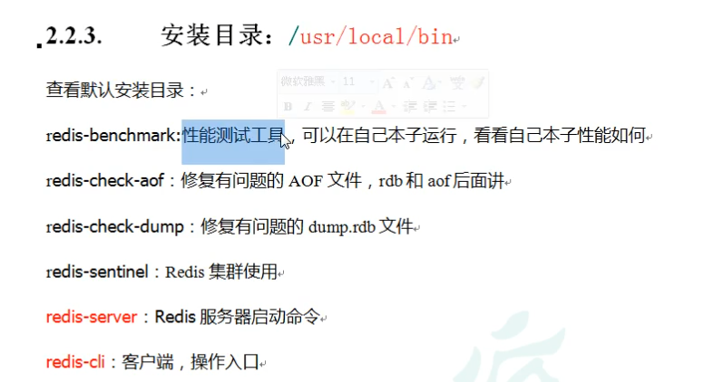


拷贝Redis-6.2.5.gar

 


## 1.2 前台启动


直接运行  redis-server 命令即可。

窗口关闭，redis结束运行


前台启动其实就是 “非守护线程”,当连接关闭，redis也就结束运行了。


## 1.3 后台启动


后台启动为 “守护线程”,当连接关闭，redis服务仍然运行，等待下一次连接。


redis启动时，可以带有路径参数。使用该路径指明的配置文件启动redis。这个配置文件，会深刻的影响redis服务的行为。redis很多功能开启都依赖于配置文件中的配置信息。例如:集群配置,密码配置,超时配置,存储文件配置。

```
redis-server  [url] 
```


### 1.3.1 如何设置 daemonize


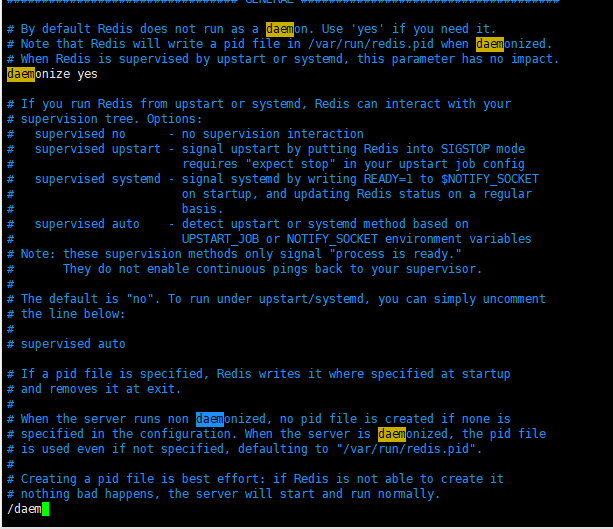

输入/daem 则自动查找 daem字段


输出一下redis.conf 的路径

使用 redis-server ，在后面带上配置文件路径，以该路径指向的配置文件启动

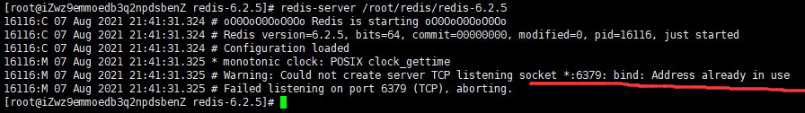

我这里启动失败了，提示是6379端口已经被占用了。可以改端口，也可以把运行在6379的程序干掉

查看占用6379的程序PID

干掉它（原本监听这个端口的redis是，是部署的RuoYi）

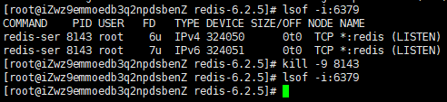

以配置文件启动 redis-server /root/redis/redis-6.2.5/redis.conf


### 1.3.2 redis-cli 客户端命令


使用 redis-cli 命令操作 redis客户端 client。


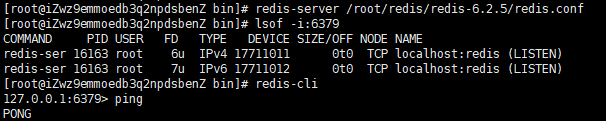

ping命令，回复pong 表示 Ping通了

至此后台启动完成


## 1.4 Redis相关知识


```
flushdb   清空当前库

flushall   清空全部库
```


同时 redis 支持多种数据类型、支持持久化

# 2. 5大常用数据类型


http://www.redis.cn/commands.html


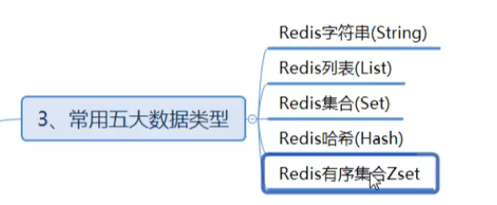


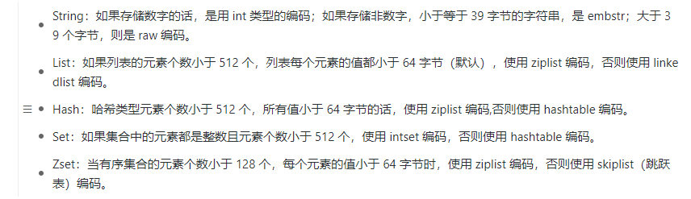


## 2.1  Redis 键 Key


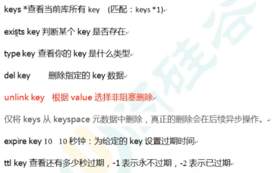

| snytax                     | expression                                                   |
| -------------------------- | ------------------------------------------------------------ |
| keys <parttern>            | 根据<parttern>检索键名                                       |
| exists <key>               | 是否存在某个指定的键                                         |
| type  <key>                | 查看某个键的类型                                             |
| del <key>                  | 阻塞删除指定键                                               |
| unlink <key>               | 非阻塞删除键                                                 |
| expire <key> <seconds>     | 给指定键设置过期时间（秒）                                   |
| expireat <key> <timestamp> | 给指定键设置过期时间（时间戳）unix timestamp<br />设置成功返回1，失败返回0 |
| ttl <key>                  | 查看指定键还有多久过期（秒）                                 |


因为Redis是单线程+多路IO复用，所以，当主线程占用时，unlink不会马上删除

del则会阻塞其他程序，直接删除


================================================================


## 2.2 字符串String

参考Docs http://www.redis.cn/commands.html#string


### 2.2.1 简介

```
常见的数据类型。
它是一个二进制安全的字符串 (二进制安全 意味着它不会对字符串的内容进行解析，可以存储任意的文件。例如图片等)
```


### 2.2.2   String 常用命令


#### 2.2.2.1  get/set


```
set <key> <value>      //添加一个 key-value    ,   set命令支持非常多的可选项如下图
get <key>             //返回一个 key的value
```


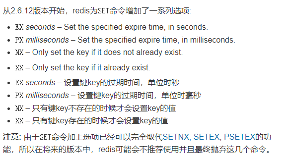


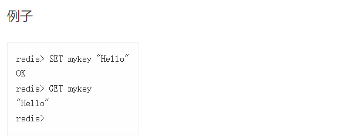


#### 2.2.2.2 append

```
append <key> <value>   // 追加一个key的value
```


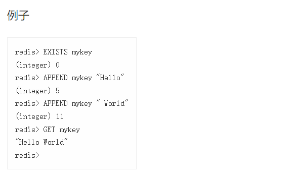


#### 2.2.2.3 incr / decr


```
incr <key>             //Redis中并没有专门存储数字的数据类型。string的value可以存储数字。在Redis底层使用int类型(是一个8字
                       //节的数据类型， 也就是java 中的long)    incr指令用于给这个value+1 , 
                       
decr <key>            //和incr 一样，只能用于value是纯数字的string ，  decr指令表示  value-1  


incrby <key> <step>   //按照步长<step> 增加值
decrby <key> <step>   //按照步长<step> 减少值
```


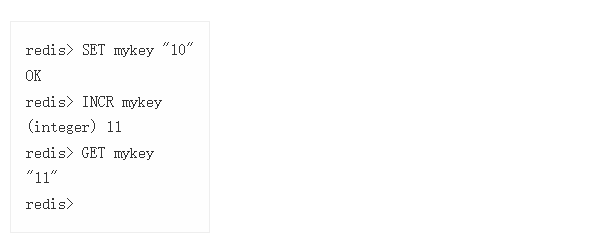


下面是 incr  incrby 示例

```dockerfile
127.0.0.1:6379> get k3
"3"
127.0.0.1:6379> incrby k3 10
(integer) 13
127.0.0.1:6379> decrby k3 50
(integer) -37
```


#### 2.2.2.4  mset/ mget

批量获取，批量设置 key , 这个批量操作是原子性的。

| snytax                                   | expression                   |
| ---------------------------------------- | ---------------------------- |
| mset <key1> <value1>[<key2> <value2>...] | 同时设置多个 key-value键值对 |
| mget <key1> [<key2>...]                  | 同时获得多个value            |
|                                          |                              |


mset  命令： 

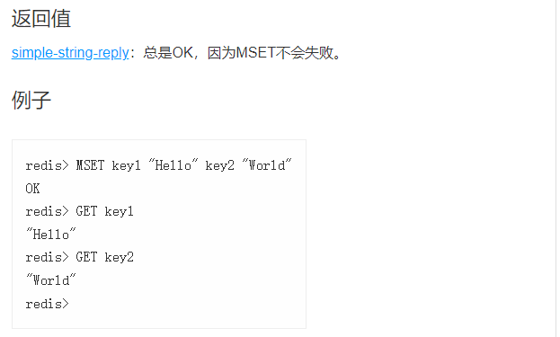


mget命令：

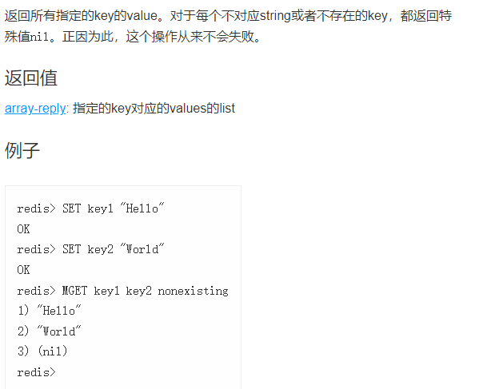


#### 2.2.2.5  getRange /setRange

等价于 String.subString() 取字串命令。


| 语法SyntAx                        | 解释expression                                 |
| --------------------------------- | ---------------------------------------------- |
| getrange <key> <start> <end>      | 获取 <key>对应<value> 索引从<start>到<end>的值 |
| SETRANGE <key>  <offset>  <value> | 从索引值(offset)开始覆盖 key对应的原有value    |


```
start/ end 可以为负，表示从右开始。右面第一个为-1

所以，0到-1 表示取全部

特别的：

当<start>=<end>  将获得索引值为<start>的值
```

示例：

```dockerfile
127.0.0.1:6379> get k1
"abcdef"
127.0.0.1:6379> getrange k1 0 -1
"abcdef"
127.0.0.1:6379> getrange k1 0 0
"a"
```


setrange  

```
从索引值开始覆盖 key对应的原有value
```


#### 2.2.2.6  getset / setex

| 语法 syntax                    | 解释                                    |
| ------------------------------ | --------------------------------------- |
| getset <key> <newValue>        | 返回<key>原有旧<value>，并覆盖新<value> |
| setex <key> <过期时间> <value> | 设置 KV同时，指定过期时间               |


getset 例子

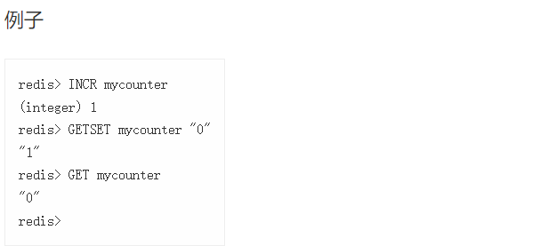


### 2.2.3 String 类型 数据结构


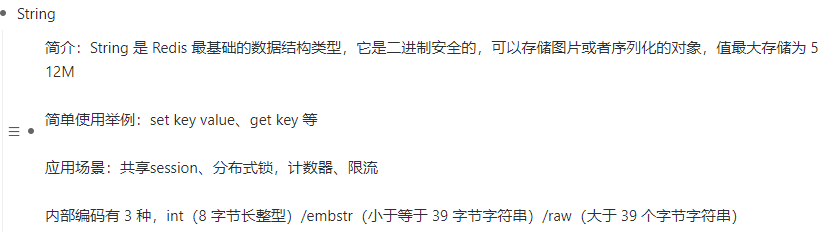


String 最大长度为512M


## 2.3 列表 List 类型


### 2.3.1   List 简介

List 是单键多值

```
用于存储多个有序的字符串。 类似于LinkedList
```


### 2.3.2  List 常用命令


```dockerfile
lrange <key> 0 -1  //表示取所有值
```

lrange  L指List，也指左侧。是从左侧遍历

当List类型 没有value时。key也就消亡了


| SNYtax                                        | expression                |
| --------------------------------------------- | ------------------------- |
| index <key> <index>                           | 获取List类型 指定索引的值 |
| llen                                          | 获取List类型 value 个数   |
| linsert <key> before\|after <value><newValue> | 在value前/后插入新值      |
|                                               |                           |

```dockerfile
127.0.0.1:6379> lrange k2 0 -1  //遍历k2
1) "b"
2) "b"
3) "a"
127.0.0.1:6379> linsert k2 after b c  //在b后插入c
(integer) 4
127.0.0.1:6379> lrange k2 0 -1  //从左往右遍历到第一个目标value
1) "b"                         //在其后插入c
2) "c"
3) "b"
4) "a"
```


| Syntax                     | expression                        |
| -------------------------- | --------------------------------- |
| lrem <key> <n> <value>     | 从低索引开始，删除n个 对应的value |
| lset <key> <index> <value> | 将指定索引的值，替换为 value      |

### 2.3.3 List的数据结构


```
当List元素超过512个 , 或者有任意一个元素超过64字节，使用 LinkedList

否则是zipList   压缩列表
```


#### 2.3.3.1  ZipList 

https://blog.csdn.net/qq_31387317/article/details/94578370 参考博客


Redis 为了节约内存空间使用，`list` `zSet`  `hash` 在元素个数较少的时候，采用压缩列表 (ziplist) 进行存储。


```
在内存中，ZipList使用的是一片连续的存储空间。元素之间相邻，没有空间冗余。
```


zipList 在两端提供O(1)的时间复杂度 pop , push的操作。


##### 2.3.3.1.1 内部结构

```c++
struct ziplist<T> {
	int32 zlbytes;        //整个zp占用字节数
	int32 zltail_offset;  //最后一个元素距离压缩列表起始位置的偏移量，用于快速定位到最后一个节点，从而可以在ziplist尾部快速
                          //的执行push，pop操作
	int16 zllength;       //元素个数，该字段只有16bit所以可以表达的最大值为2^16-1，如果ziplist元素超了该值呢？
    					  //这里规定，如果zllength小于等于2^16-2，该字段表示为ziplist中元素的个数。
    					  //否则想知道ziplist长度需要遍历整个ziplist
	T[] entries;           //元素内容列表，挨个紧凑存储
	int8 zlend;            //结束标识符，标志压缩列表的结束，值恒为 0xFF（255）
}
```


由 zltail_offset 可知，可以快速定位到zp的尾节点位置.


```c++
struct entry {
    int<var> prevlen; // 前一个 entry 的字节长度,通过 prevlen可以向前遍历节点。因此zp支持双向遍历。
    int<var> encoding; // 元素类型编码
    optional byte[] content; // 元素内容
}
```


## 2.4 Set集合

同样是一个key对应多个value，但不允许value重复


同样，当名为key的Set集合中，没有任何值的时候，这个Set集合将消亡


### 2.4.2 Set常用命令

| SYNtax                              | expression                                 |
| ----------------------------------- | ------------------------------------------ |
| sadd <key> <value>[<value>...]      | 在Set中添加一个或多个值                    |
| sismember <key> <value>             | 判断key的Set中，是否有value是1否0          |
| smembers <key>                      | 列出名为Key的Set集合中的所有值             |
| scard <key>                         | 返回名为Key的Set集合的member个数           |
| srem <key> <value> [<value>...]     | 删除Set集合中对应的一个或多个value         |
| spop <key> [<count>]                | 从名为Key的Set集合中，随机弹出一个或多个值 |
| srandmember <key> [<count>]         | 从Set中随机取1个或多个值                   |
| smove <source><destination> <value> | 从源Set取值移入到目标Set                   |

```dockerfile
127.0.0.1:6379> sadd k1 a b c d e f g //添加一个新的Set
(integer) 7
127.0.0.1:6379> sismember k1 a  //a 是 k1的成员吗？
(integer) 1                 // a 是
127.0.0.1:6379> sismember k1 k  //k 是 k1的成员吗？
(integer) 0                     //k 不是 
127.0.0.1:6379> srem k1 a     //从k1 Set中，移除a
(integer) 1          //返回1 ，操作成功
127.0.0.1:6379> srem k1 a     //从k1 Set中，移除a
(integer) 0          //返回0 ，操作失败 ，Set中不含a
127.0.0.1:6379> srem k1 b c d  //移除多个值
(integer) 3  //成功移除3个
127.0.0.1:6379> smembers k1  //遍历k1
1) "g"
2) "f"
3) "e"
127.0.0.1:6379> spop k1 2
1) "e"
2) "f"
127.0.0.1:6379> smembers k1
1) "g"
```


| Syntax                 | expression                                         |
| ---------------------- | -------------------------------------------------- |
| sinter <key1> [<key2>] | 得到两个Set集合的交集，若只有一个key，则取所有元素 |
| sunion <key1> <key2>   | 得到两个Set集合的并集，若只有一个key，则取所有元素 |
| sdiff <key1> <key2>    | key1集合里减去key2集合的所有元素，差集             |
|                        |                                                    |


### 2.4.4 应用场景


```
共同关注/共同爱好/共同粉丝
```


```
标签  
```


```
黑/白名单
```


### 2.4.3 Set的数据结构


#### 2.4.3.1  intSet


```c++
typedef struct intset {
    uint32_t encoding;    /* 编码方式，支持存放16位、32位、64位整数 */
    uint32_t length;      /* 元素个数 */
    int8_t contents[];    /* 整数数组，保存集合数据 */
} intset;
```


encoding 有三种编码方式，2字节整数， 4字节整数，8字节整数

```c++
/* Note that these encodings are ordered, so:
 * INTSET_ENC_INT16 < INTSET_ENC_INT32 < INTSET_ENC_INT64. */
#define INTSET_ENC_INT16 (sizeof(int16_t))  /* 2字节整数，范围类似java的short */
#define INTSET_ENC_INT32 (sizeof(int32_t))  /* 4字节整数，范围类似java的int */
#define INTSET_ENC_INT64 (sizeof(int64_t))  /* 8字节整数，范围类似java的long */
```


```
redis会将所有整数，按照升序依次保存在 contents数组中，所有元素都是同一个数据类型的(大小统一，方便寻址)

但这意味着只要有一个元素超过了编码数值，就会设置intSet升级问题。
```


intSet的特性

```
有序，所以可以是用二分法索引。
使用二分法可以快速确定是否唯一。
具备升级机制，用时间换取空间。
```


## 2.5 Hash 哈希


### 2.5.1 简介

Hash的数据结构是这样的： 1个key对应1个 HashTable

```
我们知道在Java中 HashMap的结构。 HashMap中 1个K对应1个V 
K,V都可以是任意类型的。

Redis的 Hash 1个唯一的key，对应着一个唯一的HashTable , 而这个HashTable内又可以有很多个K,V
```


Redis的Hash结构特别适合存储对象(因为他的kv是任意类型的)。例如:

```
我们可以存储一个班级同学的全部信息。那么此时 Hash的key就是这个班级的id， 对应的HashTable中的 key就是同学id，value就是Student类对象(java类)
```


### 2.5.2 Hash 常用命令


| syntax                                           | expression                                                   |
| ------------------------------------------------ | ------------------------------------------------------------ |
| hset <key> <field> <value>  [<field> <value>...] | 给名为key的Hash设置一个/多个键<field>值<value>对。   返回值为Hash键值对数量的增量。 |
| hget <key> <field>                               | 从指定Hash中取出指定字段值                                   |
| hexists <key> <field>                            | 指定Hash中是否有 指定字段，有返回1否则返回0                  |
| hkeys <key>                                      | 列出指定key的Hash所有 字段                                   |
| hvals <key>                                      | 列出指定key的Hash所有 字段的值h                              |
| hincrby <key> <field><increment>                 | 给指定Hash中指定字段值设置增量。返回增量后的值               |
| hsetnx <key> <field> <value>                     | 给指定Hash设置字段值，当且仅当field不存在                    |

```dockerfile
127.0.0.1:6379> hset k2 name 'qingkong' age '18'
(integer) 2
127.0.0.1:6379> hincrby k2 age 40
(integer) 58
127.0.0.1:6379> hset k2 name 'shuixing'
(integer) 0          //可以看到hset 返回了0，并不代表失败
					//返回值为 键值对数量的增量，未增加，但有修改
127.0.0.1:6379> hvals k2
1) "shuixing"   //输出一下值，确实修改了
2) "58"
```


### 2.5.3 Hash 类型数据结构

当Hash内的元素小于512个，且任意一个元素不超过64字节,使用zipList

否则使用HashTable


## 2.6 ZSet  (Sorted Set) 有序集合

为什么**ZSet** 代表了 Sorted Set？

````
Hello.`Z`is as in XYZ, so the idea is, sets with another dimension: the order. It's a far association... I know :)
````

作者的原话。

Z的意思是，是xyz三轴中的z轴。通常key value键值对可以抽象成x和y轴。如何给Set排序？引入了另外一个值Score，通过Score值 给键值对排序。也就是引入了另外一个维度。就像z轴一样


### 2.6.1  ZSet简介

ZSet就是一个 已经排序的字符串集合，同时不允许元素重复


### 2.6.2 常用命令


| syntax                                                  | expression                                                   |
| ------------------------------------------------------- | ------------------------------------------------------------ |
| zadd <key> [NX\|XX] <score><member>[<score><member>...] | 往名为Key的ZSet 添加一个或多个元素。顺序是，score小号排在前。可选nx，指member如果不存在的话，就执行。xx,指member存在的话，就执行。 |
| zrange <key> <min><max> [withScores]                    | 按照Score的范围取成员。0到-1表示取所有成员 ；可选：withScores 输出成员同时带有Score |
| zscore <key> <member>                                   | 得到指定ZSet的指定member的score                              |

```dockerfile
127.0.0.1:6379> zadd k1 nx 5 'hello' 6 'world' 7 'test'
(integer) 3
127.0.0.1:6379> zrange k1 0 -1 withscores //遍历一下
1) "hello"
2) "5"
3) "world"
4) "6"
5) "test"
6) "7"
127.0.0.1:6379> zadd k1 nx 1 'test'  //如果不存在'test'则执行
(integer) 0                         //显然zSet中存在，不执行
127.0.0.1:6379> zrange k1 0 -1  //遍历一下zSet
1) "hello"
2) "5"
3) "world"
4) "6"
5) "test"
6) "7"    // 原test的Score为7，排在最后，证明 没执行
127.0.0.1:6379> zadd k1 xx 1 'test'  //反过来，如果存在就执行
(integer) 0
127.0.0.1:6379> zrange k1 0 -1 withscores
1) "test"    
2) "1"         //test 的Score更新为 1
3) "hello"
4) "5"
5) "world"
6) "6"
```

| syntax                                                       | expression                                                   |
| ------------------------------------------------------------ | ------------------------------------------------------------ |
| zrangebyscore <key> <min> <max> [withscores] [limit offset count] | 在ZSet中取score在min 到max 之间的member 可选参数：limit <offset> <count>两个参数 。同sql种的limit一致，索引+数量 |
| zreverangebyscore <key> <max> <min>[withscores] [limit offset count] | reverse 反转；  在ZSet中取score在min 到max 之间的member 可选参数：withscores |

可以使用 `-inf` 和 `+inf` 表示 **负无穷** 和**正无穷**

```dockerfile
zrangebyscore <key> -inf +inf  withscores //取全部members
```


在redis中，默认边界都是闭合，显式的指定开 使用 ` (`

```dockerfile
127.0.0.1:6379> zrangebyscore k1 (1 5  //即(1,5]
```

```dockerfile
 127.0.0.1:6379> zrangebyscore k1 1 5  //两侧都是闭[1,5]
```

```dockerfile
 127.0.0.1:6379> zrangebyscore k1 (1 (5  //两侧都是开（1,5）
```

| syntax                             | expression                                                   |
| ---------------------------------- | ------------------------------------------------------------ |
| zincrby <key> <increment> <member> | 给指定ZSet的指定member的Score改变增量                        |
| zrem <key> <member>                | 删除ZSet中的指定member                                       |
| zcount <key> <min> <max>           | 统计score min到max的数量;  特别的，      -inf 到+inf  表示负无穷到正无穷 |
| zrank <key> <member>               | 返回该成员在ZSet中的排名                                     |


### 2.6.3 ZSet的数据结构

元素数量不超过128 , 且任何一个元素不超过64字节，使用zipList

否则使用 跳表 skipList


跳跃表： 

```
跳表的查找效率 接近于logN

跳表的本质就是 索引。 类似于InnoDB存储引擎中  B+树的索引思想。
```


# 3.Redis 配置文件

两种方法设置密码


## 3.1.修改 redis密码

Redis密码是一个重要的设置。默认是没有密码，如果云服务器的6379端口对外开放，又没有设置Redis密码，很有可能被攻击，注入挖矿病毒。

```dockerfile
vim redis.conf
```


## 3.2. redis.conf 详解

打开redis.conf


```
Redis 配置文件样例：
目的是读配置文件。Redis必须以配置文件路径作为第一个参数
就像这样:
redis-server /yourpath/redis.conf
```


```
当内存大小被需要考虑的时候。最大内存容量也能够被声明。
声明的形式，通常是  1k 5GB 4M 等等
单位是大小写不敏感的。所以 1GB=1gb
```

#### 3.3.1 include 引入配置文件


```
配置文件中，可以包含1个或多个其他的配置文件。
被包含的文件里，也可以含有更多的引用文件，所以你可以合理的使用

Redis 将会直接使用最后一次的配置。语法：
include /path/local.conf
include /path/other.conf
```


#### 3.3.2 bind 绑定ip地址


```、
默认情况下，如果没有直接配置bind ，Redis将会从所有可用的网络端口中监听主机。
如果使用bind直接配置，Redis可以监听一个或多个网络端口

每一个地址，都可以用 '-' 前缀修饰，意思是，当这些地址不可用的时候，redis 不会告知启动失败，

、
如果设置了bind 只有bind的地址可以发送请求
```

#### 3.3.3 protected-mode 


```
Protected mode 是一个层安全性保护。目的是避免Redis实例在网络上暴露，被访问和探嗅

当Protected mode 被打开，同时：
1. 服务没有显式的绑定访问地址，
2. 没有配置密码
那么Redis服务将只会被允许本地客户端访问
```


```
在指定端口号，接受连接协议。默认端口号是6379

如果指定0端口，Redis将不会监听TCP协议
```


#### 3.3.4 tcp-backlog

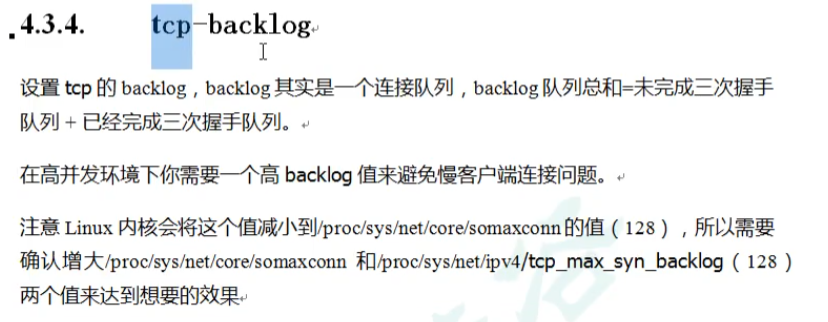


#### 3.3.5 timeout  超时时间

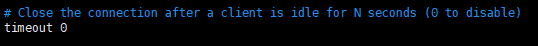

```
当客户端无操作N（timeout）秒时，就关闭连接；0为不关闭
```

#### 3.3.6 TCP keepalive 心跳时间

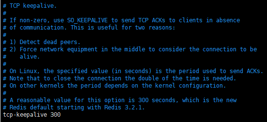

```
TCP keepalive 心跳时间，通俗的将就是每经过 TCP keepalive 秒，对连接进行一次检查
如果不为0，那么使用 SO_KEEPALIVE 发送一个 TCP ACKs 给客户端。
keppalive 的用处两方面原因：
1.发现死去的连接
2.强制要求 中间的网络设备保持连接活跃


```


#### 3.3.7 daemonize  后台启动


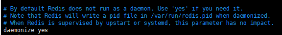

```
默认 Redis 不会作为后台模式启动。如果你需要它这样，就用yes
后台模式中，Redis 将会写一个管理文件，在 /var/run/redis.pid

```

#### 3.3.8 pidfile

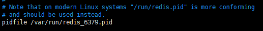

```
你仍然可以使用 pidfile 自定义配置你的管理文件
应该被可读写的文件所替换
```

#### 3.3.9 loglevel 日志级别

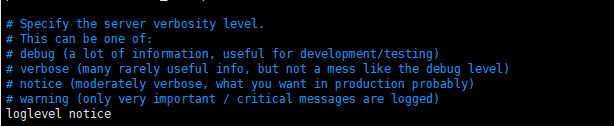

```
声明Redis 服务回报日志的级别。
你可以从以下中选一个
debug (一大堆的信息，对于开发/测试 很有帮助)
verbose （一些稀少的有用信息，但是不像debug那么多）
notice （适度的信息，你可能需要这项，在 产品级的时候）
warning (仅仅是非常重要的信息)
```

#### 3.3.10 logfile 日志文件

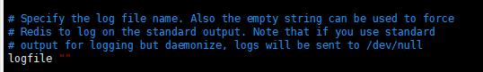

#### 3.3.11 database 数据库

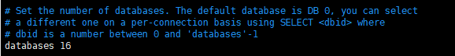

#### 3.3.12 maxclients

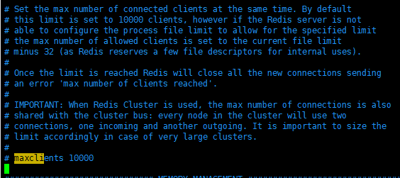

#### 3.3.13 maxmemory <bytes>

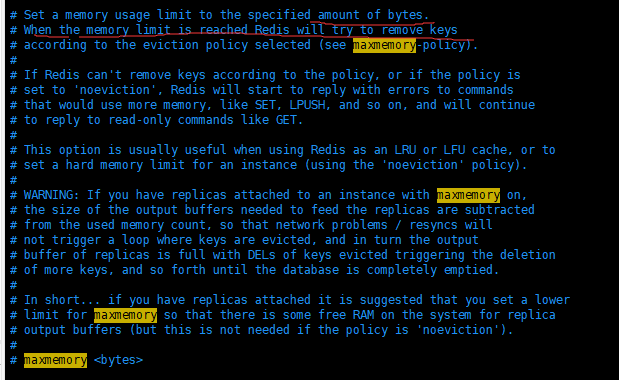

```
当达到内存极限时，Redis将会尝试根据规则移除一部分keys。参考（maxmemory-policy 规则）
```

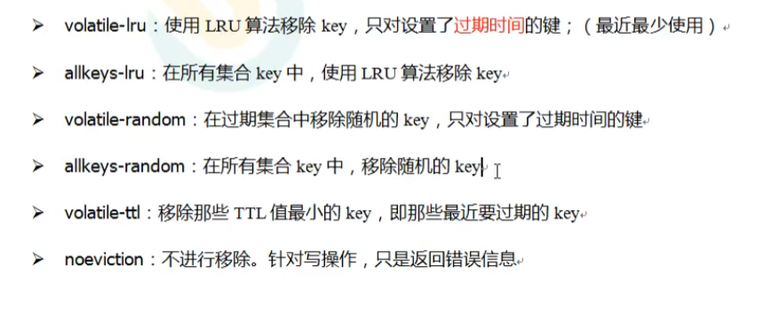

#### 3.3.14 maxmemory-samples

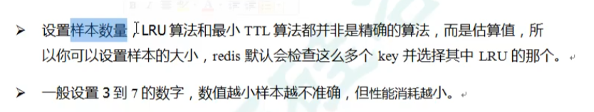

#### 3.3.15 working dir 

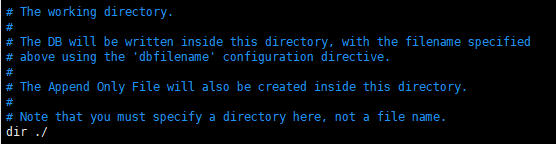

```
工作文件夹
DB 文件将被写在这个文件夹内。直接使用在配置文件中声明的 dbfilename
AOF文件也将被写在这个文件夹
你必须指明一个文件夹在这，而不是一个文件名
dir ./  表示 配置文件所在文件夹
```

#### 3.3.16 dbfilename

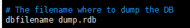

```
指定 导出的数据文件名
dbfilename <SpecialName>.rbd
```

#### 3.3.17 save

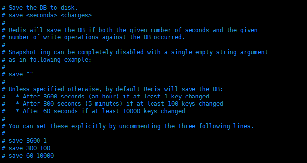


```
保存数据到硬盘中。
save <seconds> <changes>
Redis将保存数据，如果同时满足 指定的秒数，和 发生指定数量的写操作

如果你这样写   save ""
那么快照将会被完全禁用。

除非特意声明，否则通常情况下Redis将以如下规则保存 数据库文件：
	在1小时，1个key被改写了
	在5分钟，100个key被改写了
	60秒，10000个key被改写了
```

#### 3.3.18 stop-writes-on-bgsave-error

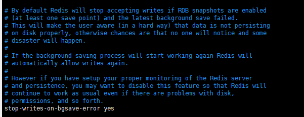

```
默认情况下，当最近一次的bgSave失败了，Redis将会停止接收写操作。
这样做会粗暴的提醒使用者，数据将不会写入磁盘。否则，如果使用者没有注意到这种情况，会酿成大祸

如果bgsave再次正常工作，Redis将会再次允许写操作

如果你想禁用这个功能就使用如下语句修改。
stop-writes-on-bgsave-error no
```

bgsave也许会因为磁盘已满而失败，所以Redis会直接用禁止写入的方式，明显的提示用户这一情况。

#### 3.3.19 rdbcompression

compression   n.压缩，浓缩

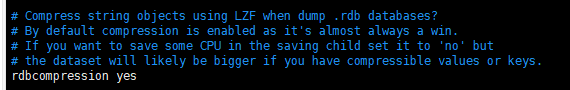

```？
当备份数据的时候，是否使用 LZF来 压缩字符串对象？
默认情况下，压缩是被启用的，这么做几乎总是对的。
如果你想要节省一些cpu资源，那么你就改成No吧

rdbcompression no
```

#### 3.3.20 rdbchecksum 

checksum    n.校验

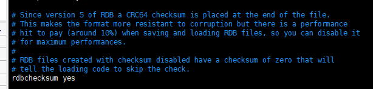

```
在Redis5版本以后，在生成RDB文件的最后，都用CRC64来校验。

这么做能更大程度上防止数据损坏，但是当保存和加载RDB文件时，将会用去10%的性能，所以你仍然可以禁用它:

rdbchecksum no
```

#### 3.3.21 appendonly

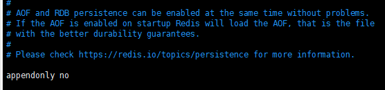


```
AOF 和 RDB 可以完美同时运行。
如果AOF被启用了，那么Redis将会选择加载AOF文件。因为它能更好的持久化

你可以到 https://redis.io/topics/persistence 了解更多信息

appendonly yes
```

#### 3.3.22 appendfilename 

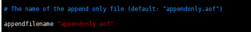

```
AOF文件的名字 默认是 ‘appendonly.aof’
```

#### 3.3.23 appendfsync 

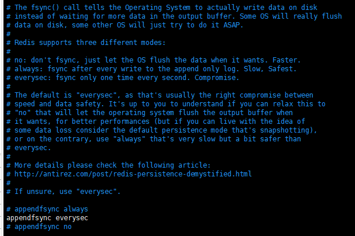

```
fsync()函数调用，将会通知操作系统，真正的把数据写入磁盘。而不是等待更多的数据把输出缓冲区填满再写入。

Redis 支持3中模式:
	no：不会主动调用fsync()，仅仅等待操作系统自己写入数据。处理更快
	always: 每次写操作之后，都主动调用fsync()。 处理很慢，但最安全
	everysec: 每秒调用一次fsync() 。折中的方案

默认选择是 “everysec”
```

#### 3.3.24 auto-aof-rewrite-min-size

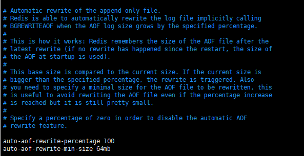


```
自动重写AOF文件

当AOF日志文件的大小超过指定值时，Redis能够在后台自动调用bgrewriteaof命令。

它工作的原理是：Redis将会记录最近的一次AOF重写文件的大小。当增量比设定值大的时候，rewrite就会被触发。


当达到了指定增量百分比 但 增量仍然很小的情况下，你可以设置触发重写aof文件的最小值，以此来	避免频繁重写。
(也就是说，两项需要同时满足。)
当声明百分比为0的时候，将会禁用自动重写AOF文件功能

auto-aof-rewrite-percentage 100
auto-aof-rewrite-min-size 64mb
```


#### 3.3.25 port

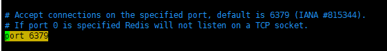

```
监听的端口
```

#### 3.3.26 replica-priority

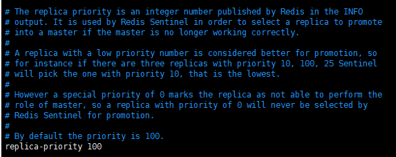

```
复本优先级（replica priority）是一个被发布在Redis输出信息上的整型数字。 它被用于Redis哨兵模式中，当主机不再工作时，可以参考replica priority 选择一个复本当作新主机

当 replica priority 更低，它将被优先选择

如果replica priority 是0，表示这个复本永不能作为主机

默认情况下，replica priority是100
```

#### 3.3.27 cluster-enabled

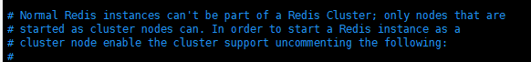

```
普通的Redis实例，不能作为一个Redis集群。仅当显式标注了以 Redis 集群启动，才可以。
```

#### 3.3.28 cluster-config-file

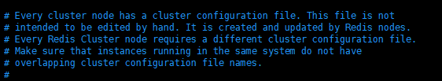

```
每一个集群节点，都有一个集群配置文件。这个文件并不需要被手动编辑。它自动被Redis节点创建并维护。
每一个Redis集群节点都需要一个不同的配置文件。
确保运行在同一台机器上的Redis服务没有重叠的配置文件名。

cluster-config-file nodes-6379.conf
```

#### 3.3.29 cluster-node-timeout

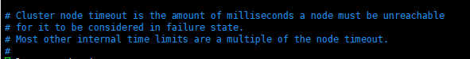

```
集群节点超时时间的单位是毫秒。当一个节点不可访问时间达到了1个超时时间，那么就会被认为失败状态

```

#### 3.3.30 cluster-require-full-coverage

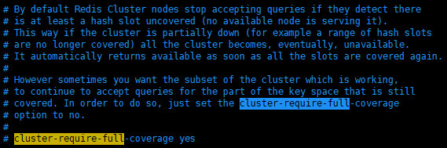

```dockerfile
通常情况下，当Redis集群服务发现任意一个插槽处于暴露状态（即没有任何一个集群节点为这个插槽服务）那么整个集群服务将停止接受任何请求。

同时，当所有插槽都再次可用时，集群服务将自动恢复正常。

有时，你想让集群子集在上述部分宕机状态下仍然工作。即在未宕机的部分仍然接受请求，你需要设置 cluster-require-full-coverage 配置


cluster-require-full-coverage   （需求全部插槽覆盖）
```


# 4. 发布订阅

发布订阅更常用于MQ


## 4.1什么是发布订阅

Redis 发布订阅（pub/sub） 是一种信息通信模式。

消息的消费者通过订阅某个频道。当这个频道的消息生产者发送了消息，会通知所有的订阅者消费这条消息。


## 4.2 Redis 发布 / 订阅

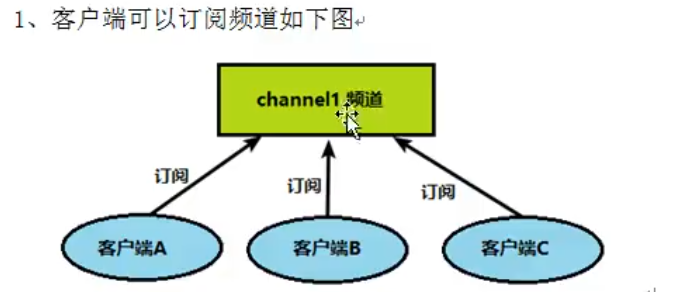


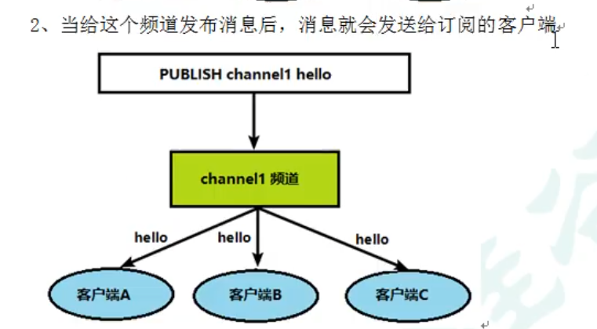


## 4.3 发布订阅 命令行实现


### 4.3.1    subscribe 

| syntax                           | expression        |
| -------------------------------- | ----------------- |
|                                  |                   |
| subscribe <channel> [channel...] | 订阅1个或多个频道 |
|                                  |                   |

```
127.0.0.1:6379> subscribe channel1
Reading messages... (press Ctrl-C to quit)
1) "subscribe"       //option
2) "channel1"		//channel Name
3) (integer) 1      // 订阅者数量
```


### 4.3.2  publish 

| syntax                  | expression        |
| ----------------------- | ----------------- |
|                         |                   |
| publish <channel> <msg> | 订阅1个或多个频道 |
|                         |                   |

发布者：

```
127.0.0.1:6379> publish channel1 helloWorld!
(integer) 1
//返回1 是订阅者数量
```

订阅者：

```dockerfile
1) "message"               //收到消息
2) "channel1"             //来自哪个 channel
3) "helloWorld"          //msg
```


# 5.  Redis 6新的数据类型


## 5.1 Bitmaps  位图


### 5.1.1 简介

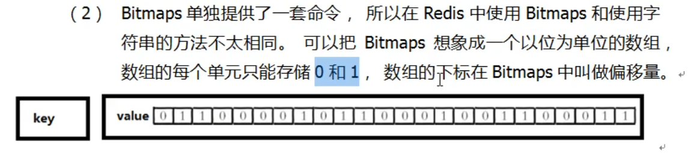

### 5.1.2 命令

| syntax                        | expression                                                   |
| ----------------------------- | ------------------------------------------------------------ |
| setbit <key> <offset> <value> | 设置Bitmaps指定偏移量的值<br />偏移量offset 从0开始          |
| getbit <key> <offset>         | 取出Bitmaps指定偏移量的值                                    |
| bitcount <key> [start end]    | **以字节为单位**，统计Bitmaps中指定范围内,1的数量<br />默认范围全部<br />start 和 end 表示的是，字节的下标。也就是8个位为一个检查单位 |
|                               |                                                              |


Bitmaps可以跨越偏移量设置value。

Bitmaps 总是以最远的1作为总长度。即： 总长度=从0偏移量，到最远的1

中间未设置偏移量的值，总是0

长度之外的值，总是0

### Bitmaps 的应用实例：


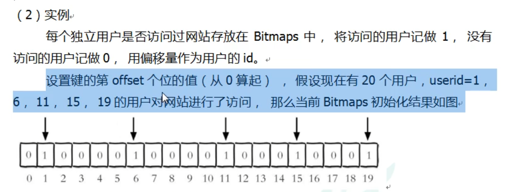

对应的命令行语句:

```
127.0.0.1:6379> setbit users_login_status_20210813 1 1
(integer) 0
127.0.0.1:6379> setbit users_login_status_20210813 6 1
(integer) 0
127.0.0.1:6379> setbit users_login_status_20210813 11 1
(integer) 0
127.0.0.1:6379> setbit users_login_status_20210813 15 1
(integer) 0
127.0.0.1:6379> setbit users_login_status_20210813 19 1
(integer) 0


127.0.0.1:6379> getbit  users_login_status_20210813 0
(integer) 0
127.0.0.1:6379> getbit  users_login_status_20210813 1
(integer) 1
127.0.0.1:6379> getbit  users_login_status_20210813 999
(integer) 0

```

对比一下Bitmaps的优势：

如果以List存储，只存储访问过的用户id，<member>如果用int存储，1个id，4个字节。当id数量超过总人数的1/32时，Bitmaps就更加节省。

1.访问指定id的用户的<value>时，Bitmaps直接改变offset比Set更快。

2.如果想得出未访问过的人，同样比Set更快。（只存访问过人的前提，如果同时存未访问过，那么占用空间将更大）


```
Bitmaps到底节省了哪些空间？
在实例中:
用户id，一个可以增长到很大的数，被offset代替了。
我们关心的登陆与否（就是一个Boolean量）被0,1表示了
每一个表示id的int类型4个字节，都造成了冗余。因为我们没有利用List的index信息。


使用Bitmaps的核心思想就是，我们只关心数据对某些指标的 是与不是（0或1）也就是boolean量，都可以考虑是否可以使用Bitmaps
```

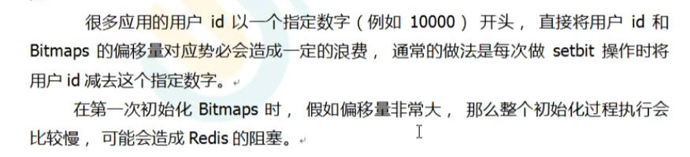


| snytax                            | exprission                                                   |
| --------------------------------- | ------------------------------------------------------------ |
| bitop <option> <destKey> [key...] | 对Bitmaps做<optin>操作<br /><option> 有 and（与）or (或) not(非) xor(异或) |
|                                   |                                                              |
|                                   |                                                              |

bitop 命令实例：

当我有如下几个Key

2021-8-14登录情况的Bitmaps : user_login_status_20210814

2021-8-13登录情况的Bitmaps : user_login_status_20210813

2021-8-12登录情况的Bitmaps : user_login_status_20210812

我可以通过bitop命令，求出连续3天都登录的用户id

也就是取交集 and option 最终把交集结果存放在 <destKey>中

```
127.0.0.1:6379> bitop and result users_login_status_20210814 users_login_status_20210813
(integer) 3
```


## 5.2 HyperLogLog

适用于统计数量，且统计量精确度要求不苛刻的前提下。


### 5.2.1 HyperLogLog使用场景


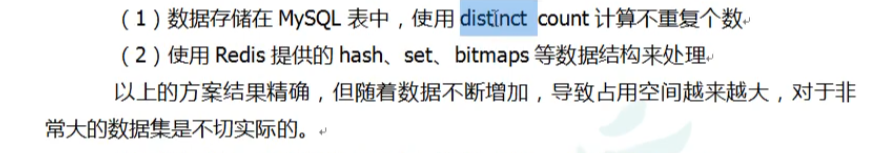


为了解决这个问题，Redis 提出了一种，降低一定精度，来统计基数的算法。


```
需要注意的是:在人数少的情况下 bitmaps ，set等 也不失是一种好方法。人数少那么更需要精确的数字；当人数很大的情况下，set就比较慢，而且通常情况下，人数很大，则对数字的精确可以一定程度忽略  
```


### 5.2.2 HyperLogLog命令

| Snytax                                     | expression                                                   |
| ------------------------------------------ | ------------------------------------------------------------ |
| pfadd <key> <element> [element...]         | 将指定1个或多个元素加入到HyperLogLog中                       |
| pfcount <key> [key...]                     | 估算指定个数的HLL的基数<br />注意：如果是多个hll那么等价于将所有hll合并之后再求基数<br />即：消除重复后计算基数 |
| pfmerge <destkey> <mergekey> [mergekey...] | 合并。将一个或多个<mergekey>合并成 <destkey> <br />成功则返回OK |


## 5.3 Geographic  地理位置


###  5.3.1   GEO 简介


### 5.3.2 Geo 命令

| snytax                                                       | expression                                                   |
| ------------------------------------------------------------ | ------------------------------------------------------------ |
| geoadd <key> [NX\|XX] <longitude> <latitude> <member> [longitude latitude member] | 向指定Geographic中加入之1个或多个坐标成员。<br />坐标成员= 经度+ 纬度 + 任意变量<br />可选参数 NX  XX |
| geopos <key> <member> [member...]                            | 通过member 在指定的Geographic中取出 Longitude latitude <br />返回值将按顺序标号 1） 2） |
| geodist <key> <member1> <member2> [m\|km\|ft\|mi]            | 返回在指定Geographic 两个成员之间的直线距离     <br />可选参数:<br />m :  米     km : 千米   mi : 英里  ft :  英尺<br /> |


| snytax                                                       | expression                                                   |
| ------------------------------------------------------------ | ------------------------------------------------------------ |
| georadius <key> <longitude> <latitude> <radius> [m\|km\|ft\|mi]  [withdist] [withcoord] [withhash] [COUNT n] [asc | desc] [store key] [storedist key]以指定的经纬度为中心，指定的radius为半径，在名为key的Geographic中搜索member<br />可选参数：<br />withdist :  同时标示出两地直线距离<br />withhash :  同时标示出该成员地点 hash<br />withcoord ： 同时标示出该成员的经纬度<br />count n : 取前 n个成员<br />asc |
|                                                              |                                                              |
|                                                              |                                                              |


```doc
127.0.0.1:6379> georadius city_china 45 45 100000 km withcoord withdist withhash
1) 1) "guangzhou"
   2) "690.6351"
   3) (integer) 3517350321017840
   4) 1) "40.00000029802322388"
      2) "39.99999991084916218"
2) 1) "shenzhen"
   2) "523.3445"
   3) (integer) 3612962385602651
   4) 1) "49.99999970197677612"
      2) "41.99999882913513005"
3) 1) "shanghai"
   2) "1175.6124"
   3) (integer) 3814519508371481
   4) 1) "57.00000196695327759"
      2) "52.00000102472843366"
4) 1) "hangzhou"
   2) "1368.3744"
   3) (integer) 3826513796212158
   4) 1) "57.99999922513961792"
      2) "53.99999994301438733"
5) 1) "daqing"
   2) "2232.1445"
   3) (integer) 3870923308765332
   4) 1) "47.99999982118606567"
      2) "65.00000033039010816"
6) 1) "xiamen"
   2) "2698.2935"
   3) (integer) 3905736201812502
   4) 1) "69.99999850988388062"
      2) "65.00000033039010816"
127.0.0.1:6379> georadius city_china 45 45 100000 km  count 3 storedist nearby_100000km_top3
(integer) 3
```


# 6.Jedis


## 6.1 引入依赖

```xml
<dependency>
    <groupId>redis.clients</groupId>
    <artifactId>jedis</artifactId>
</dependency>
```


我直接是在springboot中引入的依赖，version 已经被配置好了

在 `redis.conf`中，我们通过 `requirepass <password>` 设置了密码。

那么即使protected-mode yes 开启了，也不会被拦截。

我们将`redis.conf`中的 bind 120.0.0.1 -::1删去。那么redis将会响应来自所有ip的请求。

现在开始在java中ping一下 redis吧：

```java
    @Test
    public void jedis() {
        Jedis jedis = new Jedis("120.79.189.55",6379);
        jedis.auth("zxc,./123");  //因为我们设置的密码，所以需要使用 jedis.auth()；
                                  //否则将会报错：NOAUTH Authentication required.
        System.out.println(jedis.ping());

    }
```


## 6.2 Jedis常用方法

| modify and type       | method                | expression                  |
| --------------------- | --------------------- | --------------------------- |
| public    Set<String> | keys(String pattern)  | 返回指定的key               |
| Boolean               | exists(String key)    | 是否存在名为 "key"的 Key    |
| String                | get(final String key) | 取出 value是String类型的key |
| Long                  | ttl(String key)       | 返回指定key的过期时间       |

看一下get方法的解释

```java
Get the value of the specified key. If the key does not exist the special value 'nil' is returned. If the value stored at key is not a string an error is returned because GET can only handle string values.
Time complexity: O(1)
Params:
key –
Returns:
Bulk reply
```

如果 key存储的value不是一个字符串，那么就会返回一个Error, 因为get方法只能用于处理String类型的value


### 6.2.1 操作List


| modify and type | mothod                                 | expression                                                   |
| --------------- | -------------------------------------- | ------------------------------------------------------------ |
| Long            | lpush（String key,String... value)     | 在左侧向指定List中添加1个或多个 String类型的Value，并返回最终List中元素的数量。<br />如果key不存在就创建新的，如果存在且不是List就报错 |
| Long            | rpush(String key,String...value)       | 在右侧插入，其他同上                                         |
| Long            | llen(String key)                       | 返回指定List的长度                                           |
| String          | lpop(String key)                       | 原子操作：从左侧弹出（取出并移除）一个元素。                 |
| String          | rpop(String key)                       | 右侧弹出。其他同上                                           |
| List<String>    | lrange(String key,Long start,Long end) | 从start 开始到end结束。遍历List元素                          |


### 6.2.2 操作bitmaps

| modify and type | method                                          | expression                    |
| --------------- | ----------------------------------------------- | ----------------------------- |
| boolean         | setbit(String key,Long offset,boolean value)    | value的值 true=1 false=0      |
| boolean         | getbit(String key,Long offset)                  | 返回布尔值 1=true 0=false     |
| Long            | bitop(BitOP bitop,String destkey,String... key) | 返回该操作后destkey的成员数量 |
| Long            | bitcount(String key,Long start,Long end)        | 返回1的个数                   |

### 6.2.3操作Set

| Modify and type | method | expression |
| --------------- | ------ | ---------- |
|                 |        |            |
|                 |        |            |
|                 |        |            |


## 6.3 Redis 实例

### 6.2 模拟数字验证码


# 7.Redis 事务


## 7.1 redis中的事务


## 7.2 Multi  Exec discard


## 7.3 特点


1.组队过程中的错误，命令都不行执行；

2.命令执行过程中，错误的命令不执行。正确的命令**仍然执行**。不支持：全执行或全不执行。也就是说没有回滚功能

3.事务不会被打断


## 7.4乐观锁

|                    |                                                              |
| ------------------ | ------------------------------------------------------------ |
| watch key [key...] | 给1个或多个key加乐观锁。在事务执行前，key被改动了，那么事务会被打断 |
|                    |                                                              |
|                    |                                                              |


## 7.5 事务应用案例：秒杀


### 7.5.1 使用Jmeter进行压力测试


https://blog.csdn.net/yaorongke/article/details/82799609

### 7.5.2 代码

```java
@RestController
public class SecKillController {
	///库存前缀
    private String countPrefix = "SecKillCount_"; 
    //秒杀名单前缀
    private String setPrefix = "SecKillSet_";
    //返回信息
    private String msg;

    @Autowired
    public SecKillController(RedisTemplate redisTemplate) {
        this.redisTemplate = redisTemplate;
    }

    private RedisTemplate redisTemplate;

    @RequestMapping("/SecKill")
    public Result SecKill(Long personId,Long commodityId) {
        if (SecKillProcess(personId,commodityId)){
            return Result.success(msg,"200",null);
        }
        return Result.failure(msg,"500",null);
    }

	//处理秒杀主程序
    public boolean SecKillProcess(Long personId, Long commodityId) {
        if (personId == null || commodityId == null){
            msg="personId为空 或 commodityId为空";
            return false;
        }
        if (redisTemplate.opsForSet().isMember(setPrefix + commodityId, personId)) {
            msg="已经秒杀成功，不能重复秒杀";
            return false;
        }
        Jedis jedis = JedisUtil.getJedis();
        //使用了乐观锁 jedis.watch
        //对库存进行乐观锁
        //乐观锁一个问题就是，当并发数增多时，大多数人都会失败。后秒杀的人可能会成功。
        //秒杀时间会随着并发数增加而增加。
        //常常会出现大量的请求却秒不掉很少数量的商品，因为大家都失败了
        //这个问题称为  库存遗留问题
        jedis.watch(countPrefix + commodityId);
        if (Integer.parseInt(jedis.get(countPrefix + commodityId), 10)<1){
            jedis.close();
            msg="商品已被秒完，秒杀失败";
            return false;
        }
        Transaction transaction = jedis.multi();
        transaction.decr(countPrefix+commodityId);
        transaction.sadd(setPrefix+commodityId,personId+"");
        List<Object> exec = transaction.exec();
        jedis.close();
        if(exec==null || exec.size()==0){
            msg="秒杀失败";
            return false;
        }
        msg="秒杀成功";
        return true;
    }
}
```

### 7.5.3库存遗留问题

        //使用了乐观锁 jedis.watch
        //对库存count进行乐观锁
        //乐观锁一个问题就是，当并发数增多时，大多数人都会失败。后秒杀的人可能会成功。
        //秒杀时间会随着并发数增加而增加。
        //常常会出现大量的请求却秒不掉很少数量的商品，因为大家都失败了
        //这个问题称为  库存遗留问题

### 7.5.4 解决方案 LUA


#### 7.5.4.1 Lua脚本在Redis中的优势


# 8. 持久化

Redis虽然是基于内存的NoSQL，但也提供了将数据持久化的能力。

Redis将数据刷盘持久化有两种方式  `rdb`  `aof`


## 8.1.两种方式


`RDB` （Redis Database） 直接写入文件

```
在指定的时间间隔内将内存中的 数据快照 写入磁盘. 它恢复数据时是将快照文件直接读到内存里
```


`AOF` (Append only file)   追加写入文件

```
记录所有的可以对数据库状态修改的指令。     恢复数据时，一次执行这些命令。
```


## 8.2.RDB 方式


### 8.2.1 dump.rdb

```
Redis默认的持久化生成文件叫  dump.rdb
```

可以在配置中更改 。


## 8.2.2  RDB触发机制

RDB持久化方式，通常是 时间轮询。通过固定时间轮询将数据库快照存储到磁盘中。

当然RDB也支持调用命令手动触发存储。


```
RDB通常是自动触发，但也支持  使用命令触发。
```


#### 8.2.2.1    持久化命令

```
save      让主线程保存DB文件，会阻塞其他所有程序。一般不使用

bgsave    让后台线程来保存DB文件，也就是Fork出一个子进程，子进程将DB数据保存到磁盘然后退出。如果操作成功，可以通过客户端命令				  LASTSAVE来检查操作结果。
          什么是Fork在8.2.3中有介绍
```


#### 8.2.2.2 自动触发

在Redis的配置文件中，有如下配置：


```
save  <sec>  <times> 
```

标识在 `<sec>`秒内，至少出发了 `<times>` 次写操作，就会触发RDB备份。


### 8.2.3. RDB是如何持久化的


```
单独fork一个子进程，这意味着 持久化机制是异步的。 不影响主线程的单线程同步属性，不会占用主线程的工作时间，不会影响客户端性能。
```


为什么最后一次数据可能丢失？

```
如果恰好在进行异步刷盘操作，此时服务器宕机，数据会丢失。

如果宕机时并没有进行写磁盘操作，那么数据不会丢失。
```


什么是fork?


### 8.2.4.RDB 的优点


### 8.2.5 RDB 的缺点


```
最坏的情况下会消耗2倍的内存空间。
```


## 8.3.AOF 方式


### 8.3.1 什么是AOF


append only file 


AOF持久化思路:

```
1.记录下除了查询以外的所有变更数据库状态的指令。

2.以append追加保存到AOF文件中。

3.Redis重启时，需要执行AOF文件恢复数据。
```


### 8.3.2 AOF流程


```
AOF技术存在内存缓冲区，称为AOF缓冲区


1.将数据库变更的指令写入AOF缓冲区内

2.根据AOF刷盘策略(appendsync)，写入磁盘中。

3.AOF文件超过指定大小，会对AOF文件重写，压缩AOF文件容量。

4.Redis重启时，执行AOF文件恢复数据
```


### 8.3.3 AOF默认是不启用的

修改启用：


appendonly  yes 

详细说明的跳转到 3.3.21


### 8.3.4 AOF文件修复


### 8.3.5 AOF刷盘策略 

AOF刷盘策略有3种：

```
always      每次写操作都进行AOF备份

everysec    每秒备份1次。如果宕机，这一秒的数据会丢失

no          从不主动备份，交给操作系统来执行
```


### 8.3.6  Rewrite 压缩

重写压缩操作。


```
增量式存储。只存储增量。
有时会出现这种情况：开始时存在变量a1，后来因为某些操作，删去了a1。增量式存储会有两条记录，1添加a1 2删去a1。
rewrite压缩以后,最后的状态：这两条记录都不存在了（删去了中间变量）。
```


#### 8.3.6.1 Rewrite重写配置


auto-aof-rewrite-percentage 100  // 最小重写百分比

auto-aof-rewrite-min-size 64mb  //  最小重写大小

```
同时满足两个条件则重写；
百分比为0，则禁用自动重写
```


#### 8.3.6.2 重写流程


#### 8.3.6.3  重写过程是绝对安全的

```
AOF重写过程在一个全新的AOF文件中进行。

此时客户端的所有写命令仍然会追加到旧的AOF文件，只有在rewrite完成以后，才会切换到新的AOF文件。即使在rewrite过程中，服务器宕机也不会丢失旧的AOF文件。
```


### 8.3.7 AOF优势


```
1. AOF备份频率更高，数据库更安全。

2. AOF支持重写压缩， 控制AOF文件大小
3. AOF有序的保存了数据库执行的所有写操作，以Redis协议格式保存，更容易读懂，帮助对文件分析。

4. 使用的是软删除，只要AOF没有被重写，移除AOF文件末尾的标识符，仍能恢复
```


### 8.3.8 AOF劣势


```
1. AOF文件通常要大于RDB文件。
2. 根据 fsync(AOF刷盘策略) 的策略， AOF的性能可能会低于RDB。如果使用 everysec 性能依然很好。
```


### 8.3.9 什么场景下选择哪种持久化方式


## 8.4  AOF ，RDB对比


### 8.4.1 如何选用持久化方式


```
1. 追求强数据安全性，可以同时开启两种持久化功能
2. 如果可以承受数分钟以内的数据丢失，可以只使用RDB
3. 官方不推荐只使用AOF持久化，这会出现一些bug
```


# 9. Redis 主从复制

## 9.1 什么是 主从复制


## 9.2 主从复制 能做什么


## 9.3 实际操作配置主从复制

### 9.3.1.为主服务器和从服务器 准备配置文件：

准备3个配置文件，redis6379.conf,redis6380.conf,redis6390.conf

分别修改里面的配置信息，与配置文件名相对应的 端口号、数据库文件、等

主要修改


和working dir 。让pid,rdb 文件等都输出在指定文件夹下。


### 9.3.2. 以配置项启动Redis服务


```do
[root@iZwz9emmoedb3q2npdsbenZ myredis]# redis-server ./redis6379.conf 
[root@iZwz9emmoedb3q2npdsbenZ myredis]# redis-server ./redis6380.conf 
[root@iZwz9emmoedb3q2npdsbenZ myredis]# redis-server ./redis6390.conf 
```

使用命令

`redis-cli -p <port>`

```
[root@iZwz9emmoedb3q2npdsbenZ myredis]# redis-cli -p 6379
```

 以端口号识别，进入指定的Redis服务客户端。

这里可以让Xshell打开多个连接、每个连接启动一个redis-cli


### 9.5.3 info 命令

info <section>

| snytax              | expression                                 |
| ------------------- | ------------------------------------------ |
| info <section>      | 输出 指定<section>的信息                   |
| slaveof <ip> <port> | 配置当前Redis服务为其他Redis服务的从服务器 |
|                     |                                            |


到这里，我们需要设置两个从服务（部署在同一台服务器的6380端口和6390端口的Redis服务）去监听在6379端口的主服务。

【注意】此时，我们仅仅是用 在同一台服务器上部署的3个服务来模拟。在生产环境中、我们可以将这两个**从服务**分别部署在**其他的服务器**中。这样才真正意义上减轻了主服务器的IO压力。

既然要监听主服务的6379端口。那么就要对这个端口开放。

我使用的是阿里云服务器、在安全组中设置端口开放权限。


为了方便，我直接对127.0.0.1 授权了所有的端口


 


然后 分别在6380客户端、 6390客户端，执行 `slaveof 127.0.0.1 6379 `命令

下面是 6390端口客户端的执行情况:

```dockerfile
#执行slaveof <ip> <port> 命令
127.0.0.1:6390> slaveof 127.0.0.1 6379
OK
127.0.0.1:6390> info replication  #查看 reolication信息
# Replication
role:slave  # 角色 slave
master_host:127.0.0.1  #主机地址
master_port:6379    #主机端口
master_link_status:up  #连接状态 up  
master_last_io_seconds_ago:6 #主机最近的一次io  6（秒）
master_sync_in_progress:0  
slave_repl_offset:9276
slave_priority:100
slave_read_only:1
replica_announced:1
connected_slaves:0   #连接的从服务器数量0
master_failover_state:no-failover
master_replid:0724bcaa03b1db89119c46f930a8ade0fb50f94b
master_replid2:0000000000000000000000000000000000000000
master_repl_offset:9276
second_repl_offset:-1
repl_backlog_active:1
repl_backlog_size:1048576
repl_backlog_first_byte_offset:9263
repl_backlog_histlen:14
127.0.0.1:6390> clear
127.0.0.1:6390> keys *  #可以得到主服务器的 key了
1) "test"
127.0.0.1:6390> 
```

查看主服务器 replication 副本情况

```dockerfile
127.0.0.1:6379> info replication
# Replication 副本情况 
role:master  #扮演角色  主机
connected_slaves:2   # 连接中的从机数量 2
slave0:ip=127.0.0.1,port=6380,state=online,offset=10816,lag=1 #从机编号、ip、端口、state、偏移量
slave1:ip=127.0.0.1,port=6390,state=online,offset=10816,lag=0
master_failover_state:no-failover
master_replid:0724bcaa03b1db89119c46f930a8ade0fb50f94b
master_replid2:0000000000000000000000000000000000000000
master_repl_offset:10816
second_repl_offset:-1
repl_backlog_active:1
repl_backlog_size:1048576
repl_backlog_first_byte_offset:1
repl_backlog_histlen:10816
127.0.0.1:6379> 
```


从服务器中，不允许写操作：

```dockerfile
127.0.0.1:6390>  set testkey 'helloWold'
(error) READONLY You can't write against a read only replica.
# (错误) 只读  你不能对只读副本进行写操作
```

至此，主从复制完成。


## 9.4 主从复制的特点

### 9.4.1 数据复制点

主服务器已经运行了一段时间，并且里面已经存在一些key了。此时，从服务器加入进来，那么从服务器会有之前的key吗？

答案是：有。从服务器会把主服务器里的数据，从头到尾完全复制。无论key的创建时间

### 9.4.2 从服务器 是否可写？

答案：不可，无论主服务器是否down掉，始终不可写

### 9.4.3 主服务器 宕机后，从服务器会怎么样？

主服务器宕机后，从服务器**依然是**从服务器，不会变成主服务器。

从服务器不会一起宕掉，同时从服务器仍可进行读操作。保证了最大程度上的解耦，为实际生产增加容错。

我们shutdown一下6379的服务

```dockerfile
127.0.0.1:6380> info replication
# Replication
role:slave  #可以看到，主服务器6379shutdown后，6380扮演的角色仍然是slave
master_host:127.0.0.1
master_port:6379
master_link_status:down
master_last_io_seconds_ago:-1
master_sync_in_progress:0
slave_repl_offset:27368
master_link_down_since_seconds:122
slave_priority:100
slave_read_only:1
replica_announced:1
connected_slaves:0
master_failover_state:no-failover
master_replid:0724bcaa03b1db89119c46f930a8ade0fb50f94b
master_replid2:0000000000000000000000000000000000000000
master_repl_offset:27368
second_repl_offset:-1
repl_backlog_active:1
repl_backlog_size:1048576
repl_backlog_first_byte_offset:1
repl_backlog_histlen:27368
127.0.0.1:6380> smembers test # 从服务器仍可读
1) "python"
2) "java"
127.0.0.1:6380> srem test java  #从服务器仍然不能写
(error) READONLY You can't write against a read only replica.
```

接下来，我们跑起来主服务6379、并在其中新写入一个key

```dockerfile
[root@iZwz9emmoedb3q2npdsbenZ myredis]# redis-server ./redis6379.conf
[root@iZwz9emmoedb3q2npdsbenZ myredis]# redis-cli -p 6379
127.0.0.1:6379> keys *
1) "test"
2) "haha"
127.0.0.1:6379> set k1 'today is a good day'
OK
127.0.0.1:6379> 
```

在从服务6380中，能自动恢复连接状态、并且能得到新数据

```dockerfile
127.0.0.1:6380> keys *
1) "test"
2) "k1"
3) "haha"
127.0.0.1:6380> info replication
# Replication
...
master_link_status:up  #看到 主服务器连接恢复了
...
```

当然，主服务器宕机后，从服务器可以使用`slaveof no one`命令，

使自己变成主机，此时可以进行写操作。

但是这之后，原本的主服务器上线，篡位的从服务器**不会自动恢复**成从服务器，他仍是主机

### 9.4.4 从服务器 宕机呢？

显然可以，问题和 数据复制点问题 其实一样。


### 9.4.5  从服务器 易主，如何保证数据一致？

将原本是从服务器B的主子A修改为C。B的数据会怎样？

只要执行了 slaveof <ip> <port>成功建立连接，从服务器的数据会直接清空。替换成新主服务器里的内容。


## 9.5 薪火相传

薪火相传（从服务器的从服务器）


从左往右，1是2的主、2是3的主。

当123都正常工作时，在1写入的key会顺着主从关系复制给2。对于2来说，同样顺着主从关系将数据复制给3。

此时3台机器完成数据同步。

如果有仅有1台主服务器和100台从服务器。100台从服务器仅连接唯一的主服务器。那么当主服务器执行了写操作后，为了复制数据给100台从服务器，主服务器的IO操作将急剧增加。所以，我们使用薪火相传的方式，将1台IO的操作分散给多台，去中心化。降低了主服务器的瞬时IO压力。

### 9.5.1 薪火相传特点

#### 9.5.1.1  中间服务器不能进行写

只要这台服务器有主，无论他的主服务器是否down掉，他将不能进行写操作。

只有使用了 slaveof no one 命令后，他将晋升为主服务器，此时可以写。


#### 9.5.1.2 薪火相传某一环down掉了

当中间的某一环宕机了。因为链式的原因，后面所有的从服务器不会接收到新的数据了。不过，仍可以读操作，不过读的是旧数据。有一定风险。

但是，可以把他的从指向他的主。就好像去掉了这一环。后面的从服务器仍然可以正常工作，读到最新的数据。

不过因为 slaveof 指向了新的主，后面所有从服务的数据需要重新写入，增加了一定的IO消耗


## 9.6 主从复制原理


有2种类型,  `全量同步` `增量复制`


### 9.6.1 全量复制

一台新的从机上线以后，都要经过全量复制。之后才能增量复制


1. Slave 向 master发送sync命令

2. master 启动后台进程，将RDB快照保存到文件中
3. master 将生成RDB快照期间，修改数据库的命令保存起来
4. master将生成好的RDB发送给从机
5. 将新生成的RDB替换旧的RBD
6. 将生成RDB期间收集的修改命令发送给从机


### 9.6.2  增量复制 


1.master接收到用户的操作指令。判断是否需要传播到 slave （例如查询就不需要传播）

2.将操作追加到AOF文件中

3.将文件传播到其他Slave


slave重新连接master,一次完全同步（全量复制)将被自动执行


​                               


## 9.7 反客为主


当然，主服务器宕机后，从服务器可以使用`slaveof no one`命令，

使自己变成主机，此时可以进行写操作。

但是这之后，原本的主服务器上线，篡位的从服务器**不会自动恢复**成从服务器，他仍是主机

# 10. 哨兵模式

## 10.1 什么是哨兵模式

反客为主的自动版。

能够后台监控主机是否故障，如果故障了根据投票数自动将从库转换为主库

## 10.2 开启哨兵模式

创建一个 sentinel.conf 文件，写入：

```
sentinel monitor mymaster 127.0.0.1 6379 1

sentinel monitor <alias> <ip> <port> <quorum>
```

alias :  别名。 给监控的主机起别名

quorum: 法定人数。 表示至少有quorum个哨兵，同意迁移时，迁移


开启哨兵模式：

使用 redis-sentinel ./sentinel.conf 启动哨兵模式

```\
redis-sentinel <config>
```

可以看到启动成功。


当主机挂掉时：

```dockerfile
127.0.0.1:6379> shutdown
not connected> 
```

哨兵服务会周期性的检查主机连接状态。并根据配置信息，自动切换主机


我们发现，原来的主机6379  dwon掉以后，会被设置成新主机的从机；

现在我们重新启动6379 再看看他的状态


可以看到，6379确实是  role:slave ； master_link_status:up

## 10.3 赋值延迟


##  10.4 设置优先级


优先级在redis.conf中默认：replica-priority 100，值越小优先级越高

偏移量 越大，就说明 拷贝原服务器中数据越多。越接近原本服务器中真实的状态

每个redis实例启动后都会随机生成一个40位的runid

# 11. redis 集群


## 11.1 一些问题


无中心化集群：

一个请求商品 的操作，请求到了订单，发现不是自己的请求，转移给下一个。同样用户也转移给下一个，就找到了正确的服务器。

因为是一个环，所以任何一台服务器都可以作为入口。


​																					                     图11.1

## 11.2 什么是集群


如图11.1 对于一个完整的服务。分成了3份，每份占整个服务的1/3。这之后，为了降低节点的宕机风险，所有节点都有主从复制（小的矩形块）。


## 11.3 配置集群


### 11.3.1 删除持久化文件

.rdb .aof

设置3个主机： 6379   6380  6390

对应的3个从机： 6389  6381  6391

修改 pid文件名字，filename ，port


### 11.3.2  设置集群

配置文件中修改

cluster-enabled  yes  

cluster-config-file nodes-6391.conf

cluster-node-timeout  15000


启动服务：

```
redis-server ./redis6379.conf
redis-server ./redis6380.conf
redis-server ./redis6390.conf
redis-server ./redis6389.conf
redis-server ./redis6381.conf
redis-server ./redis6391.conf
```

使用命令，创建集群。 注意。此处 <ip>:<port> 不能使用127.0.0.1 同时ip应当是子网ip

以我的云服务器为例:


```
redis-cli --cluster create --cluster-replicas 1 172.29.0.103:6379 172.29.0.103:6380 172.29.0.103:6390 172.29.0.103:6389 172.29.0.103:6381 172.29.0.103:6391
```

可以看到

```dockerfile
[root@iZwz9emmoedb3q2npdsbenZ ~]# redis-cli --cluster create --cluster-replicas 1 127.0.0.1:6379 127.0.0.1:6380 127.0.0.1:6390 127.0.0.1:6389 127.0.0.1:6381 127.0.0.1:6391
>>> Performing hash slots allocation on 6 nodes...
Master[0] -> Slots 0 - 5460
Master[1] -> Slots 5461 - 10922
Master[2] -> Slots 10923 - 16383
Adding replica 127.0.0.1:6381 to 127.0.0.1:6379
Adding replica 127.0.0.1:6391 to 127.0.0.1:6380
Adding replica 127.0.0.1:6389 to 127.0.0.1:6390
>>> Trying to optimize slaves allocation for anti-affinity
[WARNING] Some slaves are in the same host as their master#一些从机和他们的主机在一个ip下
M: 752659c20e6cdecbd055ece59eeed4e99e484d16 127.0.0.1:6379
   slots:[0-5460] (5461 slots) master  # M(master): 看到40位的Redis服务Id   ip:端口
M: 9256f1c2fa5cca81875c5a2c45fcd52664e79c3e 127.0.0.1:6380
   slots:[5461-10922] (5462 slots) master
M: 30ebd072818eb977f67eedb49b46c9005f5d8eeb 127.0.0.1:6390
   slots:[10923-16383] (5461 slots) master
S: 1029ff9da73045ef417080b35844719e88795647 127.0.0.1:6389#S（slave）：Redis的id ip:端口
   replicates 752659c20e6cdecbd055ece59eeed4e99e484d16 # 复本目标主机id
IDS: 5cc955919a9d95a1e8e4bfcd8d26a668a511be3a 127.0.0.1:6381                    
   replicates 9256f1c2fa5cca81875c5a2c45fcd52664e79c3e
S: 48d674b083f42b107ffe416b089723fd47399234 127.0.0.1:6391
   replicates 30ebd072818eb977f67eedb49b46c9005f5d8eeb
Can I set the above configuration? (type 'yes' to accept): yes
```

输入yes后可以看到

```dockerfile
>>> Nodes configuration updated #节点配置信息已更新
>>> Assign a different config epoch to each node #每一个节点都分配了不同的配置
>>> Sending CLUSTER MEET messages to join the cluster #发送 cluster meet 信息以加入集群
Waiting for the cluster to join #等待集群加入
.
>>> Performing Cluster Check (using node 127.0.0.1:6379) #集群表现检查
M: 752659c20e6cdecbd055ece59eeed4e99e484d16 127.0.0.1:6379 #主机：Redis_id ip:端口
   slots:[0-5460] (5461 slots) master
   1 additional replica(s) # 1个附加的复本
S: 1029ff9da73045ef417080b35844719e88795647 127.0.0.1:6389 #从机
   slots: (0 slots) slave # 0个复本
   replicates 752659c20e6cdecbd055ece59eeed4e99e484d16
S: 5cc955919a9d95a1e8e4bfcd8d26a668a511be3a 127.0.0.1:6381
   slots: (0 slots) slave
   replicates 9256f1c2fa5cca81875c5a2c45fcd52664e79c3e
S: 48d674b083f42b107ffe416b089723fd47399234 127.0.0.1:6391
   slots: (0 slots) slave
   replicates 30ebd072818eb977f67eedb49b46c9005f5d8eeb
M: 9256f1c2fa5cca81875c5a2c45fcd52664e79c3e 127.0.0.1:6380
   slots:[5461-10922] (5462 slots) master
   1 additional replica(s)
M: 30ebd072818eb977f67eedb49b46c9005f5d8eeb 127.0.0.1:6390
   slots:[10923-16383] (5461 slots) master
   1 additional replica(s)
[OK] All nodes agree about slots configuration.
>>> Check for open slots...
>>> Check slots coverage...
[OK] All 16384 slots covered.
```

​                        


如果此时仍以 redis-cli -p 6379方式进入客户端：      

可能直接进入读主机，存储数据时，会出现MOVED重定向操作。所以，应该以集群方式登录。

​                               


使用命令 

```dockerfile
redis-cli -c -p 6379 # -c   (cluster)
```

**采用集群策略连接，设置数据会自动切换到相应的写主机**

```dockerfile
[root@iZwz9emmoedb3q2npdsbenZ ~]# redis-cli -c -p 6379
127.0.0.1:6379> keys *
(empty array)
127.0.0.1:6379> set k1 'helloworld'
-> Redirected to slot [12706] located at 127.0.0.1:6390  # 重定向到 slot[12706] 部署在 
OK                                                      #127.0.0.1:6390
```


### 11.3.3 cluster nodes 命令

使用 `cluster nodes `命令查看集群节点信息： 

为了工整一些，我隐去了40位的Redis服务Id

```dockerfile
127.0.0.1:6390> cluster nodes
7526...4d16 127.0.0.1:6379@16379 master - 0 1629723532501 1 connected 0-5460
# 7526...4d16服务负责 0-5460号插槽
30eb...8eeb 127.0.0.1:6390@16390 myself,master - 0 1629723530000 3 connected 10923-16383 
#可以看到，当前客户端所在服务，被标记为myself
9256...9c3e 127.0.0.1:6380@16380 master - 0 1629723529000 2 connected 5461-10922
48d6...9234 127.0.0.1:6391@16391 slave 30eb...8eeb 0 1629723530495 3 connected
#从服务，参考主机id
5cc9...be3a 127.0.0.1:6381@16381 slave 9256...9c3e 0 1629723531000 2 connected
1029...5647 127.0.0.1:6389@16389 slave 7526...4d16 0 1629723531498 1 connected
```

### 11.3.4  Slots

什么是slots?

一个 Redis 集群包含 16384 个插槽（hash slot）， 数据库中的每个键都属于这 16384 个插槽的其中一个， 

集群使用公式 CRC16(key) % 16384 来计算键 key 属于哪个槽， 其中 CRC16(key) 语句用于计算键 key 的 CRC16 校验和 。

集群中的每个节点负责处理一部分插槽。 举个例子， 如果一个集群可以有主节点， 其中：

节点 A 负责处理 0 号至 5460 号插槽。

节点 B 负责处理 5461 号至 10922 号插槽。

节点 C 负责处理 10923 号至 16383 号插槽。

### 11.3.5 集群中的插槽


#### 11.3.5.1 特点1

注意：

```
Redis集群提供了16384个插槽，也就是提供了16384个存放 <hash_tag>的位置。但是每个插槽/位置都可以存放多个值；
并不是只能存放16384个key-value
```

#### 11.5.5.2 特点2

对于同名的<key>，但是不同插槽。Redis是允许存在的。

```dockerfile
127.0.0.1:6390> keys *
1) "key1{a}"
2) "k1{a}"
     ...
6) "k1"
```

需要声明的是，对于cluster模式下，所有的key-value都有<hash_tag> ，但是有些key的<hash_tag>没有显式指出。如6)那么对于6)这种没有显式标明的key。他们的<hash_tag>就是key本身。

上述代码中。显然2)与6)是同名的key，但插槽分别是 {a} 和{k1}，允许同时存在；


以6)为例，它的完整形式应当是  "k1{k1}"   。我们甚至可以再添加一个  k2{k1} 来玩一玩slot：

```dockerfile
127.0.0.1:6390> cluster keyslot {k1}
(integer) 12706
127.0.0.1:6390> cluster countkeysinslot 12706
(integer) 1                                     #此时只有一个k1 在插槽12706
127.0.0.1:6390> set k2{k1} 'abc'                #在 插槽12706上再添加一个key-vale
OK
127.0.0.1:6390> cluster countkeysinslot 12706 
(integer) 2                                     #这之后，插槽12706就存在2个值了
                                                #再keys *一下，有趣的一幕就出现了
127.0.0.1:6390> keys *
   ...
4) "k2{k1}"
   ...
7) "k1"
   ...
127.0.0.1:6390>                          
```


#### 11.5.5.3 特点3 

 **跨服务拿不到插槽中的值；**

在上面的集群配置中，16384个 插槽分配给了3个Redis服务。无法跨Redis服务获取其他服务插槽的值。


当使用get命令时，客户端会自动跳转到对应服务下，取得那个值

```dockerfile
127.0.0.1:6379> get k1
-> Redirected to slot [12706] located at 127.0.0.1:6390  #可以看到12706在 6390端口下
"helloworld"
```

而使用一些不会自动跳转的命令如  cluster countkeysinslot 12706 就会返回0

```
127.0.0.1:6379> cluster countkeysinslot 12706
(integer) 0
```


### 11.3.5 在集群中录入key

在redis-cli每次录入、查询键值，redis都会计算出该key应该送往的插槽，如果不是该客户端对应服务器的插槽，redis会报错，并告知应前往的redis实例地址和端口。

不在一个slot下的键值，是不能使用**mget,mset**等多键操作。                     

      

可以通过{}来定义组的概念，从而使key中{}内相同内容的键值对放到一个slot中去。


```dockerfile
127.0.0.1:6390> mset key1{a} 'hello' key2{a} 'world'
OK #合理猜测一下。在计算分区（slot）的时候，key1 和 key2都使用了一个值 'a'来计算slot。这样将会匹配到一个分区

```

## 11.4 集群常用命令

| snytax                               | expression                                                   |
| ------------------------------------ | ------------------------------------------------------------ |
| cluster countKeysInslot <slot>       | 返回指定节点/插槽 负责的key的数量, 如果slot不合法则返回错误<br />即<slot>只能填数字 |
| cluster delslots slot [slot ...]     | 移除当前节点的指定哈希槽                                     |
| cluster keyslot [<key>]<{hash_tag}>  | 返回一个整数，用于计算出指定<hash_tag}所散列到的哈希槽。｛｝可以被省略<br /><key>通常应该被省略，对计算散列并无用处。详细说明参照下面 |
| cluster getkeysInslot <slot> <count> | 获取指定 <slot> 的<count>个键<br /><count>并没有被方括号修饰，表示数量不可省略 |
| cluster nodes                        | 查看当前集群的状态                                           |


关于 cluster keyslot :

```dockerfile
127.0.0.1:6390> keys *
1) "key1{a}"
2) "k1{a}"
3) "key2{a}"
4) "k2{a}"
5) "k5"
6) "k1"
127.0.0.1:6390> cluster keyslot key1           #1
(integer) 9189 
127.0.0.1:6390> cluster keyslot key1{a}        #2
(integer) 15495
127.0.0.1:6390> cluster keyslot {a}            #3
(integer) 15495
127.0.0.1:6390> cluster keyslot a              #4
(integer) 15495
127.0.0.1:6390> cluster keyslot {key1}         #5
(integer) 9189


#对比 #2 #3  可知，cluster keyslot命令默认是对<hash_tag>进行哈希散列计算。当<key>和<hash_tag>同时出现时，只计算{hash_tag}。<key>将被忽略

#对比 #1 #5 可知，当省略 {} 时，cluster keyslot命令默认将输入的全部内容都当作 <hash_tag>进行哈希计算


```


## 11.5 当集群中的主机宕机

集群中主机宕机，从机自动变为主机。

一开始的集群关系：(省略了主机的部分哈希码)

```dockerfile
[root@iZwz9emmoedb3q2npdsbenZ ~]# redis-cli -c -p 6379
127.0.0.1:6379> cluster nodes
102...5647 127.0.0.1:6389@16389 slave 752...4d16 0 1630290770000 1 connected
5cc...be3a 127.0.0.1:6381@16381 slave 925...9c3e 0 1630290770000 2 connected
752...4d16 127.0.0.1:6379@16379 myself,master - 0 1630290766000 1 connected 0-5460
48d...9234 127.0.0.1:6391@16391 slave 30e...8eeb 0 1630290770203 3 connected
926...9c3e 127.0.0.1:6380@16380 master - 0 1630290771206 2 connected 5461-10922
30e...8eeb 127.0.0.1:6390@16390 master - 0 1630290769199 3 connected 10923-16383
```

看到主从关系： 主机6379  从机 6389

现在我们shutdown 主机6379,进入6380的服务端口查看当前集群情况。（稍作等待）

```dockerfile
127.0.0.1:6379> shutdown
not connected> 
[root@iZwz9emmoedb3q2npdsbenZ ~]# redis-cli -c -p 6380
127.0.0.1:6380> cluster nodes
48d...9234 127.0.0.1:6391@16391 slave 30e...8eeb 0 1630290913264 3 connected
102...5647 127.0.0.1:6389@16389 master - 0 1630290914268 7 connected 0-5460
5cc...be3a 127.0.0.1:6381@16381 slave 925...9c3e 0 1630290913000 2 connected
752...4d16 127.0.0.1:6379@16379 master,fail - 1630290790672 1630290787000 1 disconnected
30e...8eeb 127.0.0.1:6390@16390 master - 0 1630290913000 3 connected 10923-16383
925...9c3e 127.0.0.1:6380@16380 myself,master - 0 1630290912000 2 connected 5461-10922
```

可以看到6379的master后面，标注了fail。

并且从机6389 变成了master。


现在我们恢复6379:

```dockerfile
[root@iZwz9emmoedb3q2npdsbenZ myredis]# redis-server ./redis6379.conf 
[root@iZwz9emmoedb3q2npdsbenZ myredis]# ps -ef|grep redis
root     13918     1  0 Aug23 ?        00:10:16 redis-server 127.0.0.1:6380 [cluster]
root     13927     1  0 Aug23 ?        00:10:01 redis-server 127.0.0.1:6390 [cluster]
root     13944     1  0 Aug23 ?        00:09:38 redis-server 127.0.0.1:6389 [cluster]
root     13952     1  0 Aug23 ?        00:09:49 redis-server 127.0.0.1:6381 [cluster]
root     13973     1  0 Aug23 ?        00:09:42 redis-server 127.0.0.1:6391 [cluster]
root     25502     1  0 10:45 ?        00:00:00 redis-server 127.0.0.1:6379 [cluster]
root     25509 25435  0 10:45 pts/0    00:00:00 grep --color=auto redis
```

查看他在集群中的状态:

```dockerfile
[root@iZwz9emmoedb3q2npdsbenZ myredis]# redis-cli -c -p 6379
127.0.0.1:6379> cluster nodes
925...9c3e 127.0.0.1:6380@16380 master - 0 1630291568003 2 connected 5461-10922
752...4d16 127.0.0.1:6379@16379 myself,slave 102...5647 0 1630291565000 7 connected
48d...9234 127.0.0.1:6391@16391 slave 30e...8eeb 0 1630291566999 3 connected
102...5647 127.0.0.1:6389@16389 master - 0 1630291566000 7 connected 0-5460
5cc...be3a 127.0.0.1:6381@16381 slave 925...9c3e 0 1630291567000 2 connected
30e...8eeb 127.0.0.1:6390@16390 master - 0 1630291569006 3 connected 10923-16383
127.0.0.1:6379> 
```

6389依然是主机。6379主机状态取消，变为从机

### 11.5.1 当集群中某一分区 主从全部宕机


根据 redis.conf中的配置：

若 cluster-require-full-coverage 的值是 yes ，那么整个集群都不服务

若 cluster-require-full-coverage 的值是 no ， 那么其余部分仍将提供服务


## 11.6  集群下的 Jedis


用于操作Redis 集群模式的对象  JedisCluster

一个简单的使用例子:

```java
@Component
public class JedisCluster {
    @Bean
    public redis.clients.jedis.JedisCluster get(){
        HashSet<HostAndPort> set = new HashSet<>();
        set.add(new HostAndPort("172.29.0.103",6379)); //注意 填写的ip是内网ip
        set.add(new HostAndPort("172.29.0.103",6380));
        set.add(new HostAndPort("172.29.0.103",6381));
        set.add(new HostAndPort("172.29.0.103",6389));
        set.add(new HostAndPort("172.29.0.103",6390));
        set.add(new HostAndPort("172.29.0.103",6391));
        return new redis.clients.jedis.JedisCluster(set);
    }
}
```

目前 Redis集群暂不支持跨网段，跨路由。

配置集群时不支持跨网段，跨路由。

使用时也不支持跨网段，跨路由。也就是开发者本地的jedisCluster在本地run不起来，但是部署在服务器上可以run。

这会为开发造成一定困难。

## 11.7 集群优点

实现扩容。

分摊压力

无中心化集群

# 12 Redis 问题解决


## 12.1 缓存穿透	


### 12.1.1 什么是缓存穿透


恶意大量访问【不存在的Key】造成服务器压力

```
比如用一个不存在的用户id获取用户信息，不论缓存还是数据库都没有，若黑客利用此漏洞进行攻击可能压垮数据库。
```


### 12.1.2 解决方案

#### 对空值缓存

```
把这个不存在的Key缓存为null,设置好过期时间
```


#### 布隆过滤器

布隆过滤器: 超大的二进制bit数组 + 多个散列函数

```
特点: 布隆过滤器判定为不存在的一定不存在。判定为存在的，有概率不存在。

原理: 将key通过多个散列函数，定位的slot置为1.  判断某个key是否存在只需要确定所有的slot都为1，否则一定不存在
```


```
将所有可能存在的key放入bitmaps中。一个一定不存在的数据会被 这个bitmaps拦截掉，从而避免了对底层存储系统的查询压力。
```


## 12.2 缓存击穿


### 12.2.1 什么是缓存击穿

```
热点Key消失的瞬间，持续的大并发查询数据库，导致数据库压力剧增
```


【大量并发访问，redis中没有，但数据库中有的数据】

特点是： 1.数据库访问量急剧增大。2。redis服务仍正常运行

### 12.2.2 解决方案


#### 热点key永不过期


#### 使用锁


（1）  就是在缓存失效的时候（判断拿出来的值为空），不是立即去load db。

（2）  先使用缓存工具的某些带成功操作返回值的操作（比如Redis的SETNX）去set一个mutex key

（3）  当操作返回成功时，再进行load db的操作，并回设缓存,最后删除mutex key；

（4）  当操作返回失败，证明有线程在load db，当前线程睡眠一段时间再重试整个get缓存的方法。


## 12.3 缓存雪崩

缓存服务器 重启，或者大量key集中在某个时间段【过期】，给后端系统带来压力。


### 12.3.1 解决方案


事前

1. redis高可用  主从+哨兵
2. 不同的key，设置不同的过期时间。 让缓存失效时间点均匀。 固定时间+随机数


事中

```
在缓存失效后，通过加锁或者队列来控制读数据库写缓存的线程数量。

比如对某个 key 只允许一个线程查询数据和写缓存，其他线程获取promise 并等待promise返回给他们结果。
```


## 12.4 数据库/缓存一致性


使用缓存可以提高接口吞吐率。但分布式场景下，使用缓存会带来   `数据库-缓存`的数据`不一致`问题。


问题的本质原因是   `更新数据库` 操作+ `更新缓存` 操作 不是一个原子操作。


### 12.4.1 场景模拟

```
有时数据库的数据需要修改，那么此时也需要响应的修改缓存，来保证数据库和缓存的数据一致。

但是，由于“更新数据库”和 “更新缓存” 注定了不是一个原子操作。所以会出现不一致性问题。
```


有两类解决方案:

```
更新缓存策略--

改数据库，改缓存。


删除缓存策略--让缓存等到下次未命中时，再更新

改数据库，删缓存。 
```


根据 "先动数据库" 和 "先动缓存" 这一个维度 ， 总共分为4种情况

```
先改数据库，后改缓存。
先改缓存，后改数据库。


先改数据库，后删缓存。
先删缓存，后改数据库。
```


#### 12.4.1.1 更新策略


##### 先改DB，后改缓存。

考虑到时高并发的场景，存在不同线程对数据操作：

```
先改数据库，后改缓存。
```


```
本质上因为 修改DB和修改cache
```


##### 先改缓存，后改数据库

```
缓存已经更改完毕，但数据库更新操作失败。存在不一致问题。


就算回去删掉脏缓存，如果在大并发场景也会有部分用户读到脏数据。
```


#### 12.4.1.2 删除策略


##### 先删缓存，后改数据库

```
线程1先删除了缓存，然后去执行数据库修改操作。

此时线程2查缓存发现是空，则会查数据库。此时线程1的事务还未提交，线程2查到的一定是旧数据。并又把旧数据缓存了。
如果线程1事务失败了则没有问题。如果事务成功了则缓存中是脏数据。
```


```
解决上述问题： 采用双删策略


修改DB之前，之后都删一次缓存。
```


更进一步提出了问题： 如果MySQL是读写分离。从主从同步有延迟怎么办？

```
解决：Redis更新数据总是从master中更新。
```


##### 先改数据库，后删缓存

```
1.更新数据库成功了，删缓存时宕机了。则缓存存储的是脏数据。

2.更新DB确实成功，删除也确实成功。但由于不是原子操作，在两次操作之间有线程2，查询了缓存，此时缓存内是脏数据。
```


### 12.4.2 为什么倾向删除操作	


优点

```
1.懒加载思想。
对于写多读少的场景，删除策略将更新缓存延迟到了下一次的缓存未命中。避免了一些根本没用到的查询情况

2.通常情况下删缓存要比更新缓存更快，减少两次操作的延迟
减小两次操作的延迟意味着更小的概率出现并发问题。

3.操作简单，成本低，容易开发。
```


缺点

```
会造成一次缓存未命中。这一次业务处理的时间可能会更长一些。
```


### 12.4.3 如何解决？


#### 分布式读写锁

使用分布式读写锁。保证写的时候不允许其他人读，导致并发问题。

```
分布式读写锁  Redisson
```


#### Canal

```
监听 MySQL主机的binlog日志。当主机更改库以后，发送binlog日志向从机同步，通过解析binlog日志，同步更改缓存内的数据。
```


## 12.5  RedisTemplate

springframework为我们封装了Redis command 的相关操作，使之更符合 开发API.

```
RedisTemplate 属于 springframework.data 的一部分。
```


同时,Springboot为我们自动配置了 Redis的编解码器。


在RedisAutoConfiguration中 springboot为我们注入了2个编解码器。

```java

RedisTemplate<Object,Object>

    
//在众多的RedisTemplate中， String序列化的RedisTemplate最为常用
//所以,Spring单独的抽象除了一类 StringRedisTemplate
StringRedisTemplate
```


```
事实上StringRedisTemplate类  就是K和V都是String序列化器的 RedisTemplate
```


```
Key,value ,Hash的key，Hash的Value全都是 String序列化器
```


```java
//RedisSerializer.java
	static RedisSerializer<String> string() {
		return StringRedisSerializer.UTF_8;
	}
```


```java
//StringRedisSerializer.java

	public static final StringRedisSerializer UTF_8 = new StringRedisSerializer(StandardCharsets.UTF_8);


	public StringRedisSerializer(Charset charset) {

		Assert.notNull(charset, "Charset must not be null!");
		this.charset = charset;
	}
```


### 12.5.1  配置序列化器


RedisTemplate<K,V>  支持给不同部分，添加不同的序列化器。


```
setHashKeySerializer()     // 用于设置 Redis  Hash数据结构的Key
setHashValueSerializer()   // 用于设置 Redis value的Value
```


### 12.5.2 Serializer接口


所有的序列化器全都继承并实现 org.springframework.data.redis.serializer 接口


```
一个基础的序列化接口，用于将Object对象序列化为 字节数组(二进制数据)。并且Spring建议当序列化/反序列化一个 非空Object或者非empty数组时都去实现这个接口。

注意: Redis 并不接收空的 key 或者 value 但是有可能返回一个 nil 
```


```
这个接口是一个泛型接口， T 表示被序列的Java类
```


#### 12.5.2.1  接口实现类


Spring提供了如下7种默认实现类


```
常用的是  StringRedisSerializer     Jackson2JsonRedisSerializer
```


#### 12.5.2.2 接口方法


两个重要的方法： 序列化和反序列化


两个default 方法

```
返回是否支持序列化
返回目标类型
```


RedisSerializer接口提供了5个静态方法，用于返回内置的序列化器 (即12.5.2.1 接口实现类的一个实例)实现。这5个接口，在SpringAutoConfiguration中广泛使用


### 12.5.3 RedisCallback & SessionCallback


**SessionCallback & RedisCallback** 的作用是：让RedisTemplate进行回调，通过它们可以在同一条连接下执行多个Redis命令。


未组合的Redis命令

```java
redisTemplate.opsForValue().set("key0", "value0");
redisTemplate.opsForHash().put("hash0", "field", "test");
```


```
建立了两次 RedisConnection
```


#### 12.5.3.1 使用 SessionCallback


```java
redisTemplate.execute(new SessionCallback() {
    @Override
    public Object execute(RedisOperations redisOperations) throws DataAccessException {
        redisOperations.opsForValue().set("key2", "value2");
        redisOperations.opsForHash().put("hash2", "field", "test");
        return null;
    }
});
```


```
SessionCallback只会建立1个RedisConnection，执行一系列的Redis命令。

但是这些命令并不是线程安全的 。(并不是一个事务)
```


下面测试


```
在一次SessionCallback中,获取 “fun1HitTimes”2次,其中第二次打上断点。我们使用redis客户端手动为其+1
```


可以看到res1 和res2两次获得的值并不相等。


总结一下：

```
对于 频繁查询Redis数据库，且 不强调使用【事务】，或者【锁】的场景下。
可以考虑使用SessionCallback 执行一系列Redis命令，用于提交执行效率。
```


#### 12.5.3.2  使用 RedisCallback


RedisCallback 接口是一个函数式接口


````
找个接口是为了 'low level' 底层代码服务的。 被RedisTemplate用于执行各种方法。经常使用匿名内部类作为使用。

通常，用于执行多个命令合成在一起的操作链。
````


只需要实现1个方法`doInRedis` 传入的参数是一个 [RedisConnection](# 12.5.4 RedisConnection)


### 12.5.4 RedisConnection

`RedisConnection` 表示一个和Redis服务的连接。它属于springframework.data中的一部分


```
RedisConnection 接口是作为一个可以跨不同Redis客户端的公共抽象接口。


接口方法尽可能的遵守Redis的名称和约定。
```


#### 12.5.4.1 接口方法


绝大数方法对应着操作不同的Redis数据类型。例如

```java

	//操作Geo命令
	default RedisGeoCommands geoCommands() {
		return this;
	}
	//操作Hash命令
	default RedisHashCommands hashCommands() {
		return this;
	}
	...
	
    //脚本命令
	default RedisScriptingCommands scriptingCommands() {
		return this;
	}
	//server 命令
	default RedisServerCommands serverCommands() {
		return this;
	}
	default RedisStringCommands stringCommands() {
		return this;
	}
	default RedisZSetCommands zSetCommands() {
		return this;
	}
```


pipeline 管道模式

```
当开启了pipeline模式以后,所有的命令都将返回null.

最终所有命令的结果将通过调用 closePipeline() 方法返回。


pipeline模式用于 “不需要立即获得请求的响应结果”场景下, pipeline将在 batch处理末尾获得响应结果

pipeline并不保证原子性，它只能在发出大量命令情况下(批处理场景中)提高性能。
```


重点：pipeline并不能像 `multi()` 一样，保证原子性。


```java
//返回当前的RedisConnection是否是一个 pipeline
boolean isPipelined();

//开启pipline模式
//如果当前连接已经是pipline模式,调用本方法没有任何影响。
void openPipeline();

//关闭pipeline ,返回多条命令的结果。 List<Object>

List<Object> closePipeline() throws RedisPipelineException;
```


队列模式

```
队列模式类似于我们熟知的事务,但是和MySQL中事务有一些区别。


当队列模式激活以后,所有的 redis命令都将被延迟执行，直到调用了  EXEC() 或者 DISCARD()方法


由于在队列中不返回任何结果，连接将在所有与数据交互的操作上返回NULL。
```


```
队列模式只能保证 “原子性” ,在队列模式中无法返回任何Redis中数据的结果,MySQL中的事务，可以进行查询。所以无法在队列模式中查询Redis中的数据.

需要配合 watch() 达成乐观锁，如果有任何人修改了 watch的值，都会中断操作。

中断了watch需要重试,一般需要重试。
```


```java
//返回当前的 RedisConnection 是否是队列模式(或者是 multi)
boolean isQueueing();
```


其他的接口方法：

```java
//关闭RedisConnection
void close() throws DataAccessException;

//返回RedisConnection是否关闭
boolean isClosed();
```


```java
//返回底层 lib库或者驱动器的 Object对象
Object getNativeConnection();
```


```java
// 返回 哨兵链接
RedisSentinelConnection getSentinelConnection();
```


#### 12.5.4.2  接口实现类


```
StringRedisConnection 字符串Redis连接

RedisClusterConnection Redis集群

DefaultedRedisConnection  默认Redis连接
```


## 12.6 使用Redis做分布式锁


### 12.6.1 分布式锁需要具有的特点

```
当集群时，只能运行在JVM层面的Lock就失效了。此时需要分布式锁。

能作为分布式锁需要有几个特点：


处于临界区，让多台集群机器都能访问的，需要争抢的。(所有的集群都可以连接上redis)
这个提供锁的中间件本身是线程安全的。(redis是单工作线程的)

锁具备过期：某一台机器锁超时了，需要能自动释放。不能因为一台机器宕机影响整个集群机器的运行。(redis支持key过期)
加锁+设置过期时间 需要做成一个原子操作的，否则恰好在加锁以后宕机。锁没有被设置为过期，永远也不会被删除。(redis 支持lua脚本)


锁可以续期：超时时间不够用了，拥有锁的机器可以续期。 (redis支持续期)
锁可以加密： 别人不能随意删我的锁。 (redis的 value可以设置为唯一的uuid)
```


redis的命令支持


```
EX 过期时间
NX 不存在才允许
```


```
只有当前拥有锁的线程才知道uuid是什么。删除锁的时候需要判断  getLock()==uuid
```


```
以上命令还是有一点儿问题。如果在get命令处宕机，永远也不会执行delLock().

好在redis支持lua脚本：
```


### 12.6.2 测试lua脚本


测试判断+删除lua脚本

```lua
if redis.call("get",KEYS[1]) == ARGV[1] 
then
    return redis.call("del",KEYS[1]) 
else
    return 0 
end
```


```java
@Test
public void testForRedisLua(){
    String script = "if redis.call(\"get\",KEYS[1]) == ARGV[1] then " +
            "return redis.call(\"del\",KEYS[1]) else " +
            "return 0 end";

    DefaultRedisScript<Object> redisScript = new DefaultRedisScript<>(script, Object.class);
    Object execute = stringRedisTemplate.execute(redisScript, Arrays.asList("b"), "a");
    System.out.println(execute);

}
```


### 12.6.3 使用Redisson做分布式锁

引入依赖

```xml
<!-- https://mvnrepository.com/artifact/org.redisson/redisson -->
<dependency>
    <groupId>org.redisson</groupId>
    <artifactId>redisson</artifactId>
    <version>3.12.0</version>
</dependency>

```


#### 12.6.3.1 配置

官方支持中文文档：

https://github.com/redisson/redisson/wiki/%E7%9B%AE%E5%BD%95


对Redisson的所有操作，都必须基于RedissonClient这个对象


#### 12.6.3.2 获得一个锁


```java
    @Test
    public void testForRedisson(){
        System.out.println(redissonClient);

        RLock lock = redissonClient.getLock("this_war_of_mine");

        lock.lock();
        try {
            //dosomething
            Thread.sleep(10000);
        } catch (InterruptedException e) {
            throw new RuntimeException(e);
        } finally {
            lock.unlock();
        }
    }
```

```
RedissionClient.getLock() ;
即可获得一个分布式锁。这个锁的默认过期时间是30秒。每经过 过期时间/3，就执行刷新过期时间的任务。将过期时间重新刷为30秒

当unlock()以后，会主动销毁分布式锁。或者服务器宕机以后，不会续期锁，经过30秒以后锁自动释放。
```

```
RedissionClient.getLock() ;

获得锁的时间就是在Redis中set进一个带过期时间的key。
```


```
这种锁，是非公平锁。当分布式锁一释放，所有的集群都开始尝试获得锁。
```


##### 12.6.3.2.1 不续期的锁

Redisson提供了不自动续期的锁，到了时间直接过期。但支持提前释放。


```java
// 加锁以后10秒钟自动解锁
// 无需调用unlock方法手动解锁
lock.lock(10, TimeUnit.SECONDS);

// 尝试加锁，最多等待100秒，上锁以后10秒自动解锁
boolean res = lock.tryLock(100, 10, TimeUnit.SECONDS);
if (res) {
   try {
     ...
   } finally {
       lock.unlock();
   }
}
```


#### 12.6.3.3 获取一个公平锁

```
获得非公平锁。
显然需要维护一个锁的队列。
```

```
redissonClient.getFairLock("lock1");
```


#### 12.6.3.4 联锁

基于Redis的Redisson分布式联锁[`RedissonMultiLock`](http://static.javadoc.io/org.redisson/redisson/3.10.0/org/redisson/RedissonMultiLock.html)对象可以将多个`RLock`对象关联为一个联锁，每个`RLock`对象实例可以来自于不同的Redisson实例。

```java
RLock lock1 = redissonInstance1.getLock("lock1");
RLock lock2 = redissonInstance2.getLock("lock2");
RLock lock3 = redissonInstance3.getLock("lock3");

RedissonMultiLock lock = new RedissonMultiLock(lock1, lock2, lock3);
// 同时加锁：lock1 lock2 lock3
// 所有的锁都上锁成功才算成功。
lock.lock();
...
lock.unlock();
```


```
联锁支持续期
```


#### 12.6.3.5 读写锁

```
当需要读写分离的场景的时候，可以使用读写锁。
```


```java
RReadWriteLock rwlock = redisson.getReadWriteLock("anyRWLock");
// 最常见的使用方法
rwlock.readLock().lock();
// 或
rwlock.writeLock().lock();
```


#### 12.6.3.6 倒计时锁

也叫闭锁。CountDownLatch

```
RCountDownLatch latch = redisson.getCountDownLatch("anyCountDownLatch");
latch.trySetCount(1);
latch.await();

// 在其他线程或其他JVM里
RCountDownLatch latch = redisson.getCountDownLatch("anyCountDownLatch");
latch.countDown();
```


#### 12.6.3.7 信号量


```java
RSemaphore semaphore = redisson.getSemaphore("semaphore");
semaphore.acquire();
//或
semaphore.acquireAsync();
semaphore.acquire(23);
semaphore.tryAcquire();
//或
semaphore.tryAcquireAsync();
semaphore.tryAcquire(23, TimeUnit.SECONDS);
//或
semaphore.tryAcquireAsync(23, TimeUnit.SECONDS);
semaphore.release(10);
semaphore.release();
//或
semaphore.releaseAsync();
```


# 13. Sentinel 哨兵

redis提供了 Sentinel机制来保证Redis的高可用。在没有认为干预的情况下应付各种失败的事件。


这个机制可以提供的功能：

```
监控： 监控Redis各个节点的健康状态

通知: 提供一些API通知管理员一些情况

推选主节点: 当主节点宕机时，把从节点晋升为主节点。
```


Redis的Sentinel是一种AP模式的分布式系统。

```
Redis使用异步拷贝，这让Redis不保证在分布式系统故障时写入请求被保存。
```

由于Redis是基于AP模式的，所以在主节点宕机的情况下有可能出现  “锁信息”


# 14.  Redis 与Lua

```
Redis不允许 lua脚本定义 Global的变量，所以定义变量时，需要使用local关键字
```


## 14.1 EVAL 命令

参考Docs http://www.redis.cn/commands/eval.html


EVAL命令使用内置的 Lua 解释器执行一个Lua脚本，可以对 Lua 脚本进行求值。


语法:

```
EVAL script numkeys key [key ...] arg [arg ...]
```


解释：

```
EVAL的第一个参数是一段 Lua 5.1 脚本程序。 这段Lua脚本不需要（也不应该）定义函数。它运行在 Redis 服务器中。


EVAL的第二个参数是参数的个数，后面的参数（从第三个参数），表示在脚本中所用到的那些 Redis 键(key)，这些键名参数可以在 Lua 中通过全局变量 KEYS 数组，用 1 为基址的形式访问( KEYS[1] ， KEYS[2] ，以此类推)。


在命令的最后，那些不是键名参数的附加参数 arg [arg …] ，可以在 Lua 中通过全局变量 ARGV 数组访问，访问的形式和 KEYS 变量类似( ARGV[1] 、 ARGV[2] ，诸如此类)。
```


### 14.1.1  数据类型对应

Lua的数据类型 和 Redis数据类型应该有一个一一对应。


### 14.1.3 使用RedisTemplate调用LUA脚本


```java
    public BSTable getCache(Double longitude,Double latitude,Double offset){
        //封装脚本
        DefaultRedisScript<BSTable> script = new DefaultRedisScript<>(SEARCH_CACHE_LUA,BSTable.class);
        //查找缓存块
        BSTable cache = redisTemplate.execute(script,
                Arrays.asList(CACHE_BLOCK_KEY, BSTABLE_KEY)
                , longitude, latitude, offset);

        if (cache!=null )log.info("缓存已命中");
        return cache;

    }
    public static final String SEARCH_CACHE_LUA = 
        		"local hkeys = redis.call('hkeys',KEYS[1]) " +
                "local lo=tonumber(ARGV[1]) " +
                "local la=tonumber(ARGV[2]) " +
                "local offset = tonumber(ARGV[3]) " +
                "local size = #hkeys  " +
                "for i=1,size,1 do " +
                "   local key = hkeys[i] " +
                "   local index = 1 " +
                "   local tab={} " +
                "   local s = 0 local last   " +
                "   while ((string.find(key,'_',s+1))~=nil) do " +
                "       last = s  s=string.find(key,'_',s+1) " +
                "       tab[index]=tonumber(string.sub(key,last+1,s-1)) " +
                "       index=index+1 " +
                "   end " +
                "   tab[index] = tonumber(string.sub(key,s+1,string.len(key))) " +
                "   if(lo+offset)<tab[1] and " +
                "       (lo-offset)>tab[2] and " +
                "           (la-offset)>tab[3] and " +
                "               (la+offset)<tab[4] then " +
                "   local cache_block_id = tostring(redis.call('hget',KEYS[1],key)) " +
                "   local value = redis.call('hget',KEYS[2],cache_block_id) " +
                "   return value " +
                "   end  " +
                "end " +
                "return nil";
```


方法参数解释:

```
keys参数 
args参数

在执行的Lua脚本中, keys参数使用 KEYS[1] KEYS[2]...调用
args参数使用 ARGV[1] ARGV[2]... 调用
```


## 14.2  Redis的 Lua API

参考官方文档

https://redis.io/docs/manual/programmability/lua-api/


### 14.2.1  沙盒context


Redis为Lua脚本提供了一个沙盒的运行上下文。目的是在Redis Server环境中，阻止发生意外的错误和减少潜在的风险。


Lua脚本永远都不应该尝试访问到 Redis Server 以下的宿主机OS环境. 例如OS的 文件系统，网络，以及尝试call一个系统调用。 (只要超出了API提供的都不能call)


### 14.2.2 全局变量和方法


Sandbox Context 禁止 Lua脚本定义全局变量和全局函数。

禁止定义全局变量的目的是 阻止Lua脚本维护任何一个超出 Redis内的数据。


### 14.2.3 redis.call

核心语句，调用redis相关的 command


语法：

```sh
redis.call(command [,arg...])
```


`redis.call()` 函数 用于调用一个开发者传入的 Redis command,并返回这条command的执行结果。

这个函数的输入是 command 和 参数。


#### 实例

我们可以试着调用如下的command

```
return redis.call('ECHO','Echo,echo... Hello world!')
```


```
```


# 15. 一些其他的命令


## 15.1 查看Key的大小

```
MEMORY USAGE <keyName>
```

返回使用key的字节数


示例

```sh
127.0.0.1:6379> memory usage CACHE_BLOCK
(integer) 164
```


# 16. Redis 清除策略 与 内存淘汰


## 16.1 删除策略

参考 https://blog.csdn.net/weixin_43230682/article/details/107670911

`Redis`有三种清除策略


```
定时,惰性,定期
```


### 16.1.1  key定时

`key定时` 指的就是 key的过期时间  `expire`。


特点

```
1. 每一个带有过期时间的key都需要一个独立的计时器,到达时间以后就会清除
2. 过期的key可以及时的清除，对内存友好
3. 独立计算时间,更加耗费cpu
```


### 16.1.2 惰性过期

访问一个key时，才会判断该key是否已经过期。


特点：

```
1. cpu友好
2. 过期的key仍会占用内存，直到被访问
```


### 16.1.3 定期过期

每隔一定时间，扫描一定数量数据库中 过期字典中的key，如果过期则删除


特点

```
1. 两者折中
```


## 16.2 内存淘汰策略

当既没有定期删除，也没有惰性删除，如果此时内存快满了，则执行 `内存淘汰策略`


```
1.noeviction：默认策略，直接返回错误，不淘汰任何已经存在的redis键

2.allkeys-lru：所有的键使用lru算法进行淘汰   //通常选用这个

3.volatile-lru：有过期时间的使用lru算法进行淘汰

4.allkeys-random：随机删除redis键

5.volatile-random：随机删除有过期时间的redis键

6.volatile-ttl：删除快过期的redis键

7.volatile-lfu：根据lfu算法从有过期时间的键删除
```


# 17. 存储结构细节

https://blog.csdn.net/Xin_101/article/details/126341239?spm=1001.2101.3001.6661.1&utm_medium=distribute.pc_relevant_t0.none-task-blog-2%7Edefault%7EYuanLiJiHua%7EPosition-1-126341239-blog-55823009.pc_relevant_default&depth_1-utm_source=distribute.pc_relevant_t0.none-task-blog-2%7Edefault%7EYuanLiJiHua%7EPosition-1-126341239-blog-55823009.pc_relevant_default&utm_relevant_index=1


# 18. 面试题


## 18.1  简述一下Redis是什么


```
```


## 18.2 Redis的优势/劣势


劣势： 大key问题，O(n) 操作问题。


## 18.3 Redis的数据结构


## 18.4 主从复制

哨兵模式


## 18.5 删除策略


