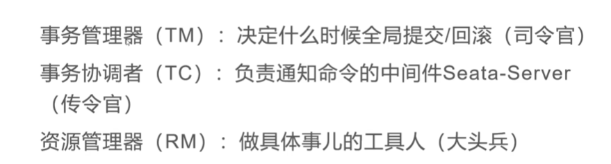
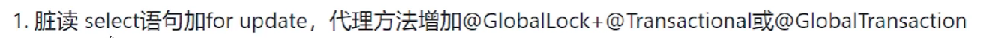

# 1.Seata


## 1.1 工作流程

前置知识 ： 2pc	




TM沟通 `Seata` 开启事务， `Seata`沟通全部的 `RM` 去执行本地事务，并且由`RM`汇报本地事务的执行结果(成功or失败)。


[注意，此时本地事务执行成功以后就提交了]，[同时，Seata会跟踪记录全部子事务的执行情况]

如果有任意子事务执行失败，则将对子事务进行`逆操作`。 逆操作如何实现？使用`Sql parser ` 分析SQL的逆操作,并保存下来。如果需要回滚各个子事务，就执行对应的逆操作。


### 1.1.1 脏读脏写问题

对于`Seata`来说， 一阶段已经有部分事务进行本地提交了。所以需要防止其他事务脏读脏写问题。




```
给行数据加行锁
```

