# 1. Shiro入门


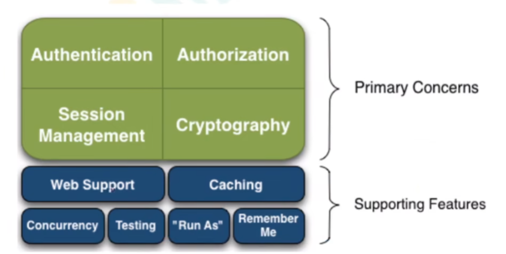


```
Authntication 认证

Authorization 授权(判断用户能否做某些行为)

Session Management  (会话管理)

Cryptography  (加密)
```


## 1.1  从外部看shiro的架构

从Application角度看


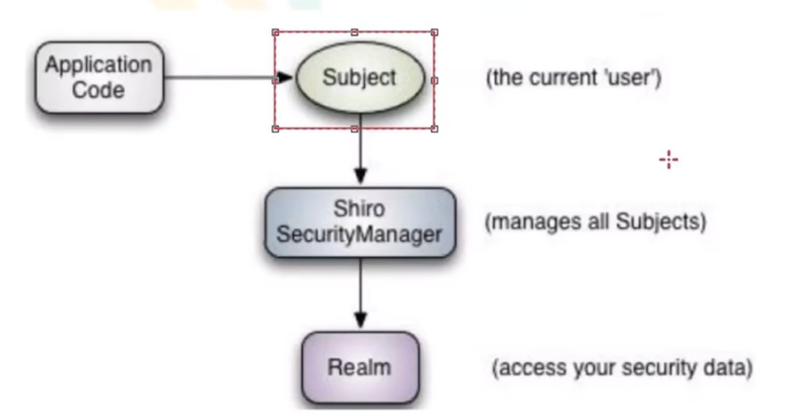


```
Subject 指当前登录的对象，可以是用户(人)，也可以是网路爬虫等。

Shiro SecurityManager    shiro 安全管理，是整个Shiro的核心。 管理全部的Subject


Realm   用于访问对应的数据。 即：用户的信息  shiro通过Realm获取的对应的信息。也就是广义上的“数据源”
```


## 1.2  quick start Demo


### 1.2.1 ini信息

shiro可以通过 数据库 或者 `.ini`文件获取 权限相关信息。


配置用户相关信息

```ini
[users]
zhangsan=123
lisi=123
```


## 1.3 登录认证


身份认证： 一般需要提供身份ID等一些标识信来证明登录者身份。例如(email , 手机号等等)


在shiro中，用户需要提供 `principals`  (身份)  和 `credentials` (证明) 给Shiro，从而Application能够验证身份。


```
通常， 一个Subject的 principals可以有多个。但只有一个 primary principal
```


最常见的 `principals`  和 `credentials` 就是 用户名/密码


## 1.4 认证流程


```
1. 收集 用户身份/凭证


2. 调用 Subject.login() 进行登录。
	如果失败，将得到 AuthenticationException,根据异常信息提示用户
	否则登陆成功
		
3. 创建自定义的  Realm类, 继承   org.apache.shiro.realm.AuthenicatingRealm 类
	实现 doGetAuthenticationInfo()方法
	
	
	
```


### 1.4.1  登录认证实例


创建一个IniSecurityManagerFactory


在resources中配置 对应的 `ini`文件


```ini
[users]
zhangsan=123
lisi=123
aaa=aaa
```


```java
 public static void main(String[] args) {
     
     	//创建一个INI SecurityManagerFactory 
        IniSecurityManagerFactory factory = new IniSecurityManagerFactory("classpath:shiro.ini");
		
        SecurityManager securityManager = factory.getInstance();

        SecurityUtils.setSecurityManager(securityManager);

        Subject subject = SecurityUtils.getSubject();

        AuthenticationToken token = new UsernamePasswordToken("zhangsan123","aaa");

        try {

            subject.login(token);
            System.out.println("如果没有抛出异常,则登陆成功");

        }catch (UnknownAccountException e){
            System.out.println("未知用户");
        }catch (ConcurrentAccessException e){
            System.out.println("账号已经登录异常");
        }catch (DisabledAccountException e){
            System.out.println("账号被禁用");
        }catch (ExcessiveAttemptsException e){
            System.out.println("尝试次数过多");
        }catch (IncorrectCredentialsException e){
            System.out.println("密码不正确");
        }catch (ExpiredCredentialsException e){
            System.out.println("密码已过期");
        }
    }
```


### 1.4.2 核心概念


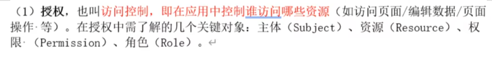


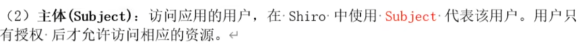

```
主体，就是代表用户
```


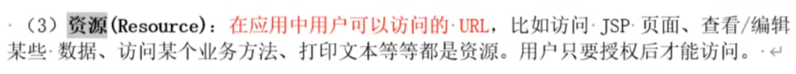

```
在Web应用中，通常 Resource就是对应的URL
```


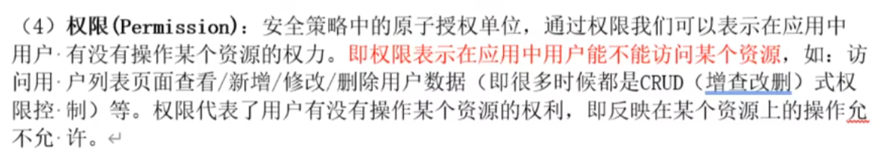

```
```


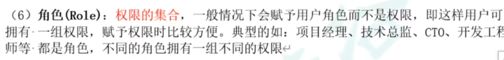

```
多个用户可以扮演用一个角色。 用户并不直接和权限关联。 角色才决定有哪些权限
```


### 1.4.2 授权方式

```java
if(subject.hasRole("admin")){
    //有权限
}else{
    //无权限
}
```


```java
@RequireRoles("admin")
public void hello(){

}
```


## 1.5  授权流程


```
通过subject.isPermitted 或者

subject.hasRole
```


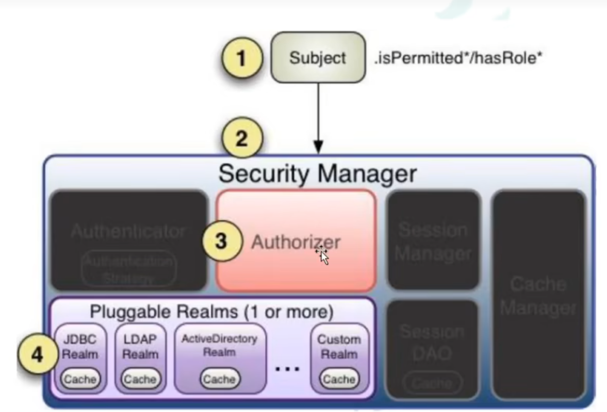


### 1.5.1 在ini中添加角色


```ini
[users]
zhangsan=123,role1,role2
```


```java
 public static void main(String[] args) {
     
		...
        AuthenticationToken token = new UsernamePasswordToken("zhangsan123","aaa");
        try {
            subject.login(token);
            System.out.println("如果没有抛出异常,则登陆成功");
            System.out.println(subject.hasRole("role1"));
            System.out.println(subject.hasRole("aaaa"));
            System.out.println(subject.hasRole("role2"));
        }catch (UnknownAccountException e){
        }
     
     	...
    }
```

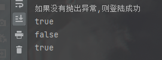


### 1.5.2 ini中配置 权限

```ini
[roles]
role1=aaa,bbb,ccc,ddd
role2=a1,a2,ccc
```


```java
	...	
	try {
            subject.login(token);
            System.out.println("如果没有抛出异常,则登陆成功");

            System.out.println("是否扮演对应角色");
            System.out.println(subject.hasRole("role1"));
            System.out.println(subject.hasRole("aaaa"));
            System.out.println(subject.hasRole("role2"));

            System.out.println("是否有对应权限");

            System.out.println(subject.isPermitted("aaa"));
            System.out.println(subject.isPermitted("bbb"));


        }catch (UnknownAccountException e){
            System.out.println("未知用户");
        }catch (ConcurrentAccessException e){
            System.out.println("账号已经登录异常");
        }
	...
```


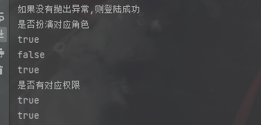


```java
subject.checkPermission("aaa");
//这个方法不返回任何值，如果鉴权失败，则抛出异常
```


## 1.6 shiro加密


shiro提供了几种快速密码加密的方式。


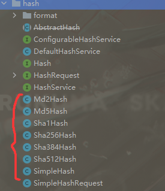


```java
        String password = "aaa";
        Random random = new Random(System.currentTimeMillis());
        StringBuilder sb = new StringBuilder();
        for (int i = 0; i < 5; i++) {
            sb.append((char) (random.nextInt(25)+97));
        }
        String salt = sb.toString();
        
        
        Sha256Hash sha256Hash = new Sha256Hash(password,salt);
        System.out.println(sha256Hash);
        System.out.println(salt);
```


## 1.7  自定义登录认证


```
shiro默认的登录认证，是不带加密的。 如果需要实现加密认证，需要自定义认证。
```


```
实现 AuthenticationRealm类

实现doGetAuthenticationInfo方法。这个方法仅仅是获取对应用户的全部认证信息 作为对比。
具体如何认证逻辑，由shiro完成
```


### 1.7.1 getAuthenticationInfo()方法


我们实现的`doGetAuthenticationInfo` 方法，将在 抽象类`AuthenticatingRealm` 中的 `getAuthenticationInfo` 方法中调用。


调用逻辑如下:

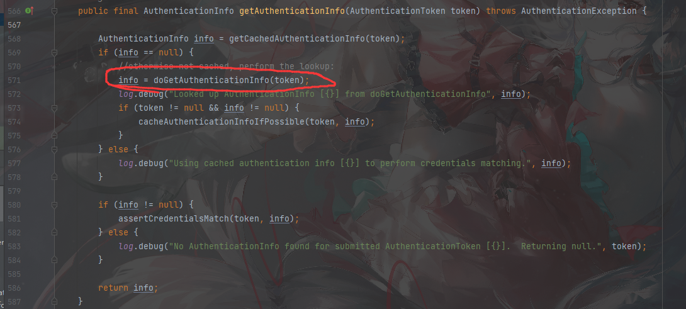


这个方法的注释如下：

```
1. 首先根据AuthenticationToken查找缓存

2.如果没有找到缓存的AuthenticationInfo，则委托doGetAuthenticationInfo(AuthenticationToken)方法执行实际的查找。
如果启用了身份验证缓存并使之成为可能，则将缓存任何返回的信息对象，以便在未来的身份验证尝试中使用。

3.如果在缓存中或通过查找没有找到AuthenticationInfo实例，则返回null，表示无法找到帐户。

4.如果找到了AuthenticationInfo实例(缓存或通过查找)，请使用credentialsMatcher确保提交的AuthenticationToken的凭据与预期的AuthenticationInfo的凭据匹配。这意味着对于身份验证尝试，总是要验证凭据。
```


要点：

```
先找缓存，缓存中没有 从数据源中查找。找不到的用户需要返回null。 

找到了可以通过  credentialsMatcher，来完成凭证匹配。
```


### 1.7.3 MyAuthenticatingRealm

```java
@Component
public class MyAuthenticatingRealm extends AuthenticatingRealm {


    @Resource
    UserService userService;

    @Override
    protected AuthenticationInfo doGetAuthenticationInfo(AuthenticationToken token) throws AuthenticationException {

        if (token instanceof MyAuthenticationToken){
            MyAuthenticationToken myToken  = (MyAuthenticationToken) token;
            String principal = (String) myToken.getPrincipal();
            String credentials = (String) myToken.getCredentials();
            //身份
            System.out.println(principal);
            //凭证
            System.out.println(credentials);

            Users users = new Users();
            users.setUsername_(principal);
            Users select = userService.select(users);
            if (select!=null){
                AuthenticationInfo info = new SimpleAuthenticationInfo(
                        token.getPrincipal(),
                        select.getPassword_(),
                        "SEMGHH"
                );
                return info;
            }
        }
        return null;
    }
}
```


## 1.8 shrio与Springboot整合

引入依赖

```xml
        <dependency>
            <groupId>org.apache.shiro</groupId>
            <artifactId>shiro-spring-boot-web-starter</artifactId>
            <version>1.10.0</version>
        </dependency>
```


### 1.8.1 自定义鉴权

实现 `AuthorizingRealm`类。


 `AuthorizingRealm` 继承于 `AuthenticatingRealm`类 ，除了完成 `获取登录信息`，还需要完成 `获取权限信息`

所以需要实现2个方法。

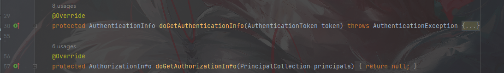

```
简而言之: 继承并实现这个类，可以同时完成  鉴权+授权
```


```java
@Component
public class MyAuthenticatingRealm extends AuthorizingRealm {


    @Resource
    UserService userService;

    @Override
    protected AuthenticationInfo doGetAuthenticationInfo(AuthenticationToken token) throws AuthenticationException {

        if (token instanceof UsernamePasswordToken){
            UsernamePasswordToken myToken  = (UsernamePasswordToken) token;
            String principal = (String) myToken.getPrincipal();
            String credentials = myToken.getCredentials().toString();
            //身份
            System.out.println(principal);
            //凭证
            System.out.println(credentials);

            Users users = new Users();
            users.setUsername_(principal);
            Users select = userService.select(users);
            if (select!=null){
                AuthenticationInfo info = new SimpleAuthenticationInfo(
                        token.getPrincipal(),
                        select.getPassword_(),
                        ByteSource.Util.bytes(select.getSalt()),
                        token.getPrincipal().toString()
                );
                return info;
            }
        }
        return null;
    }

    @Override
    protected AuthorizationInfo doGetAuthorizationInfo(PrincipalCollection principals) {
        return null;
    }
}
```


### 1.8.2 配置类

```java
@Configuration
public class ShiroConfig {

    @Resource
    private MyAuthenticatingRealm realm;


    @Bean
    public DefaultWebSecurityManager defaultSecurityManager(){
        DefaultWebSecurityManager   securityManager = new DefaultWebSecurityManager  ();
        //凭证加密 匹配器
        HashedCredentialsMatcher credentialsMatcher = new HashedCredentialsMatcher();
        credentialsMatcher.setHashAlgorithmName("md5");
        credentialsMatcher.setHashIterations(1);
        
        realm.setCredentialsMatcher(credentialsMatcher);
        securityManager.setRealm(realm);
        return securityManager;
    }

    /**
     * 配置Shiro过滤器拦截URL
     */
    @Bean
    public DefaultShiroFilterChainDefinition shiroFilterChainDefinition(){
        DefaultShiroFilterChainDefinition definition = new DefaultShiroFilterChainDefinition();
        definition.addPathDefinition("/user/login","anon");
        definition.addPathDefinition("/**","user");
        return definition;
    }

}
```


配置Shiro过滤器链，使用的是Shiro自带的过滤器。`anon` `user`

具体参考 [3.8 Shiro默认自带的过滤器](# 3.8 Shiro默认自带的过滤器)


### 1.8.3 多Realm源


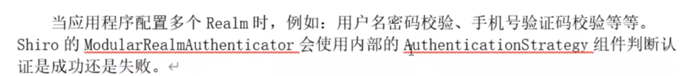


ModularRealmAuthenticator 有3种认证策略：

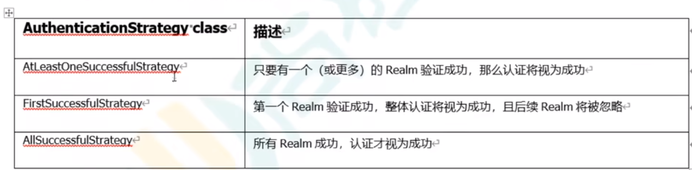

```
AtLeastOneSuccessfulStrategy ，所有的Realm都会被调用，只要有1个成功，就认为成功

FirstSuccessfulStrategy ，遇到第一个成功的Realm就立刻返回，此时认为成功。

AllSuccessfulStrategy ,所有的Realm都成功才算 最终成功。
```


默认是 AtLeastOneSuccessfulStrategy 策略


### 1.8.4  Remember Me功能

shiro 提供了 remember me 功能。


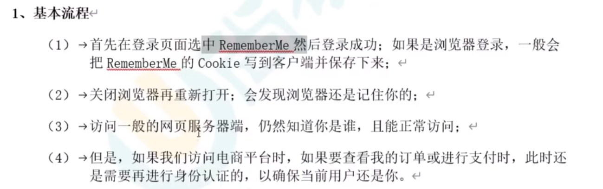


#### 1.8.4.1 Cookie的设置

```java

```


### 1.8.5 登出

使用Shiro 默认自带的 logout 过滤器即可完成登出。 只需要配置 logout过滤器即可

```java
    @Bean
    public DefaultShiroFilterChainDefinition shiroFilterChainDefinition(){
        DefaultShiroFilterChainDefinition definition = new DefaultShiroFilterChainDefinition();
        definition.addPathDefinition("/user/login","anon");
        //配置logout 过滤器
        definition.addPathDefinition("/logout","logout");
        definition.addPathDefinition("/**","user");

        return definition;
    }
```


### 1.8.6 后端服务注解

注解可以加在 Controller方法，也可以加在 Service方法中。


#### 1.8.6.1 @RequiresAuthentication

验证用户是否登录。等同于

```
subject.isAuthenticated
```


#### 1.8.6.2 @RequiresUser

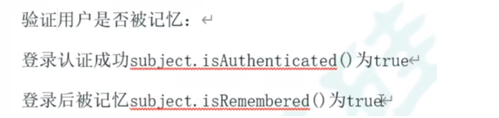

#### 1.8.6.3 @RequiresGuest

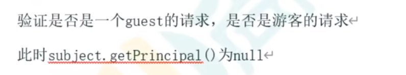


#### 1.8.6.4 @RequiresRoles


验证Subject是否有相应角色。可以在`controller` `service`方法中使用

```java
    @RequiresRoles(value = {"admin","superAdmin"})
    @RequestMapping("/hello")
    public R helloWorld(){
        return R.success("hello,world!");
    }
```


 如果验证不通过则抛出 `AuthorizationException`

可以使用  `@ControllerAdvice` 来捕捉异常返回：

```java
@ControllerAdvice
public class UserControllerAdvice {

    @ResponseBody
    @ExceptionHandler(value = {AuthorizationException.class})
    public R handlerAuthorizationException(AuthorizationException exception){
        return R.failure("权限校验失败,"+exception.getMessage());
    }
}
```


#### 1.8.6.5 @RequiresPermissions


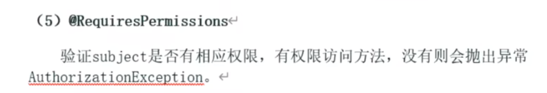


### 1.8.7 自定义获取授权信息

还是需要实现`AuthorizingRealm` 类。

```
```


# 3. 一些类


## 3.1  simpleAccountRealm

一个简单的用户管理器。

在 SimpleAccountRealm中注册用户及他扮演的角色。

SimpleAccountRealm中存储真正的用户密码及角色。


当然，支持从 .ini 文件中批量导入用户，或者从数据库中 

同时，还支持自己重写 SimpleAccountRealm

### 3.1.2 api

| modify         | method                                                      | expression                                       |
| -------------- | ----------------------------------------------------------- | ------------------------------------------------ |
| public void    | addAccount(String username,String password)                 | 添加用户。<br />将调用下面的方法，扮演角色为Null |
| public void    | addAccount(String username,String password,String... roles) | 添加用户和扮演角色                               |
| public boolean | accountExists(String username)                              | 是否含有用户                                     |
| public boolean | roleExists(String name)                                     | 是否含有角色                                     |

### 3.1.3 成员变量

```java
protected final Map<String, SimpleAccount> users;   #用户表
protected final Map<String, SimpleRole> roles;  #角色表
protected final ReadWriteLock USERS_LOCK;   #用户锁
protected final ReadWriteLock ROLES_LOCK;   #角色锁
```

来找一下源码：

```java
protected void add(SimpleAccount account) {
    String username = this.getUsername(account);
    this.USERS_LOCK.writeLock().lock();

    try {
        this.users.put(username, account); 
    } finally {
        this.USERS_LOCK.writeLock().unlock();
    }

}
```

Map<String,SimpleAccount>   其中，String是 User的 username。不难猜测，在验证时，通过搜索Map的String确定username再通过SimpleAccount确定接下来的安全认证。

而SimpleAccount是 apache官方给的一个简单的Account实现类。


## 3.2.DefaultSecurityManager


默认的安全管理者

在DefaultSercurityManager中注册Realm

```java
defaultSecurityManager.setRealm(simpleAccountRealm);
```


### 3.2.1 成员变量

```java
private static final Logger log = LoggerFactory.getLogger(DefaultSecurityManager.class);
protected RememberMeManager rememberMeManager;
protected SubjectDAO subjectDAO;
protected SubjectFactory subjectFactory;
```

 subjectFactory 用于生成Subject

subject也称  currentUser(当前用户)。是分发给任意一个用户的操作接口。用于验证用户：

用户 通过 subject 使用Token 验证登录；

```java
subject.login(token);
```


### 3.2.2 构造方法

```java
public DefaultSecurityManager() {
    this.subjectFactory = new DefaultSubjectFactory();
    this.subjectDAO = new DefaultSubjectDAO();
}

public DefaultSecurityManager(Realm singleRealm) {
    this();
    this.setRealm(singleRealm); //给默认安全性管理者 设置了真正的用户列表 AccountRealm
}

public DefaultSecurityManager(Collection<Realm> realms) {
    this();
    this.setRealms(realms); //设置了多个用户列表
}
```

无参构造方法：给两个成员变量创建了实例。subjectFactory , subjectDAO

下面两个重载的构造方法，都执行了重要的无参构造方法。


## 3.3 .SecurityUtil

安全性工具类，仅用于生成Subject


在SecurityUtil 中注册 SecurityManager

```java
SecurityUtils.setSecurityManager(SecurityManager securityManager);
```


### 3.3.1 成员变量


```java
private static volatile SecurityManager securityManager;
```

只有一个静态 volatile变量，安全性管理者。


### 3.3.2 api

```java
public SecurityUtils() {
}
```

只有一个无参构造方法。


只有3个方法

| modify        | method                                                       | expression                                               |
| ------------- | ------------------------------------------------------------ | -------------------------------------------------------- |
| public static | Subject     getSubject()                                     | 最重要的功能，生成subject。是currentUser的代表           |
| public static | void      setSecurityManager(SecurityManager securityManager) | 设置安全性管理者。                                       |
| public static | SecurityManager getSecurityManager()                         | 获得当前绑定的安全型管理者。<br />如果是null，就抛出异常 |


## 3.4. Subject

Components supporting the [`Subject`](https://shiro.apache.org/static/1.8.0/apidocs/org/apache/shiro/subject/Subject.html) interface, the most important concept in Shiro's API.//最重要的概念

A `Subject` is *the* primary component when using Shiro programmatically for single-user security operations, //subject对于用户是独立的

and it is the handle to any accessible user security data. //他是接触任何用户安全数据的handle

All single-user authentication, authorization and session operations are performed via a `Subject` instance.//所有的单用户认证，授权，以及会话操作都经过Subject实例


### 3.4.1 api


通过api 看看subject能完成哪些重要的功能


| modify | method                           | expression          |
| ------ | -------------------------------- | ------------------- |
|        | isAuthenticated()                | 返回是否 已经过验证 |
| void   | login(AuthenticationToken token) | 登录                |
| void   | logout()                         | 登出                |
| ..     |                                  |                     |


## 3.5 AuthenticationException

Shiro提供了一些 认证异常。 


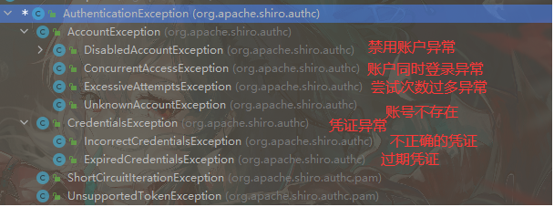


## 3.6  AuthenticationInfo


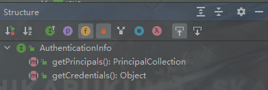


## 3.7  HashedCredentialsMatcher

哈希化凭证匹配器。

用于配置Shiro中的加密方式。告诉Shiro如何判断本次Subject中的凭证和 数据源中提取出的凭证是否相等，


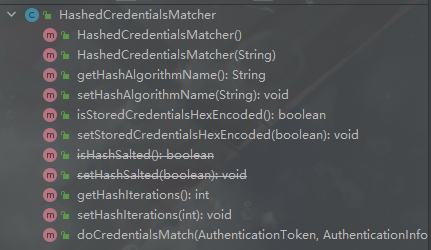


### 3.7.1  类方法


```java
//设置加密算法的名称
//例如 md5
void setHashAlgorithmName();

//设置 加密迭代次数
void setHashIterations(int);
```


## 3.8 Shiro默认自带的过滤器


Filter Name                     			Class
anon                  				  org.apache.shiro.web.filter.authc.AnonymousFilter
authc                  				 org.apache.shiro.web.filter.authc.FormAuthenticationFilter
authcBasic     					 org.apache.shiro.web.filter.authc.BasicHttpAuthenticationFilter
logout             					 org.apache.shiro.web.filter.authc.LogoutFilter
noSessionCreation  		  org.apache.shiro.web.filter.session.NoSessionCreationFilter
perms               				   org.apache.shiro.web.filter.authz.PermissionsAuthorizationFilter
port                    			      org.apache.shiro.web.filter.authz.PortFilter
rest                   			        org.apache.shiro.web.filter.authz.HttpMethodPermissionFilter
roles                			         org.apache.shiro.web.filter.authz.RolesAuthorizationFilter
ssl                     				    org.apache.shiro.web.filter.authz.SslFilter
user                   			       org.apache.shiro.web.filter.authc.UserFilter


### 3.8.1  anon

```
AnonymousFilter ,表示任何人都可以访问
```


### 3.8.2  authc

```
必须是登录之后才能进行访问,不包括remember me
```


### 3.8.3  user

```
登录用户才可以访问，包含remember me
```


### 3.8.4  perms

```
指定过滤规则，这个一般是扩展使用，不会使用原生的
```


### 3.8.5 logout


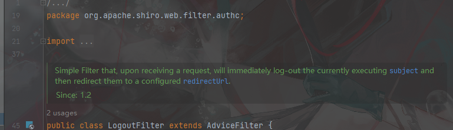


```
简单过滤器，在接收到请求时，将立即注销当前正在执行的主题，然后将它们重定向到已配置的redirectUrl。
```


## 3.9 AuthenticationStrategy

认证策略。这个类是一个接口

一个Realm认为是一个 获得【认证数据】的数据源。 也可以认为是一种认证方式。(邮箱认证/手机认证/账号密码认证)

Shiro支持多 realm认证。这意味着用户可以以任意的方式(无论是手机,邮件,账号密码)尝试认证。


此时就需要配置响应的认证策略：

```
1.任意一个Realm通过就算通过。  //FirstSuccessfulStrategy
2.任意一个Realm通过就算通过,但必须走过所有的realm  //AtLeastOneSuccessfulStrategy
3.全部realm通过才算通过  //AllSuccessfulStrategy
```


Realm默认提供了3种如上的策略，

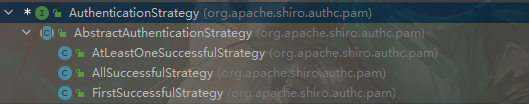


### 3.9.1 接口方法


```java
AuthenticationInfo beforeAllAttempts(Collection<? extends Realm> realms, AuthenticationToken token)
throws AuthenticationException;
```


```
方法被ModularAuthenticator组件调用。这个方法在即将开始指定令牌的身份验证过程(在实际调用任何Realm)之前调用。
```


//TODO


## 3.10 WebUtils


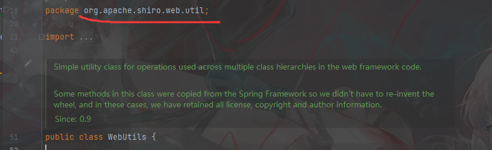


```
简单的实用程序类，用于在web框架代码中跨多个类层次结构使用的操作。


这个类中的一些方法是从Spring Framework中复制的，因此我们不必重新发明轮子，在这些情况下，我们保留了所有许可、版权和作者信息。

//Spring Framework中有同名的工具类 WebUtils
```


# 5.MD5+salt

```java
    String password = "123456";//原密码
    String salt = new SecureRandomNumberGenerator().nextBytes().toString();//生成salt
    int hashIterations=1;//hash操作次数
    SimpleHash md5 = new SimpleHash("MD5", password, salt, hashIterations);
	//SimpleHash构造方法（String algorithmName,Object source,@Nullable salt,int Iterations）
	// 算法名称，源，盐，哈希次数
    System.out.println(md5.toString());//md5+salt,hash后的值
```

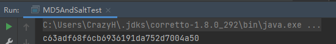


查看jvm支持的算法都有哪些：

```java
for (Provider provider : Security.getProviders()) {
    System.out.println("=========provider====== : " + provider.getName());
    for (Provider.Service service : provider.getServices()) {
        System.out.println(service.getAlgorithm());
    }
}
```

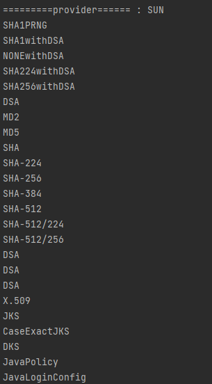****


