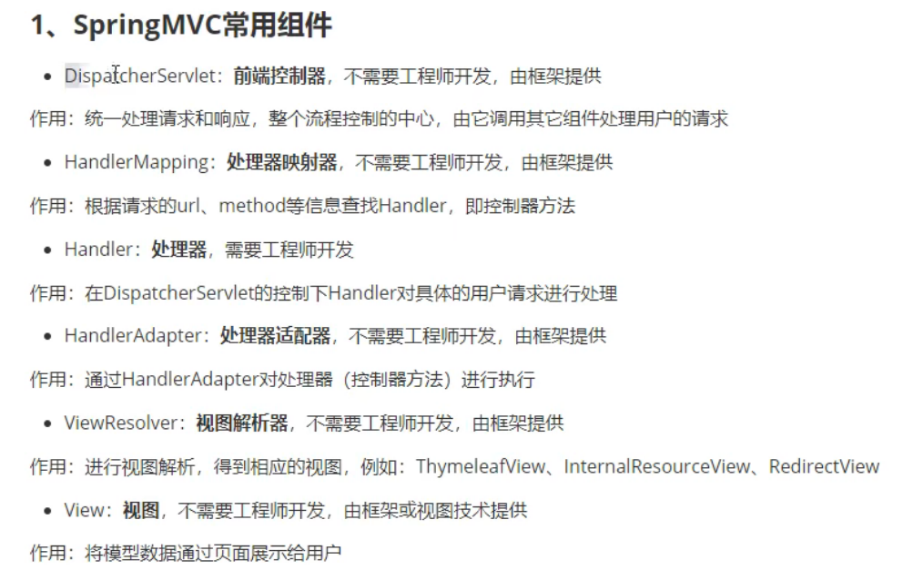
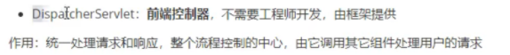
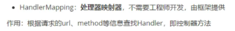
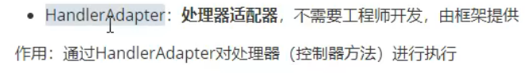
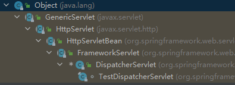
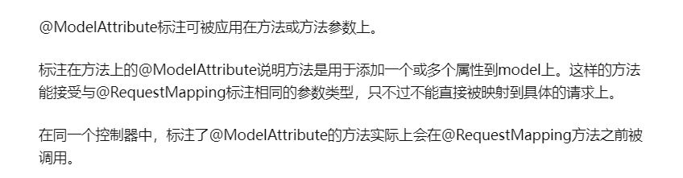

# 1.SpringMVC 执行流程

## 1.1 拆解SpringMVC为各个组件







```
接受请求,分发请求。
```




```
所谓Handler 其实就是Controller. Mapping映射器，见名知意。
识别url 并 找到对应的 Controller 解决Request。
```




```
当HandlerMapping找到了对用的Handler，由HandlerAdapter调用执行
```


## 1.2 DispatcherServlet

内容分发中心，最核心组件。

继承树如下：




### 1.2.1 doDispatch

核心方法,处理分发doDispatch(HttpReqest,HttpResponse)


# 2. 一些注解


## @ModelAttribute




