# 1.springSecurity 入门

 spring security 的核心功能主要包括：

- 认证 （你是谁）  认证当前访问的用户，确定到底是哪个用户
- 授权 （你能干什么） 确定当前用户有权限做什么
- 攻击防护 （防止伪造身份）

其核心就是一组过滤器链，项目启动后将会自动配置。最核心的就是 Basic Authentication Filter 用来认证用户的身份，一个在spring security中一种过滤器处理一种认证方式。


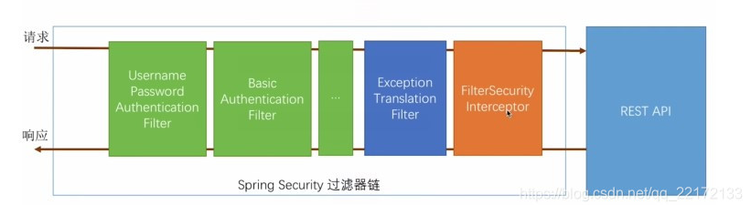


## 1.1 hello World by Spring Security

引入依赖

```xml
<dependency>
    <groupId>org.springframework.boot</groupId>
    <artifactId>spring-boot-starter-security</artifactId>
</dependency>
```


先准备一个HelloController

```java
@RestController
public class HelloController {
    @RequestMapping("/hello")
    public String hello(){
        return "Hello World";
    }
}
```

访问这个接口：

```
localhost:8080/hello
```


当用户从浏览器发送请求访问 `/hello` 接口时，服务端会返回 `302` 响应码，让客户端重定向到 `/login` 页面，用户在 `/login` 页面登录，登陆成功之后，就会自动跳转到 `/hello` 接口。


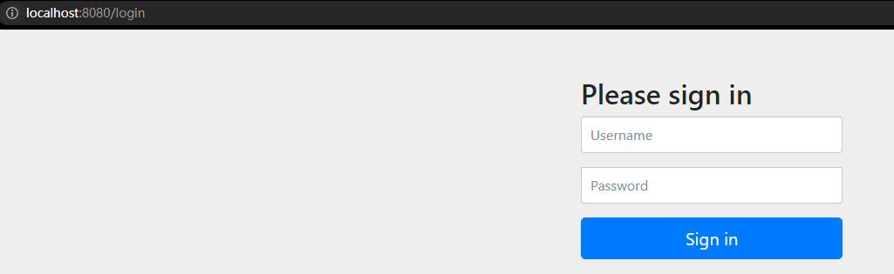

项目的控制台下，springSecurity会给出此次部署的 generated security password

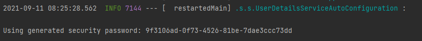

```
user
9f3106ad-0f73-4526-81be-7dae3ccc73dds
```


另外，也可以使用 `POSTMAN` 来发送请求，使用 `POSTMAN` 发送请求时，可以将用户信息放在请求头中（这样可以避免重定向到登录页面）：

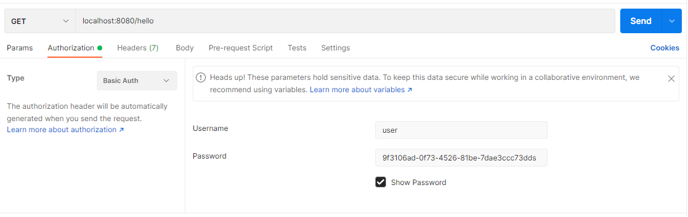


通过以上两种不同的登录方式，可以看出，Spring Security 支持两种不同的认证方式：

- 可以通过 form 表单来认证
- 可以通过 HttpBasic 来认证


## 1.2  前后端分离项目中，登录校验流程

认证, 也就是登录校验过程

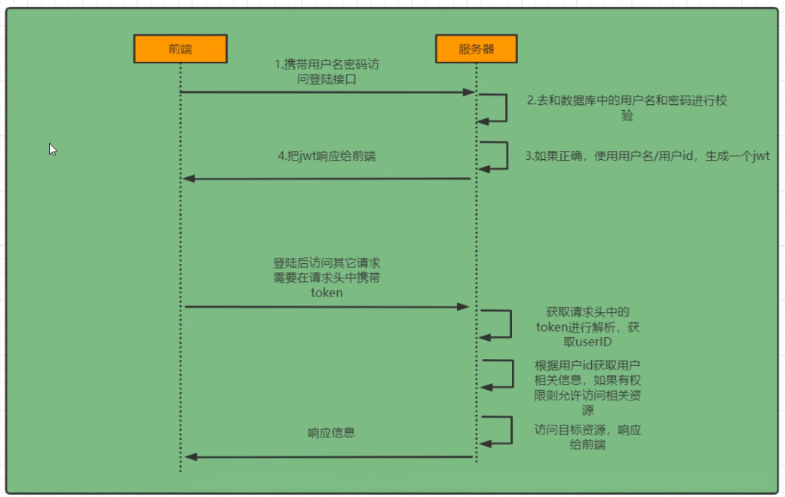


## 1.3    springSecurity 流程


springSercurity是一个过滤器链(责任链模式)。


对应组件的解释：

```
UsernamePasswordAuthenticationFilter : 负责处理在登陆页面填写了 用户名+密码 以后的请求登录。


ExceptionTranslationFilter :   抛出任何的 AccessDeniedException 和 AuthenticationException 
							  拒绝权限异常，认证异常
							  
							  
FilterSecurityInterceptor :  负责权限校验过程 (授权)
```


### 1.3.1  helloWorld案例中的流程

接下来描述在HelloWorld中，SpringSercurity的工作流程。其中涉及了非常多的类，初学时需要耐心的一条线脉络把握下来。

各种陌生的类都标注了索引，可以直接点击跳转。


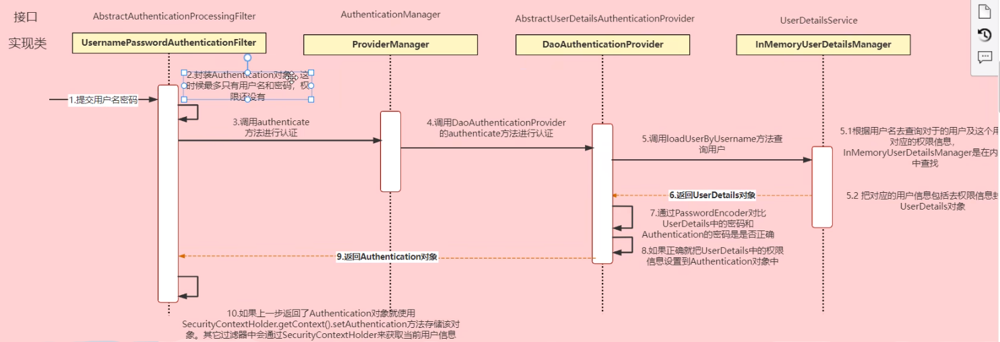


```
1.首先提交用户名密码,传入到UsernamePasswordAuthenticationFilter中。

2. Filter将 username+password 封装成一个 Authentication对象
```


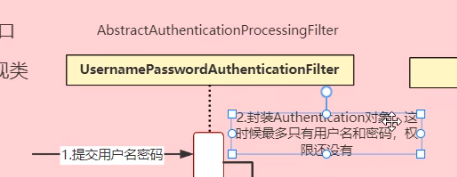


tips:

[Authentication](#2.4 Authentication)

```
Authentication : 这个类代表了一个用户的认证请求。注意此时只是代表了用户请求，一旦认证成功
(通过步骤3认证) Authentication类就代表了一个用户Token
```


```
3. 调用 AuthenticationManager.authenticate(Authentication)  这个方法去认证Authentication
```


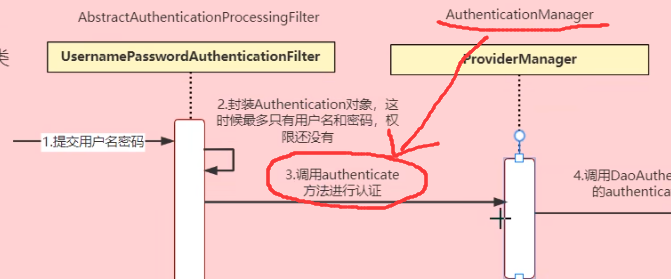

​	

tips:

```
AuthenticationManager 接口非常简单,它存在的目的就是： 认证一个Authentication。
接口内只有1个方法，就是 authenticate(Authentication authentication) 方法返回的也是一个Authentication对象。
这说明，认证成功或失败的结果，都需要在Authentication对象内部体现 。
```

具体的AuthenticationManager 查看  [AuthenticationManager](#2.6 AuthenticationManager)


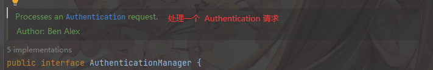


```
5.AuthenticationManager的实现类是 ProviderManager, 其内部封装了一个 List<AuthenticationProvider> ,这是一个策略的List ,里面包含的策略可以定向认证不同类型的Authentication。

调用List内的策略即可完成认证功能。


```


tips:

```
其中解决 username/passwrod的策略类是  DaoAuthenticationProvider
```

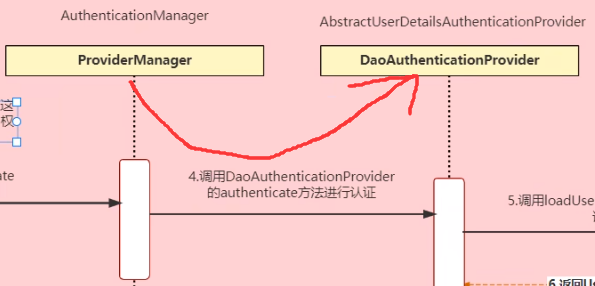


```
6. DaoAuthenticationProvider 需要一个存放了用户数据的数据源(数据源的基本单位称为 UserDetails)，作为认证的比对样本。所以需要提供一个数据源。

默认是内存数据源 InMemoryUserDetailsManager  
```

tips:

```
内存数据源是不安全的,ss官方声明，这个数据源只是为了一个演示效果测试而存在的
```

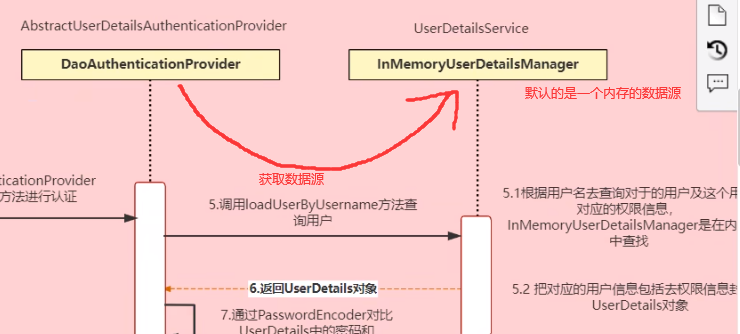


```
7. 从数据源提取出对比样本后，返回给DaoAuthenticationProvider 进行对比，由于数据库中的密码通常是被加密后存储的。所以需要实现一个特殊的 加密器(PasswrodEncoder 接口)进行对比。

如果对比成功，将UserDetails 存入Authentication,这之后Authentication已经具备了代表一个用户的Token的功能
```

tips: 

[PasswrodEncoder](#2.1  PasswordEncoder 接口)是可以自定义规则的。

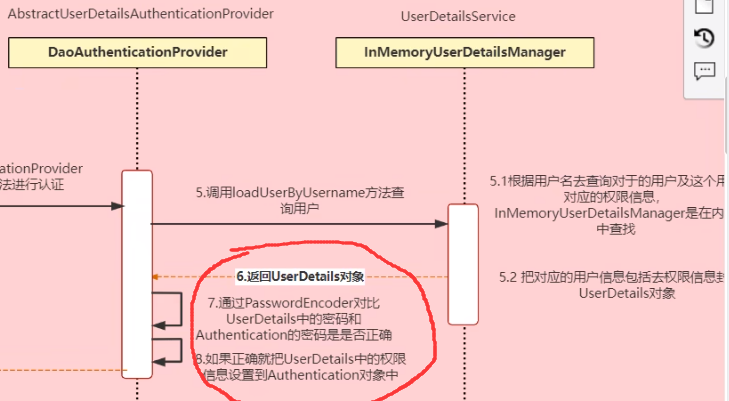


```
8. 至此，认证通过了，返回Authentication对象到 上下文中 (SecurityContextHolder)


其他过滤器会通过SecurityContextHolder来获取当前用户信息。
```

 tips: [SecurityContextHolder](#2.2 SecurityContextHolder )


### 1.3.2   前后端分离模式下，设计思路


#### 1.3.2.1 认证


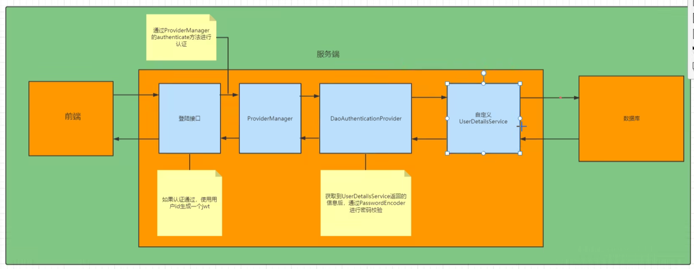


```
1. 前后端分离，需要准备一个登录接口 Controller
```

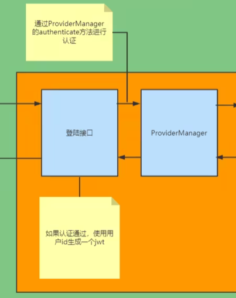


```
2. 登录接口调用  AuthenticationManager(这里不重写) ,所以会进一步调用 DAOAuthenticationProvider

3. 自定义 PasswordEncoder 使之和数据库中存储的密码相符

4.自定义 UserDetailsService (定义了从数据库中取出UserDetails)
```


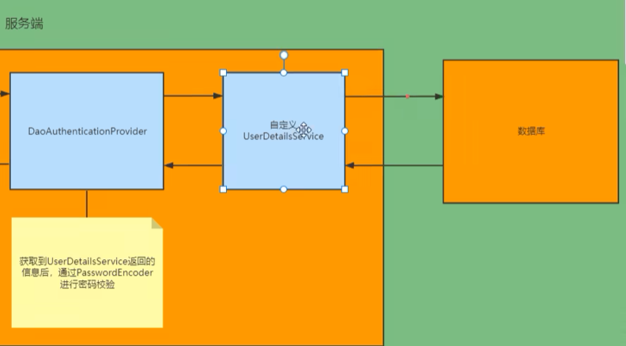


#### 1.3.2.2 校验


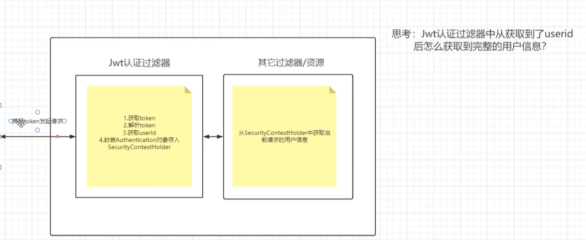


​	


## 1.2 用户名配置

对登录的用户名/密码进行配置，有三种不同的方式：

- 在 application.properties 中进行配置
- 通过 Java 代码配置在内存中
- 通过 Java 从数据库中加载


### 1.2.1 通过配置文件

可以直接在 application.properties 文件中配置用户的基本信息：

```properties
spring.security.user.name=javaboy
spring.security.user.password=123
```


### 1.2.2 通过配置类

需要一个Spring Security 的配置类 WebSecurityConfigurerAdapter 

```java
@Configuration
@EnableWebSecurity
public class WebSecurityConfig extends WebSecurityConfigurerAdapter {
    @Override
    protected void configure(HttpSecurity http) throws Exception {
        http
                .authorizeRequests()// 对请求配置
                .antMatchers("/hello")//添加Pattern
                .permitAll()//添加“patterns”全部放行
                .and()//返回HttpSecurity
                .authorizeRequests()
                .antMatchers("/admin")
                .hasAnyRole("admin")//指定可访问的Roles
        ;
    }

    @Autowired
    public void configGlobal(AuthenticationManagerBuilder auth) throws Exception {
        auth.
                inMemoryAuthentication()//在内存中的 身份验证
                .withUser("admin1")//username
                .password("123456")//password
                .roles("admin")//roles

                .and()
                .withUser("admin2")
                .password("123456")
                .roles("admin");

    }
}
```


HttpSecurity 类的方法

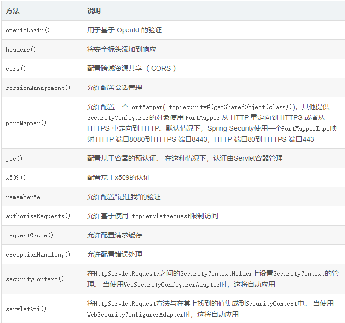

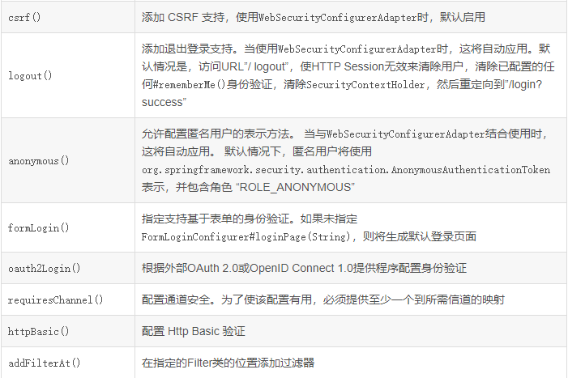


### 1.2.3  从数据库加载


## 1.3 设置角色


# 2   一些类

主要解释一些关键类，通过源码注释分析这些类代表了什么？做什么用的


## 2.1  PasswordEncoder 接口

```
为编码password的接口。实现类是 BCryptPasswordEncoder。
```


为什么要有这个接口？它是做什么的？

```
这个接口可以用于认证阶段。通常密码保存在数据库是绝对不会明文保存的，所以在认证阶段需要对请求过来的password加密并对比。
因此,需要实现PasswordEncoder接口，由于他是一个接口，所以可以自定义实现自己的加密方式。
```


PasswordEncoder 接口的三个方法

|         |                                                          | expression                                                   |
| ------- | -------------------------------------------------------- | ------------------------------------------------------------ |
| String  | encode(CharSequence rawPassword)                         | 为一整行密码编码。通常, 一个好的编码算法支持 SHA-1<br />更好的算法包括 8字节的hash<br />再好的就是包含一个随机的盐 |
| boolean | matches(CharSequence rawPassword,String encodedPassword) | 验证当前密码<rawPassword>是否与 存储的已经编码的<encodedPassword>匹配。<br />因为存储的密码本身永远不会被破解 |
| boolean | upgradeEncoding(String encodedPassword)                  | 如果编码后的密码需要再次编码以提高安全性，则返回true，否则返回false。默认实现总是返回false。 |


## 2.2 SecurityContextHolder 

这个类，专门用于存放已经 [通过验证]的 Authentication。

由专门用于认证的Filter放入( 广义上的生产者)，由后续完成各种功能的Filter使用(消费者)


### 2.2.1什么是 SecurityContextHolder

它是 spring Security的核心，内部结构如下图

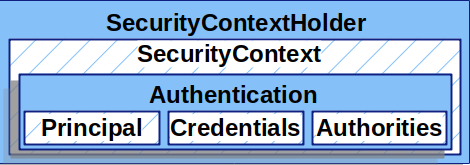


它是 Spring Security存储已[认证](https://docs.spring.io/spring-security/site/docs/5.3.11.RELEASE/reference/html5/#authentication)人员详细信息的地方。只要它存在一个值，就认为它通过了验证。

让一个用户通过验证的最好办法，就是在 SecurityContextHolder中直接设置。


------


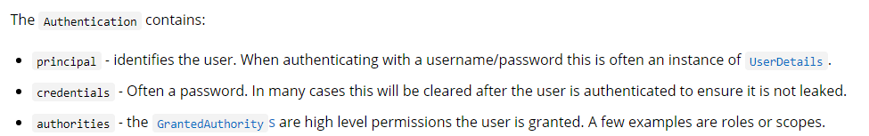

```
principal - 定义了 user。 当使用username/password模式认证的时候，它通常是 UserDetails
credentials - 通常它是一串密码。
authorities - 许可权限。 对于user来说它是一种更高水平层次的许可证。 实例是:roles 或者 scopes 作用域

```


如果还不理解： 看一看 principal 和 credentials 的数据类型。都是Object。

principal + credentials 的组合，比 username+password 的（String）组合更宽泛。.

 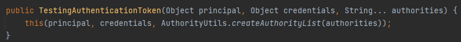

即:验证不局限于usrname/psw,而将其扩展成了<Object>类型的信物层面。你可以拿任意样式的信物来验证自己的身份，当然这么做的同时，你需要为Spring Security 提供一套验证自定义信物的方式


------


new一个 Authentication 实例

```
Authentication auth = new TestingAuthenticationToken("admin1","123456","role_admin");
```

SecurityContextHolder 含有多个 SecurityContext。每个SecurityContext都有Authentication。Authentication包含了帐号密码以及扮演的角色。


------


### 2.2.1 设置 SecurityContextHolder


```java
SecurityContext context = SecurityContextHolder.createEmptyContext(); 
Authentication authentication =
    new TestingAuthenticationToken("username", "password", "ROLE_USER"); 
// 在生产场景中更常见的是  UsernamePasswordAuthenticationToken(userDetails,password,authorities)
context.setAuthentication(authentication);//SecurityContext包含了authentication

SecurityContextHolder.setContext(context); //静态方法setContext 设置上下文
```


### 2.2.2 获取当前 已通过身份验证的用户

```java
SecurityContext context = SecurityContextHolder.getContext();//静态方法 .getContext()
Authentication authentication = context.getAuthentication();//获取Security里的Authentication
String username = authentication.getName();//获取名字
Object principal = authentication.getPrincipal();//获取Principal
Object credentials = authentication.getCredentials();//获取credentials
Collection<? extends GrantedAuthority> authorities = authentication.getAuthorities();//获取relos
```


下面自己实际操作一个实例：

```java
@Test
public void test() {

    SecurityContext emptyContext = SecurityContextHolder.createEmptyContext();
    Authentication authentication = new TestingAuthenticationToken("admin1", "123456", "role_Administrator");
    emptyContext.setAuthentication(authentication);
    SecurityContextHolder.setContext(emptyContext);


    SecurityContext context = SecurityContextHolder.getContext();
    Authentication auth = context.getAuthentication();
    String name = auth.getName();
    Object principal = auth.getPrincipal();
    Object credentials = auth.getCredentials();
    Collection<? extends GrantedAuthority> authorities = auth.getAuthorities();

    System.out.println("Authentication.getName() : "+name);
    System.out.println("Authentication.getPrincipal() : "+principal);
    System.out.println("Authentication,getCredentials() : "+credentials);
    authorities.forEach(x-> System.out.println("Authentication.getAuthorities() : "+x));

}
```

### 2.2.3 SecurityContext存储在哪里？

默认情况下，SecurityContextHolder 会把SecurityContext 存储在ThreadLoad下。保证了多个线程不会冲突。同时

Spring Security 的FilterChainProxy 确保了SecurityContext 始终会被清除干净。

## 2.3 SecurityContext


官方文档中，对SecurityContext描述很少：

SecurityContext从 SecurityContextHolder中获得，在它中存储了 Authentication对象。


可以认为SecurityContext就是Hodler管理的基本单元。


## 2.4 Authentication


```
简单的说：  一次任意的请求都会包装为一个  Authentication对象，这个Authentication对象包含着请求的Username和Password。

Authentication对象负责被 后续的过滤器组件认证，授权。

如果一个Authentication通过了认证以后，它就代表了一个用户Token
```


下面是官方Docs的解释：


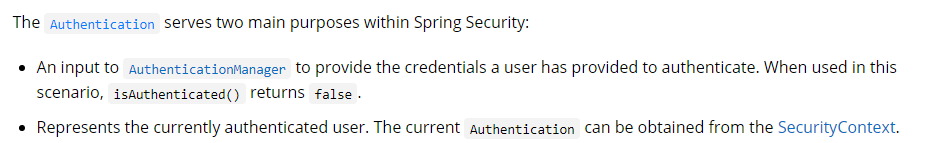

```
1. Authentication 是一个凭证。它被输入给AuthenicationManager （我称之为 认证管理器）证明了一个用户已经提交了认证的凭证。 当在以上场景中，isAuthenticated()将返回false

2. 代表了一个当前已经通过认证了的用户
```


## 2.5 Authorities


### 2.5.1 什么是 Authorities 

authorities是高级许可的一种抽象描述，在2.2.1中结构图可以看到。它包含在 authentication中，通常代表了roles

在Spring Security 中，它的接口是  GrantedAuthority。一个该接口的实现类:SimpleGrantedAuthority


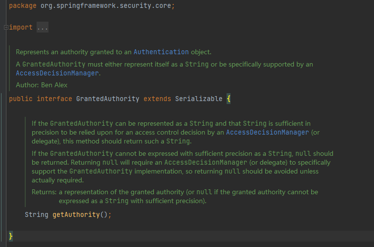

```
代表了一个权限，授权给Authentication
一个GrantedAuthority 必须实现其中的一个： 用String代表自己/ 被AccessDecisionManager支持
```

### 2.5.2  用GrantedAuthority 代表 Authorities.

官方文档中，并没有对Authorities做特别的解释。Authorities更多的表示实际生活中的种种权限，代表的是  `很多权限`（权限s）。

在java中，它是由GrantedAuthority接口表示的。GrantedAuthority就等价于 Authority 。一个GrantedAuthority实现类的Collection 就等价于 Authorities

------

我们可以从 Authentication.getAuthorities()获得一个 Collection<? extends GrantedAuthority>。通过遍历collection可以拿到这个认证用户的所有Roles。

稍后可以配置这个Roles对应的 Web权限，方法权限，Object对象权限。Spring Security 的其他部分能对Roles的具体权限进行解释。

------

当使用 username/password 这种传统的认证模式。GrantedAuthority 通常被加载为 `UserDetailService`接口


 UserDetailsService：

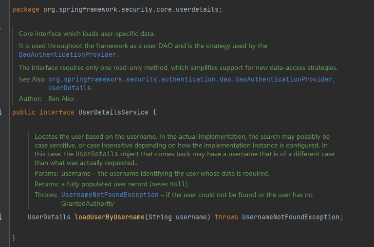

```
加载用户特殊数据的核心接口。它作为用户DAO在整个框架中使用
```

------


通常，GrantedAuthority 是设置 应用级别的 权限。他们不应该被指定给一个特定的对象。

例如：你不应该把GrantedAuthority授权给 [Employee number 45]。因为可能会含有 数千个员工,那样的话，你将很快用光你的内存。应该是 [Employee]这种的员工类roles


## 2.6 AuthenticationManager

这个接口，就是验证一个Authentication对象的。 下面简称AuthenticationManager 为 Manager

```
我们知道，用户的一次请求，会被封装成一个Authentication对象。而Manager接口就是判断认证的。
```


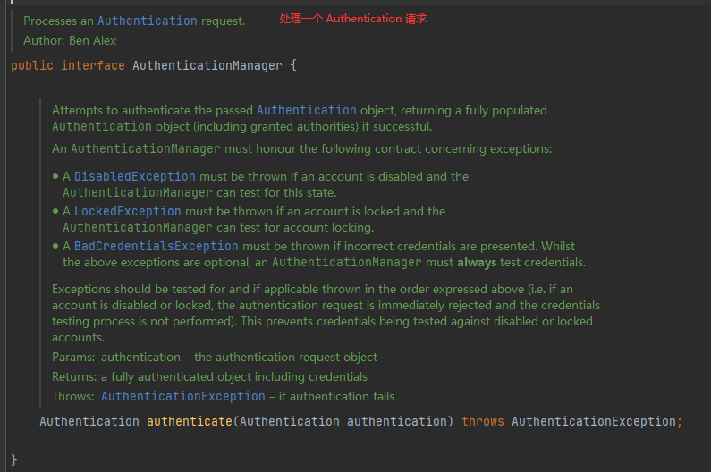


```
Spring Security Filter(过滤器链) 通过执行 AuthenticationManager，把 Authentication 返回给 SecurityContextHolder。

如果并没有整合Spring Security Filters ，我们可以直接把 SecurityContext 加入到SecurityContextHolder中，而不需要 AuthenticationManager 。就像2.2.1中的操作。
```


### 2.6.1  authenticate 方法

确认是否认证的方法。

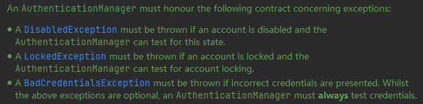

```
所有的 Manager都必须遵守以下契约：

1. 如果一个账号被禁用了，那么必须抛出一个 DisabledException 异常 ， Manager可以重复测试这次状态

2. 如果一个账号被锁定了，那么必须抛出一个 LockedException 异常， Manager可以重复测试账号是否锁定

3.如果提供了不正确的凭据，则必须抛出BadCredentialsException 异常。虽然上述异常是可选的，但AuthenticationManager必须始终测试凭证。
```


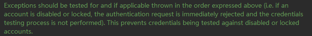

```
应该对异常进行测试，如果适用，则按上述顺序抛出异常(例如，如果帐户被禁用或锁定，身份验证请求立即被拒绝，并且不执行凭证测试过程)。这可以防止针对禁用或锁定的帐户测试凭据。
```


AuthenticationManager接口有很多的实现类：


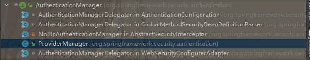


通常使用 ProviderManager 来实现 AuthenticationManager接口

[ProviderManager类解析](#2.7 ProviderManager)


## 2.7 ProviderManager


ProviderManager 是 AuthenticationManager 最常见的实现类。


ProviderManager 中有一个List<AuthenticationProvider> 集合，集合中的元素是  AuthenticationProvider 接口

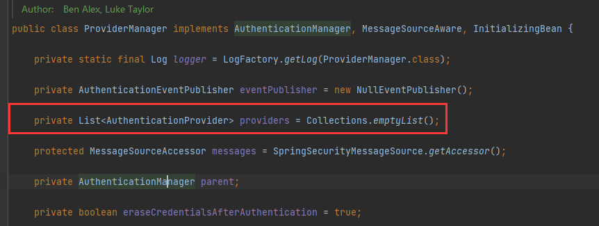


[AuthenticationProvider](#2.7.1 AuthenticationProvider) 是Manager里真正验证用户身份的执行器。

```
这个List<AuthenticationProvider>  providers 存放着全部的 认证器。等待认证的Authentication会依次尝试 providers内的全部执行器。如果当前执行器能够处理这一种Authentication就处理，否则继续尝试下一个。
```


### 2.7.1 AuthenticationProvider


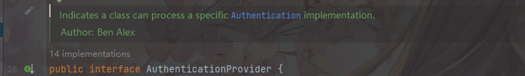


认证提供器，为具体的某一种 Authentication 提供仲裁方法。

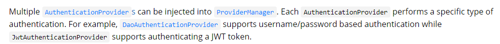

翻译：

```
多个AuthenticationProvider可以被注入到ProviderManager 中。
每一个 AuthenticationProvider 负责处理一种特殊的  authentication。


例如: 
username/password 模式认证，就可以使用   DAOAuthenticationProvider。
JwtAuthenticationProvider 支持 认证 JWT token
```


#### 2.7.1.1 接口内方法

接口只有2个方法非常简单：


```
和 AuthenticationManager一样的  authenticate方法  (注意，没有任何继承关系。在代码层面上是不一样的)

supports(Class<?> authenticationClz)   //当支持这个Authentication类型就返回true
```


#### 2.7.1.2  工作流程


------

每一个 AuthenticationProvider 都将对Authentication做出一种仲裁 : 

```
认证成功；

认证失败；

不能仲裁，并将仲裁转交给下游的 AuthenticationProvider。
```


它的流程图是这样的:


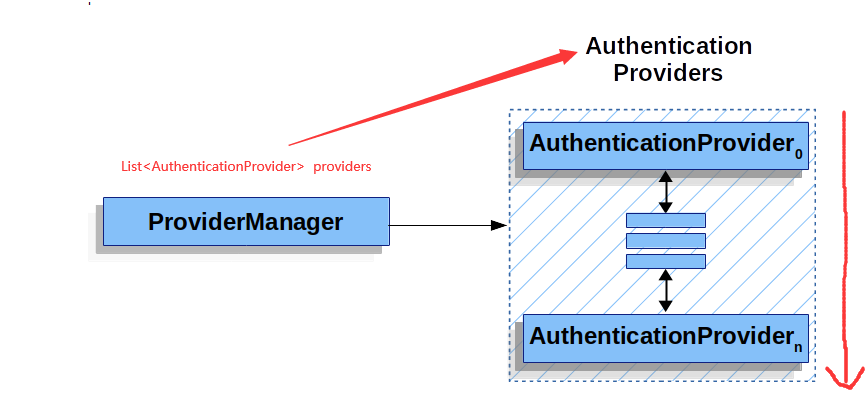


```
支持一个AuthenticatonProvider实例，仲裁多种Authentication的情况。
```


#### 2.7.1.3  接口实现类


```
前面提到过, AuthenticationProvider 内置了一些常见的实现类：

DAOAuthenticationProvider
JwtAuthenticationProvider
```


##### 2.7.1.3.1 DAOAuthenticationProvider

```
我们知道是用于处理 Username/Password 认证的
```


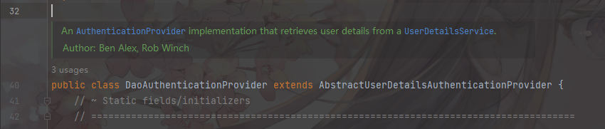

```
DAOAuthenticationProvider(下称 DAOProvider)用于从 UserDetailsService中获取 用户的细节
```


UserDetailsService暂且不表，先看DAOProvider的public方法


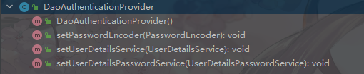


```java
//public方法比较少
public void setPasswordEncoder(PasswordEncoder passwordEncoder)  //设置一个密码编码器

    
public void setUserDetailsService(UserDetailsService userDetailsService) //设置一个 UserDetatisService
    
	public void setUserDetailsPasswordService(
			UserDetailsPasswordService userDetailsPasswordService)  //设置一个 UserDetailsPasswordService
```


到目前为止, DAOprovider提供给程序员可操作方法只有以上3个，都是配置方法。配置一些东西。


配置了密码编码器[PasswordEncoder接口](#2.1  PasswordEncoder 接口)

DAOprovider想要完成认证，就必须有比对的数据源。这个数据源怎么来？就是[UserDetailsService](#2.9   UserDetailService)

```
也就是说， 完成认证的数据源从UserDetailsService中来。 //数据源一定包含数据库，也会包含内存等，具体参考2.9 UserDetailService
```


### 2.7.2   ProviderManager成员变量 parent


ProviderManager 还允许有一个可选项的成员变量 parent


parent 是可以是任意的AuthenticationManager 

在当前ProviderManager无法仲裁的情况下，会去请求parent仲裁。

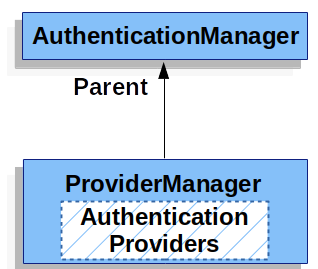


------

默认的ProviderManager 将会在成功仲裁Authentication后，尝试清理其中的敏感的credentials（也就是密码）。

这样做防止了诸如密码这种敏感信息过长时间得暴露在HttpSession中。


### 2.7.3 ProviderNotFoundException

如果全部Provider都无法对当前Authentication请求进行仲裁，那么就会抛出一个异常：

`ProviderNotFoundException`	


### 2.7.4     ProviderManager流程

```
Authentication 请求到 ProviderManager以后 ：
首先会走过 List<AuthenticationProvider>全部的 provider, 如果能处理,则直接处理，否则传递给下一个provider。
如果当前的ProviderManager没有支持的provider处理，且 parent非空，则代理给parent处理。(反双亲委派)
最终都无法处理，抛出 ProviderNotFoundException
```


## 2.8 AuthenticationEntryPoint


当向用户端请求凭证（credentials ）时， AuthenticationEntryPoint 被用于发送一个HttpResponse。

有时，客户端在请求资源的同时主动携带了凭证(credentials)。Spring Security就不需要再发送一个HttpResponse去请求凭证。

有些时候，客户端可能在没有通过用户验证的情况下，又同时发送了一个没有凭证信息的请求。

根据AuthenticationEntryPoint的实现，可能会重定向到登录界面，并带有[WWW-Authenticate](https://docs.spring.io/spring-security/site/docs/5.3.11.RELEASE/reference/html5/#servlet-authentication-basic) 的响应头


## 2.9   UserDetailService


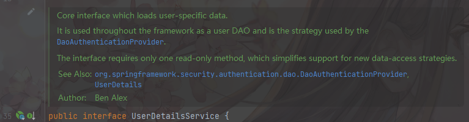

```
核心接口，用于加载一个 用户具体的数据.

它在框架中作为一个用户的DAO, 是DaoAuthenticationProvider的策略
```


```
通俗的讲，这个接口用于提供数据源，帮助其他的组件提供用户的真实数据，例如 认证的时候提供 数据库/内存中的 数据进行比对
```


接口只有1个方法：


### 2.9.1 接口方法


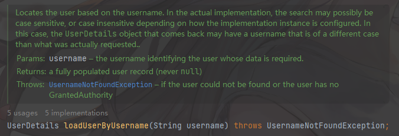

```java
UserDetails loadUserByUsername(String username) throws UsernameNotFoundException;
```

```
基于username定位一个User。
在实际实现中，搜索可能是区分大小写的，也可能是不区分大小写的，这取决于实现实例的配置方式。
在这种情况下，返回的UserDetails对象可能有一个不同于实际请求的用户名。(但指代的都应是同一个用户)
```


### 2.9.2 实现类


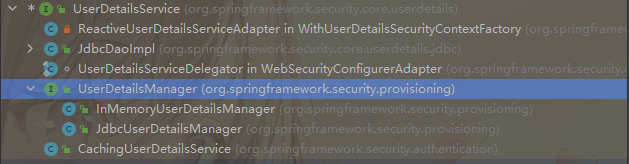


#### 2.9.2.1 UserDetailsManager


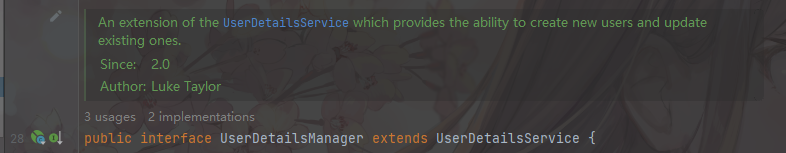

```
扩展接口：  能够让UserDetailsService提供创建新的user和修改 已存在数据的能力
```


```
方法都见名知意，不赘述了。
重点是这个扩展接口提供了2个重要的实现类 : InMemoryUserDetailsManager , JdbcUserDetailsManager
```


##### 2.9.2.1.1 InMemoryUserDetailsManager

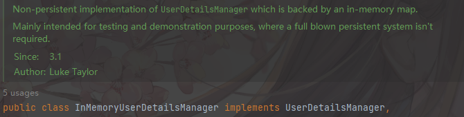

```
从一个内存Map实现的，非持久化的 UserDetailsManager.

主要用于主要用于测试和演示，不需要完整的持久系统。
```


## 2.10   UserDetails 

核心接口之一


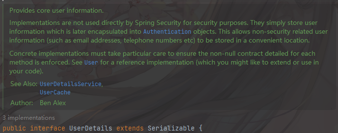


```
提供了核心的 用户信息。

这个接口不会被Spring Security 直接使用。
UserDetails简单存储了一些用户信息 在 Authentication对象中。在UserDetails中允许存储一些 和用户相关的非安全性的数据。例如邮箱地址，电话号码等。
```


```
UserDetailsService 把根据用户名查询到的用户信息，封装成UserDetails，然后存储到Authentication对象中。
```


### 2.10.1  接口方法


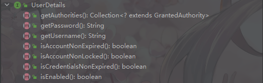


```java
Collection<? extends GrantedAuthority>  getAuthorities() ; //获得权限集合

getPassword() ;    //返回密码
getUsername() ;    //返回账号
    
boolean isAccountNonExpired();
boolean isAccountNonLocked();
boolean isEnabled();

boolean isCredentialsNonExpired();   //资格是否过期
```


### 2.10.2 实现类


UserDetails的实现类非常少： 只有User 和  MutableUser

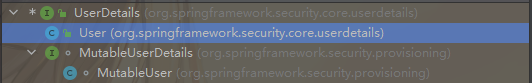


#### 2.10.2.1 User


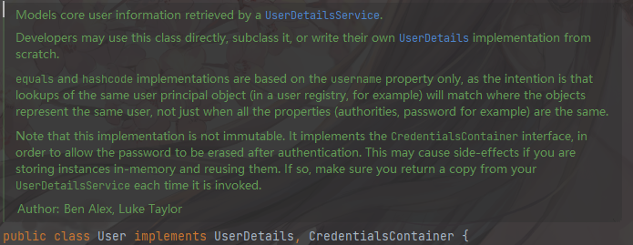


```
User 是从 UserDeatisService中获取的核心组件。用于存放用户信息

开发者也许会直接使用这个类，或这个类的子类。
```


##### 2.10.2.1.1   User类方法


构造器类：


本质上只有一个构造方法：

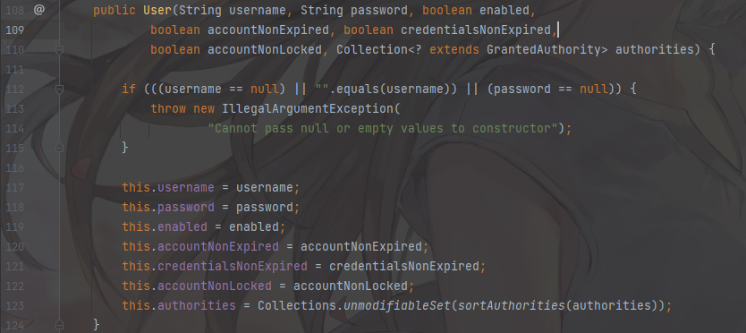

```
传入 username, password, 是否可用，是否过期，凭证是否过期，账号是否被锁定，权限集合
```


```
获得密码，账号，权限集合
```


```
返回当前账号是否 禁用，过期，锁定，凭证是否过期
```


通过 User.builder() 方法可以返回一个  构造类。

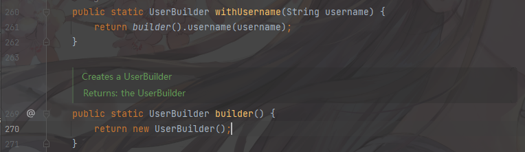


##### 2.10.2.1.2 构造类 UserBuilder

spring在User类内，内置了一个Builder类，帮助创建一个User.

```
返回大多都是this 帮助链式调用。
```


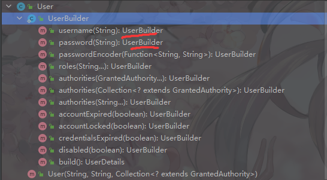


## 2.11    WebSecurityConfigurerAdapter

Spring 与 Security 配置类的适配器。专门用于配置


## 2.12   SecurityFilterChain

安全拦截器链


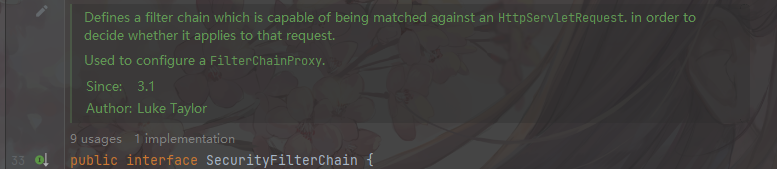


```
定义一个能够匹配HttpServletRequest的过滤器链。用来决定它是否适用于某个请求。

用于配置一个FilterChainProxy
```


两个方法:

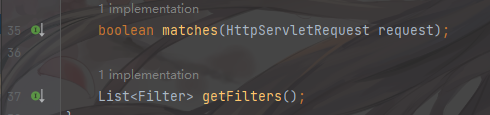

```
判断是否匹配。

获得全部的过滤器
```


## 2.13 OncePerRequestFilter

这是一个抽象类。   如这个名字 ”每个请求一次的过滤器“，对于每个请求只执行一次。


### 2.13.1  方法 


#### 2.13.1.1  doFilter


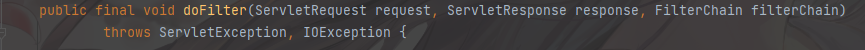


方法传入  ServletRequest ,ServletResponse , 以及过滤器链   javax.servlet.FilterChain


