# 	1. Vue Start


## 1.1 安装Vue


## 1.2 Hello实例


```html
<!DOCTYPE html>
<html>

<head>
    <meta charset="UTF-8" />
    <title>Vue</title>

    <script src="./vue.js"></script>
</head>
<body>
    <div id="root">
        hello, {{name}}
    </div>
</body>
<script>
    const vm = new Vue({
        el: '#root',
        data: {
            name: '哈哈'
        }
    });
</script>
</html>
```


## 1.3  模板语法


插值语法  : 用于在标签体中匹配对应的变量 。 标签体 表示在两个标签中的部分` <a>标签体</a>`

```
 {{}}  
```


指令语法: 用于给标签属性动态的赋值

```
<a v-bind:href="href"  v-bind:x="hello">


<script>
	
</script>
```


## 1.4 数据绑定


### 1.4.1 单向数据绑定


单向数据绑定。  只绑定了 data中的数据变化，对应显示到元素中。    数据-->h5属性

```
v-bind:<value>="<keyName>"
//简写  :<value>


//<value> 指当前h5标签的一个属性
//<keyName> 指Vue.data中绑定的keyName,如下图:
```


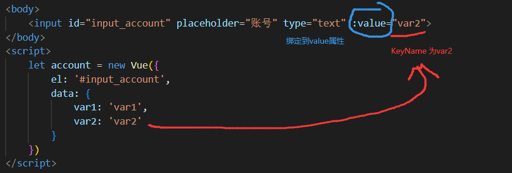


### 1.4.2 双向数据绑定

双向数据绑定。  两边变化是同步的 。    数据 <---> h5属性

```
v-model:value="<keyName>"
```


双向绑定不支持全部标签。v-model 只能应用在表单类元素(输入类元素)

```
也就是属性有value的元素.

//不能和用户交互的标签，双向绑定也没有意义。

//简写 v-model
```


总结:


## 1.5 vue的配置项

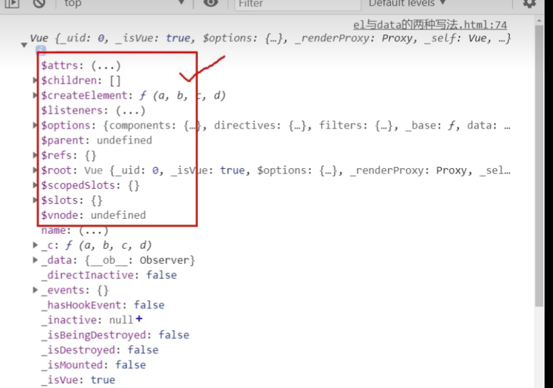


```
打印Vue实例, 以 $开头的属性，都是为开发者准备的。
```


### 1.5.1 el的写法


```
使用  Vue.$mount('#root')  绑定元素	。

这样的方法，提供了后续绑定能力,同时也能刷新页面。

mount //挂载
```


### 1.5.2 data

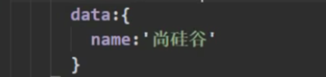

```
data可以接收一个对象
```


```
data接收一个Object的值，可以传入一个函数，函数的返回值是Objects
```


如果对象是一个函数，可以这样化简写：

```js
data(){           
    return {
        name:'hello world'
    }
}
```


```
不能写箭头函数, 因为箭头函数没有自己的this，会向外寻找，找到windows.
```


```
data中声明的变量，被放入了 Vue._date属性中
```


## 1.6  MVVM


```
Model : 模型    View : 视图    VM:视图模型


Vue就承担了VM的角色，所以通常用vm来代指Vue
```


## 1.7  数据代理

一个对象可以访问(读/写) 另一个对象的属性


### 1.7.1  Object.defineProperty


Object.defineProperty(obj,proName,properties)

```
给对象添加一个属性。

配置项有多个值:

value  值
enumerable   控制该属性是否可以被枚举
writable    控制属性是否可以被修改
configurable 是否可以被删除

get   获取属性时触发的方法
set   设置属性时获取的方法
```


遍历一个对象的属性：

```
Object.keys()
```


### 1.7.2 JS原生数据代理

这是一个最简单的数据代理示例:

```js
<script>
    let obj1 = {
        x: 'x'
    }
    let obj2 = {
        y: 'y'
    }
    Object.defineProperty(obj2, 'x', {     //在obj2中绑定了一个x属性，这个x属性通过get函数
        get() {                            //获得，get函数返回的是obj1.x
            return obj1.x                  //所以obj2可以访问2个属性 x和y
        }                                  
    })
</script>
```


### 1.7.3 Vue数据代理


```js
...
    <div id="div1">
        <h2>学校名称 :{{schoolName}}</h2>
        <h2>学校地址 :{{schoolAddress}}</h2>
    </div>
...


<script>
    let vm = new Vue({
        el: '#div1',
        data: {
            schoolName: '嘤嘤嘤',
            schoolAddress: '第一花园'
        }
    })
</script>
```


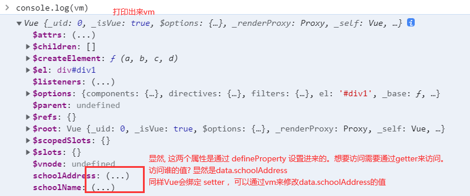


```
由于setter的存在，Vue中改变 schoolAddress,会改变data.schoolAddress
由于data.schoolAddress与div1绑定了。

所以,最终h2中的文本会动态改变。


流程:
Vue  通过setter---> data   绑定--->  div1
```


#### 1.7.3.1 _data

Vue把配置项中的 data当作元数据，存储在了自己的 _data中。

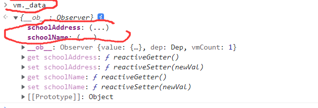


## 1.8 事件处理

使用Vue给元素标签绑定一个事件.


```
v-on:<Event> = "<functionName>"     //可以直接传递函数本体
v-on:<Event> = "<functionName>()"   //可以传参

//  <Event>事件类别
//  <functionName>  对应函数的名称


简写:

@<event>="functionName"
```


### 1.8.1 绑定onclick

```html

...
<button v-on:click="showInfo">点我提示</button>
...


```


规定:

```
所有被Vue管理的函数,最好写成普通函数,不要写成箭头函数. 因为箭头函数没有自己的this,会直接找到Window.

后续可能会影响Vue的功能
```


### 1.8.2 事件修饰符


```
对于原生JS来说,原生 事件对象有一些方法，Vue对其进行了封装。

例如 Event.preventDefault() 阻止默认行为
```


在Vue中的封装.

```vue
<a id="button1" @click.prevent="fun1('hello world')">事件修饰符</a>
```


#### 1.8.2.1 其他常用的修饰符


``` 
@click.prevent=""
@click.stop=""      //阻止冒泡
@click.once=""      //事件只触发一次
@click.capture=""   //使用事件的捕获模式
@click.self=""      //只有 event.target是当前操作的元素时 才触发
@click.passive      //事件的默认行为立即执行，无需等待事件回调执行完毕
```


##### @click.passive

```
事件执行的顺序:
等待事件绑定的函数回调执行完毕后，才执行默认行为。

有时,  绑定的函数非常重量级,需要等待一定时间才执行完毕。此时事件的默认行为等待不执行,在页面会造成卡顿一样的影响。
所以使用 : click.passive 可以优先执行默认行为。
```


例如：

```
滚动条事件，如果滚动条绑定的函数很重，等待执行完毕以后,滚动条才会滑动。用户体验不好。
```


### 1.8.3 绑定键盘事件

```
@keydown
@keyup
```


#### 1.8.3.1 别名

Vue给常用的按键起了别名: (一共有九个)     

```
@keyup.enter="fun1"    //只有当 抬起了 Enter键才会触发对应的函数。

//JS原生使用  e.keycode == <keyNumber> 来判断
```


别名列表:

```vue
enter
delete   (响应delete 和backspace)
esc
space
tab    (通常绑定Keydown)
up
down
left
right


对于 ctrl    alt    shift   meta 系统修饰键。
	使用keyup, 需要按住修饰键+其他键,释放其他键才触发 事件
	使用keydown , 正常触发


```


#### 1.8.3.2 测试实例

`@keyup.enter`

```

```


#### 1.8.3.3  支持未提供别名的按键

Vue支持未提供别名的按键，在`.`后加上这个键的标准名，并且以`-`为分隔符的标准命名

```vue
<input type="text" @keyup.cap-lock="showInfo" />
```


#### 1.8.3.4 支持自定义keycode别名

```js
//Vue支持自定义 keycode的别名:

Vue.config.keyCodes.<alias>=<keycode>
    
//Vue.config.keyCodes.haha=13

```


支持如下写法：

```html
<div @click="showInfo">
    <a href="www.baidu.com" @click.stop.prevent="showInfo"></a>
</div>
<!-- 支持使用 . 分割 同时使用多个事件修饰符  -->


<input @click.ctrl.y>   
<!-- ctrl+ y 才会触发 -->
```


```
@click="" 除了可以绑定方法名以外，还接收一个简单的表达式。

<button @click="x++">点击x属性自增1</button>

//所有表达式内的属性，都会从vm中寻找。如果vm找不到这个属性，会直接报错
```


## 1.9  计算属性

使用Vue模板内声明好的属性，计算出来的新属性


使用全新的关键字声明计算属性：

```
computed
```


```
computed的简写形式只能是get(),不能是set(),所以没办法赋值。
```

示例

```html
<!DOCTYPE html>
<html lang="en">

<head>
    <meta charset="UTF-8">
    <meta http-equiv="X-UA-Compatible" content="IE=edge">
    <meta name="viewport" content="width=device-width, initial-scale=1.0">
    <title>Document</title>
</head>
<script src="../vue.js"></script>


<body>


    <div id="div1">
        <input v-model:value="a">
        <input v-model:value="b">
        <h2>{{c}}</h2>

        <h2>{{d}}</h2>
    </div>

</body>

<script>
    let vm = new Vue({
        el: '#div1',
        data: {
            a: '',
            b: ''
        },
        computed: {
            c: {
                get() {
                    return this.a + this.b;
                },
                set(value) {
                    let arr = value.split('-')
                    this.a = arr[0]
                    this.b = arr[1]
                    return get()
                }
            },
            //简写, d 是一个属性。调用该方法返回一个值，这个方法的返回值就是d的值
            d() {
                return this.a + this.b
            }
        }
    })
</script>
</html>
```


## 1.10 监视属性

也成为侦听属性


```
当vm中的属性发生变化以后，触发监听事件。
使用watch 

watch的值是一个配置对象。
被监视的属性作为key
```


```
计算属性的值 也可以被监视
```


```vue
<script>
    let vm = new Vue({
        el: '#div1',
        data: {
            a: 1
        },
        methods:{
            add(){
            	this.a = this.a+1
            }
        },
        watch:{
            a:{
                immediate:true,  //默认是false的,当为true的时候，初始加载的时候会调用
                				 //一次handler
               	handler(newValue,oldValue){
                    console.log(newValue,oldValue)
                }
            }
        }
        
    }
    })

</script>
```


### 1.10.1 异步绑定监视属性

```vue
vm.$watch('a',{
	handler(new,old){
		console.log(new,old)
	}
})
```


### 1.10.2 多级属性监视


```html
<!DOCTYPE html>
<html lang="en">
<head>
    <meta charset="UTF-8">
    <meta http-equiv="X-UA-Compatible" content="IE=edge">
    <meta name="viewport" content="width=device-width, initial-scale=1.0">
    <title>Document</title>
</head>
<script src="../vue.js"></script>

<body>
    <div id="div1">
        <button @click="numbers.a++">点我a自增一</button>
    </div>
</body>
<script>
    let vm = new Vue({
        el: '#div1',
        data: {
            numbers: {
                a: 1,
                b: 2
            }
        },
        watch: {
            'numbers.a': {  //在监视的时候，无法使用简写了，必须带上''
                handler(newValue, oldValue) {
                    console.log(newValue, oldValue)
                }
            }

        }
    })
</script>
</html>
```


#### 1.10.3.1 深度监视

```
watch 默认不监视对象的多层级属性。如果需要监视需要配置

deep:true
```


### 1.10.3  简写

当watch 不考虑配置其他属性，只需要handler的时候可以使用简写


```
...
watch:{
	a(newValue,oldValue){
		console.log(newValue,oldValue)
	}
}
...


vm.$watch('a',function(newValue,oldValue){
	console.log(newValue,oldValue)
})

```


### 1.10.4 watch和computed的对比

通常 watch可以实现计算属性的功能。

但计算属性书写起来更简洁，但是计算属性依赖于 return返回值修改属性值。所以无法写异步任务。

只能使用watch来写异步任务。

同时，对于setTime来说，如果传入普通函数，this指向的是window对象。

需要使用箭头函数，箭头函数没有this会向上找，最终找到vm

所以传入函数的时候，到底使用箭头函数，还是普通函数需要看逻辑的需要。


## 1.11   样式绑定


### 1.11.1 class样式


#### 1.11.1.1 字符串绑定

使用场景:

```
适用于样式的类名不确定,需要动态指定 (通过Vue的属性值控制)
```


```html
<div id="div1">
    <div class="basic" :class="dynamicClass" @click="changeClass">
        <h2>
            test
        </h2>
    </div>    
</div>

<script>
    let vm =new Vue({
        el: '#div1',
        data:{
            dynamicClass: ''
        },
        methods:{
            changeClass(){
                this.dynamicClass='normal'
            }
        }
    })
</script>
```


```
通过v-bind 把 class绑定到Vue中的属性中。通过调用点击事件改变这个属性的值, 来修改绑定Class


Vue会把  :class="dynamicClass" 和h5标签的class合并成一个新的class
```


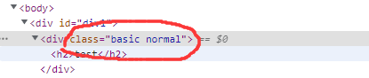


#### 1.11.1.2  绑定数组对象

```
都需要借助绑定到 Vue的属性，如果绑定的是一个数组对象。 Vue可以把数组内的字符串对象全部绑定到class样式内
```


使用场景:

```
需要绑定的样式 个数不确定,名字不确定。  //最强大的表达方式
```


```html
...
		<!-- 这里绑定了一个被Vue管理的 数组对象-->
		<div class="basic" :class="classArr">  
            <h2>test!</h2>
            <h3>css: {{classArr}}</h3>
        </div>
...


<script>
    let vm = new Vue({
        el: '#div1',
        data: {
            dynamicClassA: 'normal',
            classArr: ['normal', 'happy', 'sad']     //这个数组对象内的字符串，都会被Vue拼接成Class 样式
        },
        methods: {
            changeClass() {
                const arr = ['normal', 'happy', 'sad']
                let clz = arr[Math.floor(Math.random() * 3)]
                console.log(clz)
                this.dynamicClassA = clz
            }
        }
    })
</script>
```


#### 1.11.1.3 绑定对象

```
绑定对象内的属性 ，key为class的名字， value为boolean值，当value为false表示不启用，当value为true表示启用。
```


使用场景:

```
绑定样式的 个数确定,名字确定， 组合情况不确定的情况下推荐使用
```


```js
    let vm = new Vue({
        el: '#div1',
        data: {
            dynamicClassA: 'normal',
            classArr: ['normal', 'happy', 'sad'],
            classObj: {
                normal: false,
                happy: false,
                sad: false
            }
        },
        methods: {
            changeClass() {
                const arr = ['normal', 'happy', 'sad']
                let clz = arr[Math.floor(Math.random() * 3)]
                console.log(clz)
                this.dynamicClassA = clz
            }
        }
    })
```


### 1.11.2 style 内联样式

```
绑定给style 是一个对象。
```


```html
<div id="div1">
        <div :style="styleObj">
            <h2>test!</h2>
        </div>

</div>


<script>
let vm = new Vue({
	el: '#div1',
	data:{
		styleObj:{               //传入一个style对象
			fontSize: '50px'    //style对象的key必须是合法的 style属性
            backgroundColor: 'black'    //必须是小驼峰式命名
		}
	}
})
</script>
```


```
绑定一个 style对象数组。
由于Vue中data没有处理能力。 style对象数组只能硬编码。不能 [this.obj1,this.obj2]
```


```html
<div id="div1">
    <div class="basic" :style="styleArr">
        <h2>test</h2>
    </div>
</div>


<script>    

	let vm = new Vue({
        el: '#div1',
        data: {
            fsize: 40,
            styleArr: [{
                fontSize: '50px'
            }, {
                background: 'red'
            }]

        }

    })
</script>
```


## 1.12 条件渲染


### 1.12.1 v-if


```
在Vue中 控制标签的渲染，使用v-show="false" 或者v-show="true" 控制

在底层使用的是  style="display:none"
```


当然也可以绑定给一个属性变量

```html
<body>
    <div id="div1">
        <h2 v-show="a">哈哈</h2>
        <button @click="changeA">改变A</button>


        <h2 v-if="b">嘤嘤嘤</h2>
        <button @click="changeB">改变B</button>
    </div>

</body>

<script>
    let vm = new Vue({
        el: '#div1',
        data: {
            a: true,
            b: true
        },
        methods: {
            changeA() {
                console.log(this.a)
                this.a = !this.a
            },
            changeB() {
                this.b = !this.b
            }
        }
    })
</script>
```


`v-if="a"` 也能完成同样的显示效果。但是这个节点直接在DOM中删除了。不是 display:none

```
v-if="false"
```


```
如果节点频繁的变化，推荐使用v-show ，使用v-if频繁的在DOM中添加删除节点，会造成性能的损失
```

### 1.12.2 v-else-if  v-else

同时Vue支持 `v-else-if=""`  `v-else` 指令

```
搭配的逻辑和正常的  if , else if ,else 一样 。但是要求结构不被打断
```


使用 <template>标签不会破坏文档接口，但也能被Vue识别，接管

```html
<template v-show="n === 1">
    <h2>哈哈1</h2>
    <h2>哈哈2</h2>
    <h2>哈哈3</h2>
</template> 
<!-- 仍然能实现统一显示，统一隐藏，不会破坏结构， css样式 -->
<!-- template内只能允许1个根元素-->
```


## 1.13 列表渲染


### 1.13.1 遍历数组


想要从数据中动态的取数据，填充到下面的列表中，又不需要每一个li都写

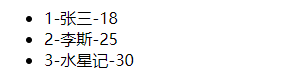

vue提供了 `v-for=""`指令，示例

```html
    <template id="template1">
        <ul>
            <li v-for="p in persons">{{p.id}}-{{p.name}}-{{p.age}}</li> 
        </ul>
    </template>
	<!-- 类似于Lua脚本语言，这是一个for循环。  p是当前变量，遍历 persons数组 。 其中persons数组是Vue管理的对象-->

<script>
    let vm = new Vue({
        el: '#template1',
        data: {
            persons: [{
                    id: 1,
                    name: '张三',
                    age: 18
                }, {
                    id: 2,
                    name: '李斯',
                    age: 25
                }, {
                    id: 3,
                    name: '水星记',
                    age: 30
                }

            ]
        }
    })
</script>
```


使用`:key=""`指定唯一id 

```
在for循环的时候，需要为每一个对象指定唯一id,否则在更新的时候可能会出现错误。
```


```
事实上，for循环会提供2个参数，  (i,index)  其中i代表每一项,index代表当前的索引。


<li v-for="(i,index) in persons" :key="id">
```


### 1.13.2 遍历对象

v-for 也可以遍历对象属性。 使用`of`一个对象，遍历这个对象的属性。

```
<li v-for="(value,key) of obj">
```


```html
    <div id="template1">
        <ul>
            <li v-for="(p,index) in persons" :key="p.id">{{p.id}}-{{p.name}}-{{p.age}}</li>
        </ul>
        <ul>
            <li v-for="(value,key,index) of cacheBlock" :key="index">{{key}} : {{value}}   ---{{index}}</li>
        </ul>
    </div>


<script>
    let vm = new Vue({
        el: '#template1',
        data: {
            persons: [{
                    id: 1,
                    name: '张三',
                    age: 18
                }, {
                    id: 2,
                    name: '李斯',
                    age: 25
                }, {
                    id: 3,
                    name: '水星记',
                    age: 30
                }

            ],
            cacheBlock: {
                top: 123.1,
                bottom: 123.1234132,
                left: 55.123,
                right: 56.1234,
                cacheBlockId: 1
            }
        }
    })
</script>
```


### 1.13.3 遍历字符串


### 1.13.4 遍历指定次数

```
```


### 1.13.5 key的原理

在v-for中key的原理


```
所有元素的key属性 都被Vue保留了。 被diff算法使用了
```


diff算法流程

```
当数据发生改变的时候，Vue会生成新的虚拟DOM树，新的虚拟DOM树会复用那些没有改变的节点。使用diff算法对比那些key相同的节点，如果未发生改变则直接使用，如果发生改变则重新生成新的虚拟DOM，最终生成一个真实的DOM渲染页面。
```


如果使用index作为key可能会出现问题：

```
尤其出现了逆序的添加，逆序的删除(破坏顺序)。会改变key对应的DOM，严重影响效率。
```


## 1.14 Vue监测数据的原理


### 1.14.1 Vue如何检测对象属性的改变


改变data中的属性，必须通过 setter来改变。

```
setter方法称为  reactiveSetter响应式的setter，会触发模板的重新解析，触发虚拟DOM的对比,重新生成DOM树,让页面刷新。
```


```
Vue会递归的检测对象的属性，如果属性是一个对象，会继续递归。为这些对象的属性都添加了setter方法。当为这些对象赋值时，都会调用对应的setter方法，setter方法会触发模板的再次解析，虚拟DOM的生成，最终导致页面重新解析。
```


​	


### 1.14.2  异步给对象添加属性


```
Vue.set(target,key,val) 
//target: 被添加属性的对象
//key  : 属性名
//val  : 属性值
```

Vue提供了2个方法，一个是静态的在Vue上，另一个是实例方法在Vue对象身上

```
vm.$set(target,key,value)
```


实例：

````js
Vue.set(vm.student,'sex','男')
````


注意:

```
Vue会为target对象添加一个属性，这个属性仍然包含了响应式的setter 和getter
在set之后，也会触发虚拟DOM对比更新,刷新页面
```


```
target不能是Vue实例，也不能是Vue实例的根数据对象。 (比如data)
```


```
Vue.set 向响应式对象中添加一个property,并确保这个property仍然是响应式的，同时触发 视图更新
```


### 1.14.3 Vue检测数组数据改变原理

```
Vue监测数组元素的时候,并不是通过setter 和 getter工作的

所以，直接操作数组元素下标索引赋值的改变，不会被Vue监听的到。
```


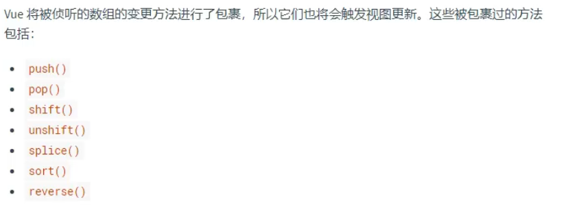

```
通过 push ,pop ,shift ,unshift ,splice ,sort ,reverse   这些方法做出的改变Vue就能监听的到。


对于那些没有变更原数组的方法:  filter() concat() slice()

直接将新数组替换原数组对象，即可触发视图更新
```


通过Vue.set(target,key,val)也能触发视图解析

```
对于数组来说key必须是下标索引。
```

例如：

```js
Vue.set(vm.student.hobby,2,'abc')
```


## 1.15  收集表单数据


### 1.15.1 tips


```
对于 radio，需要手动赋值 value属性，否则无法获取值
```


```
对于 checkbox ,需要使用相同的name为之分组，并且需要手动赋予 value属性。否则获取的是 selected属性。返回的是true或者false
```


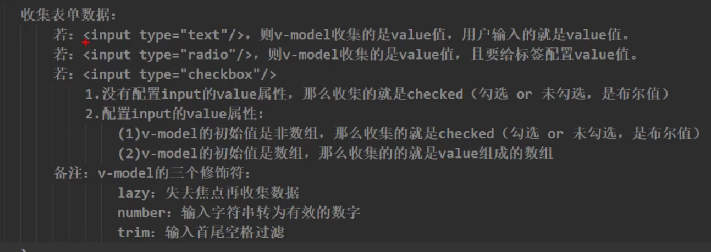


## 1.16 过滤器

```
Vue提供一个新的数据处理的方式。 如果不用，使用计算属性和methods 也可以实现
```


想要做出的效果:

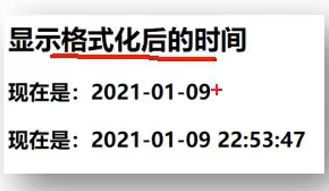


```
Date.now() //返回一个当前时间的时间戳
```


### 1.16.1 第三方插件库

推荐网址

```
bootCDN


网址内推荐的js插件库

moment.js   dayjs
```


### 1.16.2 过滤器

过滤器的本质上就是一个函数

```html

<div id="div1">
    <h2>{{time | timeFormator}}</h2>
    
    <h2>{{time | timeFormator('a','b','c')}}</h2>  <!-- 过滤器可以自定义传入任意数量的参数 ，第一个永远管道符前面的参数-->
</div>


	let vm = new Vue({
        el: '#div1',
        data: {
			time: 1660396657437
		},
        filters:{
            timeFormator(value){
				return dayjs(value).format('YYYY-MM-DD HH:mm:ss')
			}
        }
    })
```


```
过滤器使用一个 | 管道符。

Vue会把前面的属性的值，传入 filter中,将filter中返回的值，替换整个 {{}}
```


### 1.16.3 全局过滤器


定义一个全局过滤器

```
Vue.filter('my-filter', function (value) {
  // 返回处理后的值
})
```


## 1.17 自定义指令

Vue除了支持核心的默认指令(如 v-model ,v-bind等) 还支持开发者自定义指令。

```
原因是,少部分情况下,开发者仍然需要对普通DOM元素进行底层操作。这时开发者可以自定义指令。
```

参考官方文档：

https://v2.cn.vuejs.org/v2/guide/custom-directive.html


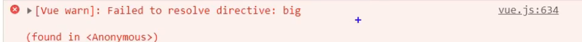

```
如果使用了一个没有定义指令:big ，则会抛出如上的错误
```


direactives中的指令，可以使用对象配置，也可以使用函数配置.


### 1.17.1 使用函数配置

如果使用函数配置,则Vue会为我们传入多个参数 依次是 :   `element` , `binding` ,  `vnode` , `oldVnode`

```
element 是绑定了自定义指令的 真实DOM元素


binding : 一个对象，包含了多个property

    name：指令名，不包括 v- 前缀。
    value：指令的绑定值，例如：v-my-directive="1 + 1" 中，绑定值为 2。
    oldValue：指令绑定的前一个值，仅在 update 和 componentUpdated 钩子中可用。无论值是否改变都可用。
    expression：字符串形式的指令表达式。例如 v-my-directive="1 + 1" 中，表达式为 "1 + 1"。
    arg：传给指令的参数，可选。例如 v-my-directive:foo 中，参数为 "foo"。
    modifiers：一个包含修饰符的对象。例如：v-my-directive.foo.bar 中，修饰符对象为 { foo: true, bar: true }。
    
vnode：Vue 编译生成的虚拟节点。移步 VNode API 来了解更多详情。


oldVnode：上一个虚拟节点，仅在 update 和 componentUpdated 钩子中可用。
```

 [VNode API](https://v2.cn.vuejs.org/v2/api/#VNode-接口)


```html
<script>
    let vm = new Vue({
        el:'#div1',
        data:{
        
	    },
        direactives:{
            big(el,binding,vnode,oldVnode){
                
            }
        }
           
    }) 
</script>
```


什么时候会调用自定义指令

```
1.初始化解析模板的时候
2.当所在模板重新被解析的时候
```


### 1.17.2  使用对象配置

这个配置对象需要配置如下几个属性：

```
bind

inserted

update

componentUpdated

unbind
```


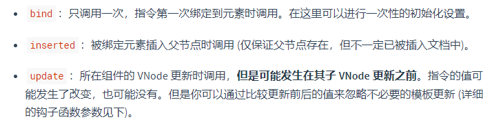


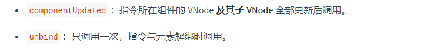


```js
let vm = new Vue({
	el:'#div1',
	data:{
	
	},
	direactives:{
		'big-number':{
			bind(el,binding){
				console.log('触发了bind')
                console.log(el,binding)
                el.value = binding.value
			},
			inserted(el,binding){
                console.log('已经插入到DOM节点中')
			},
			update(el,binding){
				console.log('更新触发')
                el.value = binding.value
			}
		}
	}
})
```


### 1.17.3 使用注意点


推荐命名方式 ： 使用`-`分隔多个单词

```
v-big-number=""


//使用kebab-case 命名法
```


this指向是window

```
自定义指令 的函数中，this指向的是Window, 不是Vue实例，因为此时Vue还没有初始化完成。
```


局部指令

```
在当前Vue中定义的指令，无法被其他Vue使用。
```

如何自定义全局指令？使用Vue.direactive(name,property)定义

```js
Vue.direactive('big-number',{
			bind(el,binding){
				console.log('触发了bind')
                console.log(el,binding)
                el.value = binding.value
			},
			inserted(el,binding){
                console.log('已经插入到DOM节点中')
			},
			update(el,binding){
				console.log('更新触发')
                el.value = binding.value
			}
		})
```


## 1.18  Vue的生命周期

```
mounted()

//Vue完成模板解析,把初始的真实DOM元素挂载到页面后(挂载完毕)，调用mounted函数


//mounted函数只调用一次
```


### 1.18.1 生命周期


```
1.Vue在创建时的关键时刻，帮我们调用的一些特殊名字的函数。

2.生命周期函数的名字不可更改，但具体内容是程序员编写的

3.生命周期函数中的this 指向的是vm 或者 组件实例对象。
```


生命周期函数  : 

```
beforeCreate()

created()

beforeMount()

mounted()

beforeUpdate()

updated()

beforeDestroy()

destroyed()
```


#### 1.18.1.1 beforeCreate

```
无法访问, data中的数据。methods中的方法
```


#### 1.18.1.2 created

```
此时已经可以访问到 data中的数据，methods中的方法
```


#### 1.18.1.3 beforeMount

```
mount此时，Vue已经将 el 及内部的元素当作模板解析完毕。生成虚拟DOM完毕，但仍没有写入真实DOM


此时对DOM的操作，最终都是不奏效的，因为后续Vue会替换

把vm.$el 替换 页面的el
```


#### 1.18.1.4  mounted

```
1.此时页面呈现的是 经过Vue编译后的DOM  (页面上已经可以显示 数据代理的值了)

2. 此时对DOM的操作有效，但尽量避免

3.至此，初始化过程完成。  一般在此进行： 开启定时器,发送网络请求，订阅消息，绑定自定义事件，等初始化操作。
```


#### 1.18.1.5  beforeUpdated

```
1.当绑定的数据更新时，会触发 beforeUpdated的函数

2.此时数据是新的，但页面是旧的。
```


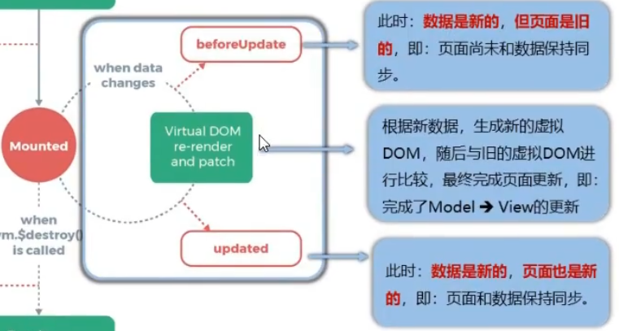


#### 1.18.1.6  updated

```
数据是新的，页面也是新的。

虚拟DOM和真实DOM对比完毕，新生成的节点已经插入到页面中。


此时数据和页面保持一致。
```


#### 1.18.1.7  beforeDestroy

```
vm.$destroy()

//完全销毁一个实例，清理它与其他实例的连接，解绑全部指令与  自定义事件监听器
```


```
此时data methods 指令等，都处于可用状态。
马上要执行销毁过程，所以一般在这个阶段执行 
关闭定时器,取消订阅信息，
解绑自定义事件
收尾操作
```


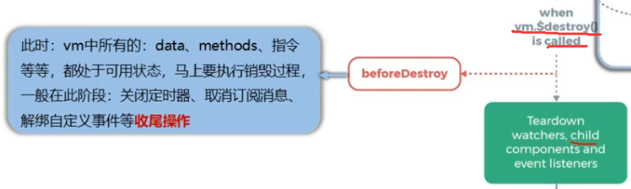


```
可以访问到数据，也可以修改。但不会触发模板解析更新到页面
```


#### 1.18.1.8  destroyed


### 1.18.2 注意事项


```
1.vm销毁了以后，原生的监听事件仍然存在。但是自定义的监听事件不存在


2. 不推荐在beforeDestroy过程中操作数据。就算操作了，也不会刷新 到页面了

3.一般在beforeDestroy中 清除定时器，解绑自定义事件，取消订阅等操作
```


## 1.19  template


可以在Vue中配置文档结构。使用`template`

```
let vm = new Vue ({
	el:'#div1',
	template:`
	<div>
		<h2>{{n}}</h2>
		<button @click="change">click me</button>
	</div>
	`,
	data:{
		n:1
	},
	methods:{
		change(){
			this.n ++
		}
	}


})
```


```
template将会替换整个 el所指的模板。
```


```
``  ES6 多行字符串语法
```


# 2.   知识点整理


## 2.1  v-model 修饰符


### lazy

```
v-model.lazy ,只有当目标标签失去焦点以后,才会收集数据。提升性能
```


### trim

```
v-model.trim  , 自动除去收集value的前后空格
```


### number

```
从value中获取的值转化为number类型
```


## 2.2 内置指令

复习一下指令

```
v-bind:value=""
v-model=""
v-for="(i,index) in Key" :key=""
v-for="(i,index) of Key"  :key=""
v-on=""       @click
v-if="key"
v-else
v-show="key"                                  //hidden隐藏节点
```


### 2.2.1 v-text

```
向其所在的标签插入文本。 innerText

插入的文本，不能当成标签
```


示例:

```html

```


### 2.2.2 v-html


```
向指定节点中渲染包含html结构的内容  ，可以解析标签。
```


示例


### 2.2.3 v-cloak


配合css可以实现还没有加载好的节点不显示给用户

```html
<style>
	[v-cloak]{
		display:none
	}
</style>
```


```
Vue解析模板的时候，会自动把节点里的 v-cloak属性移除。这样就可以把解析好的节点显示在页面上
```


### 2.2.4 v-once


只渲染元素和组件**一次**。随后的重新渲染，元素/组件及其所有的子节点将被视为静态内容并跳过。这可以用于优化更新性能。

```
v-once="key"
```


### 2.2.5  v-pre


跳过这个元素和它的子元素的编译过程。可以用来显示原始 Mustache 标签。跳过大量没有指令的节点会加快编译。


示例

```
<span v-pre>{{ this will not be compiled }}</span>
```


## 2.3 $mount

用于后续  绑定el

```
vm.$mount('#div1')
```


## 2.4 全局API

参考官方文档：

https://v2.cn.vuejs.org/v2/api/#%E5%85%A8%E5%B1%80-API

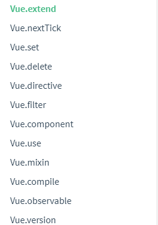


### Vue.nextTick

在下一次DOM更新完毕后执行 延迟回调。在修改数据以后立即使用这个方法，可以获得更新后的DOM

```js
vm.msg = 'Hello'

// DOM 还没有更新
Vue.nextTick(function () {
  // DOM 更新了
  //do something
})

// 作为一个 Promise 使用 (2.1.0 起新增，详见接下来的提示)
Vue.nextTick()
  .then(function () {
    // DOM 更新了
  })
```


实例：


有一个由 v-show 控制的input框。按下编辑会显示input，退出编辑input隐藏。

现在按下编辑会改变 isEdit属性为true。 v-show="item.isEdit" , 现在需要让input框自动焦点

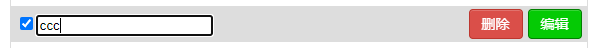

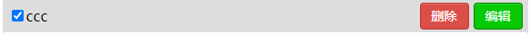

```
思路：watch监听 item.isEdit的值，当isEdit为true,让input.focus()
```

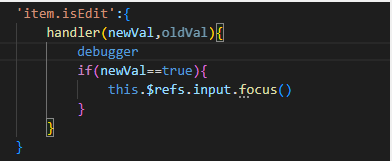

由于Vue操作DOM是异步的。当isEdit修改的时候，此时 input对应的真实DOM还没有刷新到页面上。无法 focus

所以使用 `this.nextTick` 等到下一次DOM更新完毕以后再执行。


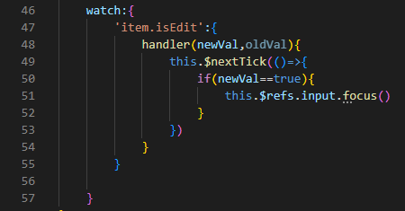


### Vue.set

语法：

```
Vue.set(target,propertyName,value)


向响应式对象中添加一个 property，并确保这个新 property 同样是响应式的，且触发视图更新。
```


### Vue.delete

和Set是对应的。


语法：

```\
Vue.delete( target, propertyName/index )

向响应式对象中添加一个 property，并确保这个新 property 同样是响应式的，且触发视图更新。
```


### Vue.directive

注册或获取全局指令。

```
Vue.directive( id, [definition] )


//{string} id
//{Function | Object} [definition]
```


