# 1. 创建Vue3工程


## 1.1 使用Vue cli


```
vue create <name>
```


## 1.2 vue cli 创建vue3的工程结构


main.js

```
import  {createApp} from 'vue'
import  App from './App.vue'

const app = createApp(App)
app.mount('#app')
```


## 1.3 Vue2 开发者工具


# 2.  Composition API

组合式API


## 2.1  Setup

是Vue3的一个新的配置项，值 为一个函数。

组件中用到的数据，方法都要配置在 setup中 （）

```vue
export default{
	name:'App',
	setup(){		
		let name='张三'
		let age = 18
		

		function sayHello(){
			console.log(`${name},hello world ${age}`)
		}


	}

}
```


setup 函数可以有返回值。

如果返回的是一个对象 ，对象的属性，方法在模板中可以直接使用。

如果返回的是一个渲染函数 ，可以自定义渲染内容  


### 2.1.1  注意点

vue2 和 vue3 不建议混用；

能在vue3中配置 data methods computed 也能获取到setup中配置的值。

如果有冲突，以vue3为准。

vue3中读取不到vue2配置的值


### 2.1.2 setup函数参数

```vue
export default {
	name:'Demo',
	props:['msg','school']
	setup(props,context){
		console.log(props,context)
	
	}
}
```


打印一下context对象

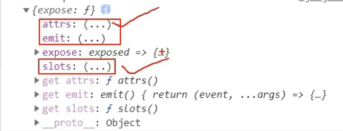


```
等价于 vue2中的 $attrs 用于存放props变量
等价于 vue2中的 $emit  用于触发自定义事件
等价于 vue2中的 $slots 模板插槽
```


## 2.2  ref 函数


### 2.2.1 使用基本数据类型


```js
import {ref} from 'vue'

export default{
	let name = ref('haha')
	let age = ref(18)

	function change(){
		name.value = 'azhe'
		age.value  = 99
	}


}
```

setup 直接定义的属性不是响应式的。

借助ref函数定义的属性，才是响应式的。


### 2.2.2 对象类型

```vue
<template>
	<div>
        <h1>{{person.name}}</h1>
        <h1>{{person.age}}</h1>
        <button @click=changeInfo>click</button>
    </div>
</template>


<script>
export default {
    name:'App',
    setup(){
        let person = ref({
            name:'hello',
            age:18
        })
        return {
            person
        }
    }   
}
</script>
```


### 2.2.3 总结

ref用于创建一个响应式的基本数据类型 或 响应式的对象。

调用基本数据数据类型时，需要使用  `变量名.value` 

调用对象属性时需要 `对象名.value.属性名`

```
在setup函数内无需使用this
在模板中无需写 .value
```


#### Vue3实现响应式的方式

对于基本数据类型

```
使用 Object.defineProperty()的 get set
```

对于对象类型

```
使用Vue3的  reactive函数
```


## 2.3  reactive函数

定义一个对象类型的响应式数据。（无法定义基本数据类型，需要使用ref函数）


### 2.3.1 语法

引入 

```
import {reactive} from 'vue'
```


```
const 代理对象 = reactive(源对象)
```


```
使用reactive包装的响应式对象，使用时无需 .value
```


### 2.3.2  原理

reactive定义的响应式是深层次的(递归，无论多少层属性都是响应式的 )，借助ES6语法中的Proxy实现的


## 2.4 对比ref / reactive


定义角度

```
ref通常用于代理基本数据类型，也可以代理对象类型。代理对象时借助reactive函数实现
reactive 通常用于代理对象类型，无法代理基本数据类型
```


原理角度

```
ref 通过Object.defineProperty()的 get 和set 来实现响应式
reactive 通过Proxy来实现响应式。通过Reflect来实现对源对象的修改。
```


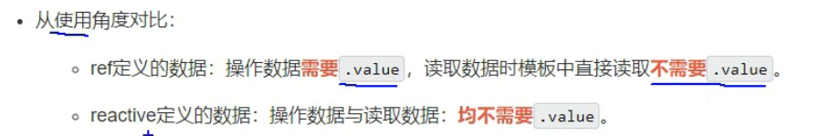


## 2.5 computed计算属性

 和data() 一样，vue3中是兼容vue2中 computed属性的。


### 2.5.1 引入vue3中的computed


简写：计算属性只可读

```vue
<template>
	<h1>{{fullName}}</h1>
</template>

<script>
import {computed} from 'vue3'
export default {
	 name:'Demo',
	 setup(){
	 	let firstName = ref('haha')
	 	let lastName = ref('abc')
	 
	 	let fullName = computed(()=>{   //简写形式
	 		return `${firstName}_${lastName}`
	 	})
        return {
            fullName
        }
	 }
}
</script>
```


完整写法： 计算属性可读可写

```vue
<template>
	<h1>{{fullName}}</h1>
</template>

<script>
import {computed} from 'vue3'
export default {
	 name:'Demo',
	 setup(){
	 	let firstName = ref('haha')
	 	let lastName = ref('abc')
	 
	 	let fullName = computed(()=>{   //简写形式
	 		return `${firstName}_${lastName}`
	 	})
        return {
            fullName
        }
	 }
}
</script>
```


## 2.6 watch属性


引入,watch函数

```js
import {watch} from 'vue'
```


语法：

```js
watch(obj,callBack,property);
// obj  监视的对象


//callback  当监视对象属性发生改变，触发这个回调。
// 这个回调提供了2个参数  (newValue,OldValue) 
// newValue 新值  oldValue 旧值


//property 配置对象
```


监听ref的代理对象

```vue
<script>
import {watch} from 'vue'
    
export default {
    name:'APP',
    setup(){
        let sum = ref(0)
        
        let msg = ref('a')
    	//监听1个变量
        watch(sum,(newValue,OldValue)=>{
            console.log(newValue,OldValue)
        })
        
        //同时监视多个对象，参数都是数组对象
        watch([sum,msg],(newValue,OldValue)=>{
            console.log(newValue,OldValue)
        })
        
        let person = ref({
            name:'haha',
            age:18
        })
        
        watch(person.value(newValue,oldValue)=>{
            console.log(newValue,oldValue)
        })
        
        
    }
}
</script>

```


监视代理reactive对象

```vue
<script>
export defatult{
    name:'Demo',
    setup(){
        let person = reactive({
            name:'哈哈',
            age:18
        })
        //watch监视对象时，无法获取旧Value
        
        watch(person,(newValue,OldValue)){
            console.log(newValue,OldValue)
        }
        
    }
}
</script>
```


### 2.6.1 监视对象的某个属性

```
对于reactive代理的对象，watch强制只能深度监视。

watch支持只监视代理对象的某一个属性。
如果这个属性仍是一个对象，必须配置 {deep:true} 才能开启深度监视。
```


```vue
<template>


</template>

<script>
import {watch} from 'vue'
export default {
    name:'Demo',
    setup(){
        let person = reactive({
            name:'haha',
            age:18,
            a:{
                b:{
                    c:0
                }
            }
        })
        
        //此时OldValue能正确返回
        watch(()=>return person.age,(newValue,oldValue)=>{
            console.log(newValue,oldValue)
        })
        
        //监视非代理对象的一个对象属性
        watch(()=>person.a,(newValue,oldValue)=>{
            
            console.log(newValue,oldValue)
        }，{deep:true})
    
    }
}

</script>
```


## 2.7 watchEffect 函数

立即运行一个函数，同时响应式地追踪其依赖，并在依赖更改时重新执行。

```
watchEffect 不用指明监视属性。会自动判断
```


引入

```
import {watchEffect} from 'vue'
```


```vue
<template>

</template>
<script>
    export default {
        name:'Demo',
        setup(){
            
            let sum = ref(1)
            
            let msg = ref('hello')
            
            watchEffect(()=>{
                console.log(sum,msg)
                
            })   
        }
    }
	

</script>
```


## 2.8 Vue3中的生命周期


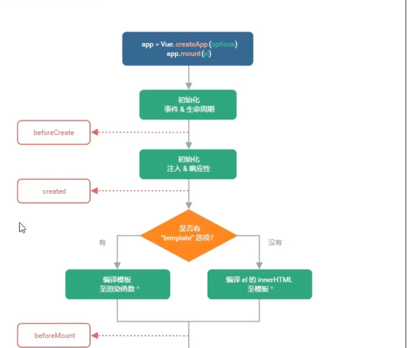


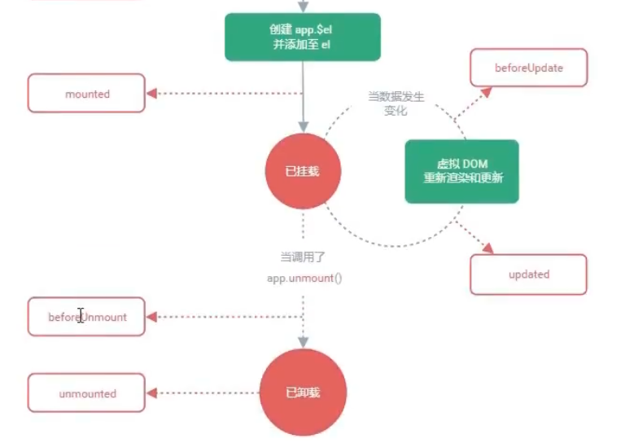


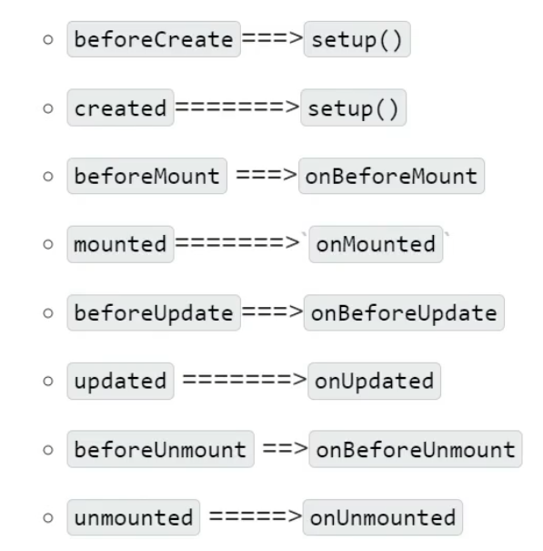


## 2.9 自定义Hook 函数

Hook是一个函数，把组合式API进行了封装。


hook函数让 组合式API可以组装起来，封装在一个js函数中。进一步的复用代码。


## 2.10 toRef


对于setup函数的return，想把一个 refImpl 代理对象的某个属性返回出去的时候，需要使用 toRef()函数。因为refImpl对象是代理对象，是响应式的对象。如果只是把它的属性返回出去，那么仅仅是把值返回出去，并不是响应式的属性。

```vue
<script>
import {ref,toRef} from 'vue'
export default {
    name:'App',
    setup(){
        
        let person = ref({
            name:'hello'
            age:'18'
        })
        const age = toRef(person,'age')
       	
        
        
        
        return {
        	name:toRef(person,'name'),
            age,
        }
    }
    
}

</script>
```


语法：

```js
toRef(obj,propertyName)

//obj   		一个代理对象
//propertyName  一个字符串, 表示需要代理属性的名称

例如：

        let person = ref({
            name:'hello'
            age:'18'
        })
        const age = toRef(person,'age')
```


### 2.10.1 toRefs

如果一个对象的属性非常多,为每个属性指定一个toRef非常麻烦。

所以toRefs批量处理对象的所有属性。

```
toRefs 只能自动帮助封装属性的第一层，如果属性是一个对象，无法完成第二层及以下的代理
```


```js
        let person = ref({
            name:'hello'
            age:'18'
        })
        
        return {
            ...toRefs(person)  //使用剩余运算符,模板可以直接使用 name ,age 属性
        }
```


## 2.11 shallowReactive

浅层次响应式。只把一个对象的第一层属性作为响应式。

```js
let foo = shallowReactive({
	a:1,
	b:{
		c:{
			d:{
			
			}
		}
	}
})

//只有 a,b 属性是响应式的
```


引入

```
import {shallowReactive} from 'vue'
```


## 2.12  shallowRef

ref可以代理基本数据类型，也可以代理对象数据类型。

shallowRef 可以代理基本数据类型，如果代理对象类型，不会代理对象的属性。只是代理对象本身(对象被替换了则会触发响应式)

 

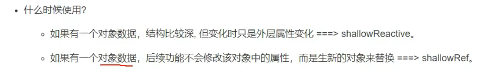


## 2.13 readonly / shallowReadonly


### 2.13.1 readonly

readonly代理的对象，不允许被修改。

```vue
<script>
import {readonly,ref,reactive} from 'vue'

export default {
	name:'Demo',
	setup(){
        let person = ref({
            name:'a',
            age:18
        })
        
        let foo = reactive({
            a:{
                b:5
            },
            c:10
        })
	}

    person = readonly(person)

    foo = readonly(foo)
    
    return {
		person
	}
	
}

</script>
```


### 2.13.2  shallowReadonly

只能禁止修改第一层的属性。深层次的不管


## 2.14  toRaw / markRaw


### 2.14.1  toRaw

将一个 reactive生成的代理对象，转换为 普通对象

 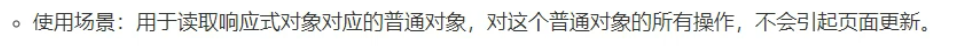


```
const p = toRaw(person)
```


### 2.14.2 markRaw


标记一个对象，使其永远不会再成为响应式对象

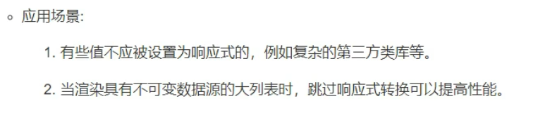


```
const car = {
	a:1,
	b:10
}

person.car = markRaw(car)
```


## 2.15  customRef

自定义Ref.  创建一个自定义的Ref，并对其依赖项跟踪，和更新触发进行显式的控制。


```vue
<script>
import {customRef} from 'vue'

export default {
    name:'Demo',
    setup(){
        function timeOutSetRef(value,timeout){
            return new customRef((stack,trigger)=>{
                let timer
            	return{
                    get(){
                        stack()
                        return value
                    },
                    set(newValue){
                        timer = setTimeout(()=>{
                            value = newValue
                        },timeout)
                        trigger()
                    } 
                }  
            })
        }
        
        
        
        
        
    }
}


</script>
```


## 2.16  provide / inject


作用：  实现 祖孙组件间通信。

父组件有一个 `provide` 选项来提供数据。 子组件有一个 `inject` 来使用数据

### 2.16.1 使用


父组件

```vue
<script>
import {ref,provide} from 'vue'

import Child from './components/Child.vue'

export default {
  name: 'App',
  components: {
    Child
  },
  setup(){
      
      let car = ref({
          name:'aa',
          size:5
      })
      
      provide('car',car)  //传递出car变量, 命名为 car
      
      return {}
  }

</script>
```


子组件：

```vue
<template>
    <div>
        <Grandchild></Grandchild>
    </div>
  
</template>

<script>

import Grandchild from './Grandchild.vue'

export default {
    name:'Child',
    components:{
        Grandchild
    }
}
</script>
```

孙组件

```vue
<template>
    <div>
        <h4>{{car.name}} -- {{car.size}}</h4>
    </div>
</template>
<script>
import {inject} from 'vue'

export default {
    name:'Grandchild',
    setup(){

        const car = inject('car')
        return {car}
    }

}
</script>
```


### 2.16.2 总结

provide/inject 子孙组件都可以使用。无论多少代


## 2.17 响应式数据的判断


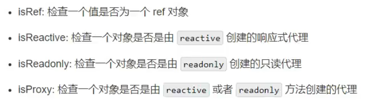


## 2.18  组合式API的优势


对于Vue2传统OptionAPI来说：

```
一个功能点的各个部分（data,watch,computed,methods 会被拆散到各个 配置项中），

显然功能点之间没有做到高内聚。 不同功能点(不相关)的代码耦合在一个option API中。
```


对于Vue3来说：

```
将各个配置项都变为 组合式API的函数式调用。这意味着setup函数中可以多次调用同一个组合式API来完成不同的功能点。

同时配合hook API ,可以将各个功能点的代码单独组织到额外的js文件中，这个js文件满足高内聚低耦合的设计思路。使得代码组织关系更加明确，代码复用率进一步提高
```


# 3.  新组件


## 3.1 Fragment

在Vue2中，组件必须有一个根标签。

在Vue3中，可以没有根标签，在内部会将多个标签包在一个Fragment虚拟元素中


```
Fragment 不需要开发者自己添加
```


## 3.2 Teleport


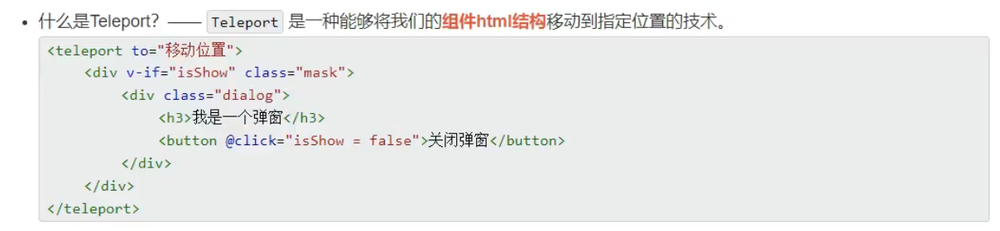


## 3.3 其他改变

Vue3中 移除了全局的 Vue


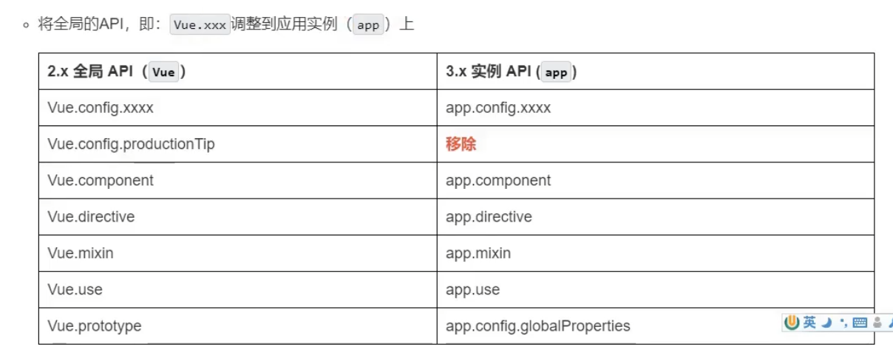

