# 3. Vue 组件化编程

什么是组件？

```
应用中 局部功能代码和资源的集合。   代码指css,html,js   资源指  mp3 mp4 zip png 等


也就是按照功能点，封装好的集合。
```


组件化编程的优势？

```
解决传统的html css js之间复杂引用关系。

一定程度上提高组件之间的代码利用率
```


## 3.1 非单文件组件

```
1个 .vue的文件中包含多个组件


1个 .vue的文件中，只包含1个组件
```


### 3.1.1 使用组件


#### 3.1.1.1 创建一个组件

使用`Vue.extend(options)` 来创建一个组件

```js
    const school = Vue.extend({

        name: 'school',
        data() {
            return {
                name: 'a'
            }
        },
        template: `
        <div>
            <h2>{{name}}</h2>
            <button @click="showX">click me</button>
        </div>
        `,
        methods: {
            showX() {
                console.log(this.x)
            }
        }
    })
```


使用`Vue.component(tagName, options)` 来全局注册一个组件。

```js
    const student = Vue.component('student', {
        data() {
            return {
                name: 'hh',
                age: 8
            }
        },
        template: `
            <div>
                <h2>{{name}}</h2>
                <h2>{{age}}</h2>
            </div>
        `

    })
```

 组件内无需声明`el` 以后由vm来管理组件指定


如下方式来调用组件:

```
<tagName></tagName>
```

```js
const school = Vue.extend({
   	template:`
   	        <h2>n : {{n}}</h2>
            <h2>学生姓名:{{studentName}}</h2>
            <h2>学生地址:{{studentAddress}}</h2>    
            <button @click="addN">click me to add n</button>
   	`
	data(){
		return {
			name:'a',
			address:'b',
			n:1
		}
	},
	methods:{
		addN(){
			this.n ++
		}
	}
})
```


注意点：

```
注册组件中的data,不是一个对象，而是一个方法。原因就是: 如果共用一个对象，可能会引起数据的错误。
其他人修改了对象的值，导致多个组件都发生了改变。
```

```
由于是非单文件组件，模板需要写在 template中，使用ES6语法``多行字符串
```


#### 3.1.1.2 注册组件

```
在vm中注册一个组件.  分为 局部注册和全局注册
```

##### 局部注册:

```js
let vm = new Vue({
	el:'#div1',
	components:{   //局部注册
		school:school,   //可以简写  school
        student           //简写
    }
})
```


````
在components中注册
````


##### 全局注册

```
使用 Vue.component(componentName,varName) 注册

所有的Vue实例都可以使用这个组件
```

```
第一个是组件的名字
第二个是变量的名字
```


```js
    const person = Vue.extend({
        template: `
        <div>
            <h2>name:{{name}}</h2>
            <h2>age:{{age}}</h2>
            <h2>hight:{{hight}}</h2>
        </div>
        `,
        data() {
            return {
                name: '小红',
                age: 15,
                hight: 175
            }
        }

    })

    Vue.component('person', person)
```


#### 3.1.1.3 几个注意的点


组件名的命名：(官方推荐)

```
'my-school':school   //多单词的组件名

MySchool            //每个单词都大写
```


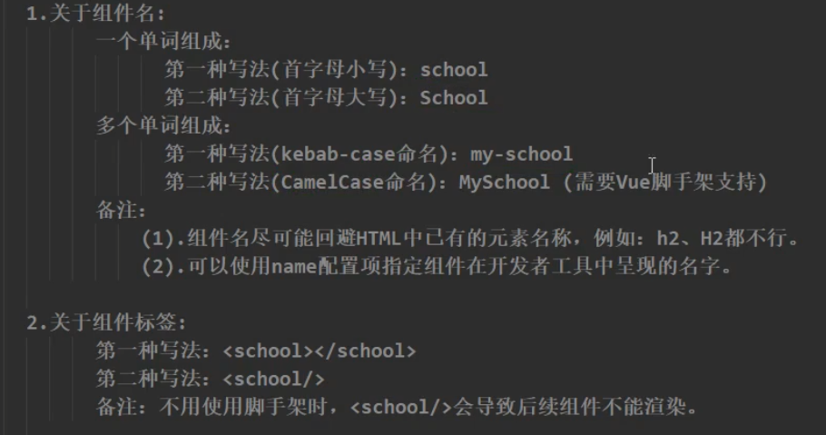


### 3.1.2 组件的嵌套


```
组件是可以嵌套使用的。
```


A注册进了B中，所以B的模板中需要加上A的标签


```html
<!DOCTYPE html>
<html lang="en">

<head>
    <meta charset="UTF-8">
    <meta http-equiv="X-UA-Compatible" content="IE=edge">
    <meta name="viewport" content="width=device-width, initial-scale=1.0">
    <title>Document</title>
    <script src="../vue.js"></script>
</head>
<body>
    <div id="div1">
        <app></app>
    </div>
</body>
<script>
    const student = Vue.extend({
        name: 'student-component',
        template: `
        <div>
            <h2>学生姓名: {{name}}</h2>
            <h2>学生年龄: {{age}}</h2>   
        </div>
        `,
        data() {
            return {
                name: '阿哲',
                age: 18
            }
        }
    })
    const hello = Vue.extend({
        template: `
            <div>
                <h3>{{msg}}</h3>
            </div>
        `,
        data() {
            return {
                msg: 'hello world'
            }
        }
    })
    const school = Vue.extend({
        name: 'school-component',
        template: `
        <div>
            <h2>学校姓名: {{name}}</h2>
            <h2>学校地址: {{address}}</h2>   
            <student></student>
            <hello></hello>
        </div>
        `,
        data() {
            return {
                name: '八一农垦',
                address: '大庆'
            }
        },
        components: {
            student,
            hello
        }
    })
    const app = Vue.extend({
        template: `
        <div>
            <school></school>
        </div>
        `,
        components: {
            school
        }
   })
    let vm = new Vue({
        el: '#div1',
        data: {},
        components: {
            app
        }
    })
</script>
</html>
```


### 3.1.3 父子组件传递属性参数


#### 3.1.3.1 prop

```
prop 是子组件用来接受父组件传递过来的数据的一个自定义属性。  //注意是 自定义属性


父组件的数据需要通过 props 把数据传给子组件，子组件需要显式地用 props 选项
```


```html
<body>
    <div id="div1">
        <school msg="hello world"></school>  <!-- 自定义属性 msg -->
    </div>
</body>

<script>
    const school = Vue.extend({
        name: 'school',
       	template:`
       		<div>
       			{{msg}}    //最终接收到父组件传过来的自定义属性msg的值： helloWorld
			</div>
       	`
    })
    
    let vm = new Vue({
        el:'#div1',
        components:{
            school
        }
    })
	
</script>
```


#### 3.1.3.2 动态prop

```
把自定义属性绑定上 v-bind ,v-model
实现动态更新数据
```


```html
<body>
    <div id="div1">
        <input v-model:"dynamicMsg">
        <school v-bind:d-msg="dynamicMsg"></school>  <!-- HTML属性是大小写不敏感，所以只能使用 kabeb-case -->
    </div>
</body>
<script>
    const school = Vue.extend({
        props:['d-msg'],
        data:{
            name:'abc'
        },
        template:`
        	<div>
        		<h2>{{dMsg}}</h2>      
			</div>
        `    //这里使用的时候仍然是小驼峰
    })
	let vm = new Vue({
        el:'#div1',
        data:{
            dynamicMsg:''
        },
        components:{
            school
        }
    })

</script>
```


#### 3.1.3.3  prop验证

组件可以为props指定验证的要求。

```
如果使用prop验证， props属性不能再是一个简单的字符串数组，而是一个对象。
```


```js
props:{
    propA:{
        type:[String,Number]  //可以是多种类型的一种
    },
    propB:{
        type: String,
        required: true  //必填的字符串
    },
    propC:{
        type:String,
        default: 'hello,world'     //可以有默认值
    },
    propD:{
        type:Object,
        default(){                        //default可以是一个函数，返回默认的值
        	return {msg:'hello ,world'}
        }
    },
    propE:{
        validator(){                      //可以自定一个校验函数
            return ['success', 'warning', 'danger'].indexOf(value) !== -1
        }
    }
    
    
    
}
```


```
当 prop 验证失败的时候，(开发环境构建版本的) Vue 将会产生一个控制台的警告。
```


##### type的取值

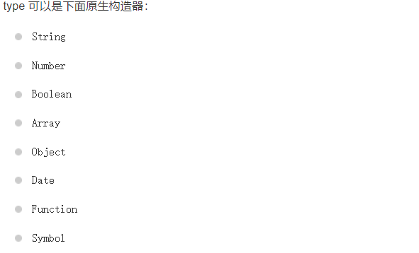


#### 3.1.3.4  prop属性的值不推荐修改

``` 
props中的属性值，Vue不推荐修改，这会引起Vue出现bug。
```


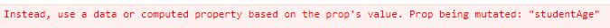

```
应该使用一个计算属性，或者data来基于 prop的值
```


```vue
<template>
    <div class="school">
        <h2>学校姓名:{{name}}</h2>
        <h2>学校地址{{address}}</h2>
        <button @click="showDMsg">点我输出prop : d-msg</button>


        <h3 >学生姓名：{{studentName}}</h3>
        <h3 >学生年龄：{{localAge}}</h3>
        <h3 >学生性别：{{studentGender}}</h3>

        <button @click="changeValue">点我年龄+5</button>
    </div>
    
</template>

<script>
export default {
    name:"School",
    props:['d-msg','student-name','student-age','student-gender'],
    data(){
        return {
            name:'aa',
            address:'bb',
            localAgeBase:5
        }
    },
    methods:{
        showDMsg(){
            console.log('收到的d-msg : ',this.dMsg)
        },
        changeValue(){
            this.localAge = 5  //相当于调用了set(5)
        }
    },
    computed:{
        localAge:{
            set(value){
                this.localAgeBase += value
            },
            get(){
                if(this.studentAge==='' || this.studentAge === undefined ){
                    return ''
                }
                return this.studentAge + this.localAgeBase
            }
        }
    }
}
```


## 3.2  VueComponent

定义的组件，其实是一个VueComponent的构造函数


```
1. 调用Vue.extend返回一个由Vue生成的构造函数。这个构造函数是 VueComponent类型的构造函数
2. 每使用1次这个组件的标签，都会new一个对应的实例
3. 每调用一次Vue.extend都返回一个全新的 VueComponent类型的构造函数
4. 在Vue中的配置中，data,methods,watch,computed中的this均指向vue实例
   在组件中，data,methods,watch,computed中的this均指向VueComponent实例，也就是组件实例对象
```


```
子组件被存放在对象的 $children中，是一个数组
```


### 3.2.1 详细剖析


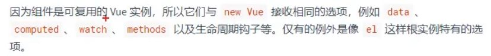


```
VueComponent中传入的options配置项几乎与Vue实例一样。除了无需指定 el

data需要写成函数，防止同一个对象出现的问题。
```


### 3.2.2 一个重要的内置关系


```
Vuecomponent.prototype.__proto__ ===  Vue.prototype
```


```
Vue组件函数的原型对象的隐式原型对象 等于 Vue的原型对象


这意味着vue组件可以访问到Vue原型上的属性和方法。
```


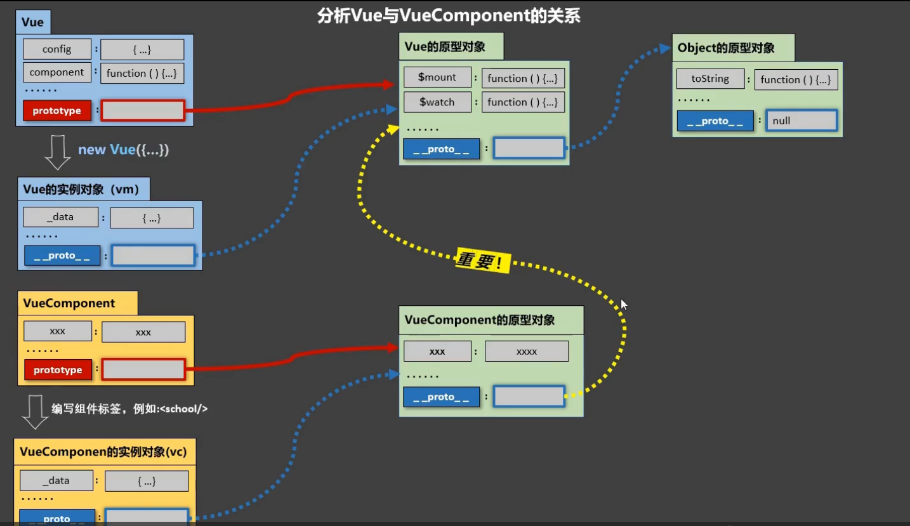


```
VueComponent的prototype的 __proto__ 指向了 Vue.prototype

即让VueComponent的实例对象访问到 Vue的原型对象上的属性和方法: $mount $watch
```


## 3.3 单文件组件

都是`.vue`结尾的，浏览器并不能直接运行.需要加工和处理变为`.js` 浏览器才能解析加工。


一般 单文件组件的命名:

```
school.vue
School.vue              //推荐
MySchool.vue            //推荐
my-school.vue 
```


## 3.4  Vue脚手架


### 3.4.1 使用Vue cli 创建工程


```
npm install -g @vue/cli
```


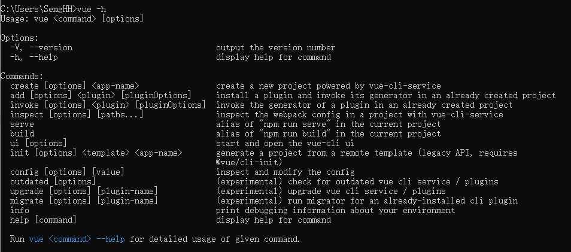


```
Vue create <name>
```


如果出现 `Vue：无法加载文件，因为在此系统上禁止运行脚本`

```
以管理员身份运行 vscode

在终端中输入
get-ExecutionPolicy
set-ExecutionPolicy RemoteSigned
```


选择版本：

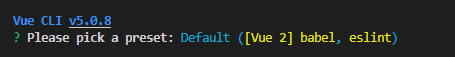

```
目前先选择Vue2  babel eslint
```


打包工程

```
npm run build
```


### 3.4.2 项目工程结构

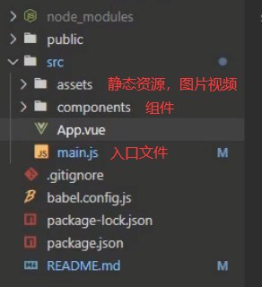


### 3.4.3 引入完整Vue

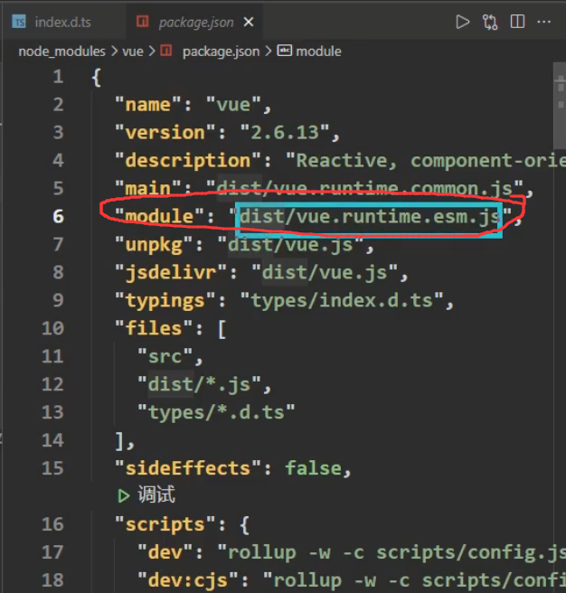


```
vue工程下的 package.json 中的 module 控制了如果使用ES6语法导入的vue，实际上是导入dist下的vue.runtime.esm.js
这是一个没有 模板解析器版本的Vue
```


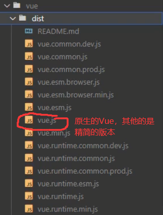


#### 3.4.3.1 使用 render函数解决

如果引入了没有 模板解析器的 Vue，无法解析 template 关键字。可以使用render函数解决问题。


```js
new Vue({
    el:'div1',
    render(createElement){
        return createElement('h1','你好啊')
    }    
})
```


#### 3.4.3.2 render


对于只有1个参数的可以化简括号,没有使用this，可以用箭头函数化简。

```js
render:createElement=>createElement(App)
```

把函数名使用一个字母化简。传入对象。

最终成了这样：

```js
new Vue({
    el:'div1',
    render:h=>h(App)
})
```


#### 3.4.3.3  为什么要有这么多版本Vue

Vue: 核心 + 模板解析器


```
减小体积,加快访问
```


#### 3.4.3.4  cli可以更改的配置


https://cli.vuejs.org/zh/config/


##### 3.4.3.4.1 pages 

对于 多页面模式 (multi-page)下， 每一个单独的Page都需要有一个对应的JS文件入口。

https://cli.vuejs.org/zh/config/#pages

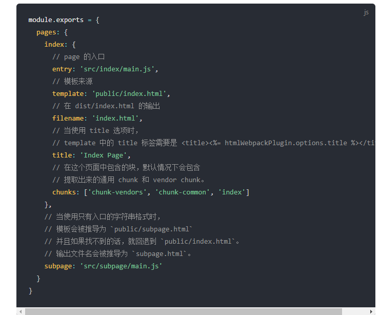


##### 3.4.3.4.2 lintOnSave

在保存的时候，进行语法检查

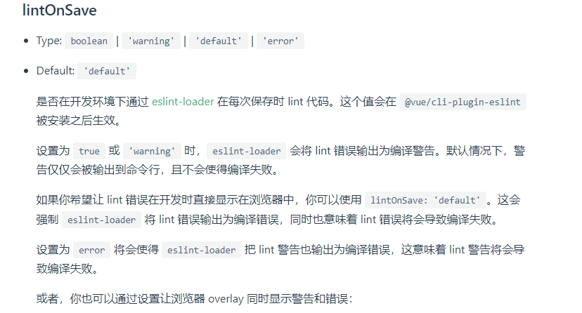


### 3.4.4  ref属性

Vue用于直接获取DOM元素。 对应的DOM存放在了 $refs中

```vue
<template>
	<div>
        <h1 ref="title" v-text="titleMsg"></h1>
        <button @click="showDOM" ref="button">点击展示DOM元素</button>
        <School ref="sch"></School>  <!-- 给组件添加一个ref ，获取的是组件的实例对象-->
        							 <!-- 如果给School标签添加的是id属性，获得的是对应的DOM-->
    </div>

</template>

<script>
	import School from './School.vue'

	let vm = new Vue({
        name='App',
        data(){
        	return {
                titleMsg: 'hello world'
            }
	    },
        components:{
            School
        },
        methods:{
            showDOM(){
                console.log(this.$refs.title)
                console.log(this.$refs.sch) //输出的是School组件的实例对象
            }
        }
    })
</script>
```


```
ref 对于非组件标签，获取的是真实DOM元素
    对于组件标签，获取的是组件实例对象 ， id获取的是组件标签对应的DOM
```


## 3.5 mixin

```
Vue的一个配置项。 用于复用其他的Vue配置项，任何其他的配置项都可以复用
```


准备mixin.js 并导出变量

```js
export const mixinMethods = {
    methods:{
        showName(){
            alert(this.name)
        }
    }
}
```


在需要该配置项的组件中引入变量：

```vue
<template>
  
  <div>
    <h2 @click="showName">学生名称{{name}}</h2>
  </div>
</template>

<script>
import {mixinMethods} from '../assets/js/mixin'

export default {
	name:'Student',
	mixins:[mixinMethods]   //和prop不一样，不需要加单引号，直接写变量名
}
</script>
```


### 3.5.1 特点

```
mixin中的配置项,是一种补充(源没有,使用mixin的)不是简单的覆盖 (不是配置项级别的补充，而是属性级别的补充)
如果源文件已有,源文件的优先级更高。

如果mixin和组件源都存在data,补充组件源不存在的data属性。如果冲突，使用源组件的
```


对于生命周期钩子:

```
对于生命周期钩子，不以任何为主。两者都执行， mixin先调用，源组件后调用
```


### 3.5.2 全局混合

```
//在 main.js 中引入mixin

//然后调用Vue.mixin(),全局的组件都会得到mixin
```


## 3.6 Vue插件

插件用于给Vue添加一些全局的功能


```
1.添加全局函数或者 property

2.添加全局资源：  指令,过滤器等

3.通过全局混入,来添加一些组件选项

4.添加 Vue实例方法。 即添加到Vue.prototype 上


```


### 3.6.1 使用插件

在`new Vue()`之前调用 `Vue.use()`即可 .  第二个参数将会被传到 install()方法中。

```js
//插件是单例注册的。

import MyPlugin from '../assets/js/myplugins.js'

Vue.use(MyPlugin,{someOptions:true})
```


### 3.6.2 定义一个插件


```
Vue的插件需要有一个  install()方法。
方法第一个参数是Vue构造器，第二个参数是一个可选的配置对象。


第二个或者更多的参数都会从Vue.use()方法参数中传递过来，给插件提供了可配置的功能。
```


插件可以做的： 定义全局方法，定义全局指令，定义全局mixin ，定义Vue实例方法(vm和 vc都能使用)

```js
MyPlugin.install = function (Vue, options) {
  // 1. 添加全局方法或 property
  Vue.myGlobalMethod = function () {
    // 逻辑...
  }

  // 2. 添加全局资源
  Vue.directive('my-directive', {
    bind (el, binding, vnode, oldVnode) {
      // 逻辑...
    }
    ...
  })

  // 3. 注入组件选项
  Vue.mixin({
    created: function () {
      // 逻辑...
    }
    ...
  })

  // 4. 添加实例方法
  Vue.prototype.$myMethod = function (methodOptions) {
    // 逻辑...
  }
}
```


## 3.7  scoped


组件中的style最终会汇总到一起，如果两个组件命名了相同的样式类名，会出现冲突。后引入的会覆盖先引入的。使用scoped解决

```vue
<style scoped>     
    .demo{    
        background-color: skyblue;
    }
</style>
<!-- 添加一个scope,样式只限制在本组件中 -->
```

```vue
<style scoped>     
    .demo{    
        background-color: orange;
    }
</style>
```


解决原理：

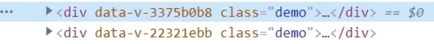

给这个组件添加了一个随机的属性。通过类名+属性选择器，作用在特定的元素上。

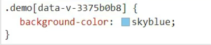


## 3.8 开发组件时的注意点

```
1. 兄弟组件之间沟通,通过状态提升。将对象放入最近的共同父组件上

2.props  可用于父组件=>>子组件通信
         子组件调用父组件传递过来的函数
         
```


## 3.9 本地存储


### 3.9.1 localStorage

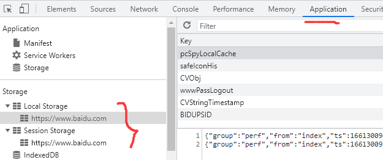


```
可以在 Application.local storage 中查看
```


#### 3.9.1.1 方法

```
localStorage.setItem(key,value)
localStorage.getItem(key)
localStorage.removeItem(key)
localStorage.clear()
```


```
存入 localStorage 中的value只能是字符串。

如果存入一个对象，会调用这个对象的tostring()方法
```


### 3.9.2 sessionStorage

```
和localStorage API都一样。
区别在于 只能存储在一次Session中。浏览器关闭表示session结束
```


#### 3.9.2.1

方法api同localStorage一样


### 3.9.3 webStorage


```
localStorage ,sessionStorage 统称 webStorage	 

通常占用大小上限 5MB
```


## 3.10 组件的自定义事件

父组件传递给子组件一个自定义事件的名。

当子组件满足某种条件后(程序员可以自己触发这个事件)触发该事件，父组件会调用该事件绑定的回调函数。

```
并且子组件在触发该事件时，可以带任意多的参数返回给父组件
```


### 3.10.1  定义

在父组件中：

```vue
<template>
	<Student v-on:my-event="getStudentName"></Student>

	<!-- 在父组件中，使用  v-on:<eventName>="<callback>"  向子组件绑定一个自定义事件 -->
</template>
<script>
    export default {
        name:'App',
        methods:{
            getStudentName(name){
                console.log('demo 被触发了',name)
            }
        }
    }
</script>
```


子组件：

```vue
<template>
  
  <div>
    <h2 @click="showName">学生名称{{name}}</h2>
    <button @click="sendStudentName">点击将学生姓名发送给App</button>
  </div>
</template>

<script>
import {mixinMethods} from '../assets/js/mixin'

export default {
    name:"Student",
    data(){
        return {
            name:'法外狂徒'
        }
    },
    mixins:[mixinMethods],
    methods:{
      sendStudentName(){ 
        this.$emit('my-event',this.name)   //调用this.%emit(key,param)
      }
    }
}
</script>
<style>
</style>
```


### 3.10.2  $emit

```
这个属性用于触发自定义事件/JS原生事件。
```


拿到 VueComponent的$emit属性，它是一个函数。传入key 和其余参数

```js
this.$emit('my-event',this.name)

// key表示 父组件 v-on:绑定的属性名
// 其余的参数都会被传入 v-on绑定的方法的参数中
```


### 3.10.3 以绑定回调的方式实现绑定

在父组件的 mounted()中，使用 `this.$refs.<modelName>.$on(key,callback)` 绑定事件

例如：

```js
this.$refs.student.$on('my-event',this.getStudentName)


//this.getStudentName 这个函数是配置在  父组件的 methods中的。
//如果函数回调直接 写function(){...} 就会出错，
//因为Vue规定,子组件触发自定义事件，回调中的this就是子组件对象。

//如果this.getStudentName 配置在methods中，则this重新指向为父组件。所以可以正常使用

//另一种方式，使用箭头函数。由于箭头函数没有this，向外层寻找。method中的this是父组件，所以仍成立
```


父组件：

```vue
<template>
	<Student ref="student"></Student>

</template>


<script>
	export default {
        name:'App',
        methods:{
            getStudentName(name){
                console.log('得到了name',name)
            }
        },
        mounted(){
        	setTimeout(()=>{
            this.$refs.student.$on('my-event',this.getStudentName)
        },3000) 
           //调用子组件的$on ,将回调函数绑定只要子组件一触发my-event事件
           //就会调用this.getStudentName函数,参数会自动传进去
            
           //这种异步绑定的方式,非常灵活。可以等待一个异步请求回来，才绑定回调 函数
            
        }
    }
</script>
```


### 3.10.4 $once

如果以 $on的方式绑定的，可以使用$once绑定。

```js
        mounted(){
        	setTimeout(()=>{
            this.$refs.student.$once('my-event',this.getStudentName)
        },3000) 
```


### 3.10.5 解绑

绑定的自定义事件，如果不用了，尽量解绑。 在子组件中调用 `$off()`解绑

```vue
<template>
  
  <div>
    <h2 @click="showName">学生名称{{name}}</h2>
    <button @click="sendStudentName">点击将学生姓名发送给App</button>
    <button @click="toUnbind">解绑my-event事件</button>
  </div>
</template>
<script>
export default {
    name:"Student",
    data(){
        return {
            name:'法外狂徒'
        }
    },
    methods:{
      sendStudentName(){
        this.$emit('my-event',this.name)
      },
      toUnbind(){
//        this.$off('my-event')
//        this.$off(['my-event','event1','event2'])  //解绑多个事件
          this.$off()  //所有自定义事件全都解绑
      }
    }
}
</script>

```


### 3.10.6 native修饰符

```
<Student  @click="show"   />
```

如果给组件绑定一个JS原生事件，Vue默认认为是一个自定义事件，必须使用

```js
this.$emit('click')
```

才能触发该事件。


如果想要 “click事件” 原来的功能： 点击就触发事件，而不是使用$emit，可以加上native修饰符

```
<Student @click.native="show" /> 
```


## 3.11 全局事件总线

可以实现任意组件间的数据通信。


### 3.11.1 设置

设置全局事件总线：

```js
let vm new Vue({
	el:'#app',
	render:h=>h(App),
	beforeCreate(){
		Vue.prototype.$bus = this
	}
})
```


```
$on $off $emit 都在Vue的prototype上，所以全局事件总线对象设置为Vue的实例对象，最终会找到原型上。
```


### 3.11.2 使用

使用全局总线

```vue
<template>
export default{
	el:'Student',
	mounted(){
		this.$bus.on('hello',(data)=>{
			console.log(data)
		})
	}
}
</template>
```

提供数据：

```
this.$bus.$emit('hello',data)
```


 


## 3.12 发布订阅

```
也是一种组件之间通信的方式
```


### 3.12.1 使用

```
npm i pubsub-js
```


```js
import pubsub from 'pubsub-js'
...
mounted(){
	this.pId = pubsub.subscribe('hello',(msgName,data)=>{ //订阅消息，并声明callback
        console.log('收到订阅消息',data)
    })
},
beforeDestroy(){
    pubsub.unsubscribe(this.pId) //解绑订阅
}

...
```

这里使用箭头函数，否则this找不到外部的Vue组件实例对象。也可以绑定被Vue管理的函数


```js
import pubsub from 'pubsub-js'
...
methods:{
    getMsg(msgName,msgData){
        this.data = msgData
    }
},
mounted(){
	this.pId = pubsub.subscribe('hello',this.getMsg)
},
beforeDestroy(){
    pubsub.unsubscribe(this.pId) //解绑订阅
}

...
```


发布消息：

```js
import pubsub from 'pubsub-js'
...
methods:{
    callPublish(){
        pubsub.publish('hello',123)  //发布消息，参数传入123
    }
}

...
```


## 3.13 使用$set

使用`$set` 添加一个响应式的的属性。

```
this.$set(obj,key,value)

//obj是要追加的对象
//key是属性名 
//value是属性对应的值
```

如果不用$set设置的属性，Vue是不会添加setter 和 getter的所以是非响应式的。


## 3.14 失去焦点事件


```
@blur=""
```


## 3.15 过度与动画


## 3.16 配置代理

通过配置代理来解决跨域问题。


```
1.nginx 反向代理

2.Vue cli 可以配置开启一个代理服务器
```


### 3.16.1 配置Vue.config.js


```js
module.exports={
    ...
  	devServer:{
        proxy: 'http://semghh.xyz:10086'
    }
}
```


存在的问题：

```
1.当本地存在的相同路径冲突，不会转发代理请求，而是返回本地数据
2.无法配置多个代理源
```


### 3.16.2 配置2

```js
module.exports={
	...
	devServer:{
		proxy:{
			'/api':{
				target:'http://semghh.xyz:10086',
                pathRewrite:{        //重写路径请求。接收一个配置项 <key>:<value>
                    '^/abc':'/qwe'   //支持一个正则的key, 将匹配的key替换为 <value>
                }					//此处的含义：把/abc替换为/qwe
                ws:true,
                changeOrigin:true
			},
            '/foo':{
                target:'http://semghh.xyz:10000'
            }
            
		}
	}
}
```


```
```


## 3.17 Slot 插槽

Vue实现了一套内容分发的API ，将`<slot>` 元素作为承载分发内容的出口


### 3.17.1 试用slot


```vue
<navigation-link url="/profile">
  Your Profile
</navigation-link>
```


在`navigation-link`组件的 `<template>` 模板中，使用 `<slot>` 可以将父组件中传递的内容，显示在子组件中。


```vue
<template>
	<a v-bind:href="url"><slot></slot></a>
</template>
```


```
Vue会将组件标签中包含的内容，输出在<slot>标签的位置
```


### 3.17.2 作用域

可以在slot的内容中，使用数据。

```vue
<navigation-link url="/profile">
  Logged in as {{ user.name }}
</navigation-link>
```


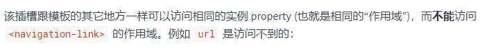

```
因为url 已经属于子组件作用域
```


### 3.17.3 slot默认值


我们可以在子组件的 `<slot></slot>` 中填写默认内容。当父组件未传入Slot的具体值得时候，使用默认值。

当父组件传入了Slot值的时候，替换默认值。


### 3.17.4 具名插槽

每个插槽可以都可以有一个唯一的名字。

在子组件中，可以按照需求将指定的 `slot` 插入特定的位置。


父组件定义具名slot：

```vue
<template>
<!-- 父组件的template-->
	<div>
        <Block>
    		<template v-slot:slot-a>
                this is slot-a
			</template>
				this is default-slot
			<template v-slot:slot-b>
				this is slot-b
			</template>
    	</Block>
    </div>
<template>


<script>
	import Block from './components/Block.vue'
	export default{
        name:'App',
        components:{
            Block
        }
    }    
</script>
```


子组件:  `<Block>`  

```vue
<template>


    <div>
        <slot name="slot-a"></slot>
        <slot></slot>
        <slot name="slot-b"></slot>
    </div>


</template>
```


对于没有被 <template>包裹的，都属于 默认的 slot。 也可以显式的包裹： 

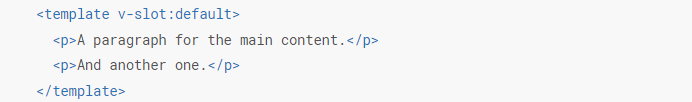


#### 3.17.4.1 具名插槽缩写

和 `v-on (@)`   `v-bind (:)` 一样，`v-slot` 也有缩写： `#`


```vue
<base-layout>
  <template #header="slotProps">
    <h1>Here might be a page title</h1>
  </template>

  <p>A paragraph for the main content.</p>
  <p>And another one.</p>

  <template #footer>
    <p>Here's some contact info</p>
  </template>
</base-layout>
```


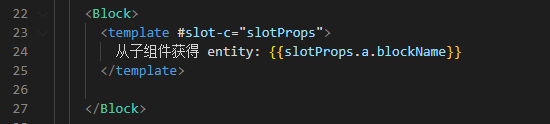


#### 3.17.4.2  旧API

旧的API中， 为slot赋值一个名，使用 slot API。同时可以付给非template

```
<div slot="header">
</div>
```


### 3.17.5  插槽作用域

通常 在父组件中，无法使用子组件的内容。

```
父级模板里的所有内容都是在父级作用域中编译的；子模板里的所有内容都是在子作用域中编译的。
```


Vue支持 插槽prop, 来让父组件使用子组件的内容。


子组件：

```vue
<template>
    <div>
      <slot v-bind:a="entity">
        {{ user.lastName }}
      </slot>
    </div>
</template>
<script>
export default {
    name:'Block',
    data(){
        return {
            entity:{
                blockName: 'foo'
            }
        }
    }
}
</script>
```

父组件：

```vue
<template>
    <Block>
      <template v-slot:slot-c="slotProps">
        从子组件获得 entity: {{slotProps.a.blockName}}
      </template>
    </Block>
</template>
```


父组件从 slot prop 中获得了entity，名字为a 。并给这个slot prop起名为 slotProps

当父组件想要访问a的时候，必须访问 `slotProps.a`  这样做的目的是，为了防止与父组件中的数据进行混淆。


#### 3.17.5.1 使用解构

参考官方文档：

https://v2.cn.vuejs.org/v2/guide/components-slots.html#%E8%A7%A3%E6%9E%84%E6%8F%92%E6%A7%BD-Prop


在使用slot prop的时候，如果觉得需要输入一个变量名，防止混淆过于麻烦，可以使用ES6的解构


```vue
<current-user v-slot="{ user }">
  {{ user.firstName }}
</current-user>
```


```vue
<current-user v-slot="{ user: person }">
  {{ person.firstName }}
</current-user>
```


# 4. 额外知识整理


## 4.1  杂项


#### 4.1.1 babel

```
babel  ES6语法转换为ES5
```


#### 4.1.2 语法检查

```
eslint 语法检查
jslint 语法检查
```


# 5. Vuex

用于解决多个组件之间共享数据的集中管理，是一种组件间通信的方式。


## 5.1 Vuex使用场景

1.多个组件依赖同一个状态

2.来自不同组件的不同行为，需要改变同一个状态


## 5.2 Vuex的工作原理


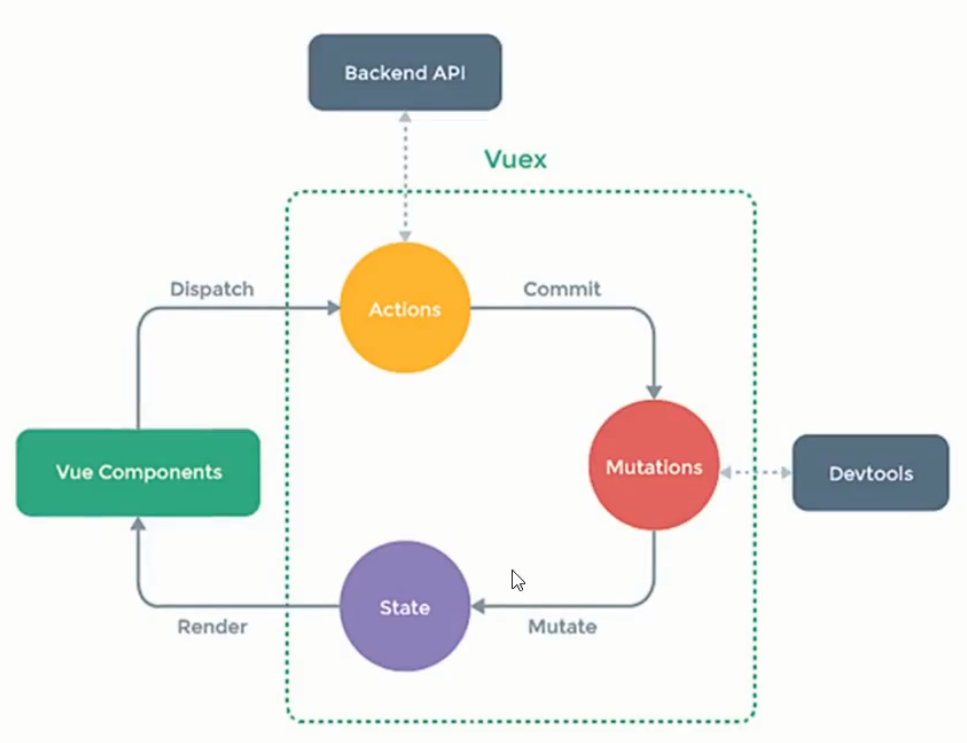


保存在Vuex的数据，要存放在 State对象中保管。


## 5.3 使用Vuex

Vue2 使用Vuex3版本

Vue3 使用Vuex4版本

```
npm i vuex@3
```


引入vuex

```js
import Vuex from 'vuex'

Vue.use(Vuex)


const vm = new Vue({
	el:'#app',
	render:h=>h(App)
})
```


src/store/index.js


创建Vuex中的核心store

```js
import Vuex from 'vuex'
import Vue from 'vue'

Vue.use(Vuex)

const actions = {

}


const mutations = {

}

const state ={

}

const store = new Vuex.Store({
	actions: actions,
	mutations: mutations,
	state: state
})

//暴露 store
export defatule store
```


main.js 中引入暴露好的 store

```js
import store from './store/index.js'


const vm = new Vue({
	el:'#app',
	render:h=>h(App),
	store: store
})
```


1. Vuex 的状态存储是响应式的。当 Vue 组件从 store 中读取状态的时候，若 store 中的状态发生变化，那么相应的组件也会相应地得到高效更新。
2. 你不能直接改变 store 中的状态。改变 store 中的状态的唯一途径就是显式地**提交 (commit) mutation**。这样使得我们可以方便地跟踪每一个状态的变化，从而让我们能够实现一些工具帮助我们更好地了解我们的应用。


## 5.4 getters

store提供了另外一个配置项 getters ,可以对state对象进行一定处理返回。其他的全部组件都可以使用

```js
...
const getters = {
	doubleSum(state){
		return state.sum *2
	}	
}
const store = new Vuex.Store({
	actions,
	mutations,
	state,
	getters    //添加getters配置项
})
```


```
可以等价于 state同级别的  computed变量
```


使用该变量：

```
this.$store.getters.doubleSum
```


## 5.5 mapState


很多情况下，我们只是访问  `this.$store.state.a` `this.$store.state.b`  变量a 和b 而已

就需要写大量的重复 `this.$store.state.`  

为了解决这种情况，Vuex提供了一种方便的功能  mapState  ，state映射功能。


```vue
import {mapState} from 'Vuex'

export default {
	name:'Operation',
	computed:{
		...mapState({a:'sum',b:'content'})
	}
}
```


其中 sum 和  content 是 state中保管的变量。

这样在 Operation组件中，可以直接使用 `this.a`，`this.b`变量了。


### 5.5.1 传入数组简写

`		...mapState({a:'sum',b:'content'})` 可以进一步简写。


```
		...mapState(['sum','content'])
```


这种简写方式，表示state中的变量名，和组件中的变量名一致。


注意：

```
mapState应写在computed中
```


## 5.6 mapGetters

mapState是对state数据进行了映射。mapGetters是对 getters对象数据进行映射。


mapGetters 同样有2种写法

```
...mapGetters({a:'doubleSum'})

...mapGetters(['doubleSum'])
```


```
mapGetters也应该写在computed中
```


## 5.7 mapMutations

同样的，对于那些只是简单调用actions.commit()的方法，Vuex同样支持了 mapMutations

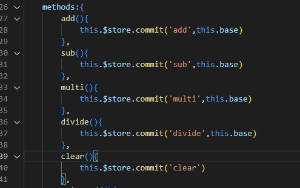


语法:

````
...mapMutations({add:'add',sub:'sub',multi:'multi',divide:'divide',clear:'clear'})

...mapMutations(['add','sub','multi','divide','clear'])
````


### 5.7.1 如何传参

如果使用了mapMutations, 意味着省略了 `this.$store.commit(key,params)`这条语句，无法在此处传参。所以需要在绑定事件的同时传入参数。

```vue
<template>
        <button @click="add(base)">+</button>
        <button @click="sub(base)">-</button>
        <button @click="multi(base)">*</button>
        <button @click="divide(base)">/</button>
        <button @click="clear(base)">clear</button>
</template>
```


```
mapMutations 应写在Methods中
```


### 5.8 mapActions


```
化简commit对应的是commit命令的下游Mutations : mapMutations

化简dispatch对应的是dispatch命令的下游Actions : mapActions
```


```js
export default {
    name:'Operation',
    data(){
        return {
            base:0
        }
    },
    methods:{
        ...mapActions({waitToAdd:'waitTimeToAdd'}),
        ...mapMutations(['add','sub','multi','divide','clear'])
    }
}
```


```
mapActions也应写在methods中
```


## 5.8 Vuex 模块化

为了化简mutations， actions中的大量方法,state，getters中大量的变量。模块化将mutations,actions，state,getters分类保管


### 5.8.1 使用模块化

```vue
<script>
    ...//省略

const calculationOptions = {
	actions:{
		add(context,val){
			context.commit('add',val)
		}
	},
    state:{
        sum:0
    },
    mutations:{
        add(state,val){
            state.sum += val
        }
    },
    getters:{
        
    }
}
const peoOptions = {
    state: {
        personList: [new Person(1, 'Semghh')]
    },
    actions: {},
    mutations: {
        addPerson(state, obj) {
            state.personList.unshift(new Person(obj.id, obj.name))
        }
    },
    getters: {

    }
}
    
export default new Vuex.Store({
	modules:{
        calOptions:calculationOptions,
        peoOptions
    }

})
    
    
</script>
```


通过在Vuex的modules配置项，引入对应的模块。

```
	...
	modules:{
        calOptions:calculationOptions,
        peoOptions
    }
    ...
```


对应的，组件中的map(mapState,mapActions,mapMutations,mapGetters)都需要进行修改：


### 5.8.2 模块化 mapState


写法一：

```vue
<template>
	<h3>{{calOptions.content}}</h3>
</template>

computed:{
	...mapState(['calOptions','peoOptions'])
//	...mapState({a:'calOptions',b:'peoOptions'})
}
```


#### 使用namespaced

如果觉得每次使用的时候，需要带上 `calOptions.` 十分麻烦。需要在modules定义的时候加上 namespaced:true 

```
const peoOptions = {
	namespaced:true,   //使用命名空间
    state: {
        personList: [new Person(1, 'Semghh')]
    },
    actions: {},
    mutations: {
        addPerson(state, obj) {
            state.personList.unshift(new Person(obj.id, obj.name))
        }
    },
    getters: {}
}
```

组件中使用：

```vue
<template>
	<h3>{{personList}}</h3>
</template>

<script>
    
    computed:{
		...mapState('peoOptions',['personList']),   //一次只能namespace  1个module
        ...mapState('calOptions',['sum','content','instance'])
	}
    
</script>


```


### 5.8.2 模块化的 mapMutations


```
methods:{
	...mapMutations('calOptions',['add','sub','divide','multi']),
//  ...mapMutations('calIptions',{a:'add',s:'sub',d:'divide',m:'multi'})
}
```


### 5.8.3 模块化的 getter


```
coumputed:{
	...mapGetters('calOptions',['doubleSum'])
}
```


## 5.9 * 路由


概念：

```
路由器: router
路由: 一组key-value的映射关系
SPA:  single page web application 单页面应用
```

通过配置路由映射，将路径路由到指定映射。

一个路径 =》 一个组件


### 5.9.1 安装Vue Router

```
npm i vue-router@3

// Vue2 使用vue-router@3 
// Vue3 使用vue-router@4
```


### 5.9.2 使用vue-router


main.js 

```js
import Vue from 'vue'
import App from './App.vue'
import VueRouter from 'vue-router'
import router from './router/index.js'
import store from './store/index,js'

Vue.use(VueRouter)  //使用VueRouter

let vm = new Vue({
	name:'App',
	render:h=>h(App),
	router,                 //在配置项中添加router
    store
})
```


和store很相似，需要在src目录下建一个router文件夹, 新建一个index.js文件，在index.js文件中配置router相关信息

src/router/index.js

```js
import Vue from 'vue'
import VueRouter from 'vue-router'

//导入相关的组件
import Home from '../components/Home'
import About from '../components/About'


const router = new VueRouter({
    routers:[
        {
            path:'/about',    //配置路径
            component: About  //配置路径对应的组件
        },
        {
            path:'/home',
            component: Home
        }
    ]
})
```


#### 5.9.2.1 router-link标签

在多页面应用，使用<a>标签跳转页面。

在vue-router 中使用 router-link 标签跳转对应的路由


```
<router-link class="list-group-item" active-class="active" to="/about">About</router-link>

<router-link class="list-group-item" active-class="active" to="/home">Home</router-link>
```


2个特殊的属性： to , active-class 

```
to:  导航到指定的组件。  /<组件名>

active-class  :  当导航激活的时候,添加指定的class到 router-link对应的DOM上
```


#### 5.9.2.2 router-view

路由对应的视图。将路由到的组件显示在 router-view中

```
<router-view></router-view>
```


### 5.9.3 路由组件


```
对于那些一般的组件，我们通常需要在父组件中注册他们(配置在components中)。还需要手动的在template中写出对应的标签


对于路由组件:来说，通过router-link 的to指明路由的链接，通过router-view 指明视图的位置。
```

通常我们在src下的pages文件夹内存放路由组件。

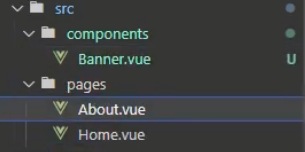


#### 5.9.3.1 不用的路由组件被销毁了


未激活的路由组件，被摧毁了。


```
验证：在组件的beforeDestroy钩子中 输出信息。可以看到未激活的路由组件被销毁了
```


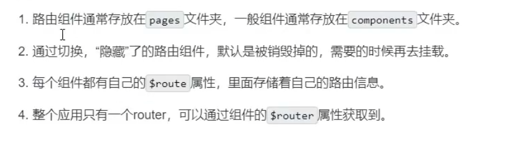


### 5.9.4 嵌套路由


```
const router = new VueRouter({
	routers:[
		{
			path:'/about',
			component:About
		},
		{
			path:'/home',
			component: Home,
			children:[
				{
					path:'news',
					components:HomeNews
				},
				{
					path:'message',
					component:HomeMessage
				}
			]
		}
	
	]
})
```


一级路由的Path必须带 '/'

在一级路由的下面，需要配置 children配置项，这是一个数组。数组内元素仍然是一个对象。

二级及一下的路由，配置Path的时候不带 '/'


#### 5.9.4.1  嵌套路由的to


```vue
<router-link to="/home/message" class="list-group-item" active-class="active">Message</router-link>

<router-link to="/home/news" class="list-group-item" active-class="active">News</router-link>
```


### 5.9.5 路由参数

给路由传递参数。


如何传递？

```
使用类似query的方式,在to属性中传递变量。以?开始,以=赋值，以$分隔多个query变量
```

#### 5.9.5.1  字符串写法

整个query参数直接以字符串的形式，写在to属性中。

```
<router-link  :to="`/home/message/detail?id=${msg.id}&content=${msg.content}`" >消息{{msg.id}}</router-link>
```


```
使用v-bind:to      绑定to属性的值,当属性内的变量发生修改，to属性的值也对应修改。

由于to的属性值中混入了字符串和变量名。使用模板字符串 ${}解析变量的值
```


#### 5.9.5.2 对象写法

当路径较长，或者传递的变量较多的时候，字符串写法比较臃肿，所以提供了一种对象写法传递query参数。


```vue
<router-link :to="{
	path:'/home/message/detail',
	query:{
    	id: msg.id,
        content:msg.content 
  	}
}">
	消息{{msg.id}}
</router-link>
```


### 5.9.6 命名路由

在路由得配置项中添加一个name. 在路由跳转得时候不必带上全部得path ，只需要指定唯一的name即可

这对那些路径特别长的 多级路由非常有帮助。

 

定义：

```
export default new VueRouter({
	routers:[
		{
			name:'guanyu',
			path:'/about',
			component:About
		}
	]
})
```


使用

```vue
<router-link :to="{name:'guanyu'}" ></router-link>
```


```vue
<router-link :to="{
	name:'guanyu',
    query:{
    	id:m.id,
        content:m.content
    }
}">
</router-link>
```


```
命名路由只能使用对象的写法
```


### 5.9.7 Params参数

这种参数对应的就是Java的 @PathVariable 路径参数。


在使用Param参数的时候，必须提前在路由中，配置占位符。

```js
				{
                    path: 'news',
                    component: HomeNews,
                    children: [{
                            name: 'newContent',
                            path: 'content/:val/:others',    //使用: 占位符
                            component: NewContent
                        }

                    ]
                }
```


#### 5.9.7.1  字符串写法


发送的时候 （router-link）

```html
<router-link :to="`/home/news/content/${item.val}/${item.others}`">歌手编号 : {{item.id}}</router-link>
```


接收的时候：

```vue
<template>
        <h5>
            {{$route.params.val}}
        </h5> 
</template>
```


打印一下 this.$route

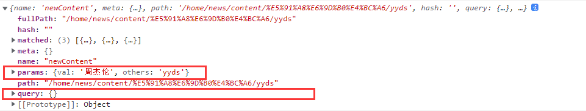


```
可以看到两个参数： query 和  params
```


#### 5.9.7.2 对象写法

对于params参数来说，必须使用 name配置项，不能使用path


```vue
                    <router-link :to="{
                        name:'newContent',
                        params:{
                            val:item.val,
                            others:item.others
                        }
                    }">
                        歌手编号 : {{item.id}}
                    </router-link>
```


### 5.9.8 路由props

用于化简 `$route.params.` `$route.query.`


在路由的定义文件中声明props定义


#### 5.9.8.1 props:true

props的值传入一个 boolean ，当boolean为true ，会将所有的params传入props  （不会传入query参数）

```
{
	name:'newContent',
	path:'content/:val/:others',
	content:NewContent,
	props:true
}
```


```vue
<template>
	<div>
        <h5>props:true</h5>
        <h5>{{val}}</h5>
        <h5>{{others}}</h5>
    </div>

</template>


<script>
export default {
    name:'NewContent',
    props:['val','others']   //必须在props中声明
}
</script>
```


#### 5.9.8.2  props 为函数

可以在props里传递query参数。

```
```


### 5.9.9 replace 属性

router-link 标签的replace属性，让新的页面替换当前页面。(没有后退选项)

```vue
<router-link replace :to="`/home/message/detail?id=${m.id}&content=${m.content}`" ></router-link>
```


### 5.9.10 编程式路由导航


#### 5.9.10.1 push/replace

有时候，我们需要使用button按钮来完成跳转页面。不是使用<a>标签。 <router-link> 最终会编译为一个<a>


不借助router-link 来完成跳转，称为编程式路由导航。本质上是借助 `this.$router`身上的API


```
this.$router.push()

this.$router.replace()

//这两个API都需要传入1个配置对象
//配置对象和router-link对象写法一致。
```


##### 示例

```js
methods:{
        pushShow(msg){
            let path = `/home/message/detail?id=${msg.id}&content=${msg.content}`
            if(this.$route.fullPath !== encodeURI(path) ) {
                this.$router.push({
                    path:'/home/message/detail',
                    query:{
                        id:msg.id,
                        content:msg.content
                    }
                })
            }
        },
        replaceShow(msg){
            this.$router.replace({
                path:'/home/message/detail',
                query:{
                    id:msg.id,
                    content:msg.content
                }
            })
        }
    }
```


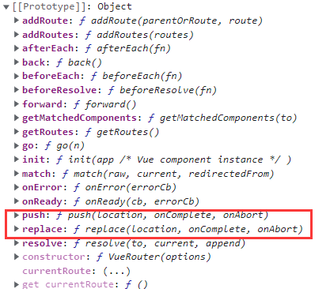


#### 5.9.10.2 back/forward


```
$router.back()    //后退
$router.forward() //前进

//没有参数
```


#### 5.9.10.3 go

```
$router.go()

//传入一个数字n。 n>0 则前进n步
//             n<0 则后退n步
```


### 5.9.11 缓存路由组件

我们知道默认的路由组件在不使用的情况下会被销毁。这意味着上一个路由组件内保存的临时内容也会丢失。

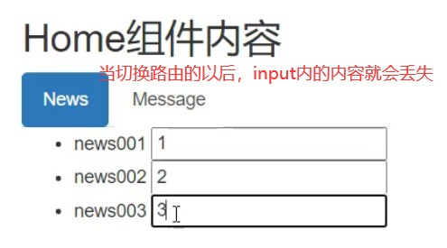


使用缓存路由组件： `<keep-alive> </keep-alive> 包住 <router-view标签`

```
<keep-alive>
	<router-view></router-view>
</keep-alive>
```


#### 5.9.11.1 include属性

keep-alive标签的include属性指明了哪些路由组件需要保存。 如果没有include属性则保存全部的路由组件。会带来不必要的性能损失


```vue
<keep-alive include="HomeNews">   <!-- 传入组件名-->
	<router-view></router-view>
</keep-alive>
```


缓存多个：

```vue
<keep-alive :include="[HomeNews,HomeMessage]">
    <router-view></router-view>
</keep-alive>
```


### 5.9.12 路由组件生命周期钩子

路由组件有2个独有的生命周期钩子：

```
activated()  //激活
deactivated() //失活
```


每次切换到当前的路由组件以后，都会调用activated方法。

当切走当前路由组件以后，都会调用 deactivated方法。


### 5.9.13 路由守卫  

在路由之前鉴定权限。无权，则不会跳转路由。


#### 5.9.13.1 全局，前置路由守卫


每次调用路由之前，beforeEach传入的函数，都会被调用。  初始化时也会调用1次	

```
router.beforeEach((to,from,next)=>{
	console.log(to)
	console.log(from)
	next()


})


//Vue router 会给这个函数传入3个参数, to from ,
//如果放行本次跳转，调用 next()函数即可。
```


所有$route中包含了 meta, 给开发者提供了一个属性，开发者可以向其中添加自定义的数据。

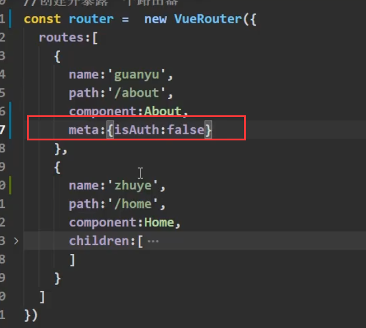


#### 5.9.13.2 全局 后置路由守卫


初始化调用1次。 每次成功路由以后，调用该方法

```
router.afterEach((to,from)=>{

})
```


#### 5.9.13.3 独享路由守卫


在routers中添加配置项：

```
{
	name:'about',
	path:'news',
	component:News,
	meta:{
		isAuth:true,
		title:'新闻'
	},
	beforeEnter:(to,from,next){
		if(from.meta.isAuth && 
			localStorage.getItem('school')=== 'abc'){
			next()
		}
	}
}
```


#### 5.9.13.4 组件内路由守卫

全局前置路由守卫，全局后置路由守卫，独享路由守卫，都是在router.index.js 中配置的。

组件内路由守卫，是在组件的.vue文件中配置的。


```
//当路由进入组件之前，调用
beforeRouteEnter(to,from,next){

}
//当路由即将离开组件时，调用
beforeRouteLeave(to,from,next){

}
```


```
如果路由器干脆没有路由到本组件，则beforeRouteEnter 和 beforeRouteLeave不会被调用
```


### 5.9.14 hash/history


```
以 /#/开始的路径，不会发送给服务器
```


在router中配置

```
mode:history
```


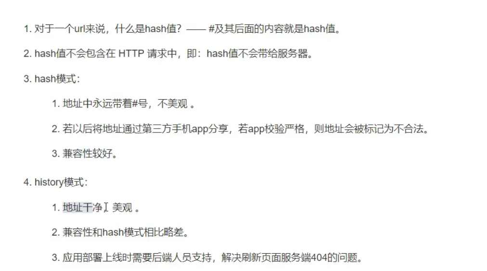


## 5.10 Element Ui


https://element.eleme.cn/#/zh-CN/component/installation


### 5.10.1  安装Element UI


#### 5.10.1.1 webpack

```
npm i element-ui -S
```


#### 5.10.1.2 引入


##### 完整引入


在 main.js 中写入以下内容：

```js
import Vue from 'vue';
import ElementUI from 'element-ui    //引入ElementUi
import 'element-ui/lib/theme-chalk/index.css';  //引入样式文件
import App from './App.vue';

Vue.use(ElementUI);  //启用ElementUI

new Vue({
  el: '#app',
  render: h => h(App)
});
```


##### 引入部分组件

如果你只希望引入部分组件，比如 Button 和 Select，那么需要在 main.js 中写入以下内容：

```js
import Vue from 'vue';
import { Button, Select } from 'element-ui';
import App from './App.vue';

Vue.component(Button.name, Button);
Vue.component(Select.name, Select);
/* 或写为
 * Vue.use(Button)
 * Vue.use(Select)
 */

new Vue({
  el: '#app',
  render: h => h(App)
});
```


##### 全局配置

在引入 Element 时，可以传入一个全局配置对象。

这个对象 用于调整 UI的默认尺寸和弹框的初始值。 


```
size 用于改变组件的默认尺寸.
zIndex 设置弹框的初始 z-index（默认值：2000）
```


```js
import Vue from 'vue';
import Element from 'element-ui';
Vue.use(Element, { size: 'small', zIndex: 3000 });
```


### 5.10.2 按钮

https://element.eleme.cn/#/zh-CN/component/button	


常规按钮

```vue
<el-row>
  <el-button :disabled="isDisable">默认按钮</el-button>    
    <!-- 禁用 disabled -->
</el-row>
```


文字按钮

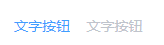

```
<el-button type="text">文字按钮</el-button>
<el-button type="text" disabled>文字按钮</el-button>
```


图标按钮

带图标的按钮可增强辨识度（有文字）或节省空间（无文字）。

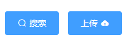

```vue
    <el-button type="primary" icon="el-icon-search">搜索</el-button>
<el-button type="primary">上传<i class="el-icon-upload el-icon--right"></i></el-button>
```


按钮组

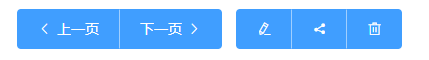

```vue
<el-button-group>
  <el-button type="primary" icon="el-icon-arrow-left">上一页</el-button>
  <el-button type="primary">下一页<i class="el-icon-arrow-right el-icon--right"></i></el-button>
</el-button-group>
```


加载中

```vue
<el-button type="primary" :loading="true">加载中</el-button>
```


#### 5.10.2.1 Attributes


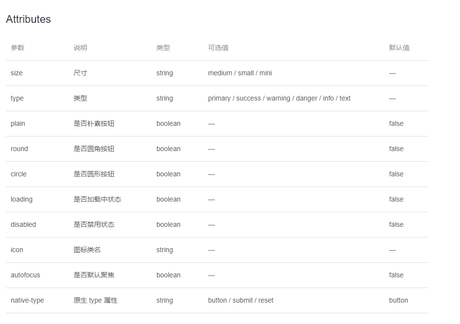


### 5.10.3  icon

https://element.eleme.cn/#/zh-CN/component/icon

```vue
<i class="el-icon-edit"></i>
<i class="el-icon-share"></i>
<i class="el-icon-delete"></i>
<el-button type="primary" icon="el-icon-search">搜索</el-button>
```


### 5.10.4 Tree 型


### 5.10.5 选择器


#### 5.10.5.1 单选

最基础的单选  选择器。 

```
带禁用的 :disabled=""
```


```vue
    <el-select v-model="selectValue" placeholder="请选择">
      <el-option
        v-for="item in selectorData"
        :key="item.dataValue"
        :label="item.dataName"
        :value="item.dataValue"
        :disabled="item.disabled">
      </el-option>
    </el-select>

<script>
    ...
    data(){
        return {
          buttonDisabled: true,
          isFollow: false,
          selectValue:'',
          selectorData:[
            {
              dataName:'Semghh',
              dataValue:'0'
            },{
              dataName:'青空',
              dataValue:'1'
            }
          ]
        }
   }
    ...
</script>
```


可清空选项。 

为`el-select`设置`clearable`属性，则可将选择器清空。需要注意的是，`clearable`属性仅适用于单选。

```vue
<el-select v-model="value" clearable placeholder="请选择">
    <el-option
      v-for="item in options"
      :key="item.value"
      :label="item.label"
      :value="item.value">
    </el-option>
  </el-select>
```


#### 5.10.5.2 多选

为`el-select`设置`multiple`属性即可启用多选，此时`v-model`的值为当前选中值所组成的数组。

默认情况下选中值会以 Tag 的形式展现，你也可以设置`collapse-tags`属性将它们合并为一段文字。


#### 5.10.5.3 自定义模板


将自定义的 HTML 模板插入`el-option`的 slot 中即可。


```vue
  <el-select v-model="value" placeholder="请选择">
    <el-option
      v-for="item in cities"
      :key="item.value"
      :label="item.label"
      :value="item.value">
      <span style="float: left">{{ item.label }}</span>
      <span style="float: right; color: #8492a6; font-size: 13px">{{ item.value }}</span>
    </el-option>
  </el-select>
```


#### 5.10.5.4 可搜索

从服务器搜索数据，输入关键字进行查找.


##### 普通的本地搜索

默认只需要为el-select 添加一个filterable属性即可。查询所有label包含输出项。


如果希望使用其他的搜索逻辑，可以通过传入一个`filter-method`来实现。`filter-method`为一个`Function`，它会在输入值发生变化时调用，参数为当前输入值。


##### 远程搜索

为了启用远程搜索，需要将`filterable`和`remote`设置为`true`，同时传入一个`remote-method`。

`remote-method`为一个`Function`，它会在输入值发生变化时调用，参数为当前输入值。

需要注意的是，如果`el-option`是通过`v-for`指令渲染出来的，此时需要为`el-option`添加`key`属性，且其值需具有唯一性，比如此例中的`item.value`。

https://element.eleme.cn/#/zh-CN/component/select#yuan-cheng-sou-suo


```vue
<template>
  <el-select
    v-model="value"
    multiple
    filterable
    remote
    reserve-keyword
    placeholder="请输入关键词"
    :remote-method="remoteMethod"
    :loading="loading">
    <el-option
      v-for="item in options"
      :key="item.value"
      :label="item.label"
      :value="item.value">
    </el-option>
  </el-select>
</template>

<script>
  export default {
    data() {
      return {
        options: [],
        value: [],
        list: [],
        loading: false,
        states: ["Alabama", "Alaska", "Arizona",
        "Arkansas", "California", "Colorado",
        "Connecticut", "Delaware", "Florida",
        "Georgia", "Hawaii", "Idaho", "Illinois",
        "Indiana", "Iowa", "Kansas", "Kentucky",
        "Louisiana", "Maine", "Maryland",
        "Massachusetts", "Michigan", "Minnesota",
        "Mississippi"]
      }
    },
    mounted() {
      this.list = this.states.map(item => {
        return { value: `value:${item}`, label: `label:${item}` };
      });
    },
    methods: {
      remoteMethod(query) {
        if (query !== '') {
          this.loading = true;
          setTimeout(() => {
            this.loading = false;
            this.options = this.list.filter(item => {
              return item.label.toLowerCase()
                .indexOf(query.toLowerCase()) > -1;
            });
          }, 200);
        } else {
          this.options = [];
        }
      }
    }
  }
</script>
```


#### 5.10.5.4 创建条目

使用`allow-create`属性即可通过在输入框中输入文字来创建新的条目。

注意此时`filterable`必须为真。


本例还使用了`default-first-option`属性，在该属性打开的情况下，按下回车就可以选中当前选项列表中的第一个选项，无需使用鼠标或键盘方向键进行定位。


```vue
<template>
  <el-select
    v-model="value"
    multiple
    filterable
    allow-create
    default-first-option
    placeholder="请选择文章标签">
    <el-option
      v-for="item in options"
      :key="item.value"
      :label="item.label"
      :value="item.value">
    </el-option>
  </el-select>
</template>

<script>
  export default {
    data() {
      return {
        options: [{
          value: 'HTML',
          label: 'HTML'
        }, {
          value: 'CSS',
          label: 'CSS'
        }, {
          value: 'JavaScript',
          label: 'JavaScript'
        }],
        value: []
      }
    }
  }
</script>
```


### 5.10.6 级联选择器

https://element.eleme.cn/#/zh-CN/component/cascader


```vue
<div class="block">
  <span class="demonstration">默认click 触发子菜单</span>
  <el-cascader
    v-model="value"
    :options="options"
    @change="handleChange"></el-cascader>
</div>
<div class="block">
  <span class="demonstration">hover 触发子菜单</span>
  <el-cascader
    v-model="value"
    :options="options"
    :props="{ expandTrigger: 'hover' }"
    @change="handleChange"></el-cascader>
    <!-- 在props中添加expandTrigger: 'hover' ,修改为hover触发  -->
</div>
<script>
  export default {
    data() {
      return {
        value: [],
        options: [{
          value: 'zhinan',
          label: '指南',
          children: [{
            value: 'shejiyuanze',
            label: '设计原则',
            children: [{
              value: 'yizhi',
              label: '一致'
            }, {
              value: 'fankui',
              label: '反馈'
            }, {
              value: 'xiaolv',
              label: '效率'
            }, {
              value: 'kekong',
              label: '可控'
            }]
          }, {
            value: 'daohang',
            label: '导航',
            children: [{
              value: 'cexiangdaohang',
              label: '侧向导航'
            }, {
              value: 'dingbudaohang',
              label: '顶部导航'
            }]
          }]
        }, {
          value: 'zujian',
          label: '组件',
          children: [{
            value: 'basic',
            label: 'Basic',
            children: [{
              value: 'layout',
              label: 'Layout 布局'
            }, {
              value: 'color',
              label: 'Color 色彩'
            }, {
              value: 'typography',
              label: 'Typography 字体'
            }, {
              value: 'icon',
              label: 'Icon 图标'
            }, {
              value: 'button',
              label: 'Button 按钮'
            }]
          }, {
            value: 'form',
            label: 'Form',
            children: [{
              value: 'radio',
              label: 'Radio 单选框'
            }, {
              value: 'checkbox',
              label: 'Checkbox 多选框'
            }, {
              value: 'input',
              label: 'Input 输入框'
            }, {
              value: 'input-number',
              label: 'InputNumber 计数器'
            }, {
              value: 'select',
              label: 'Select 选择器'
            }, {
              value: 'cascader',
              label: 'Cascader 级联选择器'
            }, {
              value: 'switch',
              label: 'Switch 开关'
            }, {
              value: 'slider',
              label: 'Slider 滑块'
            }, {
              value: 'time-picker',
              label: 'TimePicker 时间选择器'
            }, {
              value: 'date-picker',
              label: 'DatePicker 日期选择器'
            }, {
              value: 'datetime-picker',
              label: 'DateTimePicker 日期时间选择器'
            }, {
              value: 'upload',
              label: 'Upload 上传'
            }, {
              value: 'rate',
              label: 'Rate 评分'
            }, {
              value: 'form',
              label: 'Form 表单'
            }]
          }, {
            value: 'data',
            label: 'Data',
            children: [{
              value: 'table',
              label: 'Table 表格'
            }, {
              value: 'tag',
              label: 'Tag 标签'
            }, {
              value: 'progress',
              label: 'Progress 进度条'
            }, {
              value: 'tree',
              label: 'Tree 树形控件'
            }, {
              value: 'pagination',
              label: 'Pagination 分页'
            }, {
              value: 'badge',
              label: 'Badge 标记'
            }]
          }, {
            value: 'notice',
            label: 'Notice',
            children: [{
              value: 'alert',
              label: 'Alert 警告'
            }, {
              value: 'loading',
              label: 'Loading 加载'
            }, {
              value: 'message',
              label: 'Message 消息提示'
            }, {
              value: 'message-box',
              label: 'MessageBox 弹框'
            }, {
              value: 'notification',
              label: 'Notification 通知'
            }]
          }, {
            value: 'navigation',
            label: 'Navigation',
            children: [{
              value: 'menu',
              label: 'NavMenu 导航菜单'
            }, {
              value: 'tabs',
              label: 'Tabs 标签页'
            }, {
              value: 'breadcrumb',
              label: 'Breadcrumb 面包屑'
            }, {
              value: 'dropdown',
              label: 'Dropdown 下拉菜单'
            }, {
              value: 'steps',
              label: 'Steps 步骤条'
            }]
          }, {
            value: 'others',
            label: 'Others',
            children: [{
              value: 'dialog',
              label: 'Dialog 对话框'
            }, {
              value: 'tooltip',
              label: 'Tooltip 文字提示'
            }, {
              value: 'popover',
              label: 'Popover 弹出框'
            }, {
              value: 'card',
              label: 'Card 卡片'
            }, {
              value: 'carousel',
              label: 'Carousel 走马灯'
            }, {
              value: 'collapse',
              label: 'Collapse 折叠面板'
            }]
          }]
        }, {
          value: 'ziyuan',
          label: '资源',
          children: [{
            value: 'axure',
            label: 'Axure Components'
          }, {
            value: 'sketch',
            label: 'Sketch Templates'
          }, {
            value: 'jiaohu',
            label: '组件交互文档'
          }]
        }]
      };
    },
    methods: {
      handleChange(value) {
        console.log(value);
      }
    }
  };
</script>
```


#### 5.10.6.1  props配置


在 props属性中，配置多种表现形式

```vue
<div class="block">
  <span class="demonstration">多选可搜索</span>
  <el-cascader
    placeholder="试试搜索：指南"
    :options="options"
    :props="{ multiple: true }"
    filterable></el-cascader>
</div>
```


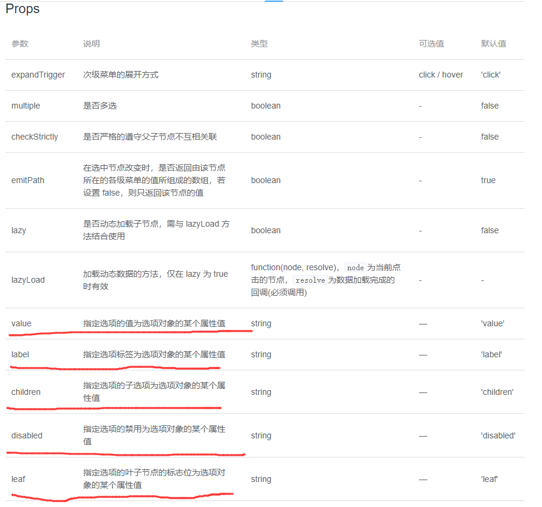


### 5.10.7 switch 开关

https://element.eleme.cn/#/zh-CN/component/switchs


### 5.10.8  Slider 滑块


https://element.eleme.cn/#/zh-CN/component/slider


### 5.10.9 Dialog 对话框

https://element.eleme.cn/#/zh-CN/component/dialog


### 5.10.10 Breadcrumb 面包屑

https://element.eleme.cn/#/zh-CN/component/breadcrumb


### 5.10.11 日期选择器

https://element.eleme.cn/#/zh-CN/component/date-picker


## 5.11 消息提示

消息提示会自动关闭。

https://element.eleme.cn/#/zh-CN/component/message


### 5.11.1 this.$message

```js
//使用 this.$message 即可完成消息提示


open1() {
	this.$message('这是一条消息提示');
},
    
open2(){
    this.$message({
        message: '恭喜你，这是一条成功消息',
        type: 'success'
	});
},

open3() {
    this.$message({
        message: '警告哦，这是一条警告消息',
        type: 'warning'
	});
},

open4() {
    this.$message.error('错了哦，这是一条错误消息');
}
```


效果


## 5.12 消息提示 MessageBox

消息盒子


# 6. axios

教程参考：

https://www.runoob.com/vue2/vuejs-ajax-axios.htmls


```
Vue.js 2.0 版本推荐使用 axios 来完成 ajax 请求。

Axios 是一个基于 Promise 的 HTTP 库，可以用在浏览器和 node.js 中。

```

Github开源地址： https://github.com/axios/axios


## 6.1 安装


**使用 cdn:**

```
<script src="https://unpkg.com/axios/dist/axios.min.js"></script>
```

或

```
<script src="https://cdn.staticfile.org/axios/0.18.0/axios.min.js"></script>
```

**使用 npm:**

```
$ npm install axios
```

**使用 bower:**

```
$ bower install axios
```

**使用 yarn:**

```
$ yarn add axios
```


## 6.2 请求配置项

下面是创建请求时可用的配置选项，`url` 是必需的。如果没有指定 `method`，请求将默认使用 get 方法。


```js
{
  
  url: "/user",  // `url` 是用于请求的服务器 URL
  method: "get", // `method` 是创建请求时使用的方法,默认是 get
  baseURL: "https://some-domain.com/api/", // `baseURL` 将自动加在 `url` 前面，除非 `url` 是一个绝对 URL。
										   // 用于设置一个 `baseURL` 便于为 axios 实例的方法传递相对 URL
			
  // `transformRequest` 允许在向服务器发送前，修改请求数据
  // 只能用在 "PUT", "POST" 和 "PATCH" 这几个请求方法
  // 后面数组中的函数必须返回一个字符串，或 ArrayBuffer，或 Stream
  transformRequest: [function (data) {
    // 对 data 进行任意转换处理

    return data;
  }],

  // `transformResponse` 在传递给 then/catch 前，允许修改响应数据
  transformResponse: [function (data) {
    // 对 data 进行任意转换处理
    return data;
  }],

  // `headers` 是即将被发送的自定义请求头
  headers: {"X-Requested-With": "XMLHttpRequest"},

  // `params` 是即将与请求一起发送的 URL 参数
  // 必须是一个无格式对象(plain object)或 URLSearchParams 对象
  params: {
    ID: 12345
  },

  // `paramsSerializer` 是一个负责 `params` 序列化的函数
  // (e.g. https://www.npmjs.com/package/qs, https://api.jquery.com/jquery.param/)
  paramsSerializer: function(params) {
    return Qs.stringify(params, {arrayFormat: "brackets"})
  },

  // `data` 是作为请求主体被发送的数据
  // 只适用于这些请求方法 "PUT", "POST", 和 "PATCH"
  // 在没有设置 `transformRequest` 时，必须是以下类型之一：
  // - string, plain object, ArrayBuffer, ArrayBufferView, URLSearchParams
  // - 浏览器专属：FormData, File, Blob
  // - Node 专属： Stream
  data: {
    firstName: "Fred"
  },

  // `timeout` 指定请求超时的毫秒数(0 表示无超时时间)
  // 如果请求花费了超过 `timeout` 的时间，请求将被中断
  timeout: 1000,

  // `withCredentials` 表示跨域请求时是否需要使用凭证
  withCredentials: false, // 默认的

  // `adapter` 允许自定义处理请求，以使测试更轻松
  // 返回一个 promise 并应用一个有效的响应 (查阅 [response docs](#response-api)).
  adapter: function (config) {
    /* ... */
  },

  // `auth` 表示应该使用 HTTP 基础验证，并提供凭据
  // 这将设置一个 `Authorization` 头，覆写掉现有的任意使用 `headers` 设置的自定义 `Authorization`头
  auth: {
    username: "janedoe",
    password: "s00pers3cret"
  },

  // `responseType` 表示服务器响应的数据类型，可以是 "arraybuffer", "blob", "document", "json", "text", "stream"
  responseType: "json", // 默认的

  // `xsrfCookieName` 是用作 xsrf token 的值的cookie的名称
  xsrfCookieName: "XSRF-TOKEN", // default

  // `xsrfHeaderName` 是承载 xsrf token 的值的 HTTP 头的名称
  xsrfHeaderName: "X-XSRF-TOKEN", // 默认的

  // `onUploadProgress` 允许为上传处理进度事件
  onUploadProgress: function (progressEvent) {
    // 对原生进度事件的处理
  },

  // `onDownloadProgress` 允许为下载处理进度事件
  onDownloadProgress: function (progressEvent) {
    // 对原生进度事件的处理
  },

  // `maxContentLength` 定义允许的响应内容的最大尺寸
  maxContentLength: 2000,

  // `validateStatus` 定义对于给定的HTTP 响应状态码是 resolve 或 reject  promise 。如果 `validateStatus` 返回 `true` (或者设置为 `null` 或 `undefined`)，promise 将被 resolve; 否则，promise 将被 rejecte
  validateStatus: function (status) {
    return status &gt;= 200 &amp;&amp; status &lt; 300; // 默认的
  },

  // `maxRedirects` 定义在 node.js 中 follow 的最大重定向数目
  // 如果设置为0，将不会 follow 任何重定向
  maxRedirects: 5, // 默认的

  // `httpAgent` 和 `httpsAgent` 分别在 node.js 中用于定义在执行 http 和 https 时使用的自定义代理。允许像这样配置选项：
  // `keepAlive` 默认没有启用
  httpAgent: new http.Agent({ keepAlive: true }),
  httpsAgent: new https.Agent({ keepAlive: true }),

  // "proxy" 定义代理服务器的主机名称和端口
  // `auth` 表示 HTTP 基础验证应当用于连接代理，并提供凭据
  // 这将会设置一个 `Proxy-Authorization` 头，覆写掉已有的通过使用 `header` 设置的自定义 `Proxy-Authorization` 头。
  proxy: {
    host: "127.0.0.1",
    port: 9000,
    auth: : {
      username: "mikeymike",
      password: "rapunz3l"
    }
  },

  // `cancelToken` 指定用于取消请求的 cancel token
  // （查看后面的 Cancellation 这节了解更多）
  cancelToken: new CancelToken(function (cancel) {
  })
}
```


