# 1、Java并行基础

https://www.cnblogs.com/dolphin0520/p/3920373.html

## 1.1、原子性、可见性、有序性


### 1.1.1原子性：

​			指事务的不可分割性，一个事务的所有操作要么不间断地全部被执行，要么一个也没有执行。


在Java中，对基本数据类型的变量的读取和赋值操作是原子性操作，即这些操作是不可被中断的，要么执行，要么不执行。

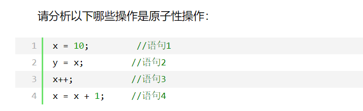


咋一看，有些朋友可能会说上面的4个语句中的操作都是原子性操作。其实只有语句1是原子性操作，其他三个语句都不是原子性操作。

　　语句1是直接将数值10赋值给x，也就是说线程执行这个语句的会直接将数值10写入到工作内存中。

　　语句2实际上包含2个操作，它先要去读取x的值，再将x的值写入工作内存，虽然读取x的值以及 将x的值写入工作内存 这2个操作都是原子性操作，但是合起来就不是原子性操作了。

　　同样的，x++和 x = x+1包括3个操作：读取x的值，进行加1操作，写入新的值。

 　所以上面4个语句只有语句1的操作具备原子性。

　　也就是说，只有简单的读取、赋值（而且必须是将数字赋值给某个变量，变量之间的相互赋值不是原子操作）才是原子操作。


### 1.1.2可见性：

​			可见性是指当多个线程访问同一个变量时，一个线程修改了这个变量的值，其他线程能够立即看得到修改的值。

对于可见性，Java提供了volatile关键字来保证可见性。

synchronized和Lock也能够保证可见性，在释放锁之前会将对变量的修改刷新到主存当中。因此可以保证可见性。


### 1.1.3 有序性：

​			即程序执行的顺序按照代码的先后顺序执行。

在Java内存模型中，允许编译器和处理器对指令进行重排序，但是重排序过程不会影响到单线程程序的执行，却会影响到多线程并发执行的正确性。

另外，Java内存模型具备一些先天的“有序性”，即不需要通过任何手段就能够得到保证的有序性，这个通常也称为 happens-before 原则。如果两个操作的执行次序无法从happens-before原则推导出来，那么它们就不能保证它们的有序性，虚拟机可以随意地对它们进行重排序。

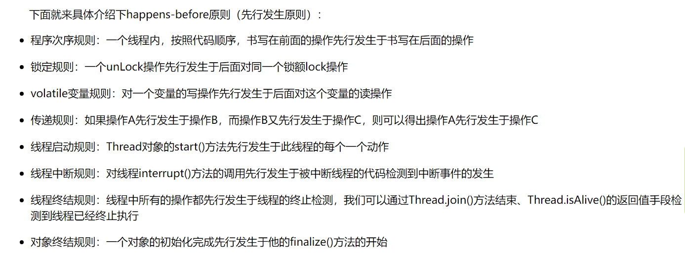


引入一个例子。

```java
public class test {
    public static volatile int v1 = 0;
    public static int v2 = 0;
    public static int v3 = 0;
    public static volatile int v4 = 0;
    public static AtomicInteger v5 = new AtomicInteger(0);

    public static void process() {
        try {
            Thread.sleep(30);
        } catch (InterruptedException e) {
            e.printStackTrace();
        }
        v1++;
        v2++;
        v5.getAndIncrement();
        synchronized (test.class) {
            v3++;
            v4++;

        }
    }
    public static void main(String[] args) {
        Thread[] t = new Thread[10000];
        for (int i = 0; i < 10000; i++) {
            t[i] = new Thread(() -> {
                process();
            });
            t[i].start();
        }
        for (int i = 0;i<10000;i++){
            try {
                t[i].join();
            } catch (InterruptedException e) {
                e.printStackTrace();
            }

        }
        System.out.println("v1的值" + v1);
        System.out.println("v2的值" + v2);
        System.out.println("v3的值" + v3);
        System.out.println("v4的值" + v4);
        System.out.println("v5的值" + v5);
    }
}
```

运行结果如下：

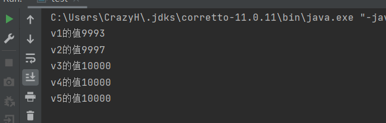


v123都在 锁外。其中v3 AtomicInteger 保证了原子性，是线程安全的。正确输出10000。

v1被volatile 修饰了，仅保持了可见性。但仍不具有原子性，所以并非是所有情况下线程安全的。

```
volatile 仅保证了在线程获取值的时候，是最新值。
如果两个线程同时从内存中获取最新值n，此时没有任何其他线程刷新n。
当这两个线程取到最新值n后，不会再检查这个值是否保持最新。
当这两个线程执行完毕后，n+1 就会被刷新两次。无法保证线程安全
```

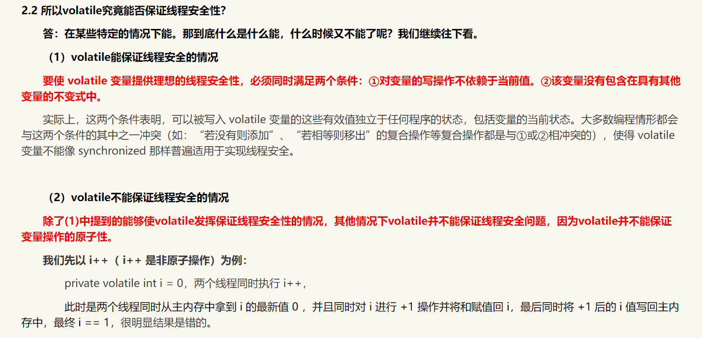


### 1.1.4指令重排：

处理器会进行 指令重排：

只保证执行代码的结果和重排前一致。 依据数据依赖性,若没有数据依赖，则可能会发生重排现象。

指令重排不会影响单线程，但会影响多线程。

## 1.2、Java内存模型（Java Memory Model，JMM）

在Java虚拟机规范中试图定义一种Java内存模型（Java Memory Model，JMM）来屏蔽各个硬件平台和操作系统的内存访问差异，以实现让Java程序在各种平台下都能达到一致的内存访问效果。那么Java内存模型规定了哪些东西呢，它定义了程序中变量的访问规则，往大一点说是定义了程序执行的次序。注意，为了获得较好的执行性能，Java内存模型并没有限制执行引擎使用处理器的寄存器或者高速缓存来提升指令执行速度，也没有限制编译器对指令进行重排序。也就是说，在java内存模型中，也会存在缓存一致性问题和指令重排序的问题。

### 1.2.1缓存一致性：

对于多核cpu来说，每一个核都有自己的高速缓存，如果两颗或以上的核使用了共同资源，并修改其值。新数据在写回主存前，其他核就会使用旧的数据。出现缓存一致性问题。


### 1.2.2解决缓存一致性

1）通过在总线加LOCK#锁的方式

　　2）通过缓存一致性协议

　　这2种方式都是硬件层面上提供的方式。

　　在早期的CPU当中，是通过在总线上加LOCK#锁的形式来解决缓存不一致的问题。因为CPU和其他部件进行通信都是通过总线来进行的，如果对总线加LOCK#锁的话，也就是说阻塞了其他CPU对其他部件访问（如内存），从而使得只能有一个CPU能使用这个变量的内存。比如上面例子中 如果一个线程在执行 i = i +1，如果在执行这段代码的过程中，在总线上发出了LCOK#锁的信号，那么只有等待这段代码完全执行完毕之后，其他CPU才能从变量i所在的内存读取变量，然后进行相应的操作。这样就解决了缓存不一致的问题。

　　但是上面的方式会有一个问题，由于在锁住总线期间，其他CPU无法访问内存，导致效率低下。

　　所以就出现了缓存一致性协议。最出名的就是Intel 的MESI协议，MESI协议保证了每个缓存中使用的共享变量的副本是一致的。它核心的思想是：当CPU写数据时，如果发现操作的变量是共享变量，即在其他CPU中也存在该变量的副本，会发出信号通知其他CPU将该变量的缓存行置为无效状态，因此当其他CPU需要读取这个变量时，发现自己缓存中缓存该变量的缓存行是无效的，那么它就会从内存重新读取。

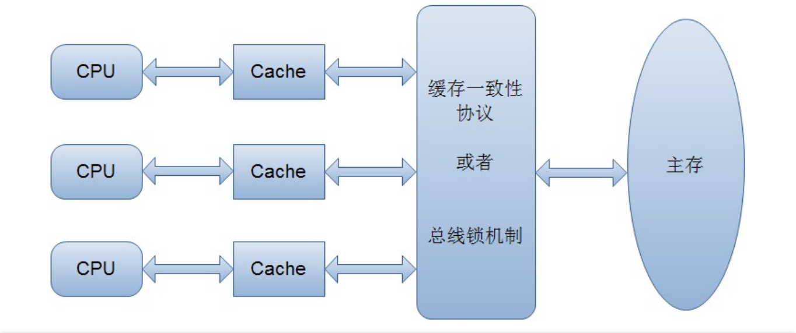


Java内存模型规定所有的变量都是存在主存当中（类似于前面说的物理内存），每个线程都有自己的工作内存（类似于前面的高速缓存）。线程对变量的所有操作都必须在工作内存中进行，而不能直接对主存进行操作。并且每个线程不能访问其他线程的工作内存。

　举个简单的例子：在java中，执行下面这个语句：

```java
i = 10;
```

 　执行线程必须先在自己的工作线程中对变量i所在的缓存行进行赋值操作，然后再写入主存当中。而不是直接将数值10写入主存当中。

　　那么Java语言 本身对 原子性、可见性以及有序性提供了哪些保证呢？

3、wait() 释放锁，sleep()不释放锁

```java
public class MyTest {
    
    final static Object o = new Object();

    private static class myThread extends Thread {
        @Override
        public void run() {
            synchronized (o) {
                System.out.println("t1 starting");
                try {
                    System.out.println("t1.wait();   t1 waiting for o");
                    o.wait();
                } catch (InterruptedException e) {
                    e.printStackTrace();
                }
                System.out.println("t1 ending");
                o.notifyAll();
            }
        }
    }

    private static class myThread1 extends Thread {
        @Override
        public void run() {
            synchronized (o) {
                System.out.println("t2 starting  notify other thread");
                o.notifyAll();
                try {
                    System.out.println("t2.wait() t2 waiting for o ");
                    o.wait();
                } catch (InterruptedException e) {
                    e.printStackTrace();
                }
                System.out.println("t2 ending");
            }
        }
    }

    public static void main(String[] args) {
        多线程.多线程_7_wait_notify.MyTest.myThread t1 = new 多线程.多线程_7_wait_notify.MyTest.myThread();
        多线程.多线程_7_wait_notify.MyTest.myThread1 t2 = new 多线程.多线程_7_wait_notify.MyTest.myThread1();
        t1.start();
        t2.start();
    }
}
```

## 1.2、 join()  yield()

```javascript
t1.join()  等待t1线程执行完毕
t1.join(long time)  最多等待t1线程 long毫秒

Thread.yield()  通知选择器,主动释放cpu使用权
```


```java
public class synchornizedTest {

    private static int  i = 0;
    public static void main(String[] args) {
        Object o = new Object();
        Thread t1 = new Thread(()->{
            for (int j = 0; j < 10000; j++) {

                synchronized (o){
                    i++;
                }
            }
            System.out.println("t1 done!");
        },"increment");

        Thread t2  = new Thread(()->{
            for (int j = 0; j < 10000; j++) {
                synchronized (o){
                    i--;
                }
            }
            System.out.println("t2 done!");
        },"decrement");

        t1.start();
        t2.start();
        try {
            t1.join(); //等待t1运行结束
            t2.join(); //等待t2运行结束
        } catch (InterruptedException e) {
            e.printStackTrace();
        }

        System.out.println(i);//输出最后i的结果
    }
}
```

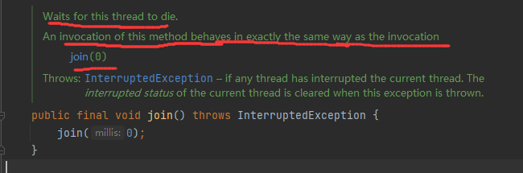


## 1.3、ThreadGroup线程组

```java
ThreadGroup tg = new ThreadGroup(String groupName);  
Thread t1 = new Thread(ThreadGroup threadGroup ,String threadNamge);  //申请线程并注册在指定线程组中
//Thread有很多构造方法
```

## 1.4、守护线程 Daemon


```java
t1.setDaemon(Boolean flag);//   setDaemon(true)
t1.start();
//应在start()前 设置守护线程/后台线程  否则会抛出异常。
```

守护线程 理解为后台线程。前台程序执行完毕，不管后台程序运行情况，直接结束线程


引入例子：


```java
public class test {
    public static void main(String[] args) {

        Thread t = new Thread(()->{

            while (true){
                System.out.println("running");
                try {
                    Thread.sleep(1000);
                } catch (InterruptedException e) {
                    e.printStackTrace();
                }
            }
        });
        t.setDaemon(false);//默认是false 即非守护线程
        t.start();
        System.out.println("main 线程结束...");
    }
}
```

输出结果：

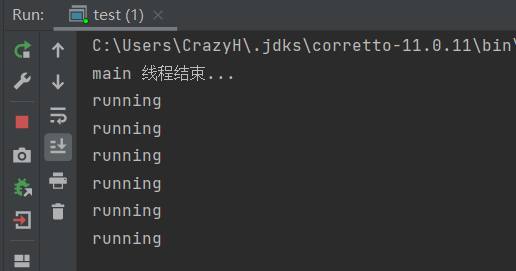


将t设置为 守护线程

```java
public class test {
    public static void main(String[] args) throws InterruptedException {

        Thread t = new Thread(()->{

            while (true){
                System.out.println("running");
                try {
                    Thread.sleep(1000);
                } catch (InterruptedException e) {
                    e.printStackTrace();
                }
            }
        });
        t.setDaemon(true);//默认是false 即非守护线程
        t.start();
        Thread.sleep(5000);
        System.out.println("main 线程结束...");
        
    }
}
```

当main方法执行完毕，线程结束

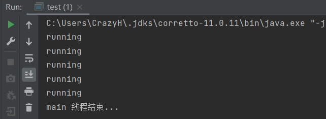


## 1.5、设置优先级

```java
t1.setPriority(int level);  // 1-10
```

## 1.6、使用Vector 和ConcurrentHashMap

使用线程安全的Vector 代替ArrayList

使用线程安全的ConcurrentHashMap 代替 HashMap

## 1.7  synchronized 锁


### 1.7.1 概括

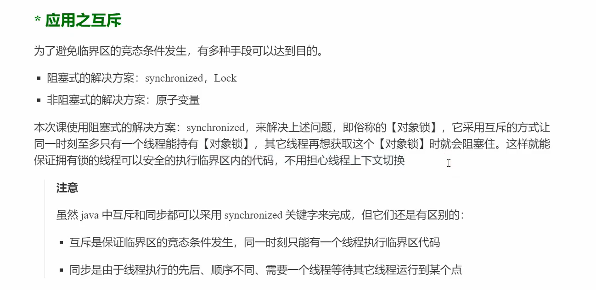


### 1.7.2 语法

```
synchronized(对象){
	
	//临界区
}
```


来个例子:

前面引入了缓存一致性问题。下面来模拟一下，并解决

```java
public class learningSynchronized {

    static Integer num = 0;

    public static void main(String[] args) throws InterruptedException {
        Thread t1 = new Thread(() -> {
            for (int i = 0; i < 10000; i++)
                num++;
        });
        Thread t2 = new Thread(() -> {
            for (int i = 0; i < 10000; i++) {
                num--;
            }
        });
        t1.start();
        t2.start();
        t1.join();
        t2.join();

        System.out.println("最终num的值是 :  " + num);
    }
}
```

不能保证原子性：最终的结果不是0

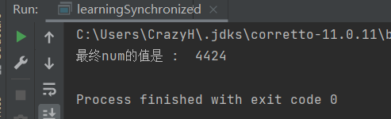


下面对learningSynchronized类加 synchronized 对象锁

```java
public class learningSynchronized {

    static Integer num = 0;

    public static void main(String[] args) throws InterruptedException {
        Thread t1 = new Thread(() -> {
            for (int i = 0; i < 10000; i++)
                synchronized (learningSynchronized.class) {
                    num++;
                }

        });
        Thread t2 = new Thread(() -> {
            for (int i = 0; i < 10000; i++)
                synchronized (learningSynchronized.class) {
                    num--;
                }
        });
        t1.start();
        t2.start();
        t1.join();
        t2.join();
        System.out.println("最终num的值是 :  " + num);
    }
}
```

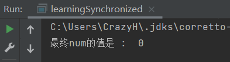

最终的结果总是0

### 1.7.3  cpu时间片用完了情况下

在一个线程获得了 名为lock的对象锁，即使cpu时间片用完了，也不会释放lock对象。直到synchronized代码块中的程序全部执行完毕，才会释放锁。

由此，在不连续的时间片内保证了 synchronized内的原子性。

### 1.7.4 思考

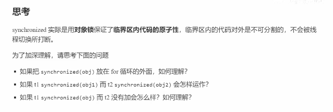


```
1.将变成同步代码。整个for全部执行完毕后，释放锁
2.没有对同一个对象使用锁，相当于对t1,t2没有加任何锁。不存在锁竞争问题
3.看下面的例子：
```

```java
public class test1 {
    static ArrayList<Integer> list = new ArrayList<>();
    public static void main(String[] args) throws InterruptedException {
        list.add(1);

        Thread t = new Thread(()->{
            System.out.println("t is running");
            synchronized (list){
                while (true){
                }
            }
        });
        t.start();
        Thread.sleep(1000);
        synchronized (list){
            Integer integer = list.get(0);
            System.out.println(integer);
        }
    }
}
```

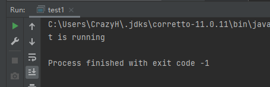

当t线程不释放list的锁时，无法访问到list对象。

现在修改代码：去掉 sync块

```java
        Integer integer = list.get(0);
        System.out.println(integer);
```

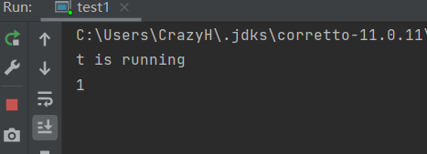


程序一直运行，说明没有释放list锁。但是仍然访问到了list对象。也就是说，只有加了sync修饰的代码块，才回去检查是否获得了这个对象锁----请求获得这个对象锁----竞争这个锁

否则直接正常访问这个对象。


### 1.7.5 一个有意思的类

```java
public class MyInteger {
    private Integer data = 0;


    public Integer increment(){
        synchronized (this){
            data++;
            return data;
        }
    }

    public Integer decrement(){
        synchronized (this){
            data--;
            return data;
        }
    }

    public Integer getValue(){
        synchronized (this){
            return data;
        }
    }


    public static void main(String[] args) throws InterruptedException {
        MyInteger myInteger = new MyInteger();

        Thread t1 = new Thread(()->{
            for (int i = 0;i<10000;i++){
                myInteger.increment();
            }
        });

        Thread t2 = new Thread(()->{
            for (int i = 0;i<10000;i++){
                myInteger.decrement();
            }
        });

        t1.start();
        t2.start();
        t1.join();
        t2.join();

        System.out.println("最后的结果 : "+myInteger.getValue());
    }
}
```

这个类的各种操作，都是原子操作。使用synchronized 锁住了this对象。

使用这个类的实例

```java
    public static void main(String[] args) throws InterruptedException {
        MyInteger myInteger = new MyInteger();
        
        Thread t1 = new Thread(()->{
            for (int i = 0;i<10000;i++){
                myInteger.increment();
            }
        });

        Thread t2 = new Thread(()->{
            for (int i = 0;i<10000;i++){
                myInteger.decrement();
            }
        });

        t1.start();
        t2.start();
        t1.join();
        t2.join();

        System.out.println("最后的结果 : "+myInteger.getValue());
    }
```

所有操作，都是原子操作。所以，最后的结果总是0

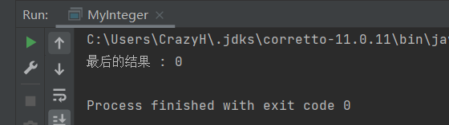


```
这个类的思想就是，把需要同步的原子操作，写在一个类里。
这个类的所有方法，都单独的是一个原子操作。
在操作比较简单的情况下，不必对整个Thread.run方法的粒度下加锁。而是将粒度减小到了类方法中。
同时还屏蔽了synchronized同步细节。
```


### 1.7.6 加在方法上的  synchornized

#### 1.7.6.1 加在成员方法上

等价于加在这个实例对象身上。

```java
    public synchronized Integer increment(){
            data++;
            return data;
        
    }
```

等价于

```java
    public Integer increment(){
        synchronized (this){
            data++;
            return data;
        }
    }
```


#### 1.7.6.2 加在静态方法上

等价于加在这个 类.class

```java
public class MyInteger {

    public static synchronized void say(){
        System.out.println("Hello world");
    }        
}

```

等价于

```java
public static  void say(){
    synchronized (MyInteger.class){
        System.out.println("Hello world");
    }
}
```


#### 1.7.6.3 引入一个例子


```java
public class MyInteger {

    private Integer data = 0;

    public Integer increment(){
        synchronized (this){
            data++;
            return data;
        }
    }
    
    public static  void say(){
        synchronized (MyInteger.class){
            System.out.println("Hello world");
        }
    }
}
```

主函数中这样调用

```java
public static void main(String[] args) throws InterruptedException {

        MyInteger myInteger = new MyInteger();

        Thread t1 = new Thread(()->{
            System.out.println(System.currentTimeMillis());
            myInteger.increment();
            try {
                Thread.sleep(10000);
            } catch (InterruptedException e) {
                e.printStackTrace();
            }
        });
        Thread t2 = new Thread(()->{
            System.out.println(System.currentTimeMillis());
            MyInteger.say();
            try {
                Thread.sleep(10000);
            } catch (InterruptedException e) {
                e.printStackTrace();
            }
        });

        t1.start();
        t2.start();
    }
```

t1 使用了 this对象锁。 t2使用了 .class对象锁。这两个有互斥关系吗？输出一下两个方法的执行前时间。

并在后面尝试休眠10秒。如果存在互斥关系，无论哪个线程先拿到了锁，都将导致另一个线程的执行时间不一致

结果是：并行执行，不会存在锁竞争问题

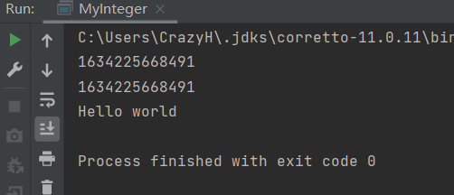


#### 1.7.6.4 再引例子

.class类对象是由jvm维护的唯一的对象。

```java
public class MyInteger {
    public static void say() throws InterruptedException {
        synchronized (MyInteger.class){
            System.out.println("Hello world");
            while (true){
                Thread.sleep(1000);
            }
        }
    }
    public static synchronized void breath() throws InterruptedException {
        System.out.println("heartbeat...");
        while (true){
            Thread.sleep(1000);
        }
    }
｝
```

两个方法都尝试无限睡1秒。如果是同步执行，那么另外一个方法应当永远得不到锁。

如下调用


```java
        Thread t1 = new Thread(()->{
            try {
                MyInteger.say();
            } catch (InterruptedException e) {
                e.printStackTrace();
            }
        });

        Thread t2 = new Thread(()->{
            try {
                MyInteger.breath();
            } catch (InterruptedException e) {
                e.printStackTrace();
            }

        });

        t1.start();
        t2.start();
```

t1 ,t2使用的方法，都是对静态方法加synchronized锁。锁住的都是同一个.class类对象。

看来是t1先运行了，t2永远无法获得.class对象锁

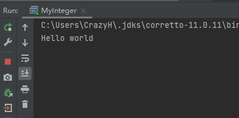


## 1.8 线程安全

### 1.8.1什么是线程安全

线程安全是多线程编程时的计算机程序代码中的一个概念。在拥有共享数据的多条线程并行执行的程序中，线程安全的代码会通过同步机制保证各个线程都可以正常且正确的执行，不会出现数据污染等意外情况。

### 1.8.2 线程安全分析


局部变量：如果是基本数据类型，是属于这个方法自己的，就是线程安全的。
如果引用的是堆中的变量，那么不是现场安全


### 1.8.3常见的线程安全类


String 

Integer

StringBuffer

Vector

Hashtable

java.util.concurrent 包下的类


```
这里的线程安全是指。
这些类下的 每个单独方法内部，是线程安全的。（执行一次方法，是安全的）

当这些方法组合在一起，粒度变大，仍不能保证线程安全
```


### 1.8.4 不可变类 是线程安全的


不可变类，内部状态根本没有改变。String内的replace 和substring的方法，最终都是new一个新的

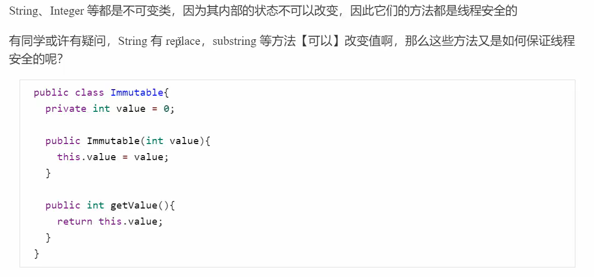


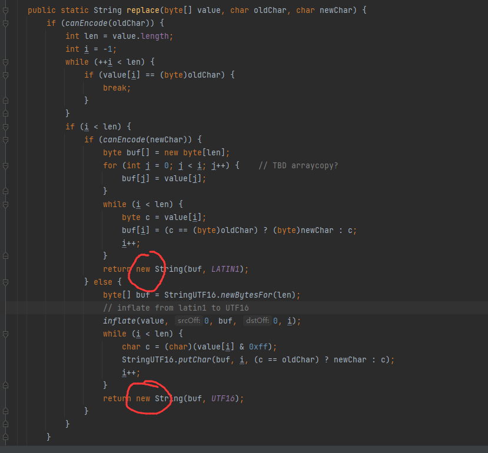


### 1.8.5 final 关键字

final 可以用来修饰  类  、方法 、变量

参考 https://www.cnblogs.com/dolphin0520/p/3736238.html

#### 1.8.5.1 修饰类


当用final修饰一个类时，表明这个类不能被继承。也就是说，如果一个类你永远不会让他被继承，就可以用final进行修饰。final类中的成员变量可以根据需要设为final。


final类中的所有 `成员方法` 都会被隐式地指定为 `final方法。`


在使用final修饰类的时候，要注意谨慎选择，除非这个类真的在以后不会用来继承或者出于安全的考虑，尽量不要将类设计为final类。


#### 1.8.5.2 修饰方法

 final 关键字 把方法锁定，以防任何继承类修改它的含义；


```
因此，如果只有在想明确禁止 该方法在子类中被覆盖的情况下才将方法设置为final的。
```


#### 1.8.5.3 修饰变量


对于一个final变量，如果是基本数据类型的变量，则其数值一旦在初始化之后便不能更改；如果是引用类型的变量，则在对其初始化之后便不能再让其指向另一个对象。


```java
public class testFinal {
    
    @Data
    @AllArgsConstructor
    static class Person{
        private String name;
        private Integer age;
    }
    
    
    public static void main(String[] args) {
        final Person p = new Person("水星",22);
        System.out.println(p.toString());
        p.setAge(21);
        System.out.println(p.toString());
        
//        p = new Person("青空",25);
    }
}
```

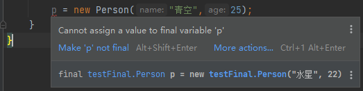


即： 基本数据类型被fianl修饰后是线程安全的。但 引用对象仅仅是不能修改引用目标，被引用对象的内部状态（属性）仍然可以改变。所以final修饰引用变量不是线程安全的！

```
```


# 2、JDK并发包

### 1、ReentrantLock  类   

##### 1、 可重入锁：同一个线程可以多次获得已经得到的同一把锁。‘’

##### 2、TimeUnit 类，封装了一些时间粒度常量。如秒，毫秒，微妙，纳秒

### 2、ReentrantLock  的部分方法

```java
ReentrantLock(); //no prama构造方法  default nofair
ReentrantLock(boolean fair); // 是否获得公平锁
void lock() ;  //获得锁
void unlock();  //释放锁
void lockInterruptibly();    //以可中断的方式申请一把锁  调用 Thread类的 interrupt 方法可尝试中断，释放锁
boolean isHeldByCurrentThread();  //查询此锁是否由当前线程持有。 
boolean tryLock(long timeout, TimeUnit unit);//在给定的等待时间内，如果锁没有被另一个线程占用，并且当前线程尚未被 保留，则获取该锁（ interrupted） 
boolean tryLock(); // no prama  如果锁被占用，不做等待立即返回。
```

```java
//一些简单代码。
ReentrantLock rLock = new ReentrantLock();
...
rLock.lock();
try{
    ...//do someting
}finally {
    rLock.unlock();//解锁
}
//可以灵活控制 加锁时机和解锁时机
```

### 3、Condition 类

配合重入锁使用，提供 await() 使线程等待，并释放锁。 singal() singalAll()唤醒线程

### 4、Condition类 的部分方法

```java
void await(); //等待,响应中断 
boolean await(long time, TimeUnit unit) ; //在给定的最大时间内，等待,响应中断
void awaitUninterruptibly(); // 等待，不响应中断
```


## 2.5 一些方法


| modify and type | method             | expression                                                   |
| --------------- | ------------------ | ------------------------------------------------------------ |
|                 | start()            | 开启一个线程。并自动执行run()方法<br />每个线程对象只能执行1次start()方法。否则会抛出<br />IllegalThreadStateException |
|                 | join()             | 等待线程运行结束。（用于线程之间通信）                       |
|                 | join(long millis)  | 等待线程结束，最多等待millis秒                               |
| String          | getName()          | 获得线程名称                                                 |
|                 | setName()          | 设置线程名称                                                 |
| int             | getPriority()      | 获得线程的优先级                                             |
|                 | setPriority(int i) | 设置线程优先级 <br />1-10的整数<br />优先级越高，越容易获得cpu |
|                 | getState()         | 获得当前线程的状态<br />NEW<br />RUNNABLE<br />BLOCKED<br />WAITING<br />TIMED_WAITING<br />TERMINATED |
| boolean         | isInterrupted      | 判断线程是否被打断                                           |
| boolean         | isAlive()          | 是否存活（是否运行完毕）                                     |
| static void     | sleep(Long millis) | 让线程休眠。不会释放锁                                       |
| static void     | yield()            | 让当前线程释放cpu，转而进入就绪态                            |


### 2.5.1  sleep 和 yield 


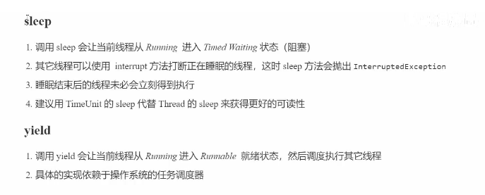

Thread.sleep（）。并不会让线程释放已经获得的锁。


### 2.5.2 interrupted


当线程被打断时，会抛出  java.lang.InterruptedException: sleep interrupted 异常。


打断处于 wait sleep join的线程，isInterrupted标记仍然是false。

打断正常运行的线程，isInterrupted标记变为true。interrupted()正常运行的程序，并不会让线程真正停下来


先测试打断处于sleep状态的线程：

```java
    public static void main(String[] args) throws InterruptedException {

        Thread t1 = new Thread(()->{

            try {
                System.out.println("t1 线程尝试sleep 10秒");
                Thread.sleep(10000);
                System.out.println("t1 线程休眠结束");
            } catch (InterruptedException e) {
                e.printStackTrace();
            }

        });
        t1.start();
        Thread.sleep(10);

        t1.interrupt();
        System.out.println("t1.isInterrupted : "+t1.isInterrupted());

    }
```

查看输出结果

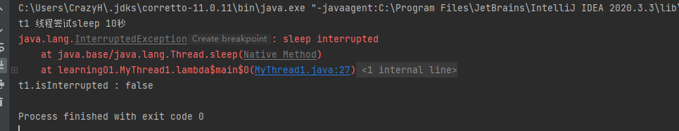

看到，被打断线程后续的语句不能正常执行。同时 打断标记为false。


再来测试打断正在运行的程序：


```java
        public static void main(String[] args) throws InterruptedException {


        Thread t1 = new Thread(()->{
            Thread myself = Thread.currentThread();
            while (!myself.isInterrupted()){ //如果自己的打断状态是false，那么就一直运行
                System.out.println("t1 is running");
            }
        });

        t1.start();//启动t1线程
        Thread.sleep(1); //main线程尝试休眠1ms。把cpu交给t1线程
        t1.interrupt(); //休眠1ms后打断t1线程
        System.out.println("isInterrupted : " + t1.isInterrupted());//输出被打断后的 打断标记


    }
```

观察输出结果1：

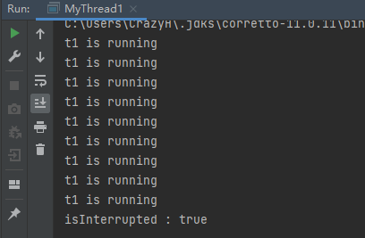

结果2：

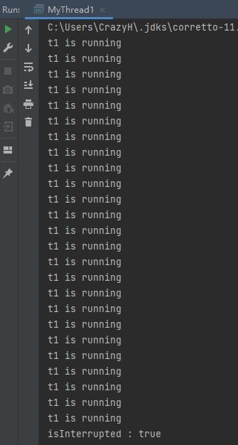

t1程序执行次数不同，是因为cpu调度程序没有立刻把cpu给main线程。


```
interrupted()正常运行的程序，并不会让线程真正停下来
```


测试：

```java
        public static void main(String[] args) throws InterruptedException {
            
        Thread t1 = new Thread(()->{
            Integer n = 0;
            while (true){
                n++;
                if (n%1000000==0){ //每运行1000000次，输出一句话
                    System.out.println("hello world");
                    n=0;
                }
            }
        });

        t1.start();
        Thread.sleep(1);
        t1.interrupt();
        System.out.println("isInterrupted : " + t1.isInterrupted());


    }
```

运行结果：

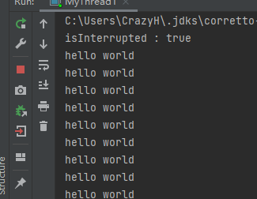

看到，isInterrupted 打断标记显示，该线程已经被打断。但线程不会结束，仍在运行。

所以应当这样使用循环

```java
while (true){ 
    ...
    if(isInterrupted()){
        ...
        break;
    }
}
```

#### 2.5.2.1 两阶段终止模式

TwoPhaseTermination

https://blog.csdn.net/crazyzxljing0621/article/details/56669649

在一个线程T1中优雅的终止线程T2。让T2 有料理后事的机会。


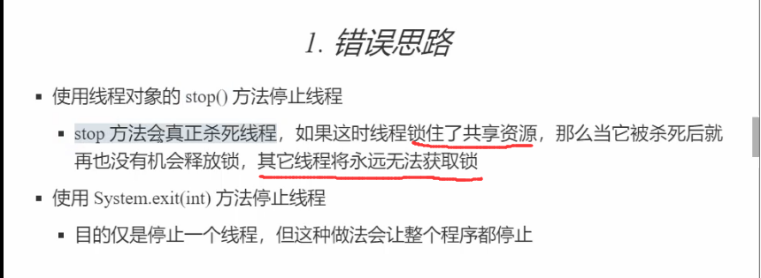


target类，对业务代码run()包装了 close()方法，shutdown（）方法

善后方法 afterClose() 放在finnally代码块中执行，保证最终一定会执行善后工作。

```java
public class target implements Runnable {

    private static volatile boolean closedFlag = false;

    public void close() {
        target.closedFlag = true;
    }

    public void shutdown() {
        target.closedFlag = true;
        Thread.currentThread().interrupt();
    }


    //run中就是被托管线程的业务代码
    @Override
    public void run() {
        try {
            while (!closedFlag) {
                
                System.out.println("执行业务代码...");

                Thread.sleep(1);

            }
        } catch (InterruptedException e) {
        }finally {
            afterClosed();
        }


    }

    private void afterClosed(){
        try {
            Thread.sleep(1000);
            System.out.println("这是善后工作...");
            Thread.sleep(1000);
            System.out.println("整理仪表...");
            Thread.sleep(1000);
            System.out.println("整理仪容...");
            Thread.sleep(1000);
            System.out.println("入土...");
            Thread.sleep(1000);
            System.out.println("GG!");

        } catch (InterruptedException e) {
            e.printStackTrace();
        }
        System.out.println();
    }
}
```


```java
public class TwoPhaseTermination {
    public static void main(String[] args) {

        target moniter = new target();
        Thread t1 = new Thread(moniter);
        t1.start();
        try {
            Thread.sleep(5);
            moniter.close();
        } catch (InterruptedException e) {
            e.printStackTrace();
        }

    }
}
```


参考：

https://blog.csdn.net/crazyzxljing0621/article/details/56669649


### 2.5.3 run() 和 start() 区别

## 2.6 run 和 start的区别


https://www.cnblogs.com/aspirant/p/8879628.html

一个线程真正执行的是run方法体。

1） start：
　　用start方法来启动线程，真正实现了多线程运行。这时无需等待run方法体代码执行完而直接继续执行下面的代码。

2） run：
　　run()方法只是类的一个普通方法而已，如果直接调用Run方法，程序中依然只有主线程这一个线程，其程序执行路径还是只有一条，还是要顺序执行。

把需要并行处理的代码放在run()方法中，start()方法启动线程将自动调用 run()方法，这是由jvm的内存机制规定的。并且run()方法必须是public访问权限，返回值类型为void。


## 2.7 练习题

### 2.7.1 经典卖票问题


( 自己写的程序，一家之言)

需要注意的是，执行结果。和模拟随机等待的时间关系巨大。

```java
public class ticket {

    //票数
    static int ticketNumber = 50;
    //模拟一个随机时间
    static Random random = new Random(System.currentTimeMillis());
    //输出日志
    static Log log = LogFactory.getLog("main");

    public static void main(String[] args) throws InterruptedException {

        int ThreadNumber = 1;//线程数量
        Object lock = new Object(); //卖票锁
        Object waitLock = new Object(); //线程等待锁，用于模拟随机时间内用户的点击   线程之间的通信锁

        buyerClick buyerClick = new buyerClick(waitLock);//创建了用户点击线程
        buyerClick.setDaemon(true);//将这个线程设置为守护线程，票空了，跳出循环。主线程运行完毕，这个线 程也退出
        buyerClick.start();

        while (true) {
            synchronized (waitLock){
                waitLock.wait();//线程等待。直到有用户点击了预定购买。就启动线程
            }
            if(ticketNumber>0){
                synchronized (lock) {     //选择了加锁的方式检测剩余票数。如果不加锁,将会产生更多的买不到票的人
                    if (ticketNumber > 0) {
                        log.info("创建了一个买票人" + ThreadNumber++);
                        new buyer(lock).start();      //创建了一个买票人线程。
                    } else break;
                }
            }else break;
        }
        log.info("票卖完了，不再为用户创建购买链接了。 已经存在的用户链接，因为操作过慢，买不到票了！");

    }


    static class buyer extends Thread {
        Object lock;
        public buyer(Object lock) {
            this.lock = lock;
        }

        @Override
        public void run() {
            synchronized (lock) {  //获得锁
                try {
                    Thread.sleep(random.nextInt(2000));//模拟用户操作时间。实际要比2秒长
                    if (ticketNumber > 0) {
                        log.info(Thread.currentThread().getName() + "购买了一张票! 购买后剩余 : " + --ticketNumber);
                    } else {
                        log.info(Thread.currentThread().getName() + "没有剩余，买不到票了!");
                    }
                } catch (InterruptedException e) {
                    e.printStackTrace();
                }
            }
        }
    }


    static class buyerClick extends Thread {
        Object waitLock;//等待锁

        public buyerClick(Object waitLock) {
            this.waitLock = waitLock;
        }

        @Override
        public void run() {
            while (true) {
                try {
                    Thread.sleep(random.nextInt(1));//模拟用户点击
                    synchronized (waitLock){
                        waitLock.notifyAll(); //当有用户点击，唤醒主线程
                    }
                } catch (InterruptedException e) {
                    e.printStackTrace();
                }
            }
        }
    }
}
```

在创建  “买票人”的时候，对票数使用了锁，检测票数剩余。这样能避免创建很多买不到票的人。


如果不使用锁检测票数版本

```java
public class ticket {

    //票数
    static int ticketNumber = 50;
    //模拟一个随机时间
    static Random random = new Random(System.currentTimeMillis());
    //输出日志
    static Log log = LogFactory.getLog("main");

    public static void main(String[] args) throws InterruptedException {

        int ThreadNumber = 1;//线程数量
        Object lock = new Object(); //卖票锁
        Object waitLock = new Object(); //线程等待锁，用于模拟随机时间内用户的点击   线程之间的通信锁

        buyerClick buyerClick = new buyerClick(waitLock);
        buyerClick.setDaemon(true);
        buyerClick.start();

        while (true) {
            synchronized (waitLock){
                waitLock.wait();//线程等待。直到有用户点击了预定购买。就启动线程
            }
//            if(ticketNumber>0){
//                synchronized (lock) {     //选择了加锁的方式检测剩余票数。如果不加锁,将会产生更多的买不到票的人
                    if (ticketNumber > 0) {
                        log.info("创建了一个买票人" + ThreadNumber++);
                        new buyer(lock).start();      //创建了一个买票人线程
                    } else break;
//                }
//            }else break;
        }
        log.info("票卖完了，不再为用户创建购买链接了。 已经存在的用户链接，因为操作过慢，买不到票了！");

    }


    static class buyer extends Thread {
        Object lock;
        public buyer(Object lock) {
            this.lock = lock;
        }

        @Override
        public void run() {
            synchronized (lock) {  //获得锁
                try {
                    Thread.sleep(random.nextInt(1000));//模拟用户操作时间。实际要比2秒长
                    if (ticketNumber > 0) {
                        log.info(Thread.currentThread().getName() + "购买了一张票! 购买后剩余 : " + --ticketNumber);
                    } else {
                        log.info(Thread.currentThread().getName() + "没有剩余，买不到票了!");
                    }
                } catch (InterruptedException e) {
                    e.printStackTrace();
                }
            }
        }
    }


    static class buyerClick extends Thread {
        Object waitLock;//等待锁

        public buyerClick(Object waitLock) {
            this.waitLock = waitLock;
        }

        @Override
        public void run() {
            while (true) {
                try {
                    Thread.sleep(random.nextInt(500));//模拟用户点击
                    synchronized (waitLock){
                        waitLock.notifyAll(); //当有用户点击，唤醒主线程
                    }
                } catch (InterruptedException e) {
                    e.printStackTrace();
                }
            }
        }
    }
}

```


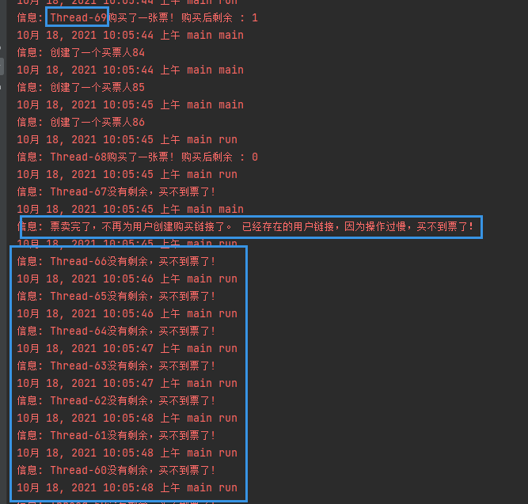


除此以外，当第6行代码，得不到锁时。main线程不会尝试获取waitLock，这将导致  用户点击线程 无法响应。（因为此前 buyerClick 已经调用了notifyAll()方法，释放了waitLock锁，并等待waitLock锁。只有当main线程获得了waitLock锁并再次等待waitLock，即waitLock发生易主后，才能再次获得waitLock锁）

```java
1        while (true) {
2            synchronized (waitLock){
3                waitLock.wait();//线程等待。直到有用户点击了预定购买。就启动线程
4            }
5            if(ticketNumber>0){
6                synchronized (lock) {     
7                   ...
8                }
9            }else break;
10        }
```


事实上，经过上面分析，我发现自己写的程序几乎约等于单线程工作了。

尝试降低锁的粒度：

```java
public class ticket {

    //票数
    static volatile  int ticketNumber = 50; //保证可见性
    //模拟一个随机时间
    static Random random = new Random(System.currentTimeMillis());
    //输出日志
    static Log log = LogFactory.getLog("main");

    static Vector<Thread> array = new Vector<>(); //线程list

    static int realBuy = 0; //真正购买到的票数

    public static void main(String[] args) throws InterruptedException {

        int ThreadNumber = 1;//线程数量
        Object lock = new Object(); //卖票锁
        Object waitLock = new Object(); //线程等待锁，用于模拟随机时间内用户的点击   线程之间的通信锁

        buyerClick buyerClick = new buyerClick(waitLock);//创建了用户点击线程
        buyerClick.setDaemon(true);//将这个线程设置为守护线程，票空了，跳出循环。主线程运行完毕，这个线 程也退出
        buyerClick.start();

        while (true) {
            synchronized (waitLock) {
                if (ticketNumber > 0) {
                    log.info("创建了一个买票人" + ThreadNumber++);
                    synchronized (lock) {
                        ticketNumber--;
                    }
                    buyer buyer = new buyer(lock);//创建了一个买票人线程。这个人独立的去买票。买票人之间没有干扰
                    array.add(buyer);
                    buyer.start();
                }
                if (array.size() == 0 && ticketNumber <= 0)
                    break;
                waitLock.wait();//线程等待。直到有用户点击了预定购买。就启动线程
            }
        }
        log.info("票卖完了，不再为用户创建购买链接了。 已经存在的用户链接，因为操作过慢，买不到票了！");

    }


    static class buyer extends Thread {
        Object lock;

        public buyer(Object lock) {
            this.lock = lock;
        }

        @Override
        public void run() {
            try {
                Thread.sleep(random.nextInt(2000));//模拟用户操作时间。实际要比2秒长
                //此处为用户的各种操作
                if (random.nextInt(10) < 8) {
                    //假设用户操作成功！
                    log.info(Thread.currentThread().getName() + "购买了一张票!  真正购买票数 : " + ++realBuy);
                } else {
                    //操作失败了，就归还票数
                    synchronized (lock) {
                        log.info(Thread.currentThread().getName() + "操作失败! 归还余票 : " + ++ticketNumber);
                    }
                }
            } catch (InterruptedException e) {
                e.printStackTrace();
            } finally {
                array.remove(this);
            }
        }
    }


    static class buyerClick extends Thread {
        Object waitLock;//等待锁

        public buyerClick(Object waitLock) {
            this.waitLock = waitLock;
        }

        @Override
        public void run() {
            while (true) {
                try {
                    Thread.sleep(random.nextInt(1000));//模拟用户点击
                    synchronized (waitLock) {
                        waitLock.notifyAll(); //当有用户点击，唤醒主线程
                    }
                } catch (InterruptedException e) {
                    e.printStackTrace();
                }
            }
        }
    }
}

```


降低了锁的粒度。只锁住了ticketNumber--。和++操作。并添加关键字volatile保证可见性。


# 3.  线程的状态

## 3.1 操作系统层面 5种状态


## 3.2 JAVA 中6种状态

new

runnable

blocked

waiting

timed_waiting

terminated

是Thread类的内部枚举类型


## 3.3 小结


# 4.共享模型之管程

本章内容：

**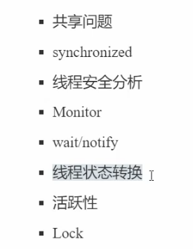**


## 4.1 临界区 Critical Section


### 4.1.1 什么时候临界区会出现问题


### 4.1.2 临界区示例

```
如果有多个线程开启。调用了多次increment(),decrement()
就有可能出现问题。
```


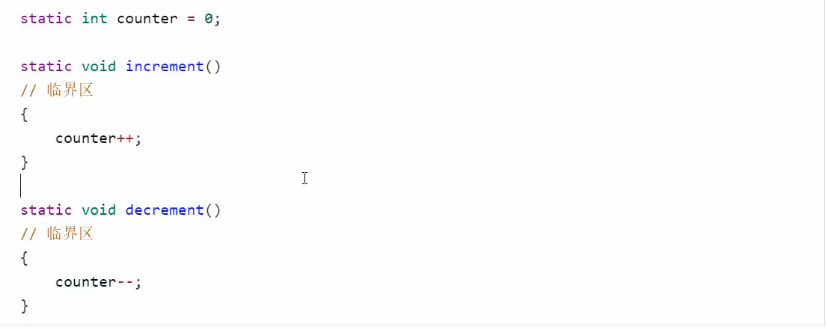


## 4.2 解决方案 synchronized


```
synchronized 俗称 对象锁。
以互斥的方式，保证同一时刻，临界区有且只有1个线程进入。
```

### 4.2.1 互斥 和 同步

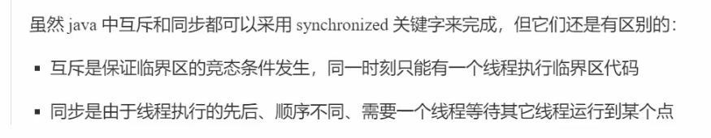


### 4.2.2 synchronized 语法


synchronized 可以加在方法、类、代码块上


```
synchronized（Object o）{
	//do something
}
```

```
所有尝试进入synchronized代码块的线程，都尝试获得这个对象锁。只有获得了对象锁才能进入临界区。

在字节码指令 synchronized 是依靠  moniterenter moniterexit 完成进入锁，释放锁的过程。
```

```
值得注意的是，synchornzied 并不保证代码块内部的代码一次性全部执行完毕。施行多少还是受到操作系统调度的影响（时间片）。
```

#### 4.2.2.1 实例1：

```java
//synchornized 会遇到时间片用完的情况。但不会让出锁
	public class synchornizedTest {

    private static int i = 0;

    public static void main(String[] args) {
        Object o = new Object();
        Thread t1 = new Thread(() -> {
            synchronized (o) {
                for (int j = 0; j < 100000; j++) {
                    i++;
                    System.out.println(i);
                }
            }
            System.out.println("t1 done!");
        }, "increment");

        Thread t2 = new Thread(() -> {
            synchronized (o) {
                for (int j = 0; j < 100000; j++) {
                    i--;
                    System.out.println(i);
                }
            }
            System.out.println("t2 done!");
        }, "decrement");

        Thread t3 = new Thread(()->{
            while (true)
                System.out.println("哈哈哈哈");
        });
        t2.start();
        t1.start();
        t3.start();
        try {
            t1.join();
            t2.join();
            t3.join();
        } catch (InterruptedException e) {
            e.printStackTrace();
        }

        System.out.println(i);
    }
}
```


