前言：

本文类似提词器

建议类、主观倾向。

适用于未找到目标、方向的同学。

任何人的成功路都不一定能轻易复制、需要在自己的路上不断总结、修正。找到伙伴、同行者进而完成自己的价值。


# 1.做一个存档的想法？


## 1.1 起因

善文老师的启发。

我也曾迷茫。

为什么大厂喜欢内推？


## 1.2 我能得到什么

越来越多的同行者、校友。

本质是热爱。


## 1.3 你能得到什么

帮助...

方向...

朋友...

技术...

最终仍是热爱。


我这人很简单，你跟我说编程，我就开心。


## 1.4  展望一下


# 2.干货时刻


## 2.1 大学4年你想成为什么样的人


## 2.2 计算机专业2个大方向


### 2.2.3 考研

#### 	2.2.3.1 计算机方向: 

​		出来就业两个大方向 ：  算法 ，开发。

​					

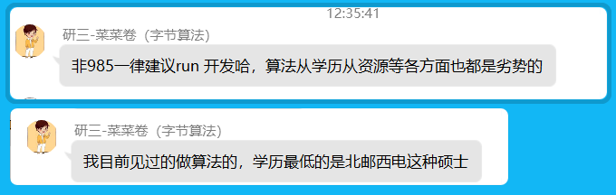

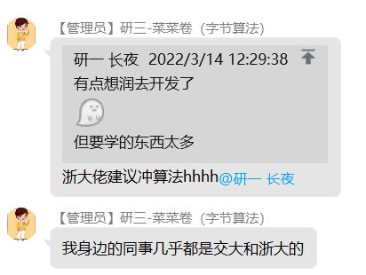

​	


#### 	2.2.3.2 其他方向


### 2.2.4 开发


我不知道我要学什么编程语言。

#### 2.2.4.1 技术选型


##### 2.2.4.1.1  编程语言TOP10


github language rank


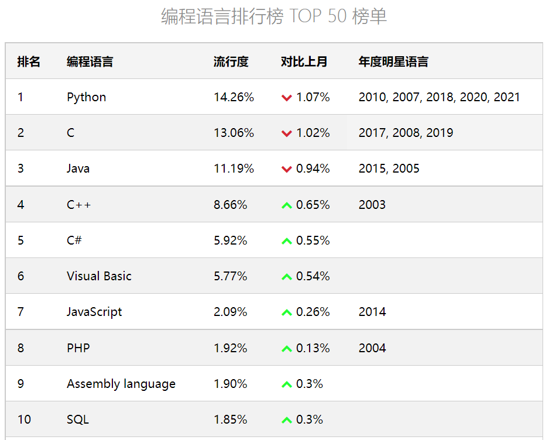

```
你该如何搜索？

kotlin 能做什么。 


xxx能做什么，xxx擅长什么领域。
```

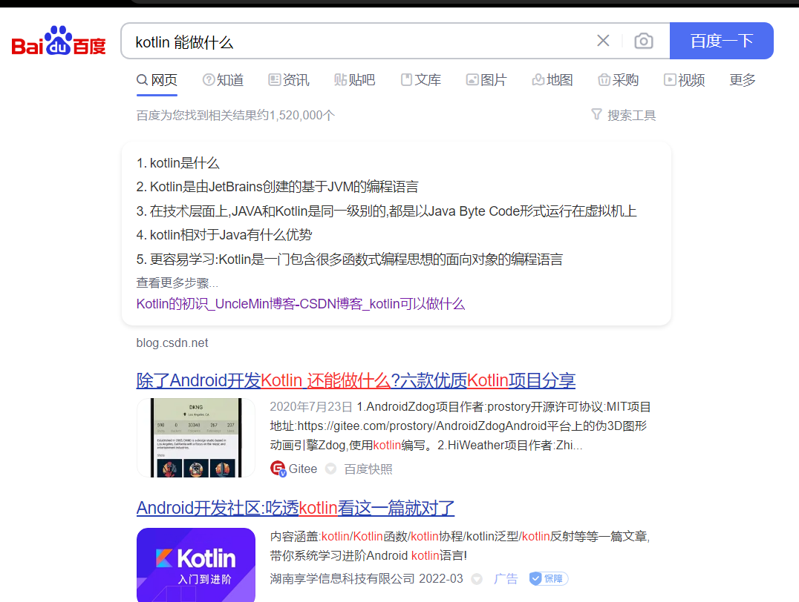


##### 	2.2.4.1.2 数据库Top10

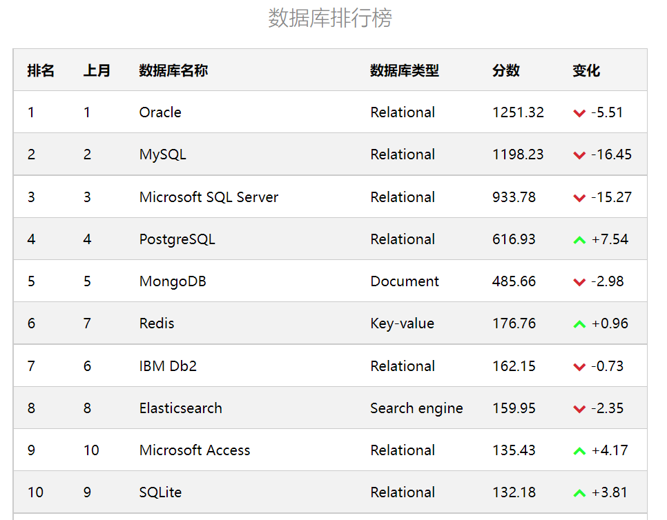


各种编程语言的适用领域和优缺点是什么？


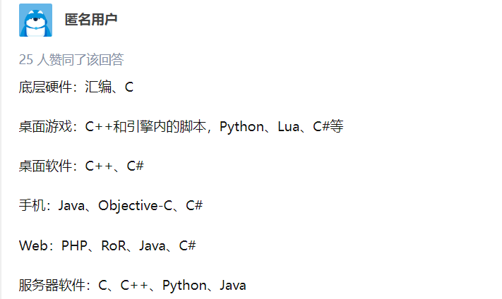


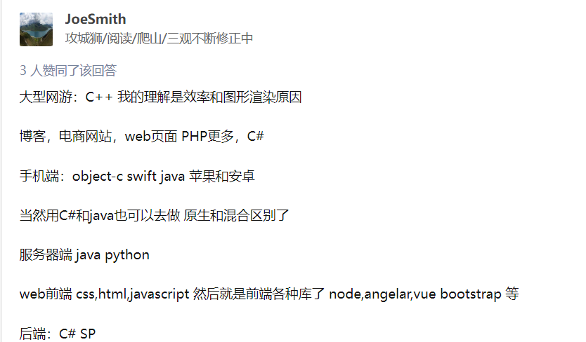


学校里的哪些课程比较重要？

#### 2.2.4.2  你必须会的基础专业课

数据结构、算法、操作系统、计网 、数据库、编译原理 、计组


```
请注意： 以上几门课和主修语言并不冲突。 
编程语言就像是外功。
以上几门课是内功。

“要称为语言大师，语言榜前30门语言，总要都懂”  （他说的数量不一定对，但数量级总不至于差太多）
```


当我差不多选好了技术、方向。我要学到什么程度呢？

或者我干脆仍然不知道方向呢？

#### 2.2.4.3   大厂校园招聘

以字节跳动校园招聘为例：


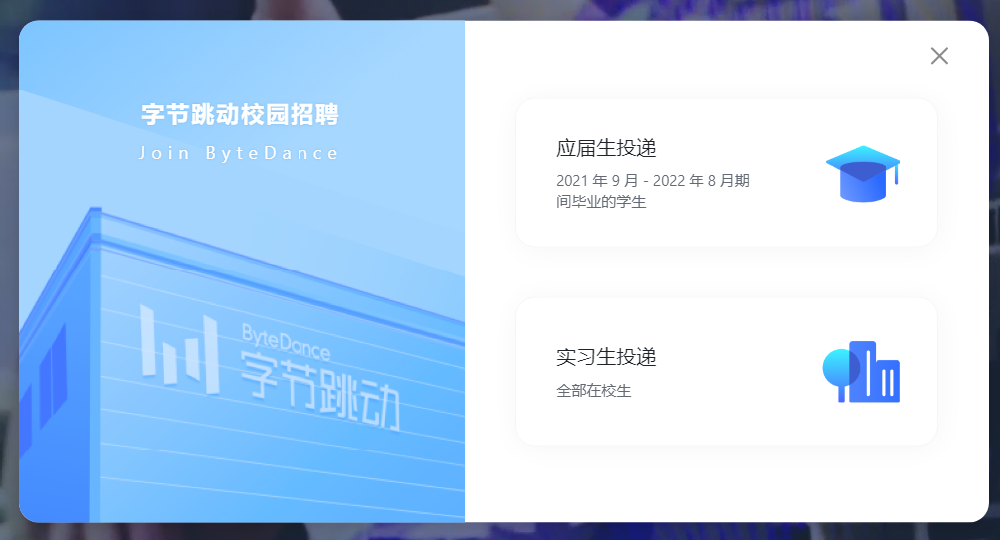


还是很模糊？因为编程实力本来就不是一个很容易界定的东西。

所以我们反思路：看看其他求职者是什么样的简历：牛客网。

#### 2.2.4.4  看简历、刷面经、牛客网


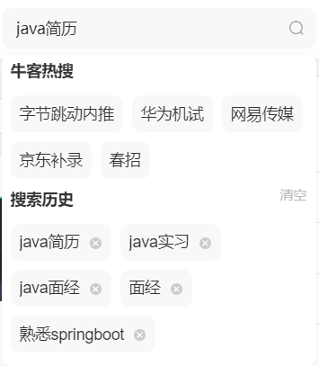


以javaWeb为例：

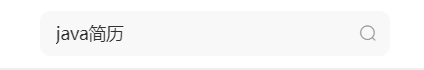


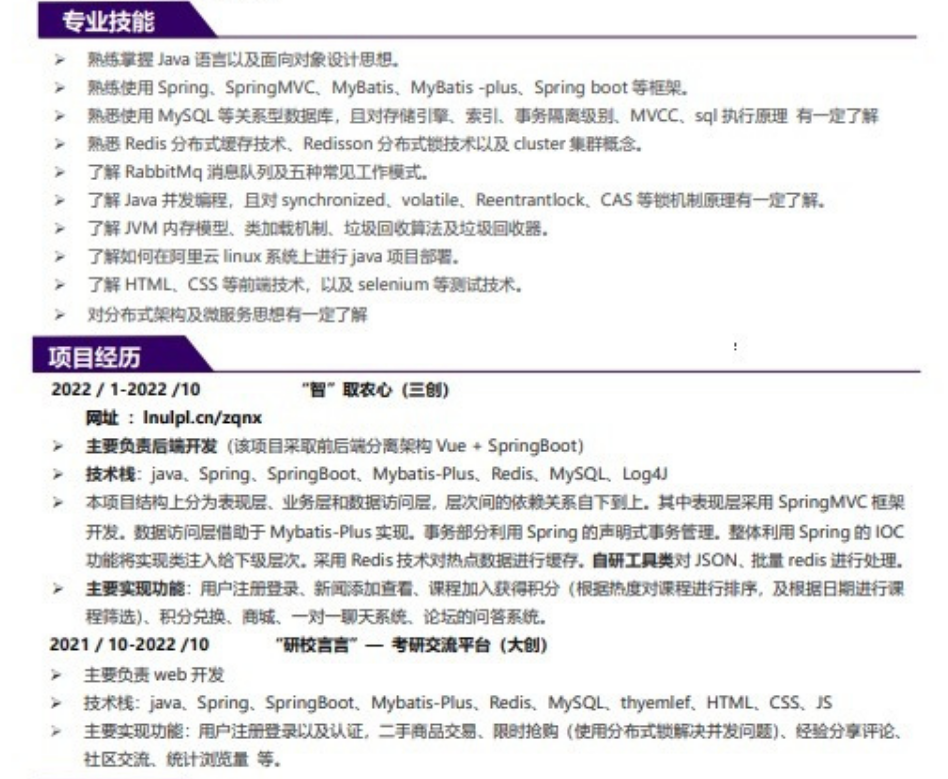


#### 2.2.4.5  你需要的刚柔兼济


##### 2.2.4.5.1 柔

JavaWeb 后端方向技术指路 ： 

spring  、mybatis 、mybatis-plus、springMVC 、（redis 、MQ 、nginx ） 、 JVM 、JUC 、springcloud....


##### 2.2.4.5.2  刚


你需要掌握最基本的数据结构、算法。

推荐的刷题地址 ： 

LeetCode 

Codetop


不成器的师兄：

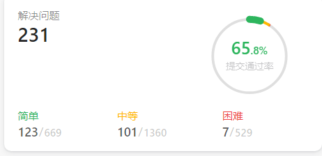


小道消息：

```
一位同学的表哥、十多年在业互联网老兵、二本、现在月薪20k+ 不996 、现在在用C#做桌面应用:  LC刷会300道大厂随便挑。
```


大厂消息：

```
找不到原图了、可以去LC 讨论区搜一下。一个字节的HR留下的经验、并且在结尾留了微信招实习：
推荐LC刷了200道以上同学投简历、最好500道以上。
日期2022年
```


培训班消息：

```
大厂一般先有一轮算法题。要么手写。要么上级。过了算法才有机会面试。
大厂面试一般1-3轮。丧心病狂的部门会额外有。一般1.2面差不多就定了。
每轮面试必有算法题。
```


你需要会的基础算法：

排序(快排，归并)、递归/回溯 (深搜、广搜) 、 双指针、哈希表(映射) 、滑动窗口、动态规划、二分查找(类二分搜索)、优先级队列...


你需要有深刻理解的数据结构，并需要用其解决问题:

数组、 队列、栈、优先级队列、单调栈、图、矩阵....


### 2.3 碍于时间限制

提几个名词，各位回去自己检索。兴趣，是最好的老师。


Github    git

java开发IDE：IDEA

多读源码。

Codetop

文理观魏大爷非常好，还有电，可以给笔记本充电。（别问信息院自习室为什么没有电）


## 2.4  我的学习方法


### 2.4.1 提问式 学习

JDBC？

数据库？


提出问题---解决问题模式


### 2.4.2  目的驱动、认识型学习


一段时间后你会忘掉细节... 留下骨头...


忘了怎么办？翻笔记...


养成写笔记的习惯...


### 2.4.3 笔记


#### 2.4.3.1 写笔记的习惯


笔记是写给自己看的，要用自己的看得懂的文字(自己最懂的叙事方法)


这样便于检索，便于二次使用。


如何写的脉络清晰？

旧笔记 新笔记对比


#### 2.4.3.2 给出一个简单的思路


什么是？

(前情提要，提出了什么样的问题。解决了什么样的问题。)

怎么解决、如何解决。


#### 2.4.3.3 其他好处

很多HR喜欢要有个人博客，个人笔记的面试者。

​	
