# 1.引论

## 1.1 编译器的结构


### 1.1.1 编译器的编译流程

```
词法分析->语法分析->语义分析->中间代码生成->代码优化->代码生成
```


#### 1.1.1.1 词法分析

例如 ：position = init + rate *60;

经过词法分析：

<id,1>  <=>  <id,2> <+> <id,3> <*> <60>


```
其中被拆分成以“<>”包裹的单元称为 “词法单元”。
```


```
编译器内有一个重要的数据结构“符号表”。符号表包含了变量的一些信息，如变量名、类型、作用域等等。
符号表将在1.1.2重点介绍。

例如第一个词法单元 <id,1> 的含义对应的就是 符号表的第一个变量。
例如 = ,抽象为一个表示赋值的<=>即可。
```


#### 1.1.1.2 语法分析

语法分析做了什么？

语法分析使用词法分析解析出的“词法单元”构建一个树。

称之为“语法树”。

```
语法树的内部节点为“运算符号”,每个节点的子节点表示该运算的分量。
```

语法树例如：

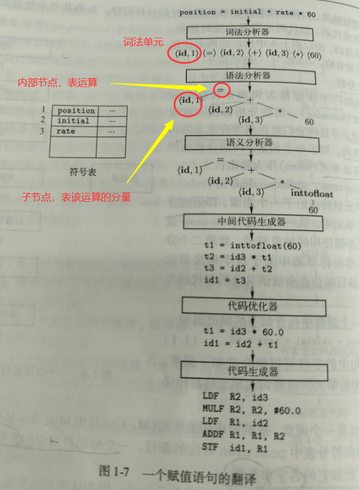


```
上图整颗语法树就表达了   position = init + rate *60  这条语句。

显然在整颗语法树中节点是有先后顺序的， * 节点应当被先运算。
```


#### 1.1.1.3 语义分析

第三步语义分析完成的内容：

- 语义是否一致
- 类型信息收集


类型信息收集，包含了2个部分，类型检查、自动类型转换。

```
类型检查:  检查运算分量是否符合指定的运算符。

例如:  数组下标必须是整型，当传入了浮点型，编译器就必须报错。


自动类型转换

例如： 双目运算符的两个运算分量是 浮点和整型，并且要求结果是浮点数。那么编译器就会自动将整型转化为浮点型。
```


#### 1.1.1.4 中间代码生成

很多时候，编译器并不直接把语句翻译为 二进制机器码、而是生成一个中间代码。

亦如Java生成了中间的字节码文件(.class文件)，这样的“中间表示”可以帮助Java代码完成“一次编译，多处运行”跨平台的优点。

又亦如 “语法树” 也是一种“中间表示”。它通常用于 词法分析、语法分析时使用。


```
总的来讲，“中间表示”和直接翻译成机器语言相比，并不是多此一举。它可以让“翻译为机器指令”这一过程，带有更多的优质特性，比如“跨平台”。

无论是何种“中间表示”，它都应该满足2点：
 1.易于生成
 2.能够轻松的翻译为目标机器上的语言
```


#### 1.1.1.5 代码优化

代码优化这一步骤，试图对 "中间代码" 进行优化。 值得注意的是，这种优化必须是与机器无关的。

因为此时中间代码，还没有翻译成与机器相关联的目标代码。


```
不同编译器在 代码优化阶段，做的工作差异非常大。
```


例如： 在上文中的优化：

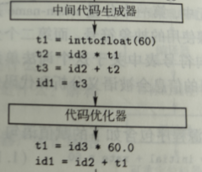

```
将长的指令序列优化成更短的。
```


例如： Java的前置编译器，对于一些特殊的变量 (static final String str= "abc") 在编译阶段就能确定下来的值的变量，不再看做“变量”，而是“字面量”，直接把对应的值付给了变量。

#### 1.1.1.6 代码生成

代码生成器以源程序的中间表示作为输入，以目标代码作为输出。

如果目标代码是机器代码，那么必须要做的工作就是 ： 把变量的内存地址映射称为真实的物理内存地址或寄存器地址。

这之后，把中间表示的代码翻译为 机器相关的 且 功能相同的 机器指令。


例如: 

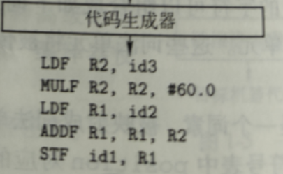


### 1.1.2  符号表 管理

在1.1.1 编译器流程中，提到了一种重要的数据结构--- 符号表。编译器的重要功能就是，管理维护“符号表”。

#### 1.1.2.1 符号表的内容

符号表包括变量的信息： 变量名、类型、作用域

符号表同时也包括方法(过程)信息：  方法的参数数量、参数类型、返回值类型


符号表就像一个映射表一样。为每个变量名字创建了一个映射。映射到的字段就是这个变量的各种属性，就像一种记录条目一样，记录了这个变量的各种信息。

符号表这种数据结构，应该允许编译器迅速插到每一个记录的名字。并向记录中快速存取。


更详细的符号表，将在后面描述。


## 1.2 程序设计语言基础


### 1.2.1 静态/动态


#### 1.2.1.1 静态策略/动态策略


如果一个语言使用的策略支持编译器静态决定某个问题，那么称这门语言使用了静态策略。也就是说，这个问题可以在编译时刻就决定了。


相反，如果一个问题只能等到程序运行时（Runtime）才能解决，那么称为动态策略。


#### 1.2.1.2 静态作用域、动态作用域


仅通过阅读程序就可以确定一个变量声明的作用域，那么称为“静态作用域”。其实，本质上也是编译时就能确定下来的作用域，称为静态作用域。


相反，当变量在Runtime时可能会改变作用域，也就是在Runtime的某一时刻才会确定作用域。称为动态作用域。

大部分语言（C，java）使用静态作用域。


```
例如：

在Java中，当类中的某个成员变量被声明为Static以后，那么这个变量不再称为实例变量。而是称为 类变量。

所有这个类的实例都可以共享访问的类变量。这个变量本身只存在一份，属于类所有。
此时，类变量的引用，存放在方法区。
```


### 1.2.2 环境与状态


接下来将提出一个值得思考的点：

程序在运行时发生的改变，是影响数据元素的值，还是影响了对那个数据名字的解释。


```
通俗来讲: 影响元素的值。表示变量名指代的内存地址不变，但变量里内存里的内容改变。

影响了数据名字的解释，表示变量名指代的内存地址发生了改变。
```


例如 Integer a = 1; a = 2; 对于Java来说，JVM会自动准备创建 值为-128~127一共256个Integer对象，供使用，节约频繁的创建销毁对象的开销。

此时"a=2" 这条语句影响了数据名字的解释。a重新指向了值为2的Integer对象。

如果"a = 10086;"  则是影响元素的值。


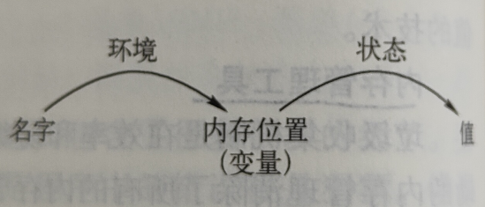

#### 1.2.2.1 状态

 参照上图： 内存到值的映射，称为状态。

#### 1.2.2.2 环境

参照上图：名字到内存地址的映射，称为环境。


```
显然，a=2 是环境发生了变化。  a=10086 是状态发生了变化
```


### 1.2.3 静态作用域与块结构


1.2.1.2提到过静态作用域。C、Java等同类语言都使用静态作用域。C语言的作用域规则是基于程序结构的。也就是说，一个作用域隐含的在程序结构中声明了。

例如后续的关键字public protected private 等关键字，提供了对作用域的明确控制。


#### 1.2.3.1 块结构

块结构“{}”相当于显式的声明:块内的变量作用域不超过块外。


#### 1.2.3.2 名字、标识符、变量

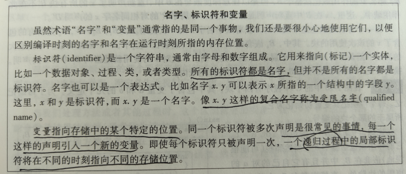


```
描述的非常好。在树的递归中，同一个局部标识符 TreeNode root ，总是在不同的递归层数中指代了不同的节点(物理内存)。
由此，同一个标识符被多次声明确实是常见的事情。


在JVM中,递归调用会在JAVA栈中创建一个新的栈帧。root的引用存储在栈帧的局部变量表中，指向了不同的变量。由此解决了各次递归中 标识符->变量的映射问题。
```


### 1.2.4 动态作用域

从技术上讲，如果一个作用域策略依赖于一个或多个只有在程序执行时刻才能知道的因素，它就是动态的。

作用域不单指变量，方法也有作用域。


```
对于Java来说，方法重载决定于变量的静态类型。

方法重写决定于变量的动态类型。
```


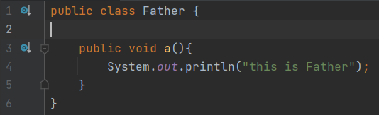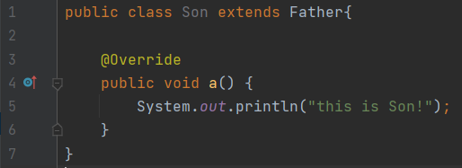

```java
    public static void main(String[] args) throws InterruptedException {
        Son son = new Son();son.a();
        Father a = son;a.a();
    }
```

方法重写 Override 决定于动态类型。也就是方法的动态作用域。

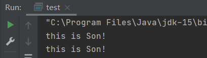


```java
    public static void main(String[] args) throws InterruptedException {
        Son son = new Son();
        check((Father) son);
        check(son);
    }

    static void check(Father f){
        System.out.println("this is Father");
    }
    static void check(Son son){
        System.out.println("this is Son");
    }
```

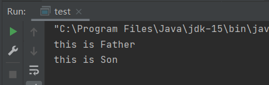

方法的重载，依据于静态作用域。


### 1.2.5 参数传递机制

#### 1.2.5.1 值调用

值调用(call-by-value)  在调用方法时，值调用会拷贝一份实参的值，存入方法形参的内存中。

这种调用的好处在于，不用担心改变了实参的值。也就是方法是无副作用的，也称为显式函数。

这种调用常见于函数式编程。

在java、类C类语言中。是一种常见的使用方式。


#### 1.2.5.2 引用调用

引用调用(call-by-reference) 在方法调用的时候，不拷贝实参的值，而是把实参的引用传递到形参中。

也就是形参的值等于 实参对象引用。

此时，使用实参就要小心了，因为有可能直接改变实参的State。

这类调用的好处在于 ：可以改变实参的State，成也萧何。这类调用可以借助实参来保存状态。

```
因为很多时候，我们希望直接在对象的状态中保存结果,不是在返回值返回结果。

例如在Java中 ThreadPoolExecuter类中,保存了一个数值为整型成员变量ctl。
ctl变量间接的表示了整个线程池的状态。例如111表示线程池正在运行。000表示线程池ShutDown了

这个类的对象,通过State的改变。表示了不同的状态。
```

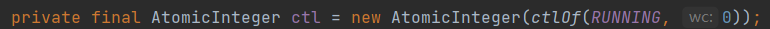

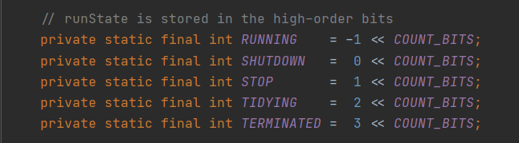


# 7.运行时环境


# 7.5 垃圾回收


### 7.5.1 垃圾回收的几个性能指标


#### 7.5.1.1 总体运行时间

#### 7.5.1.2 空间使用

#### 7.5.1.3 停顿时间


一个设计简单的垃圾回收器会有一个致命的问题： 

垃圾回收过程在一个没有任何预警的情况下突然启动(因为工作线程没办法知道并预测此时剩余内存的大小，是否触发了垃圾回收)，这将导致工作程序突然长时间停顿。


```
所以,让停顿时间在一个可控范围内，是衡量一个垃圾回收机制的纬度。
```


#### 7.5.1.4 程序局部性


### 7.5.2 垃圾回收的一个基本要求

#### 7.5.2.1 类型安全

垃圾回收器如果能工作，那么它必须明确任何一个指针是否已经指向了某块已经分配了的空间。

如果不能，则无法工作。


如果一门语言，任何数据分量的类型都是可以确定的，就称这门语言为类型安全的。

对于C，C++，存储地址可以进行任意的操作，任何整数都可以强制转化为指针。因此，一个程序可以在任意时刻使用任意位置的内存，这意味着无法判断哪一块内存空间不再会被引用。垃圾回收也就无法工作。


