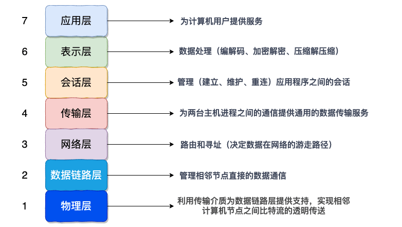
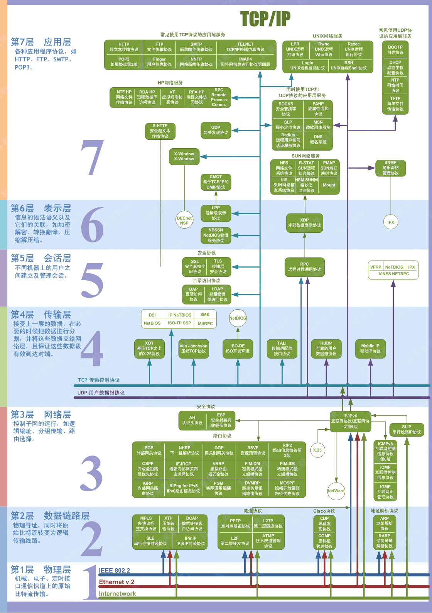
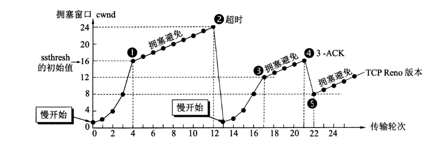
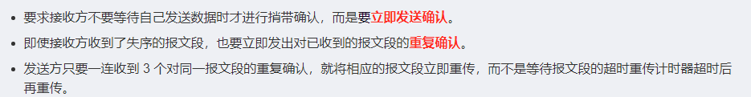
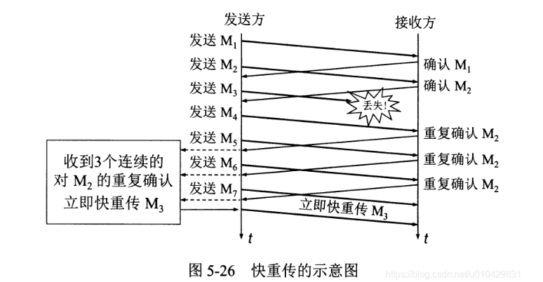
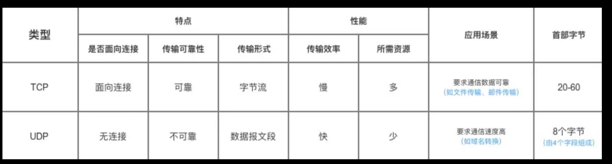

# 1. OSI / TCPIP


## 1.1 OSI 7层模型

| OSI7层协议 | TCP/IP4层  | 5层协议    | 对应网络协议      |
| ---------- | ---------- | ---------- | ----------------- |
| 应用层     | 应用层     | 应用层     | HTTP、TFTP、NFS、 |
| 表示层     |            |            | telnet            |
| 会话层     |            |            | SMTP              |
| 运输层     | 运输层     | 运输层     | TCP/UDP           |
| 网络层     | 网络层     | 网络层     | IP                |
| 数据链路层 | 网络接口层 | 数据链路层 | FDDI              |
| 物理层     |            | 物理层     | IEEE 802.1A       |





```
应用层：  为用户提供服务
表示层: 编解码
会话层： 应用软件之间沟通
运输层： 主机之间通信。 Socket通信
网络： 路由和寻址  IP
数据链路层： 将比特流变为逻辑传输
物理层：  最底层的传输介质。2进制比特流
```





## 1.2  TCP/TP  四层


```
应用层
传输层
网络层
网络接口层
```


### 1.2.1 传输层

传输层的任务:

```
负责协商沟通两台终端设备进程之间是如何通信的，提供通用的数据传输服务。
```


传输层的2个重要协议： TCP/UDP 


### 1.2.2  网络层

网络层的任务：

```
负责分组交换转发不同异构网络，不同主机之间的通信信息。
```


网络层使用的协议：IP协议。

主要任务： 

```
将上层的报文封装成组 转发。以及选择合适的路由，将分组信息转发到目的主机。
```


### 1.2.3 网络接口层

网络接口层的任务：

```
将ip层的 ip数据包封装成帧，在相邻的链路节点中传送。每一帧包括必要的控制信息如差错控制。
```


# 2. TCP/UDP

TCP UDP 是 运输层的2个重要协议。

```
TCP 传输控制协议，面向连接的、可靠的、全双工通信的、基于字节流的通讯协议。

UDP 用户数据协议，无连接的。不考虑传输可靠性
```


TCP 特点：

```
TCP层因为收到链路层 “最大传输单元MTU”的限制，会将字节数据流分割成段传输。所以产生了粘包半包的问题。
在TCP层之上，是数据安全的,无需考虑数据丢失，超时重传等问题。只需要考虑业务逻辑问题即可
```


TCP首部

​	标志位：

​			ACK （ 确认位）当ACK=1，确认号才有效。

​			ack  （确认号）

​			seq（序号） 

​			SNY  (同步锁位)   在建立连接时使用，使用同步信号。建立连接时为1。

​			FIN （终止控制位）在释放连接时使用。 释放连接时为1。


## 2.1 TCP建立/释放过程


### 2.1.1 三次握手


建立方称a   对方称为b

第一次握手：a发送一个SYN=1 序号seq为x的报文。此时x为a的一个未使用的序号。

第二次握手：如果b接受到了这个报文，并同意建立连接。向a发送SYN=1 ACK=1 ack = x+1 的报文,同时指定b的一个未使用的序号seq=y。

第三次握手：当a收到了b的确认报文。a发送一个确认的确认报文。SYN=1 ACK=1 ack = y+1  seq=x+1


### 2.1.2  四次挥手


释放TCP连接是双向的。可以由任意一方提起释放。

假设a先发送释放报文段。

第一次挥手：a发送FIN=1 seq=x的报文段给b。

第二次挥手：b收到a释放连接的报文。返回一个ACK=1 ack=x+1  seq=y的报文

此时A->B的连接已经断开。TCP处于半关闭状态。表示A已经没有数据向B发送了。但是B->A的连接还未关闭，B仍能向A发送数据，A必须仍能接收B发送过来的数据。

直到第三次握手： B发送FIN=1 seq=m 的报文给A (seq为什么是w，不是v+1呢？因为在半连接状态B很有可能仍然向A发送了一些数据。)

第四次握手： A收到B释放连接的报文，返回一个确认报文 ACK=1 ack=m+1 seq=n


#### 第几次握手以后就可以发送数据了？


同样的问法等价于：

```
客户端发送完第三次握手后，是不是不管服务器有没有收到，直接就发送数据？
```

答案是肯定的。

```
假设客户端向服务器端建立tcp连接。

在客户端发送第三次握手以后，就可以接收数据了。可能由于网路的原因，第三次握手还没有到服务器端，但此时客户端已经可以接收服务器端的数据包了。
```


#### TCP第三次握手能不能携带数据？

同样的文法等价于：

```
客户端在发送第三次握手包的时候是不是会携带数据一起传输过去？
```


答案是 ： 可以携带

```
TCP标准协议规范中，第三次握手包是允许传输数据的
```


## 2.2 TCP 为什么可靠？


```
TCP除了在 建立释放连接阶段 使用了三次握手四次挥手。

还在建立连接以后、传输数据过程中提供了不同场景下的应对方法。

例如在网路状况不良的   “拥塞控制”。
基于双方数据吞吐能力的 “滑动窗口”。
以及保证数据安全收到的 “超时重传”。
```


### 2.2.1 流量控制（滑动窗口）

```
流量控制用于避免发送方 数据发送的过快，导致接收方来不及完全收下处理。通常由接收方通知发送方进行调节大小。
```


流量控制借助于 “滑动窗口”：

```
滑动窗口是在“发送方”存在的一个控制结构。滑动窗口是以字节为单位的。
```


```
[滑动窗口的大小]决定了发送方一次性能发送字节的多少。
滑动窗口内存储了 已发送数据的序号，和可发送数据的序号。
```


当发送方收到来自接收方的确认序号，就将已确认的数据序号从滑动窗口内移出，滑动窗口内再装入新的待发送的序号。

如果把发送数据的序号看成一条链。上述过程就好像一个固定窗口在链上滑动。故称为滑动窗口


```
同时、滑动窗口的大小是基于此时的网络拥塞程度，主机双方的网络吞吐量灵活伸缩的。
```


### 2.2.2 超时重传


#### 什么是超时重传 ？

```
所有的TCP数据包都带有唯一序号。这个序号保证了包的乱序交付时的顺序，更重要的“丢失的数据可以被找回”。

所有的数据包，接收方都需要发送对应的ACk确认报文告知发送方已经收到，发送方在规定时间(RTT 往返时延)内没有收到来自 接收方的确认ACK就要重传已经发送的报文。
```


#### 基于重复累计确认的重传

```
由于TCP数据包的交付时乱序的，有时可能会先收到大序号的报文段。此时可能会对小序号之前的报文段发送确认报文。这将导致发送方发送无作用的重传。所以当收到来自接收方3次对同一个包的确认，就重传最后一个未被确认的包
```


#### TCP延迟确认

TCP delayed acknowledgment

```
将若干ACK报文组合在一起成为单个报文，从而减少协议开销，用于改善网络性能
```


### 2.2.3 拥塞控制


拥塞控制的目的：

```
拥塞控制是发送方根据网络的承载情况控制分组的发送量，以获取高性能又能避免拥塞崩溃（congestion collapse，网络性能下降几个数量级）
```


具体理解:

```
对于端对端的主机来说，没有办法感知确认当前网络的全部吞吐能力。同时网络上的主机量、数据量也是动态变化的。没有一个一劳永逸的方法,只能使用一些算法主键 "适应"网络的吞吐能力。


设计拥塞控制的思想肯定是: 
我们如何在未知的情况下,达到网络最大的吞吐能力,最大化利用网络。
那么就需要在多个算法的协同下，逐步达到网络承载能力上限。
```


```
拥塞控制抽象出了 “拥塞窗口”的数据结构。拥塞窗口的大小对应着网络吞吐能力大小。
如果网络吞吐能力强，则适当的增加拥塞窗口大小。
如果出现了网络拥塞，则会减小拥塞窗口大小。
```


#### 2.2.3.1 拥塞控制的4个算法





##### 慢开始

```
一开始，并不知道当前网络拥塞程度。所以一点儿一点儿增大拥塞窗口。以指数级增大拥塞窗口。
指数级增大,这代表后面很有可能增大一次就超过了当前网络承载上线，所以显然不能无限指数级增长。
所以需要一个可变的阈值threshold 。
当达到阈值以后,不再指数级增长而是使用线性增长“拥塞避免” 来逐步达到网络承载上限。
```


##### 拥塞避免

```
当慢开始达到设定的阈值后。每经过一个RTT时间增大1个拥塞窗口。逐步达到上限。
当达到上限以后,超过路由器吞吐能力的报文将被丢弃。此时根据上限，修正可变阈值 threshold。
```


##### 快重传：

```
就是让发送方尽快重传丢失报文段，而不是等待超时重传计时器超时后再重传。
```

满足上述需要以下三点：




```
快重传建立在接收方接收到报文后立即发送确认的基础上。
当某一个中间报文发送方没有收到确认，而连续收到多个后面的报文确认。则认为是某一时刻网络出现拥塞，那个报文出现丢失了。发送方不会等到最大超时重传时间再重传该报文，而是立即重传该报文。
```





##### 快恢复

```
快恢复是建立在快重传上的。当报文只是偶尔丢失一个，而不是大批量丢失。则认为网络不是拥塞，而是波动。
此时再重新使用慢开始一点点爬坡，显然是浪费资源的。
```


### 2.2.4 TCP提供了哪些方式保证可靠传输

```
确认和重传 

数据校验

流量控制

拥塞控制（4个算法  慢开始 拥塞避免 快重传 快恢复）
```


## 2.3 UDP


### 2.3.1  UDP和TCP区别


TCP： 面向连接、全双工通信、传输可靠、传输效率低、所需资源多 、首部字节多(20-60)

UDP:   无连接、不可靠、传输效率高、所需资源少





# 3. HTTP/HTTPs


## 3.1 HTTP


超文本传输协议。顾名思义，HTTP 协议就是用来规范超文本的传输，超文本，也就是网络上的包括文本在内的各式各样的消息。

```
通俗来将，就是规范服务器和浏览器之间的通信行为。
```


### 3.1.1  HTTP优点

扩展性强

```
按照规则可以自定义字段，传输可以不仅限于txt文本，可以传输图片视频等。
```

应用广泛,成熟


### 3.1.2 其他特点

无状态

```
不保存状态信息。
```


### 3.1.3  TCP长连接

HTTP1.1 增加了 tcp长连接功能。一次http请求响应完成以后不关闭tcp连接，后续http请求进行复用。有请求超时时间，超时以后关闭tcp。

```
可以不携带Connection：keep-alive请求头。默认是长连接请求。
```


## 3.2 Https

HTTPS 是基于 HTTP 的，也是用 TCP 作为底层协议，并额外使用 SSL/TLS 协议用作加密和安全认证。默认端口号是 443.


```
保密性好、信任度高
```


### 3.2.1 SSL

安全套接字协议。其原理是非对称加密。


#### 3.2.1.1 非对称加密

加密密钥和解密密钥是不一样的，称为非对称加密。

相对的，加密密钥和解密密钥相同，称为对称式加密。


##### 3.2.1.1.1 非对称如何使用？

```
非对称式加密，私钥所有者需要保密，公钥需要向外界公开。

外界给密钥所有者发送消息时，使用公钥加密。   密钥所有者通过私钥解密。
密钥所有者向外界发送消息时，使用私钥加密。   外界通过公钥解密
```


##### 3.2.1.1.2  公钥传输的信赖性

首先网络信道通信有以下前提：

```
1.任何人都可以捕获通信包
2.通信包的保密性由发送者设计
3.保密算法设计方案默认为公开，而（解密）密钥默认是安全的
```


非对称式加密，外界想要和密钥拥有者通信，必须知道公钥。但公钥的传播又是明文的，这就可能会出现一个“伪造者”，截获了公钥。并给外界伪造一个属于“伪造者”自己的公钥，欺骗外界。这样外界和原本密钥拥有者通信，都会被“伪造者”监听。而此时，密钥拥有者和外界全然不知。


```
当客户端（浏览器）向服务器发送 HTTPS 请求时，一定要先获取目标服务器的证书，并根据证书上的信息，检验证书的合法性。一旦客户端检测到证书非法，就会发生错误。
客户端获取了服务器的证书后，由于证书的信任性是由第三方信赖机构认证的，而证书上又包含着服务器的公钥信息，客户端就可以放心的信任证书上的公钥就是目标服务器的公钥。
```


#### 3.2.1.2 数字签名

数字签名技术 是为了防止CA证书被伪造。


数字签名如何防止CA证书被伪造？

```
1.客户端和服务器建立Https连接，首先需要获取服务器的证书，经过如下验证通过以后，认为是服务器的正确公钥。
2.CA需要知道服务器的公钥，对服务器的公钥使用CA自己的私钥加密，并附在证书上。
3.客户端检验证书时向CA请求CA的公钥，通过对证书解密，对比服务器公钥是否一致，如果一致则通过
```


##### 3.2.1.2.1  数字签名的作用

不可抵赖

完整性检验

报文鉴别  ： 核实发送者签名


#### 3.2.1.3 为什么不用对称加密

对称式加密的加密解密过程开销比较高昂。


# 10.综合性面试题：


## 10.1 从url到页面加载都完成了什么？

首先浏览器想要把域名解析为ip地址，然后才能对其进行访问。

通常，最近访问过的ip地址与域名之间的映射会存储在本地缓存中。

本地缓存按照顺序详细的来讲，包括浏览器缓存、操作系统内存、磁盘host文件、路由器缓存等。

因为有可能是第一次访问该域名。所以如果在以上缓存没有查找到，就回去本地dns服务器请求解析该域名。

本地dns服务器并不会知道所有的映射关系，它会先查找自己的缓存，如果找到，则直接返回给用户。

如果没有，将代理用户向根服务器请求“域服务器”的地址。从“根服务器”获得域服务器的地址、进而向一级域名，二级域名服务器请求查询结果。直到找到url对应的ip地址，返回给用户，同时本地dns服务器将此次查询的结果存储在缓存中，加快下次解析过程。

而此时用户并不知道本地dns服务器是否完成以上的迭代查询，用户只关心请求解析的结果。

当用户拿到url对应的ip地址后，就尝试建立TCP连接。涉及到tcp三次握手，就不详细展开说了。运输层建立连接后。

浏览器将用户输入的地址封装成http Request 报文发送到服务器。

接收，解析，处理HttpRequest通常由 web Container （Web容器）来完成。

Web容器，创建一个新线程，每一个线程为一个用户服务。先请求解析，比如拿到请求方式、请求体、分析请求参数。调用内部函数解决请求,请求解决完毕将数据(资源)返回给用户。

浏览器负责为用户解析渲染资源。


## 10.2 常见的应用层协议


HTTP ： 超文本传输协议

SMTP :   邮件协议


