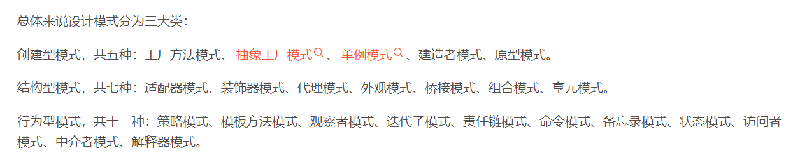
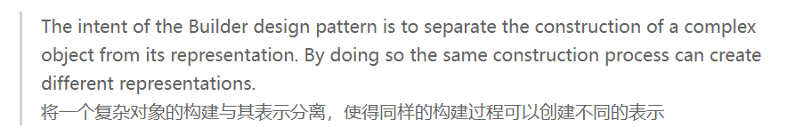
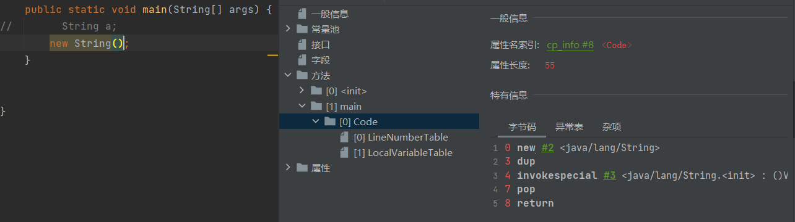
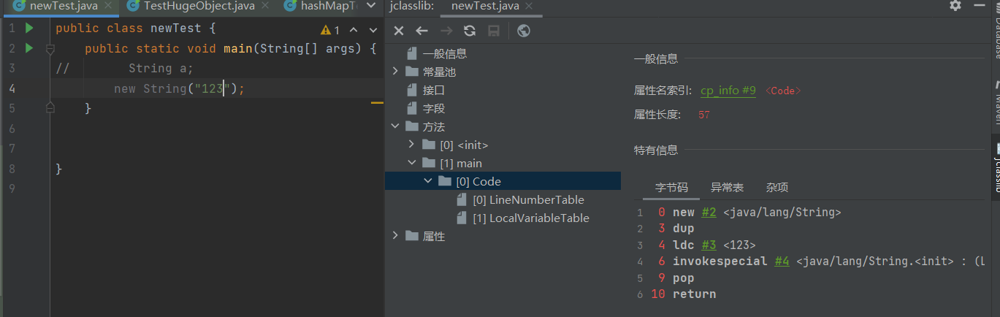
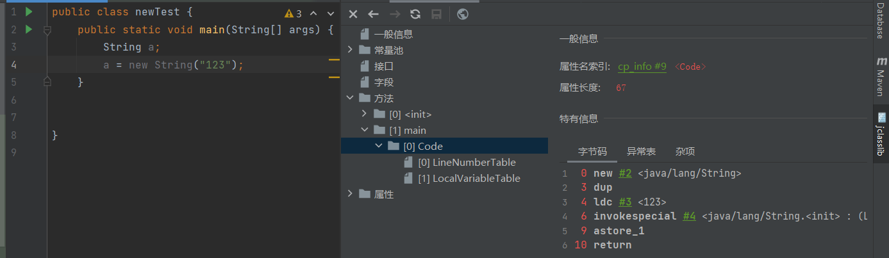

# 1. 设计模式类型


设计模式有3种类型。每种类型代表了不同的目的。

```
1. 创建型 设计模式, 目的是在一些复杂的特定场景下,使用更合理的，易扩展的方式 创建一系列对象。


2. 结构型 设计模式, 结构性的设计模式更加关注 类和对象之间的组合关系。


3. 行为型 设计模式， 主要关注 对象之间的通信行为。
```





# 2. 创建型


## 2.1.建造者模式


https://zhuanlan.zhihu.com/p/58093669


### 2.1.1 定义





### 2.1.2 使用场景

当一个类的构造函数参数个数超过4个，而且这些参数有些是可选的参数，考虑使用构造者模式。


#### 2.1.2.1 提出问题

```
当一个类的构造函数参数超过4个，而且这些参数有些是可选的时，我们通常有两种办法来构建它的对象。 例如我们现在有如下一个类计算机类`Computer`，其中cpu与ram是必填参数，而其他3个是可选参数，那么我们如何构造这个类的实例呢,通常有两种常用的方式：
```

```java
public class Computer {
    private String cpu;//必须
    private String ram;//必须
    private int usbCount;//可选
    private String keyboard;//可选
    private String display;//可选
}
```

第一：折叠构造函数模式（telescoping constructor pattern ），这个我们经常用,如下代码所示

```java
public class Computer {
     ...
    public Computer(String cpu, String ram) {
        this(cpu, ram, 0);
    }
    public Computer(String cpu, String ram, int usbCount) {
        this(cpu, ram, usbCount, "罗技键盘");
    }
    public Computer(String cpu, String ram, int usbCount, String keyboard) {
        this(cpu, ram, usbCount, keyboard, "三星显示器");
    }
    public Computer(String cpu, String ram, int usbCount, String keyboard, String display) {
        this.cpu = cpu;
        this.ram = ram;
        this.usbCount = usbCount;
        this.keyboard = keyboard;
        this.display = display;
    }
}

```

第二种：Javabean 模式，如下所示

```java
public class Computer {
        ...

    public String getCpu() {
        return cpu;
    }
    public void setCpu(String cpu) {
        this.cpu = cpu;
    }
    public String getRam() {
        return ram;
    }
    public void setRam(String ram) {
        this.ram = ram;
    }
    public int getUsbCount() {
        return usbCount;
    }
...
}
```

#### 2.1.2.2 弊端

那么这两种方式有什么弊端呢？

第一种主要是使用及阅读不方便。你可以想象一下，当你要调用一个类的构造函数时，你首先要决定使用哪一个，然后里面又是一堆参数，如果这些参数的类型很多又都一样，你还要搞清楚这些参数的含义，很容易就传混了。。。那酸爽谁用谁知道。

第二种方式在构建过程中对象的状态容易发生变化，造成错误。因为那个类中的属性是分步设置的，所以就容易出错。

为了解决这两个痛点，builder模式就横空出世了。


### 2.1.3 使用builder 解决


如何实现builder？

1. 在Computer 中创建一个静态内部类 Builder，然后将Computer 中的参数都复制到Builder类中。
2. 在Computer中创建一个private的构造函数，参数为Builder类型
3. 在Builder中创建一个`public`的构造函数，参数为Computer中必填的那些参数，cpu 和ram。
4. 在Builder中创建设置函数，对Computer中那些可选参数进行赋值，返回值为Builder类型的实例
5. 在Builder中创建一个`build()`方法，在其中构建Computer的实例并返回


先看使用起来的样子：

```java
Computer computer=new Computer.Builder("因特尔","三星")
                .setDisplay("三星24寸")
                .setKeyboard("罗技")
                .setUsbCount(2)
                .build();
```

完整代码

```java
public class Computer {
    private final String cpu;//必须
    private final String ram;//必须
    private final int usbCount;//可选
    private final String keyboard;//可选
    private final String display;//可选

    private Computer(Builder builder){
        this.cpu=builder.cpu;
        this.ram=builder.ram;
        this.usbCount=builder.usbCount;
        this.keyboard=builder.keyboard;
        this.display=builder.display;
    }
    public static class Builder{
        private String cpu;//必须
        private String ram;//必须
        private int usbCount;//可选
        private String keyboard;//可选
        private String display;//可选

        public Builder(String cup,String ram){
            this.cpu=cup;
            this.ram=ram;
        }

        public Builder setUsbCount(int usbCount) {
            this.usbCount = usbCount;
            return this;
        }
        public Builder setKeyboard(String keyboard) {
            this.keyboard = keyboard;
            return this;
        }
        public Builder setDisplay(String display) {
            this.display = display;
            return this;
        }        
        public Computer build(){
            return new Computer(this);
        }
    }
  //省略getter方法
}
```


## 2.2. 单例模式


### 2.2.1 双重校验锁的单例模式


```java
public class B {

    static volatile private B singleton;
    
    private B() {
    }

    public static B getInstance(){
        if (singleton==null){
            synchronized (B.class){
                if (singleton==null){
                    singleton = new B();
                }
            }
        }
        return singleton;
    }
}
```

```
变量singleton必须使用  volatile关键字修饰，禁止指令重排，否则会出现null指针异常

原因是什么？看一下new关键字对应的字节码指令。
```




```
invokespecial //完成初始化
```



```
比上面多了一个 ldc
```



```
将new的String对象的地址赋值给了a。
pop指令变成了 astore_1
astore包含了弹出操作数栈，并赋值的操作。


主要关注invokespecial 和astore操作，由于指令重排。
这两条操作可能会发生指令重排。

这将会导致发生 “变量a先指向了被分配的空间，后完成初始化操作”的情况。

同时，外层的 singlaton==null判断是任意线程都可以访问的。
在上述情况中，恰好初始化singlaton线程时间片使用完毕，新的线程访问singlaton!=null，拿到对象地址，去访问对象导致空指针异常。
```

```
总结一下：
	1.线程的调度不是synchronized锁决定的，是操作系统调度的。
	2.synchronized 只保证 原子性 可见性 ，不保证有序性
	3.volatile 可以禁止指令重排，保证有序性。
```

关于指令重排

https://www.cnblogs.com/xdecode/p/8948277.html


# 3. 行为型


## 3.1. 访问者模式

Visitor Pattern  属于行为型模式。


### 3.1.1 意图

将数据结构与数据操作分离。

### 3.1.2 解决的问题

稳定的数据结构，与 易变的操作耦合在一起的问题。

```
深刻理解：  稳定的数据结构。
 		  容易变化的操作。
 		  
稳定的数据结构 ： 意味着 开发者定义的代码行为操作的对象是比较稳定的。

容易变化的操作行为 :  不同的开发者,对于同一个数据结构,希望有多种的代码行为
```


### 3.1.3 应用实例

想象一下， 开发者是一位访客， 开发者能访问到哪些东西由 【家主】说的算。家主把希望提供给 开发者(访客)的数据结构暴露出来。


### 3.1.4 具体细节

访问者需要实现一个访问接口。这个访问接口内必须包含全部 【待访问数据结构】的访问行为方法。

所有的访问者，都需要实现这个访问接口。


所有的 【待访问数据结构】都必须实现一个 【被访问接口】,这个接口接收一个访问者。在接口内,将自己的引用传递给访问者。

 


## 3.2 策略模式


一个类的 `行为/算法` 可以在运行时改变。 这种称为 `策略模式` 。

常见的表现： 通过 `策略模式` 来化简  `if...else` `switch ` 分支中


### 3.2.1 具体实施手段

通过策略接口


## 3.3 观察者模式

当存在 ：

多个对象依赖于1个对象的状态， 并希望当 “依赖的对象状态改变“时，自身做出相应改变。

可以使用观察者模式。


```
定义对象间的一种"一对多"的依赖关系，当一个对象的状态发生改变时，所有依赖于它的对象都得到通知并被自动更新。
```


### 3.3.1 关键代码/思想

需要定义一个 hook函数  `interface Observer  `，作为通知的行为。

被观察的对象中存放  观察者的引用。`List<Observer>`

当`被观察对象`状态发生改变时，调用 `Observer.hook()`


# 4. 结构型

结构型设计模式更加关注 ： 通过组合类之间，对象之间的关系，来突出逻辑。


## 4.1. 外观模式

Facade(外观模式)  属于结构型模式。 

```
是一种在日常开发中常用的设计模式。
```


意图：

```
为子系统的一组接口提供一个统一的界面。   Facade模式定义了一个高层接口，这个接口使得外界调用子系统时更加容易使用。
```


示意图 ： 


```
注意：子系统的繁杂 指的是 子系统的引用关系繁杂。

而不是1个繁杂的组件，提供给用户调用接口。 调用方根本不关心内部细节实现，但调用时需要关心接口引用。
外观模式化简了子系统的各个组件引用关系，只暴露出简单的业务接口调用。
```


### 4.1.1 意图举例


#### 4.1.1.1 图书管理员

图书馆书的摆放，与运作是一个复杂的系统。内部的运行只有内部人员比较清楚，此时有一个初来的访客只关心快速获取想要的书籍，而不希望了解内部运行逻辑，那么最好的办法就是直接询问 “图书管理员”。


“图书管理员” 就相当于一个 `子系统` 对外提供的 `外观接口` ，供外界便捷调用，而无需关心子系统内部逻辑。
